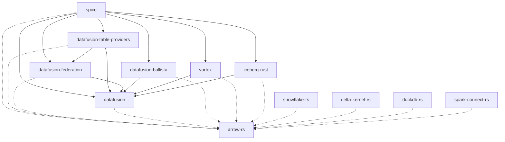

This issue tracks the process of upgrading Spice OSS to a new major version of DataFusion to maintain a version that is one major release version behind the [latest](https://github.com/apache/datafusion/tags). Because many internal crates and forked dependencies rely on DataFusion, they all need to be upgraded in lockstep.



## Current Upgrade PRs

Keep this table updated as the canonical status tracker for the upgrade — one row per fork plus the main Spice PR. Re-query mergeability with `gh pr view <n> --repo <repo> --json state,isDraft,mergeable,mergeStateStatus` (`DIRTY` = conflicts, `BLOCKED` = mergeable but gated by checks/draft, `CLEAN` = ready).

Main Spice PR: _spiceai/spiceai#NNNN_

| Dependency                 | PR  | Base ← Head                                       | Status |
| -------------------------- | --- | ------------------------------------------------- | ------ |
| DataFusion                 |     | `spiceai-X` ← `spiceai-X-patches`                 |        |
| DataFusion Ballista        |     | `spiceai-X` ← `spiceai-X-patches`                 |        |
| DataFusion Federation      |     | `spiceai-X` ← `spiceai-X-patches`                 |        |
| DataFusion Table Providers |     | `spiceai-X` ← `spiceai-X-patches`                 |        |
| Iceberg Rust               |     | `spiceai-<iceberg>` ← `spiceai-<iceberg>-patches` |        |
| Arrow RS                   |     | `spiceai-<arrow>` ← `spiceai-<arrow>-patches`     |        |
| DuckDB RS                  |     | `spiceai-<arrow>` ← `spiceai-<arrow>-patches`     |        |
| Delta Kernel RS            |     | `spiceai-<delta>` ← `spiceai-<delta>-patches`     |        |
| Snowflake RS               |     | `spiceai-<arrow>` ← `spiceai-<arrow>-patches`     |        |
| Spark Connect RS           |     | `spiceai-<arrow>` ← `spiceai-<arrow>-patches`     |        |
| Spice Rust SDK             |     | `spiceai-<arrow>` ← `spiceai-<arrow>-patches`     |        |

## Fork Branch Naming Convention

For all forked dependencies, we use a two-branch strategy. Both branches are cut from **our own previous line**, and the upstream release is merged *into* the patch branch — the upgrade is a merge, not a replay.

1. **Version branch** (`spiceai-<version>`): created from the previous version branch (`spiceai-<X-1>`), so it starts out carrying every Spice patch already on that line, with history intact. Nothing is committed here directly; it only ever moves by merging its `-patches` branch. This is the canonical branch `Cargo.toml` pins once the upgrade lands.
2. **Patch branch** (`spiceai-<version>-patches`): created from the version branch. The upstream release is merged into it (`git merge <upstream-tag>`) and **every conflict is resolved here**.

### What `<version>` is

`<version>` is whichever upstream forces the re-cut, which is **not always DataFusion**:

| Axis | Forks | Branch |
| --- | --- | --- |
| DataFusion major | `datafusion`, `datafusion-ballista`, `datafusion-federation`, `datafusion-table-providers`, `vortex` | `spiceai-55` |
| Arrow major | `arrow-rs`, `snowflake-rs`, `spark-connect-rs`, `spice-rs` | `spiceai-59` |
| The fork's own release | `delta-kernel-rs`, `duckdb-rs`, `sea-query` | `spiceai-0.28.0`, `spiceai-1.5.3`, … |

Check the fork's `Cargo.toml` if unsure — a DataFusion-coupled crate keys on DataFusion even though its own version is unrelated (Vortex sits at `0.1.0` on `spiceai-54` → `spiceai-55`). Beware same-string collisions: `arrow-rs`'s `spiceai-55.x` branches are **Arrow 55**, nothing to do with DataFusion 55.

### Why merge rather than cherry-pick

Merging the upstream release into a branch that already carries our patches surfaces each conflict **once**, against the patch it actually conflicts with. A patch upstream did not touch comes across untouched and is never re-examined. `git blame` keeps pointing at the original author, and the diff `spiceai-<X-1>..spiceai-<X>` is exactly "what upstream changed", which is what the post-merge patch audit reads.

Resolve conflicts on `-patches` in as few merge commits as the conflicts require, and record each non-obvious resolution in the merge commit message. Where upstream has **adopted** one of our patches, take upstream's side and note the patch as upstreamed — that is the signal to drop its row from `SPICE_PATCHES.md`.

> **Before forking, check whether a fork is still needed.** If the new upstream release already contains our patches (merged upstream) or the crates.io release works without Spice modifications, depend on the upstream crates.io release directly and skip the `spiceai-<version>` fork for that crate — prefer upstream-direct to reduce fork-maintenance burden. (In the v53 cycle several DataFusion-stack crates — `datafusion`, `datafusion-federation`, `datafusion-table-providers` — were taken from crates.io directly rather than via a `[patch.crates-io]` fork.) If you go upstream-direct, make sure no stale fork `[patch.crates-io]` entry for that crate is left behind.

**Example workflow for DataFusion v55:**

```bash
# In the spiceai/datafusion fork
git fetch origin
git fetch upstream --tags

# 1. Version branch, cut from OUR previous line
git checkout -b spiceai-55 origin/spiceai-54
git push origin spiceai-55

# 2. Patch branch, cut from the version branch
git checkout -b spiceai-55-patches spiceai-55

# 3. Merge the upstream release in, resolving conflicts here
git merge 55.1.0
# resolve, then: git add -A && git commit
git push origin spiceai-55-patches

# 4. Open the PR
gh pr create --repo spiceai/datafusion --base spiceai-55 --head spiceai-55-patches \
  --title "Merge upstream DataFusion 55.1.0 into spiceai-55"
```

Enable `git config rerere.enabled true` before starting: a long upgrade re-resolves the same conflicts when a merge is redone or an upstream patch release is taken, and `rerere` replays those resolutions for you.

**Never rebase or force-push a version or patch branch once it is pushed** — other forks and the Spice PR pin commits on it. Move it forward with follow-up commits or another merge.

**Do not merge `-patches` into `spiceai-<version>` until the Spice PR is ready** (see *Merge Order* below). The PR exists from the start so the work is reviewable; it just stays open.

## Merge Order

The fork PRs and the Spice PR land in one sequence. Getting it wrong either strands the forks
ahead of a Spice branch that cannot yet build, or leaves the Spice PR pinned to commits that
move under it.

1. **Cut the branches and open every fork PR** (`spiceai-X` ← `spiceai-X-patches`). They stay
   open — opening early is what makes the work reviewable while it is still changing.
2. **Pin the Spice `Cargo.toml` at the `-patches` heads** and get the Spice PR green: build,
   unit tests, integration tests, lint, benchmarks. Every pin here is a `-patches` commit, and
   it is expected to move as review lands more commits on those branches; re-pin and re-resolve
   `Cargo.lock` each time.
3. **Finalize the Spice PR** — approved, all checks green, no further fork changes expected.
4. **Merge the fork PRs**, in dependency order (see the graph above): `arrow-rs` first, then
   `datafusion`, then everything that pins through them.
5. **Re-pin the Spice PR to the merged `spiceai-X` commits.** Never ship a pin to a `-patches`
   or personal branch — those are working refs and may be deleted or rewritten.
6. **Merge the Spice PR.** 🎉

Two failure modes this ordering exists to prevent:

- **Merging a fork PR early** moves `spiceai-X` while other forks still pin `-patches`, and can
  block unrelated PRs on that fork's line.
- **Shipping a `-patches` pin** leaves `Cargo.toml` referencing a branch nobody maintains once
  the upgrade closes. `docs/dev/fork_patches.md` records the canonical `spiceai-X` revision, so
  a `-patches` pin also makes `scripts/check_fork_patches.py` disagree with reality.

### While the upgrade is in flight

The previous line (`spiceai-<X-1>`) usually stays the active development branch, so anything
merged there after the cut has to be forward-ported to `spiceai-X-patches` — and that queue
grows the longer the upgrade runs. Decide up front whether to freeze `spiceai-<X-1>` to
correctness-only fixes, and keep a list of what still needs porting. A fix landed on the old
line and never ported is indistinguishable, later, from a patch that was never written.

## Pre-upgrade Tasks

- [ ] Read the DataFusion [changelog](https://github.com/apache/datafusion/tree/main/dev/changelog) of the new version (open the target version's `branch-X` to see its changelog) to identify breaking changes and new features.
- [ ] Read the DataFusion [blog](https://datafusion.apache.org/blog/) for the latest release.
- [ ] Read the DataFusion [upgrade guides](https://datafusion.apache.org/library-user-guide/upgrading.html).
- [ ] Identify which Arrow version the new DataFusion requires (check DataFusion's `Cargo.toml`).

## Upgrade DataFusion Fork

- [ ] Sync the forked main branch with the upstream repository.
- [ ] Enumerate the patches the current line carries, before touching anything — this is the list the merge has to preserve:

  ```bash
  git log --oneline <upstream-base-of-X-1>..origin/spiceai-<X-1>
  ```

- [ ] Create the version branch `spiceai-X` **from the previous version branch**, not from the upstream tag:

  ```bash
  git checkout -b spiceai-X origin/spiceai-<X-1>
  git push origin spiceai-X
  ```

- [ ] Create the patch branch `spiceai-X-patches` from `spiceai-X`:

  ```bash
  git checkout -b spiceai-X-patches spiceai-X
  ```

- [ ] Merge the upstream release into `spiceai-X-patches` and resolve conflicts there:

  ```bash
  git merge X.Y.Z
  ```

  For each conflict, decide whether upstream has **adopted** our patch (take upstream, mark the patch upstreamed) or merely moved the code around it (keep ours, adapted). Record the call in the merge commit message.

- [ ] Run `cargo test`. Note any upstream tests that already failed before the merge so they are not mistaken for regressions.
- [ ] Update the fork's `SPICE_PATCHES.md` on `-patches`: every patch marked **present**, **upstreamed** (cite the upstream code) or **consciously dropped** (with the rationale).
- [ ] Push `spiceai-X-patches` and record the commit hash for `Cargo.toml`.
- [ ] Open the `spiceai-X` ← `spiceai-X-patches` PR and add it to the *Current Upgrade PRs* table. The PR body carries the patch-survival table from the previous step, plus the test that proves each surviving patch still works. **Leave it open** — see *Merge Order*.
- [ ] If upstream now contains every patch this line carried, the fork is no longer needed: depend on the crates.io release directly and remove the stale `[patch.crates-io]` entry.

## Forked Dependency Upgrades

The following forked dependencies use DataFusion and/or Arrow and need to be upgraded in lockstep. Each fork should follow the same `spiceai-<version>` / `spiceai-<version>-patches` branching convention.

### DataFusion Ecosystem Forks

- [ ] **[datafusion-ballista](https://github.com/spiceai/datafusion-ballista)**: Distributed query execution.
  - Cut `spiceai-X` from `spiceai-<X-1>`, then `spiceai-X-patches` from it, and merge upstream's DataFusion-compatible release in (TLS support, API key auth, UDF sync ride along).
  - Update DataFusion dependencies in `ballista-core` and `ballista-scheduler`.
  - Run `cargo test` to confirm compatibility.
  - **Do not merge into the `spice` branch until the main Spice OSS PR is ready to be merged.** Merging sooner can block other PRs.

- [ ] **[datafusion-federation](https://github.com/spiceai/datafusion-federation)**: Query federation support.
  - We maintain this fork separately as our changes are incompatible with upstream.
  - Cut `spiceai-X` from `spiceai-<X-1>`. There is no upstream release to merge — upgrade the DataFusion dependency on `spiceai-X-patches` and resolve breaking changes there.
  - Run tests to confirm compatibility.

- [ ] **[datafusion-table-providers](https://github.com/datafusion-contrib/datafusion-table-providers)**: SQL database table providers.
  - Cut `spiceai-X` from `spiceai-<X-1>`, then `spiceai-X-patches`, and merge upstream's DataFusion-compatible release in.
  - **Do not merge into the `spiceai` branch until the main Spice OSS PR is ready to be merged.** Merging sooner can block other PRs.

- [ ] **[vortex](https://github.com/spiceai/vortex)**: Compressed array format with DataFusion integration.
  - Cut `spiceai-X` from `spiceai-<X-1>`, then `spiceai-X-patches`, and merge the upstream release in. Vortex keys on the **DataFusion** major even though its own version stays `0.1.0`.
  - The `vortex-datafusion` crate must be compatible with the new DataFusion version.
  - Note: Vortex uses `version = "0.1.0"` in their Cargo.toml regardless of release, so we cannot use `[patch.crates-io]` and must specify git dependencies directly.

- [ ] **[iceberg-rust](https://github.com/spiceai/iceberg-rust)**: Apache Iceberg support.
  - Cut `spiceai-<iceberg-version>` from the previous Iceberg line, then `-patches`, and merge the upstream Iceberg release tag (e.g., `v0.8.0`) in.
  - The `iceberg-datafusion` crate within this repository needs to be compatible with the new DataFusion version.

### Arrow Ecosystem Forks

If DataFusion upgraded Arrow, the following crates should be upgraded:

> Note: an Arrow-only fork (e.g. `duckdb-rs`) may temporarily lag one Arrow major behind the main stack during a transition. This is acceptable **only** if that crate's Arrow types stay isolated behind a conversion boundary and never cross into the new-Arrow stack — confirm the isolation rather than forcing a same-day bump. Watch for the inverse trap too: a `[patch.crates-io] arrow = ...` rev that still resolves to the *old* Arrow major is inert for the new stack (crates.io wins) and only patches the lagging fork — bump the fork branch to the new major and re-point, or drop the patch.

- [ ] **[arrow-rs](https://github.com/spiceai/arrow-rs)**: Core Arrow implementation.
  - Cut `spiceai-<arrow-major>` from the previous Arrow line (e.g. `spiceai-59` from `spiceai-58`), then `-patches`, and merge the upstream tag (e.g. `59.2.0`) in.
  - All arrow-* crates and parquet must use the same revision.

- [ ] **[duckdb-rs](https://github.com/spiceai/duckdb-rs)**: DuckDB Rust bindings with Arrow support.
  - Cut from the previous line and merge upstream in; update arrow dependencies to match the new version. Note this fork keys on its **own** DuckDB release (`spiceai-1.5.3`), not the Arrow major.

- [ ] **[delta-kernel-rs](https://github.com/spiceai/delta-kernel-rs)**: Delta Lake kernel.
  - Cut `spiceai-<delta-version>` from the previous Delta line, then `-patches`, and merge the upstream tag in; update arrow dependencies to match the new version.

- [ ] **[snowflake-rs](https://github.com/spiceai/snowflake-rs)**: Snowflake connector.
  - Cut from the previous Arrow line, then `-patches`, and merge upstream in; update arrow dependencies to match the new version.

- [ ] **[spark-connect-rs](https://github.com/spiceai/spark-connect-rs)**: Spark Connect client.
  - Create or update branch with compatible arrow version.
  - Update arrow dependencies.

- [ ] **[spice-rs](https://github.com/spiceai/spice-rs)**: Spice Rust SDK.
  - Update arrow dependencies to match new version.

### Other Forks (Less Frequently Updated)

These forks may not require changes for every DataFusion upgrade but should be verified:

- [ ] **[candle](https://github.com/spiceai/candle)**: ML framework (cudarc compatibility).
- [ ] **[rusqlite](https://github.com/spiceai/rusqlite)**: SQLite bindings.
- [ ] **arrow-odbc**: ODBC Arrow bridge (upstream, may need version bump).
- [ ] **object_store**: Object store abstraction (apache/arrow-rs-object-store).

## Core Dependency Upgrade

- [ ] Create a new branch in Spice for the upgrade process. A personal branch may be best until tests at the end are passing to avoid issues with protected branch names.
- [ ] Update the `datafusion` dependency in the root `Cargo.toml` to the new patched commit.
  - Update **all** datafusion-* crate patches to the same revision.
- [ ] If Arrow needs updating, update the `arrow-rs` dependency in the root `Cargo.toml` to the new patched commit.
  - Update **all** arrow-* crate patches and `parquet` to the same revision.
- [ ] Update the `datafusion-ballista` dependency (ballista-core, ballista-executor, ballista-scheduler) to the new patched commit.
- [ ] Update the `datafusion-federation` dependency to the new patched commit.
- [ ] Update the `datafusion-table-providers` dependency to the new patched commit.
- [ ] Update the `vortex-*` dependencies to the new revision (direct git deps, not patches).
- [ ] Update `iceberg-*` dependencies to the new patched commit.
- [ ] Update `duckdb` dependency to the new patched commit.
- [ ] Update `delta_kernel` dependency to the new patched commit.
- [ ] Run `make build` to ensure the entire project compiles without errors.
  - [ ] Address any compilation errors. Common issues include:
    - API changes (check upgrade guides)
    - New required trait methods
    - Changed method signatures
    - Removed deprecated methods
- [ ] Verify no duplicate major versions linger in `Cargo.lock`: `cargo tree -d -i datafusion` and `cargo tree -d -i arrow`. A transitive consumer can pin the previous major and silently pull a second DataFusion/Arrow tree (e.g. `geodatafusion` held DataFusion on the old major during the v53 cycle). Bump/pin or drop the offending crate until a single major remains.
- [ ] Run all tests using `make build-cli nextest` to verify that all functionality is working as expected and snapshots have not changed.
- [ ] Create a pull request with the changes, pinned at the `-patches` heads.
- [ ] Ensure all CI checks pass.
- [ ] Build the branch version and test with test operator, updating snapshots if needed.
- [ ] Finalize the Spice PR — approved, green, no further fork changes expected (*Merge Order* step 3).
- [ ] Merge the fork PRs in dependency order (*Merge Order* step 4).
- [ ] **Re-pin `Cargo.toml` to the merged `spiceai-X` commits**, never a `-patches` or personal branch, and re-resolve `Cargo.lock`.
- [ ] Update `docs/dev/fork_patches.md` with the merged revisions and confirm `scripts/check_fork_patches.py` exits 0 — it fails the build when a pin moves without the ledger following it, which is what catches a patch dropped in the merge.
- [ ] Merge PR. 🎉

## Post-Merge Verification

After each fork's version-branch PR merges, double-check that no Spice patch was lost in the port:

- [ ] Diff the newly merged version branch against the previous one (e.g. `spiceai-53` vs `spiceai-52.5`, `spiceai-58` vs `spiceai-57`). Enumerate the old line's Spice patches and verify each is accounted for in the merged branch — **PRESENT** (commit or equivalent), **UPSTREAMED** (cite the upstream code), or **consciously dropped** (document the rationale):

  ```bash
  # enumerate the previous line's Spice patches
  git log --oneline <upstream-base>..spiceai-<prev>-patches
  # verify each patch in the new branch by key symbol
  git log -S<key-symbol> spiceai-<new>   # and/or grep the code
  ```

- [ ] Re-pin the Spice root `Cargo.toml` to the **final merged commit** on the canonical `spiceai-*` branch (never a personal or pre-merge branch).
- [ ] Update the upgrade PR description's dependency table with the merged commit SHAs.

## Forked Dependency Test Coverage

This section documents which tests in the Spice test suite verify the functionality of each forked dependency. **If a fork's patches are missing or incompatible after an upgrade, these tests should fail.**

When upgrading, ensure all these tests pass. If adding a new patch to a fork, add corresponding test coverage.

### DataFusion (`spiceai/datafusion`)

| Patch/Feature                                   | Test Location                         | What It Verifies                                                                                                 |
| ----------------------------------------------- | ------------------------------------- | ---------------------------------------------------------------------------------------------------------------- |
| UDTF args in TableScan name (cache correctness) | `crates/runtime/tests/results_cache/` | Different UDTF calls (e.g., `read_parquet('/a')` vs `read_parquet('/b')`) don't incorrectly share cached results |
| Core query execution                            | All integration tests                 | DataFusion query planning and execution                                                                          |
| UDF/UDAF support                                | `crates/runtime/tests/` (various)     | User-defined functions work correctly                                                                            |

### Ballista (`spiceai/datafusion-ballista`)

| Patch/Feature              | Test Location               | What It Verifies                            |
| -------------------------- | --------------------------- | ------------------------------------------- |
| mTLS cluster communication | `crates/runtime/tests/tls/` | Secure scheduler-executor connections       |
| UDF synchronization        | Cluster mode tests          | UDFs available across distributed executors |
| Catalog synchronization    | Cluster mode tests          | Tables visible across cluster               |

### DataFusion Federation (`spiceai/datafusion-federation`)

| Patch/Feature            | Test Location                                          | What It Verifies                      |
| ------------------------ | ------------------------------------------------------ | ------------------------------------- |
| Federated query pushdown | `crates/runtime/tests/acceleration/query_push_down.rs` | Queries pushed to source databases    |
| Multi-source federation  | Various connector tests                                | Joining across different data sources |

### DataFusion Table Providers (`datafusion-contrib/datafusion-table-providers`)

| Patch/Feature        | Test Location                    | What It Verifies                |
| -------------------- | -------------------------------- | ------------------------------- |
| PostgreSQL connector | `crates/runtime/tests/postgres/` | PostgreSQL table provider works |
| MySQL connector      | `crates/runtime/tests/mysql/`    | MySQL table provider works      |
| SQLite connector     | `crates/runtime/tests/sqlite/`   | SQLite table provider works     |
| DuckDB connector     | `crates/runtime/tests/duckdb/`   | DuckDB table provider works     |

### Vortex (`spiceai/vortex`)

| Patch/Feature                 | Test Location                   | What It Verifies                                |
| ----------------------------- | ------------------------------- | ----------------------------------------------- |
| Vortex-DataFusion integration | `crates/runtime/tests/cayenne/` | Cayenne accelerator with Vortex columnar format |
| Vortex array operations       | `crates/cayenne/` benchmarks    | Compressed array read/write                     |

### Iceberg-Rust (`spiceai/iceberg-rust`)

| Patch/Feature                  | Test Location                       | What It Verifies                   |
| ------------------------------ | ----------------------------------- | ---------------------------------- |
| Iceberg-DataFusion integration | `crates/runtime/tests/iceberg/`     | Iceberg table scans via DataFusion |
| Glue catalog support           | `crates/runtime/tests/glue/`        | AWS Glue Iceberg catalog           |
| REST catalog support           | `crates/runtime/tests/iceberg_api/` | Iceberg REST catalog               |

### Arrow-RS (`spiceai/arrow-rs`)

| Patch/Feature         | Test Location                  | What It Verifies            |
| --------------------- | ------------------------------ | --------------------------- |
| Arrow IPC / Flight    | `crates/runtime/tests/flight/` | Arrow Flight protocol       |
| Parquet read/write    | All accelerator tests          | Parquet file operations     |
| Core array operations | All tests                      | Fundamental data operations |

### DuckDB-RS (`spiceai/duckdb-rs`)

| Patch/Feature       | Test Location                       | What It Verifies              |
| ------------------- | ----------------------------------- | ----------------------------- |
| DuckDB accelerator  | `crates/runtime/tests/duckdb/`      | DuckDB as acceleration engine |
| Arrow compatibility | `crates/runtime/tests/rehydration/` | Arrow<->DuckDB data transfer  |
| Connection pooling  | DuckDB accelerator tests            | Concurrent DuckDB access      |

### Delta Kernel (`spiceai/delta-kernel-rs`)

| Patch/Feature    | Test Location                             | What It Verifies               |
| ---------------- | ----------------------------------------- | ------------------------------ |
| Delta Lake reads | `crates/runtime/tests/delta_lake/`        | Reading Delta tables           |
| Databricks Delta | `crates/runtime/tests/databricks_delta*/` | Databricks-hosted Delta tables |

### Snowflake-RS (`spiceai/snowflake-rs`)

| Patch/Feature       | Test Location                     | What It Verifies         |
| ------------------- | --------------------------------- | ------------------------ |
| Snowflake connector | `crates/runtime/tests/snowflake/` | Snowflake table provider |

### Spark Connect (`spiceai/spark-connect-rs`)

| Patch/Feature    | Test Location                             | What It Verifies                       |
| ---------------- | ----------------------------------------- | -------------------------------------- |
| Spark connector  | `crates/runtime/tests/spark/`             | Spark table provider via Spark Connect |
| Databricks Spark | `crates/runtime/tests/databricks_spark*/` | Databricks-hosted Spark                |

### Rusqlite (`spiceai/rusqlite`)

| Patch/Feature      | Test Location                   | What It Verifies              |
| ------------------ | ------------------------------- | ----------------------------- |
| SQLite accelerator | `crates/runtime/tests/sqlite/`  | SQLite as acceleration engine |
| Cayenne metastore  | `crates/runtime/tests/cayenne/` | SQLite metadata storage       |

### Candle (`spiceai/candle`)

| Patch/Feature        | Test Location                           | What It Verifies             |
| -------------------- | --------------------------------------- | ---------------------------- |
| ML model inference   | `crates/runtime/tests/models/`          | Local ML model execution     |
| Embedding generation | `crates/runtime/tests/models/search.rs` | Vector embeddings for search |

## Common API Changes Reference

This section documents breaking API changes encountered during upgrades. Update this list as new patterns emerge. List newest version first.

### DataFusion v53 Breaking Changes

1. **`ExecutionPlan::statistics` removed**
   - Replaced by `partition_statistics(&self, partition: Option<usize>)`.
   - Fix: delete the `statistics` impl and provide `partition_statistics`. For a single-partition plan, return the whole-plan stats for `None | Some(0)` and `Statistics::new_unknown(&schema)` otherwise.

   ```rust
   // Before (DF52)
   fn statistics(&self) -> Result<Statistics> {
       Ok(self.statistics.clone())
   }

   // After (DF53)
   fn partition_statistics(&self, partition: Option<usize>) -> Result<Statistics> {
       match partition {
           None | Some(0) => Ok(self.statistics.clone()),
           Some(_) => Ok(Statistics::new_unknown(&self.projected_schema)),
       }
   }
   ```

### DataFusion v51 Breaking Changes

1. **`CreateExternalTable` struct changes**
   - Added new `or_replace: bool` field (required)
   - Fix: Add `or_replace: false` to all struct initializations

2. **`UnionExec::try_new` return type change**
   - Now returns `Result<Arc<dyn ExecutionPlan>>` instead of `Result<Self>`
   - Fix: Remove `Arc::new()` wrapper when calling `try_new()`

   ```rust
   // Before (DF50)
   let union: Arc<dyn ExecutionPlan> = Arc::new(UnionExec::try_new(children)?);

   // After (DF51)
   let union: Arc<dyn ExecutionPlan> = UnionExec::try_new(children)?;
   ```

3. **`ScalarAndMetadata` no longer implements `PartialEq`**
   - Can't compare `ParamValues` directly in tests
   - Fix: Compare `.value()` field instead

   ```rust
   // Before
   assert_eq!(scalar_and_metadata_a, scalar_and_metadata_b);

   // After
   assert_eq!(scalar_and_metadata_a.value(), scalar_and_metadata_b.value());
   ```

4. **`ParamValues::from` type ambiguity**
   - `Vec<T>` implementations require explicit types
   - Fix: Use explicit `ScalarValue` construction

   ```rust
   // Before
   ParamValues::from(vec![1.into()])

   // After
   ParamValues::from(vec![ScalarValue::Int32(Some(1))])
   ```

5. **`FederationProvider::name` return type change**
   - Now returns `&'static str` instead of `&str`
   - Fix: Update trait implementations to use static strings

6. **`FileScanConfigBuilder` method rename**
   - `with_projection` renamed to `with_projection_indices`

7. **`IpcDataGenerator::encoded_batch` renamed**
   - Renamed to `encode` with additional `CompressionContext` parameter

   ```rust
   // Before
   encoder.encoded_batch(&batch, &mut tracker, &options)

   // After
   let mut compression_context = CompressionContext::default();
   encoder.encode(&batch, &mut tracker, &options, &mut compression_context)
   ```

8. **`SqlTable::new` signature change**
   - Removed the `Engine` parameter

   ```rust
   // Before
   SqlTable::new("postgres", &pool, "table_name", None)

   // After
   SqlTable::new("postgres", &pool, "table_name")
   ```

9. **`InsertBuilder::new` signature change**
   - Second parameter now takes `&[RecordBatch]` instead of `Vec<RecordBatch>`

   ```rust
   // Before
   InsertBuilder::new(&table_ref, batches)

   // After
   InsertBuilder::new(&table_ref, &batches)
   ```

10. **`PushMetricExporter::export` signature change**
    - Now takes `&ResourceMetrics` instead of `&mut ResourceMetrics`

### Clippy Expectation Changes

Some clippy lints may become fulfilled/unfulfilled after upgrades:

- `clippy::result_large_err` - Error types may change size
- `#[expect(dead_code)]` - Previously dead code may now be used (or vice versa)

Fix: Run `make lint-rust` and remove/add expectations as needed.

## Post-Upgrade Tasks

- [ ] Update this template if the upgrade process revealed new steps or forks.
- [ ] Document any breaking changes in release notes.
- [ ] Verify all fork branches are pushed and tagged appropriately.
- [ ] Update the "Common API Changes Reference" section with any new patterns encountered.
