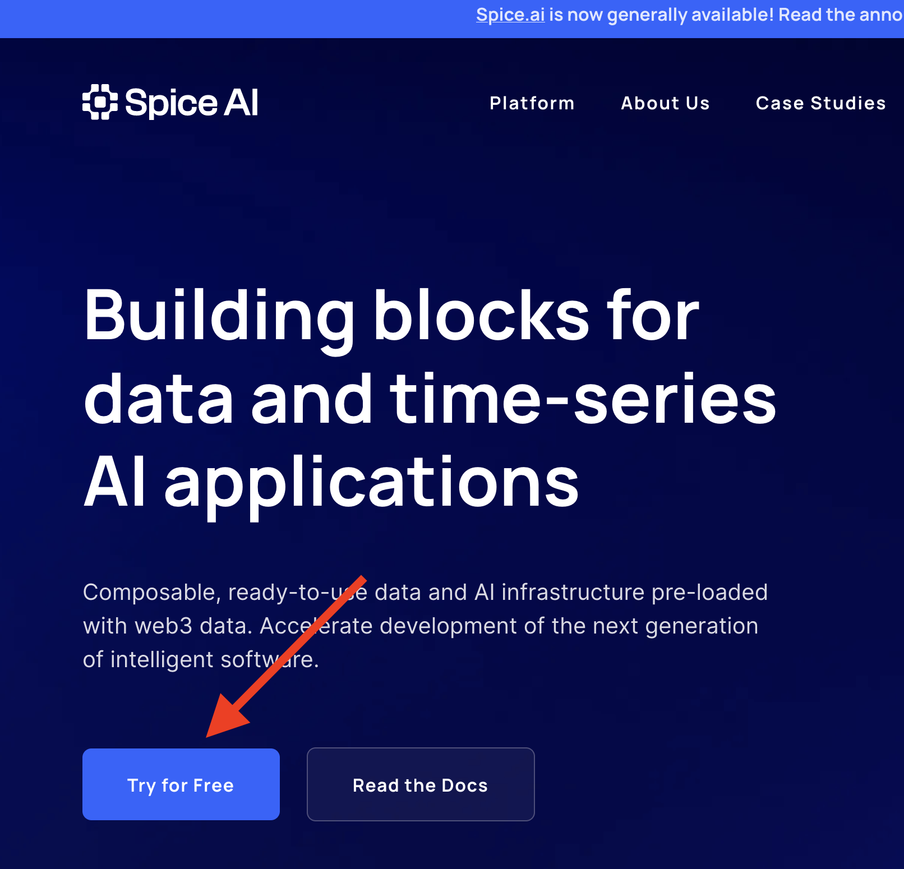

# Spice.ai

[](https://github.com/spiceai/spiceai/actions/workflows/e2e_test.yml)
[](https://github.com/spiceai/spiceai/actions/workflows/codeql-analysis.yml)
[](https://opensource.org/licenses/Apache-2.0)
[](https://discord.gg/kZnTfneP5u)
[](https://www.reddit.com/r/spiceai)
[](https://twitter.com/intent/follow?screen_name=spiceaihq)

**Spice.ai** is an open source runtime environment that enables developers to leverage rapid access to time-series data for building applications at the edge.

⚠️ **DEVELOPER PREVIEW ONLY** Spice.ai is under active **alpha** stage development and is not intended to be used in production until its **1.0-stable** release.

## Why Spice.ai? Use case section

Highlight three use cases.

1.  Front ends that need to be continuously updated
2.  High performance queries for data applications.
3.  Machine learning at the edge. Empowering edge devices to continuously improve inference

---

📺 View a getting started walkthrough of Spice.ai in action [here] TODO: NEW VIDEO HERE. Should showcase how to create a local spicepod form cloud database (Dremio, Postgress, etc).

## Quikc Start

\*\* Step 1. Install the SpiceAI CLI:

```bash
curl https://install.spiceai.org | /bin/bash
```

**Step 2. Navigate to `https://spice.ai/` and create a new account by clicking on Try for Free.**

<p align="center">
  
</p>

### Run through a data demo step by step here. Include a video showing the steps

### Community-Driven Data Components

## Will this feature be available in the future?

### Spicepod registry

Modern developers build with the community by leveraging registries such as npm, NuGet, and pip. The Spice.ai platform includes [spicerack.org](https://spicerack.org), the registry for publically avaialble datasets and machine learning models.

### INSERT EXAMPLE OF A SPICEPOD YAML HERE

As the community shares their ML building blocks (aka Spicepods, or pods for short), developers can quickly add them to their Spice.ai applications enabling them to stream data and upload pre-trained models into their applications quickly and easily.

#### This diagram should be accompanied by a summary or step by step explanation.

<p align="center">
  
</p>

### Pre-release software

⚠️ The vision to make it easy to build intelligent applications that learn is a vast undertaking. We haven't figured it all out or solved all the problems yet, so we’re inviting you on this journey and are looking for feedback the direction.

The team at SpiceAI is committed to creating a developer community

Spice.ai and spicerack.org are both pre-release, early, alpha software. Until v1.0, Spice.ai may have gaps, including limited deep learning algorithms, training-at-scale, and simulated environments..

Our intention with this preview is to work with developers early to define and create the developer experience together. 🚀 See the [Roadmap to v1.0-stable](https://github.com/spiceai/spiceai/blob/rust/docs/RELEASE.md) for upcoming features.

### Join us!

We greatly appreciate and value your support! You can help Spice.ai in a number of ways:

- ⭐️ Star this repo.
- Build an app with Spice.ai and send us feedback and suggestions at [hey@spice.ai](mailto:hey@spice.ai) or on [Discord](https://discord.gg/kZnTfneP5u).
- [File an issue](https://github.com/spiceai/spiceai/issues/new) if you see something not quite working correctly.
- Follow us on [Reddit](https://www.reddit.com/r/spiceai), [Twitter](https://twitter.com/SpiceAIHQ), and [LinkedIn](https://www.linkedin.com/company/74148478).
- Join our team ([We’re hiring!](https://spice.ai/careers))
- Contribute code or documentation to the project (see [CONTRIBUTING.md](CONTRIBUTING.md)).

We’re also starting a community call series soon!

Thank you for sharing this journey with us.

## Getting started with Spice.ai

First, ⭐️ star this repo! Thank you for your support! 🙏

Then, follow this guide to get started quickly with Spice.ai. For a more comprehensive guide, see the full [online documentation](https://docs.spiceai.org/). ADD A VIDEO OF THE DATA DEMO HERE.

## Community

Spice.ai started with the vision to make AI easy for developers. We are building Spice.ai in the open and with the community. Reach out on Discord or by email to get involved. We will be starting a community call series soon!

- Discord: [](https://discord.gg/kZnTfneP5u)
- Reddit: [](https://www.reddit.com/r/spiceai)
- Twitter: [@SpiceAIHQ](https://twitter.com/spiceaihq)
- Email: [hey@spice.ai](mailto:hey@spice.ai)

### Contributing to Spice.ai

See [CONTRIBUTING.md](/CONTRIBUTING.md).
