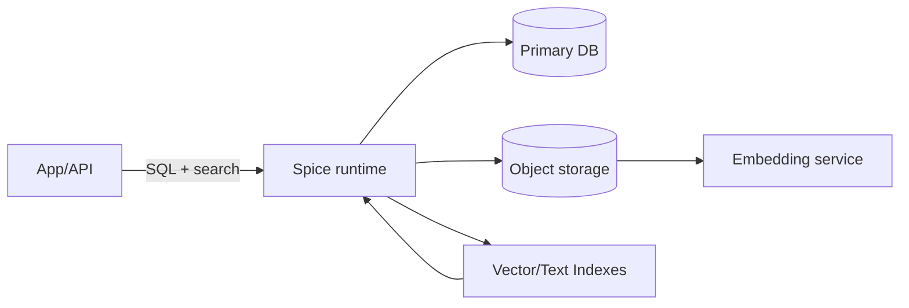
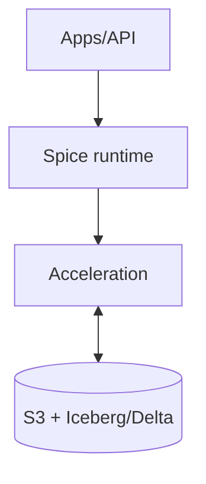
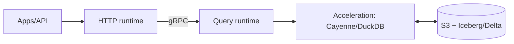

# Deploying Spice by Use Case: A Stepwise Architecture Guide

*Walk through practical deployment topologies starting simple and layering capabilities for search, acceleration, lakehouses, secure agents, and RAG.*

---

## Table of Contents

1. [Why Use-Case-First Architecture](#why-use-case-first-architecture)
2. [Building Blocks](#building-blocks)
3. [Application Search](#application-search)
4. [Datalake Accelerator](#datalake-accelerator)
5. [Operational Data Lakehouse](#operational-data-lakehouse)
6. [Secure AI Agents](#secure-ai-agents)
7. [Retrieval-Augmented Generation](#retrieval-augmented-generation)
8. [Cross-Cutting Metrics and SLOs](#cross-cutting-metrics-and-slos)
9. [Production Hardening Checklist](#production-hardening-checklist)
10. [Further Reading](#further-reading)

---

## Why Use-Case-First Architecture

Spice can run anywhere from a laptop to a multi-region cluster. Instead of starting with infrastructure, start with the problem. Each path below maps to a distinct use case and adds only the components required to meet that need. The goal is to avoid overbuilding early while leaving clear headroom for scale.

Principles to guide the journey:

- **Start with the bottleneck**: Is it relevance, latency, cost, governance, or freshness? Add components that directly relieve that pressure.
- **Keep the source of truth stable**: Lakes, warehouses, and OLTP systems remain authoritative; acceleration layers are disposable and recomputable.
- **Prefer declarative over imperative**: Capture intent in `spicepod.yml`—datasets, indexes, refresh policies—so changes are reviewable and repeatable.
- **Measure continuously**: Track p95 latency, freshness lag, cost per 1K queries, and incident rate. Let metrics justify each architectural step.

The sections that follow are written per use case. Each one starts with a minimal setup, then scales outward as requirements grow.

---

## Building Blocks

- **Spice runtime (spiced)**: Unified SQL, search, and AI inference plane; deploys as a single binary or in split HTTP/query modes.
- **Connectors**: Postgres, MySQL, Snowflake, S3/Blob/GCS, REST/GraphQL, Kafka, Iceberg/Delta/Hudi, file glob patterns. Keep credentials in secret stores.
- **Acceleration engines**: DuckDB (file) for fast local acceleration, SQLite for metadata and tiny tables, Cayenne (Vortex) for high-performance columnar acceleration on NVMe.
- **Search + vector**: Built-in vector, keyword, and full-text search with hybrid scoring; embeddings from OpenAI, Bedrock, Anthropic, Hugging Face, or self-hosted models.
- **AI inference**: Models via OpenAI, Bedrock, Anthropic, Azure, or self-hosted endpoints; combine with `ai()` SQL function and structured outputs.

Sizing cheatsheet:

- **Small teams / prototypes**: 4 vCPU, 8-16 GB RAM; DuckDB acceleration on local disk.
- **Growth workloads**: 8-16 vCPU, 32-64 GB RAM; NVMe for acceleration; separate HTTP/query runtimes.
- **High-throughput APIs**: 32-64 vCPU, 128-256 GB RAM per query node; horizontal HTTP tier; CDC-driven refresh.

---

## Application Search

**Use case**: [Application search](https://spice.ai/use-case/application-search) with hybrid (vector + BM25 + SQL) ranking.

### Start simple (Application search)

```text
[App / API]
    ↓  SQL + search
[Spice runtime]
    ↓          ↓
[Primary DB]  [Object storage]
    ↓
[Embedding service]
```

Mermaid view:



- Vector and text indexes on a single node; embeddings written to object storage.
- DuckDB acceleration in file mode for faceted filters and joins.

Config:

```yaml
datasets:
  - name: products
    from: postgres:analytics.products
    acceleration:
      enabled: true
      engine: duckdb
      mode: file
  - name: product_docs
    from: s3://docs/catalog/*.parquet
    embedding:
      model: openai:text-embedding-3-small
indexes:
  - name: product_docs_vec
    on: product_docs.content
    using:
      type: vector
      dims: 1536
  - name: product_docs_text
    on: product_docs.content
    using:
      type: text
```

Query pattern:

```sql
SELECT *
FROM vector_search(product_docs, 'ergonomic chair', 50) vs
JOIN text_search(product_docs, 'adjustable lumbar', 50) ts ON vs.id = ts.id
JOIN products p ON p.id = vs.id
WHERE p.price < 500 AND p.in_stock = true
ORDER BY (0.6 * vs.score + 0.4 * ts.score) DESC
LIMIT 10;
```

### Scale out (Application search)

- Move embeddings to a managed model endpoint; enable periodic refresh for drift control.
- Add caching for top queries; pin hot partitions in acceleration.
- Split read/write pods: one for embedding/refresh jobs, one for serving.

Data flow (medium scale):

```text
[Clients] → [HTTP runtime] → [Query runtime] → [Acceleration] → [DB + Object Store]
                          ↘ [Embedding workers] ↘ [Model endpoint]
```

Operational guardrails:

- Track p95 latency for vector and text paths separately; regressions often come from embedding skew or index bloat.
- Backfill embeddings asynchronously; block serve traffic only when schema changes, not when content updates.
- Cap concurrent embeddings to protect downstream model rate limits; queue with priorities.

### Advanced (Application search)

- Multi-tenant isolation: namespace embeddings and indexes by tenant ID.
- Rerank top-K with a lightweight LLM for higher relevance; cap model latency with timeout + fallback to scores.
- Add typo-tolerant search by pairing text index with fuzzy matching thresholds.
- Blend scoring with learned weights or offline evals; log judgments to refine weighting.
- Introduce per-tenant quotas and circuit breakers; shed load on tail latencies instead of failing global traffic.

Common pitfalls (Application search):

- Embedding drift from model upgrades without backfilling leads to unpredictable relevance; version embeddings and stagger rollouts.
- Oversized vector dims inflate storage and latency; start smaller (384-768) unless proven otherwise.
- Forgetting to refresh text indexes when documents change; align refresh cadence for vectors and text together.

Validation checklist (Application search):

- Build a small judged set (50-200 queries) and track NDCG@K and recall@K across iterations.
- Load-test hybrid queries with representative filters; watch for join selectivity spikes.
- Run chaos drills by pausing embedding workers to ensure serving continues gracefully.

---

## Datalake Accelerator

**Use case**: [Datalake accelerator](https://spice.ai/use-case/datalake-accelerator) for sub-second queries over S3/Blob lake data.

### Start simple (Datalake accelerator)

```text
[App / BI]
    ↓
[Spice runtime]  ←→  [Acceleration store: DuckDB/Cayenne]
    ↓
[S3 + Parquet / Iceberg / Delta]
```

Mermaid view:

```mermaid
flowchart TD
  APP[App/BI] --> SR[Spice runtime]
  SR <--> ACC[Acceleration (DuckDB/Cayenne)]
  SR --> LAKE[(S3 + Parquet/Iceberg/Delta)]
```

- Materialize filtered working sets near compute using DuckDB.
- Keep the lake as the source of truth; no warehouse copy.

Baseline operating model:

- Refresh on a fixed cadence (e.g., every 15 minutes) while measuring freshness gap versus business SLO.
- Favor column pruning and predicate pushdown in `refresh_sql` to keep accelerations compact.
- Validate accelerations by sampling rows against the lake to catch schema drifts early.

Config:

```yaml
datasets:
  - name: orders
    from: iceberg:s3://lake/warehouse/orders
    acceleration:
      enabled: true
      engine: duckdb
      mode: file
      refresh_sql: |
        SELECT * FROM orders WHERE order_date >= current_date - interval '30 days'
```

### Harden for scale (Datalake accelerator)

- Switch to Cayenne (Vortex) for large working sets; place acceleration on NVMe.
- Schedule refresh with `refresh_schedule` or attach CDC streams.
- Monitor freshness via `/v1/datasets`; alert on SLA breaches.

Data flow (with CDC):

```text
[Producers/DB] → [CDC stream] → [Spice runtime] → [Cayenne acceleration]
                ↓
              [S3/Iceberg]
```

Operational practices:

- Run `refresh_check_interval` low (e.g., 30-60s) when CDC is present; back off when bandwidth is constrained.
- Keep spill paths on SSD; watch spill rate to catch under-provisioned memory before p99 spikes.
- Store acceleration metadata in SQLite or Postgres for repeatable recovery after restarts.

### Advanced (Datalake accelerator)

- Partition-aware acceleration: pin hot partitions, evict cold ones.
- Multi-region read replicas: ship acceleration snapshots to edge regions.
- Cost controls: shrink acceleration footprint using column pruning and row filters.
- Snapshot promotion: build next snapshot in parallel, validate row counts/hash checks, then atomically flip.
- Tiered storage: keep 30-90 days on NVMe, older but still queried slices on cheaper object storage-backed acceleration.

Common pitfalls (Datalake accelerator):

- Refresh SQL that diverges from production filters, causing skew between acceleration and truth.
- Running acceleration on network-attached disks increases tail latencies; prefer local NVMe.
- Letting Iceberg/Delta metadata balloon (too many small files) slows planning; compact upstream or schedule table maintenance.

Validation checklist (Datalake accelerator):

- Compare row counts and sampled hashes between acceleration and lake on every refresh.
- Benchmark p50/p95 with and without acceleration to quantify ROI; publish the delta.
- Simulate schema evolution (add/drop/rename columns) in staging and ensure refresh jobs adapt without manual fixes.

---

## Operational Data Lakehouse

**Use case**: [Operational data lakehouse](https://spice.ai/use-case/operational-data-lakehouse) for real-time APIs on lake data.

### Start simple (Operational lakehouse)

```text
[Apps/API]
    ↓ SQL
[Spice runtime]
    ↓
[Acceleration: DuckDB/Cayenne] ↔ [S3 + Iceberg/Delta]
```

Mermaid view:



- Single runtime handling HTTP + planning; accelerate recent data windows.

When to start here:

- You already have Iceberg/Delta tables and need <500 ms API responses for recent data.
- You want to avoid duplicating data into a warehouse for serving workloads.
- Governance (time travel, schema evolution) must remain in the lake.

### Harden for traffic (Operational lakehouse)

```text
                  ┌───────────────┐
            SQL   │ HTTP runtime  │   health + auth
[Apps/API] ─────▶ │ (front layer) │ ───────────────┐
                  └──────┬────────┘               │
                         │ gRPC                   │
                         ▼                        │
                  ┌───────────────┐               │
                  │ Query runtime │ ◀─────────────┘
                  │ (planning/DF) │
                  └──────┬────────┘
                         ▼
        [Acceleration: Cayenne/DuckDB] ↔ [S3 + Iceberg/Delta]
```

Mermaid view:



- Separate HTTP and query runtimes (distinct Tokio runtimes) to keep health probes fast.
- Horizontal scale HTTP layer; scale query runtimes for concurrency and CPU.
- Use Iceberg/Delta snapshots for correctness; accelerate hot slices; stream CDC for freshness.

Key settings:

- `max_concurrent_tasks` tuned per CPU core count.
- `refresh_check_interval` for near-real-time materialization.
- `spill_path` for large joins; place on fast NVMe.

Runbook essentials:

- Alert on health endpoint latency and queue depth; they signal pressure before user latency regresses.
- Keep per-table freshness SLOs (e.g., 2 minutes for orders, 15 minutes for inventory) and track separately.
- Test failover: restart query runtime while HTTP runtime stays up; ensure cached auth and routing survive.

### Advanced (Operational lakehouse)

- Multi-tenant throttling and workload management (priorities per API key).
- Tiered acceleration: NVMe for hot, object storage for warm snapshots.
- Blue/green accelerations: build new snapshot, flip pointer after validation.
- Dual-write safety: validate CDC gaps by comparing snapshot sequence numbers against Iceberg/Delta manifests.
- Coarse-grained cell-based architecture for regional fault domains; avoid cross-zone chatter for hot paths.

Common pitfalls (Operational lakehouse):

- Mixing long-running batch queries with latency-sensitive traffic on the same query runtime without admission control.
- Ignoring snapshot expiration; stale metadata can surface ghost data or 404s.
- Over-widening accelerations (full-table copies) that erase the cost and latency gains of working sets.

Validation checklist (Operational lakehouse):

- Run failover tests where query runtimes restart during traffic; ensure HTTP layer stays healthy.
- Verify snapshot correctness by replaying a small set of critical queries against both lake and acceleration.
- Stress test CDC ingest while serving to ensure backpressure protects query latency.

---

## Secure AI Agents

**Use case**: [Secure AI agents](https://spice.ai/use-case/secure-ai-agents) needing least-privilege access and auditability.

### Start simple (Secure AI agents)

```text
[Agents]
  ↓ (SQL + AI)
[Spice runtime]
  ↓
[Policy engine / allowlists]
  ↓
[Connectors: DBs, APIs, lakes]
```

Mermaid view:

```mermaid
flowchart TD
    AG[Agents] --> SR[Spice runtime]
    SR --> POL[Policy engine / allowlists]
    POL --> CONN[Connectors (DBs/APIs/lakes)]
    SR --> AI[ai() / Models]
```

- Define allowlisted datasets and columns; bind to API keys.
- Use structured outputs (`ai()` with JSON schema) to constrain generations.

Threat model basics:

- Agents must not access systems beyond declared connectors.
- Prompts and outputs may contain sensitive data—log minimally and redact aggressively.
- Tool calls should be bounded by timeouts, size limits, and allowlists.

### Harden controls (Secure AI agents)

- Externalize secrets to vaults; block direct egress except allowlisted hosts.
- Add audit logging to every query and model call; forward to SIEM.
- Redact PII in logs and traces; enforce column masking where required.

Pattern:

- Create policy views (e.g., `customers_allowed`) and expose only those to agents.
- Configure network egress restrictions so agents cannot call arbitrary hosts.

Observability for governance:

- Emit structured events for each `ai()` invocation with dataset, model, token count, and decision outcome.
- Capture prompt hashes (not full text) for correlation without leaking content.
- Build dashboards for allowlist hits/denies and throttle reasons to tune policies.

### Advanced (Secure AI agents)

- Per-tenant identity: map API keys to roles and datasets; enforce row-level filters.
- Response signing and tamper-proof logs for regulated environments.
- Sandboxed tool execution with strict timeouts and payload size limits.
- Dynamic policy: adjust row filters based on model confidence or user risk tier.
- Multi-LLM diversity: route high-risk prompts to smaller, cheaper, or internally hosted models with stricter guardrails.

Common pitfalls (Secure AI agents):

- Allowing agents to construct arbitrary network calls; always restrict egress destinations.
- Logging full prompts and responses containing sensitive data; prefer hashes and structured summaries.
- Forgetting to rotate credentials used by tools; set TTLs and automate rotation.

Validation checklist (Secure AI agents):

- Red-team prompts for data exfiltration and prompt injection; verify policies and allowlists stop them.
- Confirm audit logs capture principal, dataset, model, and tool calls for every request.
- Periodically rotate keys and ensure agents continue to function; watch for hardcoded credentials.

---

## Retrieval-Augmented Generation

**Use case**: [Retrieval-augmented generation](https://spice.ai/use-case/retrieval-augmented-generation) combining search, retrieval, and LLM calls.

### Start simple (RAG)

```text
[App]
  ↓
[Spice SQL]
  ↓              ↓
[Vector + text]  [ai()] → [LLM]
  ↓
[Acceleration store]
  ↓
[Lake/DB/Files]
```

Mermaid view:

```mermaid
flowchart TD
    APP[App]
    APP --> SQL[Spice SQL]
    SQL --> RETR[Vector + text retrieval]
    SQL --> AI[ai()]
    AI --> LLM[LLM]
    RETR --> ACC[Acceleration store]
    ACC --> DATA[(Lake/DB/Files)]
```

- Single SQL to fetch context and call the model via `ai()`.
- Cache embeddings locally; keep working set small.

Validation tips:

- Measure answer quality with small human eval sets; track coverage and hallucination rate.
- Start with deterministic prompts and narrow scopes (one domain, one tone) before broadening.
- Keep chunk sizes consistent (e.g., 256-512 tokens) and overlap minimal to reduce duplicates.

Example query:

```sql
WITH ctx AS (
  SELECT *
  FROM vector_search(docs, $query, 40) vs
  JOIN text_search(docs, $query, 40) ts ON vs.id = ts.id
  WHERE ts.score > 0.35
  ORDER BY (0.7 * vs.score + 0.3 * ts.score) DESC
  LIMIT 8
)
SELECT ai(
  'Answer using only the provided context. Context: ' || string_agg(ctx.content, '\n\n'),
  'gpt-4o'
) AS answer
FROM ctx;
```

### Harden for production (RAG)

- Materialize embeddings close to compute; avoid re-embedding unchanged docs.
- Track prompt + model cost; cap `max_tokens`; set timeouts with fallbacks.
- Enforce content filters and citation requirements to reduce hallucinations.

Operational safeguards:

- Attach per-tenant or per-index rate limits; burst tokens can spike cost quickly.
- Version embeddings and prompts; store both with responses to enable rollbacks.
- Add freshness signals to responses (e.g., `data_version`, `last_refreshed`) for observability.

### Advanced (RAG)

- Multi-vector strategy: store title, body, and metadata embeddings; blend scores.
- Hybrid rerank: combine vector, text, and structured filters with learned weights.
- Multi-tenant namespaces for embeddings and indexes to isolate customers.
- Tool-aware RAG: when answers require joins or aggregations, call SQL first, then condition the model on the result.
- Streaming generation with partial context fetch to reduce time-to-first-token while keeping recall high.

Common pitfalls (RAG):

- Over-long context windows that dilute relevance; keep context compact and precise.
- Re-embedding unchanged documents wastes cost; track hashes and only embed deltas.
- Unbounded model retries on timeouts can create request storms; enforce caps and backoff.

Validation checklist (RAG):

- Maintain an eval set with grounded answers; track factuality and citation coverage.
- Compare retrieval-only, retrieval+rerank, and retrieval+rerank+LLM to quantify each layer's impact.
- Monitor context diversity per answer to avoid repeating the same chunk across responses.

---

## Cross-Cutting Metrics and SLOs

Track a handful of signals across all architectures to know when to scale up or down:

- **Latency**: p50/p95 for search, SQL, and `ai()` separately; alert on p99 for user-facing APIs.
- **Freshness**: end-to-end lag between source commit and accelerated view; keep per-dataset SLOs.
- **Cost**: storage for accelerations, model spend per 1K queries, and egress to model endpoints.
- **Quality**: relevance or answer accuracy from offline eval sets; embed judgments into logs for continuous tuning.
- **Reliability**: error budget burn for 4xx/5xx, model timeouts, and failed refresh jobs.

Example SLOs by use case:

- Application search: p95 < 300 ms, freshness < 10 minutes, top-K accuracy > 85% on eval set.
- Datalake accelerator: p95 < 500 ms for hot slices, freshness < 5 minutes with CDC, cost < target $/1K queries.
- Operational lakehouse: p95 < 400 ms for APIs, snapshot correctness 100%, zero failed health checks under load.
- Secure agents: policy evaluation < 50 ms, zero egress violations, audit completeness 100%.
- RAG: p95 < 1.5 s including model, hallucination rate < 5% on evals, cost per answer within budget.

## Production Hardening Checklist

- **Resilience**: Health probes on HTTP runtime; backpressure on query runtime; circuit breakers on model calls.
- **Freshness**: CDC or scheduled refresh; alert if staleness exceeds SLO.
- **Cost**: Right-size acceleration (working set vs full copy); cache LLM responses; choose embedding dimensions intentionally.
- **Observability**: Tracing on every query, embedding, and `ai()` call; metrics for cache hit rate and refresh latency.
- **Security**: Principle of least privilege on connectors; signed requests; egress controls; redact PII in logs.
- **Capacity**: Track spill rate, CPU saturation, and concurrency; model p95 under peak plus 30% headroom.
- **Deployments**: Blue/green for accelerations and configs; canary high-risk schema or prompt changes.
- **Data quality**: Validate row counts and null rates post-refresh; block promotion on regressions.
- **Runbooks**: Document restart orders, cache warmup steps, and how to rebuild accelerations quickly.

---

## Further Reading

- Deployment architectures: [spiceai.org/docs/deployment/architectures](https://spiceai.org/docs/deployment/architectures)
- Application search: [spice.ai/use-case/application-search](https://spice.ai/use-case/application-search)
- Datalake accelerator: [spice.ai/use-case/datalake-accelerator](https://spice.ai/use-case/datalake-accelerator)
- Operational data lakehouse: [spice.ai/use-case/operational-data-lakehouse](https://spice.ai/use-case/operational-data-lakehouse)
- Secure AI agents: [spice.ai/use-case/secure-ai-agents](https://spice.ai/use-case/secure-ai-agents)
- Retrieval-augmented generation: [spice.ai/use-case/retrieval-augmented-generation](https://spice.ai/use-case/retrieval-augmented-generation)
