# Cayenne

### Spice.ai's acceleration engine for high-rate CDC — a lakehouse table format built on Vortex

*A technical walkthrough — organized breadth-first, from the 10,000-foot view down to the hot-path internals, with comparisons to Iceberg, Delta Lake, and Apache Hudi.*

---

> **Scope and sourcing.** This document describes the `cayenne` crate in the Spice.ai OSS repository (`crates/cayenne`), **as of commit `9403890bb12a7040006da14431519686ae7b44b0` (`9403890bb1`, committed 2026-07-14)** — carrying forward the `4685a3dd` baseline and folding in the maintained-aggregate, memory-mode, CDC, compaction, and statistics changes since. It is built from the crate's `README.md` and `docs/storage.md`, cross-checked against the source — primarily `maintained_aggregate.rs`, `provider/table.rs`, `provider/mutation_writer.rs`, `provider/deletion_index.rs`, `provider/on_conflict.rs`, `provider/mem_tier.rs`, `provider/compaction.rs`, `provider/compaction_writer.rs`, `provider/zorder.rs`, `provider/query_admission.rs`, `provider/tuning.rs`, `provider/wal_checksum.rs`, `provider/file_digest.rs`, the vendored `row_converter/` module, and `metastore.rs` / `metastore/sqlite.rs` / `metastore/turso.rs`. Where a detail matters, the relevant type or function is named so you can find it in the tree. The DDL in `metastore/sqlite.rs` and the column lists in `metastore::EXPECTED_TABLES` are the authoritative source of truth for anything schema-related.

---

# Glossary

A quick reference for the recurring terms below. Each is defined in more depth where it first appears in the text; this is the thirty-second version.

**Role and substrate**

- **Accelerator** — Cayenne's deployed role: a derived, refreshable replica of a source, not the system of record.
- **Vortex** — the columnar on-disk file format Cayenne stores data in.
- **Metastore** — the transactional catalog (SQLite, or libSQL/Turso) holding snapshots, file manifests, sequence numbers, delete-file references, and statistics.
- **CDC** — change data capture; the ordered stream of row changes Cayenne ingests from a source.
- **Source slot / LSN** — the source's change-log offset (e.g. a Postgres LSN), acked only once the corresponding burst is durable.

**Versioning and visibility**

- **Snapshot** — an immutable, point-in-time set of data files plus metadata. Kinds: *current*, *staging*, *protected*.
- **Snapshot pointer (`current_snapshot_id`)** — the atomic pointer whose flip publishes a new version to readers.
- **Sequence number** — the monotonic, Iceberg-style ordering stamped on every row and delete (`delete_seq`, `insert_seq`, and the protected-threshold `snapshot_sequence`).
- **Snapshot isolation / MVCC** — readers see one consistent snapshot for the life of a scan; writers publish new snapshots without blocking readers.
- **Merge-on-read** — deletions applied at scan time via the deletion index, rather than by rewriting data files.

**The write path**

- **Stage A / Stage B** — the two-phase write: Stage A is the durable half (encode + staged files + WAL); Stage B is the visibility half (move into the current snapshot + pointer flip).
- **Staging WAL (`_wal.json`)** — the crash-safety marker that makes a burst's staged file set recoverable.
- **Checkpoint** — the process that flushes the in-memory mem-tier to a durable, published Vortex file (and advances the source slot, if a seal hasn't already).
- **Seal** — a cheap periodic pass (default every 2 s) that durably *shadows* the mem-tier's active segments into the unpublished inline corpus and advances the source slot — durability without a Vortex encode or a publish.
- **Level-0 / tier-0** — the small-write landing tier: inline blobs (in the metastore) or the mem-tier, before flush to a Vortex file.
- **Mem-tier** — the RAM tier used in `cdc_durability: memory` (and as the permanent store under acceleration `mode: memory`); for file-mode CDC it is discarded on crash and recovered from its seal shadow plus a replay of the un-sealed tail. Under `mode: memory` there is no seal/checkpoint recovery — the tier is the whole table and dies with the process.
- **`mode: memory`** — acceleration storage mode: fully in-RAM Cayenne (no Vortex, no durable metastore path); see *Storage modes*.
- **Upsert / on-conflict** — an update modeled Iceberg-style as a re-insertion that tombstones the prior copy of the key.
- **PK keyset** — the cached set of existing primary keys, used for `auto` conflict detection without rescanning data.

**Deletions**

- **Tombstone** — a per-key fused `{delete_seq, insert_seq}` marker; the row is visible iff `insert_seq > delete_seq`.
- **Deletion vector** — the durable Arrow-IPC file recording deleted row positions or keys.
- **Deletion index (`LayeredRuns`)** — the in-memory, LSM-shaped cache of unbaked tombstones that each scan probes.
- **Seq-prefix bake** — the compaction that folds deletions at or below a cutoff sequence into rewritten data and prunes them from the index, bounding its size.
- **Protected snapshot** — a snapshot tagged with a threshold sequence so a writer needn't re-resolve the whole prior deletion set.
- **Position-based vs key-based deletion** — deletion by row position (a RoaringBitmap over a data file) versus by primary key.

**Concurrency and statistics**

- **Listing fence** — the RwLock read/write barrier that serializes the publish move + pointer flip against a scan's plan-build.
- **`ArcSwap` / `rcu`** — the lock-free publish primitives: `ArcSwap` gives wait-free reads of an `Arc`, and `rcu` is its compare-and-swap retry loop for safe read-modify-write.
- **HyperLogLog / NDV** — the mergeable, add-only sketch that estimates a column's number of distinct values for the query optimizer.

---

# Part 1 — The 10,000-foot view

## What Cayenne is, in one breath

Cayenne is the **acceleration engine** behind Spice.ai datasets configured with `engine: cayenne`: it holds a local, query-optimized, continuously-refreshed copy of data whose source of truth lives upstream. It is **built on** the [Vortex](https://github.com/spiral-db/vortex) columnar file format, pairing it with a **transactional SQL metastore** (SQLite by default, Turso optionally) for all metadata, **immutable Vortex data files** on local disk or S3 Express One Zone for the columnar data, and an **LSM-style level-0 tier** that absorbs small writes without producing a data file per batch. A single `CayenneTableProvider` ties these together behind DataFusion's `TableProvider` trait, so the *same* table simultaneously serves high-rate change-data-capture (CDC) ingestion and low-latency analytical scans — the dual workload it was built to carry, with the architecture shaped end-to-end around keeping the write path and the read path off each other's backs.

## Table format, or accelerator?

Cayenne has the full apparatus of a lakehouse table format — a transactional metastore, immutable columnar files made visible by an atomic snapshot-pointer flip (genuine snapshot isolation, not last-write-wins), Iceberg-style sequence numbers governing delete and insert visibility, deletion vectors, tiered compaction, and `MERGE` / `CREATE TABLE` handlers against a catalog. That apparatus is why it *looks* like Iceberg or Delta, and it is what lets the rest of this document compare it to them.

But "table format" describes the machinery, not the job. Cayenne's **role** is the accelerator: you select it with `engine: cayenne` in the same slot you would otherwise write `engine: duckdb` or `engine: postgres`, and the data it holds is a derived replica — disposable and rebuildable from the upstream source (a schema mismatch tells you, in those words, to *clear your acceleration data*). The two descriptions don't compete. Cayenne *is* a table format **because** an accelerator that applies an upserting CDC stream needs ACID snapshots, ordered deletes, and merge-on-read — a plain cache cannot apply changes correctly — and it was built **as** an accelerator because that is the workload its level-0 inline tier, in-memory CDC durability tier, and source-commit-timestamp plumbing are tuned for. Those are accelerator-first choices — the kind of CDC bookkeeping the open formats today leave to the ingestion engine rather than baking into the table format itself — but they reflect an emphasis, not a ceiling. Nothing in the machinery confines Cayenne to the accelerator role: it already carries `MERGE` / DDL handlers (today behind a feature flag) and portable, node-independent snapshots, so it *could* grow into a more general-purpose table format if Spice chose to take it there. As built and as used today, though, it is best read as one thing: **a lakehouse table format, built on Vortex, deployed as Spice's high-rate-CDC accelerator.**

## The one idea everything hangs from

Most of Cayenne's design follows from a single discipline: **the expensive parts of a write never block a read, and a write becomes visible through one atomic pointer flip.**

- All metadata changes are transactional in the metastore (`BEGIN … COMMIT`).
- Data files are immutable — a write never mutates a file in place.
- The authoritative state of a table is a single column, `cayenne_table.current_snapshot_id`. A write or a compaction becomes visible by **atomically flipping that pointer**, never by editing existing data.
- The heavy lifting (encoding Vortex files, metastore I/O, checkpoints) happens *outside* the read/write barrier. Only the instantaneous pointer flip happens inside it.
- State the read hot-path touches is published **wait-free** through `ArcSwap` cells, so readers never block on a writer's `Arc`-load.

Everything below — the tiers, the locks, the deletion index, the CDC pipeline — is machinery in service of that one idea.

## Storage modes: `mode: file` vs `mode: memory`

Acceleration `mode:` selects how Cayenne persists data. This is distinct from
`cdc_durability: memory` (a durability deferral on an otherwise file-backed table).

Spicepod `acceleration.mode` defaults to **`memory`** (the same default as Arrow).
Omitting `mode` on a Cayenne dataset therefore selects fully in-RAM Cayenne. Set
`mode: file` explicitly when you need durable on-disk (or S3 Express) storage.

- **`mode: file`** (durable; must be set explicitly): local SQLite/Turso metastore,
  Vortex data files (local FS or S3 Express One Zone), level-0 inline + optional RAM
  mem-tier for CDC, background compaction/seal/checkpoint. Survives restarts; CDC
  source slots are deferred until a durable seal or checkpoint covers the burst.
- **`mode: memory`** (fully in-RAM, ephemeral; spicepod default when `mode` is
  omitted): all table data lives in the RAM mem-tier; the catalog is an in-memory
  SQLite `memdb` (never written to disk). Checkpointing, sealing, compaction, and
  the datalake (cold) tier are disabled. On restart the table is empty and reloads
  from its source (like Arrow memory acceleration). Because there is no durable
  covering checkpoint, a CDC (`refresh_mode: changes`) source's replication slot is
  committed **immediately** after each in-RAM write — not deferred behind a later
  seal/checkpoint. Works for `full` / `append` / `changes` and for keyed or no-PK
  tables; a full refresh atomically replaces the in-RAM tier. **Partitioning is
  rejected** at accelerator config time (`partition_by` + `mode: memory` returns a
  configuration error). A per-table hard RAM bound (`cayenne_cdc_mem_tier_max_bytes`;
  default unbounded) is enforced as a structured error during buffering; peak checks
  count **resident + incoming** even for overwrite, because the old tier stays live
  until the atomic replace. S3 Express / `cayenne_file_path` params are ignored in
  this mode (no object store is built).

Source: acceleration `mode` → `!is_file_accelerated()` in
`crates/accelerators/accelerator-cayenne/src/lib.rs` (`apply_memory_mode_overrides`,
partition reject), `VortexConfig.memory_mode`,
`CayenneTableProvider::is_memory_resident_mode`, and the mem-tier write path in
`provider/sink.rs` / `provider/mutation_writer.rs`.

## The three cooperating tiers

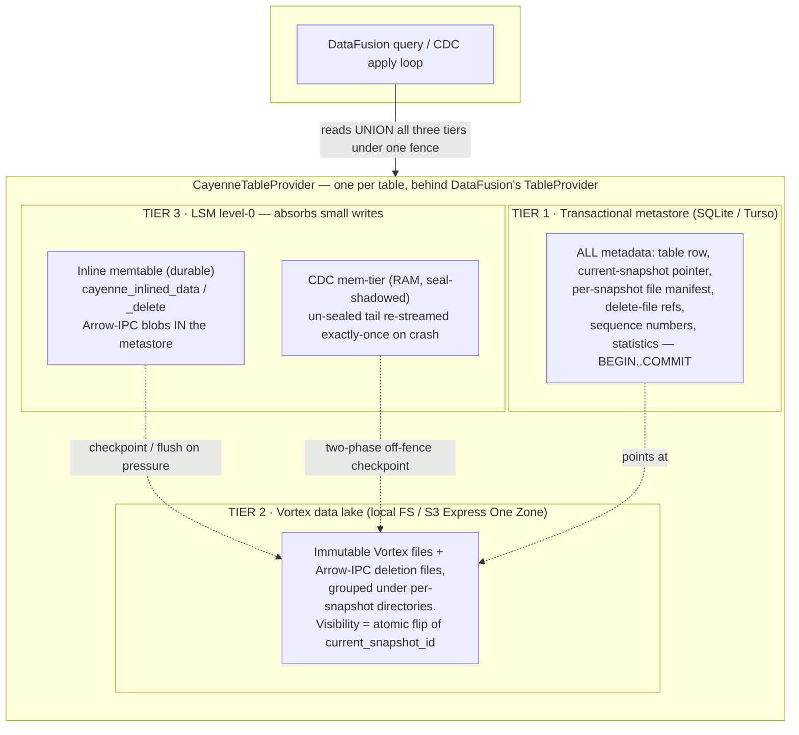
```mermaid
flowchart TB
    subgraph CLIENT[" "]
        direction TB
        DF["DataFusion query / CDC apply loop"]
    end

    subgraph PROVIDER["CayenneTableProvider — one per table, behind DataFusion's TableProvider"]
        direction TB

        subgraph T1["TIER 1 · Transactional metastore (SQLite / Turso)"]
            M["ALL metadata: table row, current-snapshot pointer,<br/>per-snapshot file manifest, delete-file refs,<br/>sequence numbers, statistics — BEGIN..COMMIT"]
        end

        subgraph T3["TIER 3 · LSM level-0 — absorbs small writes"]
            L0A["Inline memtable (durable)<br/>cayenne_inlined_data / _delete<br/>Arrow-IPC blobs IN the metastore"]
            L0B["CDC mem-tier (RAM, seal-shadowed)<br/>un-sealed tail re-streamed exactly-once on crash"]
        end

        subgraph T2["TIER 2 · Vortex data lake (local FS / S3 Express One Zone)"]
            V["Immutable Vortex files + Arrow-IPC deletion files,<br/>grouped under per-snapshot directories.<br/>Visibility = atomic flip of current_snapshot_id"]
        end
    end

    DF -->|"reads UNION all three tiers under one fence"| PROVIDER
    L0A -.->|"checkpoint / flush on pressure"| V
    L0B -.->|"two-phase off-fence checkpoint"| V
    M -.->|"points at"| V
```

| Tier | Holds | Durability | Backed by |
|------|-------|-----------|-----------|
| **Metastore** (SQLite / Turso) | *all* metadata — table row, snapshot pointer, file manifests, delete-file refs, statistics, sequence numbers, and the inline memtable itself | transactional (`BEGIN … COMMIT`) | a SQL database file (or libSQL) |
| **Vortex data lake** (local FS / S3 Express One Zone) | immutable Vortex data files + Arrow-IPC deletion files, grouped under per-snapshot directories | atomic file rename + snapshot-pointer flip | the object store / filesystem |
| **LSM level-0** | small writes absorbed as Arrow-IPC blobs in the metastore (`cayenne_inlined_*`) and, under the CDC profile, an in-RAM mem-tier | metastore tier is durable; RAM tier is discarded on crash — its sealed prefix recovers from a durable shadow, the un-sealed tail re-streams exactly-once | metastore (inline) + process RAM (mem-tier) |

The level-0 tier is the part that makes high-rate CDC affordable. A naïve format turns every small change batch into its own little data file, and a stream of thousands of tiny files wrecks read performance (the classic "small-files problem"). Cayenne instead lands small bursts in the level-0 tier — either as Arrow-IPC blobs inside the metastore (durable) or in a RAM mem-tier (seal-shadowed every ~2 s; the un-sealed tail re-streamed on crash) — and only *checkpoints* them into a consolidated Vortex file once enough has accumulated.

## Where Cayenne sits

Cayenne is the acceleration engine behind a Spice dataset configured with `engine: cayenne`. A `refresh_mode: changes` dataset selects it exactly as it would select DuckDB, SQLite, or Postgres — but Cayenne's owned Vortex storage and in-memory CDC tier make it the engine of choice for high-rate, large CDC streams. The runtime's CDC apply loop coalesces source change envelopes into bursts and hands them to Cayenne. Those envelopes are **connector-agnostic**: PostgreSQL WAL logical replication, DynamoDB Streams, MongoDB Change Streams, and Debezium (CDC over Kafka, for MySQL/SQL Server/Oracle) all decode into the same `{op, primary_keys, data}` change batch, so Cayenne ingests all of them through one path.

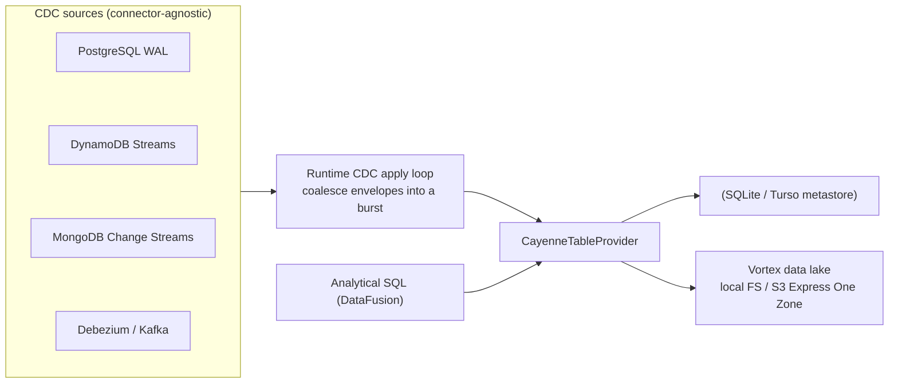
```mermaid
flowchart LR
    subgraph SRC["CDC sources (connector-agnostic)"]
        direction TB
        PG["PostgreSQL WAL"]
        DDB["DynamoDB Streams"]
        MDB["MongoDB Change Streams"]
        DBZ["Debezium / Kafka"]
        PG ~~~ DDB ~~~ MDB ~~~ DBZ
    end
    SRC --> APPLY["Runtime CDC apply loop<br/>coalesce envelopes into a burst"]
    APPLY --> PROV["CayenneTableProvider"]
    QRY["Analytical SQL (DataFusion)"] --> PROV
    PROV --> META["(SQLite / Turso metastore)"]
    PROV --> LAKE["Vortex data lake<br/>local FS / S3 Express One Zone"]
```

A reader can keep the whole rest of this document in perspective with four claims:

1. **Metadata is a SQL transaction; data is an immutable file; visibility is a pointer flip.**
2. **Small writes are absorbed in level-0; big writes become Vortex files; both are unioned at read time.**
3. **Deletes never rewrite data** — they are recorded as separate deletion vectors and applied *merge-on-read*.
4. **Sequence numbers order everything**, so a scan can always answer "was this row deleted, and if so, re-inserted after the delete?" deterministically.

## The life of a change: one stream, many generations

Everything above is easier to hold in the head as one picture. A source emits a single long, ordered stream of changes; Cayenne continuously *partitions* that stream into generations that age from volatile to consolidated, and each boundary between generations is crossed by a specific write-path or background process. Read the landscape figure below as a staircase: from the **top-right** — the system of record, holding the newest changes — down and to the **left** into ever-more-consolidated storage. Time / recency runs left→right, and the bracket down the left groups the generations by where they physically live — in-memory (RAM), warm (local-disk Vortex), and cold (object store). The sequence ranges are illustrative: they exist only to show that at any instant the one stream is cut into contiguous spans, one per generation.

<div class="landscape-fig">
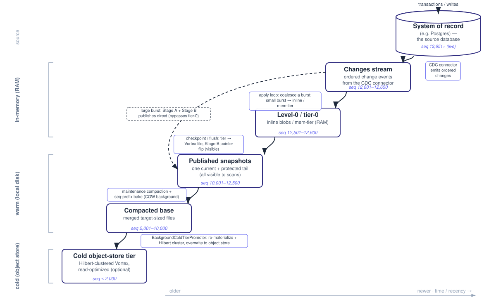
<figcaption>The life of a change — one ordered stream, partitioned across generations. Time / recency runs left→right; the bracket down the left groups the generations by where they physically live (in-memory, warm local disk, cold object store). Solid arrows name the process that settles a change into the next generation; the dashed arrow is the large-burst path that bypasses the level-0 tier.</figcaption>
</div>

Three boundaries in that picture are worth naming, because the rest of the document keeps returning to them. **Durability**: a change becomes crash-safe once Stage A's `_wal.json` is fsynced (in `file` mode) or — in `memory` mode — at the earlier of a periodic **seal** (default every 2 s, which durably shadows the mem-tier's newest segments without publishing them) and the next full checkpoint; whichever comes first is also when the **source offset is acked**, so a crash before that point simply re-streams the burst. **Visibility**: a change becomes queryable only after Stage B flips the snapshot pointer; in between it is safe on disk but unseen. **Consolidation**: the last arrow is *background maintenance*, not a stage on the write path — a copy-on-write pass that runs off the listing fence and commits by the same atomic pointer flip. It takes two related forms sharing the subset-compaction machinery: tiered **compaction**, triggered by small-file accumulation, rebuilds the current snapshot into fewer target-sized files; and the **seq-prefix bake**, triggered once the deletion index grows past a threshold, consolidates the settled prefix of protected snapshots — physically applying their deletions and pruning every tombstone at or below the cutoff, while leaving the newest few protected snapshots untouched. Its output, the compacted base, becomes the floor of the *next* current snapshot, so the published generation is always "the compacted base, plus whatever has landed since." Because the pass is copy-on-write and optimistic, one that races a concurrent append simply aborts and retries later rather than blocking the writer. Each transition is detailed later: Stage A/B and the write path in Parts 2 and 4, the tiers and checkpoint in Part 2, and compaction and the seq-prefix bake in Parts 3 and 4.

One note on versioning: the **cold object-store tier** at the bottom (user-facing name: the **datalake tier**) is newer than the commit this document otherwise tracks — added in PR #11543 (`e972f80`), finalized and renamed in #11731, and made incremental in #11745. It is optional (enabled by `cayenne_datalake_location`, an `s3://` URI; dormant and byte-identical otherwise) and shown here because it completes the tiering picture. When enabled, the tiers form a strict cascade — RAM mem-tier, then warm local-disk Vortex, then cold object store, with a row living in exactly one tier. A background `BackgroundColdTierPromoter` promotes warm to cold once size/file thresholds cross (default trigger: warm bytes exceeding 16× `cayenne_datalake_target_file_size_mb`). Promotion is **incremental carry-forward** (#11745): the existing cold manifest is classified into *dirty* files that may host a tombstoned key — per-PK-column min/max rectangles from the manifest stats blobs, refined by per-file PK bloom filters, conservative in every failure direction — and *clean* files carried forward by manifest reference, never re-read. Only the warm delta plus the dirty files are re-read (all deletes applied, one version per key), **Z-order-clustered** for tight multi-column zone maps, and written as read-optimized Vortex at the larger cold file size under a per-promotion prefix (`…/<table_name>-<table_id>/data/<promotion_id>/` — the sanitized table name makes a shared datalake location navigable, the UUIDv7 `table_id` suffix keeps the prefix collision-free; `TableMetadata::datalake_dir_segment`), then atomically registered (`cayenne_cold_tier_file`, whose per-file `pk_bloom_blob` also lets upsert keyset rebuilds serve cold PK existence with no object-store scan) while overwrite-clearing the warm tier — so promotion cost tracks the *changed* data, not total table size (watch `datalake_rewrite_selectivity` in the commit trace). Objects orphaned by rewrites are reclaimed by a periodic mark-and-sweep GC rooted at the manifest (`cayenne_datalake_gc_interval_ms`, default 5 min, doubling as the orphan grace period). Enabling the tier requires `refresh_mode: changes` or `append` and forces key-based deletes; partitioned and position-delete tables are unsupported.

### Where it all lives on disk

The left-hand bracket above groups the generations by *where they physically live*. Here is that same split as an actual on-disk tree for the default local-filesystem backend; an S3-backed table mirrors the per-table portion under an `s3://…/<table_id>/<snapshot_id>/` prefix. Paths and names come from `provider/constants.rs`, `snapshot_dir_path`, and the compaction file writer.

```text
cayenne_<catalog>/                        # created under <spice_data_base_path>/
├─ metadata/
│  └─ cayenne.db                          # SQLite metastore (all metadata; see below)
└─ data/                                  # the table_path root
   └─ <table_id>/                         # one dir per accelerated table
      ├─ <current_snapshot_id>/           # exactly ONE live snapshot
      │  ├─ file_0000.vortex              # immutable Vortex data files,
      │  ├─ file_0001.vortex              #   merged + target-sized by compaction
      │  └─ deletions/
      │     └─ <id>.arrow                 # Arrow-IPC delete vectors (merge-on-read)
      ├─ <protected_snapshot_id>/         # 0..K retained older publishes,
      │  └─ ...                           #   same shape; may share files via manifest
      └─ _staging/                        # transient — present only mid-burst
         ├─ _wal.json                     # Stage-A durability marker (file mode)
         └─ <staged>.vortex               # staged data; moved in at Stage B
```

Two things the tree deliberately omits, because they are not files under the table directory. First, the metastore (`cayenne.db`) is a single SQLite database holding *all* metadata and some data: table metadata, the authoritative per-snapshot data-file manifest (`cayenne_snapshot_file`), delete-file and re-insertion references (`cayenne_delete_file` / `cayenne_insert_record`), per-snapshot sequence numbers (`cayenne_snapshot_sequence`), the inline level-0 rows and unflushed tombstones (`cayenne_inlined_data` / `cayenne_inlined_delete`), and the PK-existence checkpoint (`cayenne_pk_index`). A small write absorbed inline therefore never becomes a file at all — it is a row in `cayenne.db` until a checkpoint flushes it into a `.vortex` file. Second, the CDC mem-tier has no filesystem presence whatsoever: it lives in process RAM and is rebuilt by re-streaming from the source on restart. And when the optional cold tier is enabled, its files sit in the object store — registered append-only in `cayenne_cold_tier_file` by absolute `file_url` — outside the per-table snapshot directories entirely.

A snapshot, then, is not a self-contained copy of the table; it is a *directory of immutable Vortex files plus a `deletions/` subdirectory*, whose membership is defined by the manifest rows in `cayenne.db`. Publishing a new snapshot is a metastore transaction that points at a new set of file paths — many of them shared, unchanged, with the previous snapshot — which is why a pointer flip or a compaction is cheap, and why the handful of retained protected snapshots do not each cost a full table's worth of disk. The Vortex segment cache follows the same physical identity: its key is the object store, the exact path within it, and the Vortex segment id. It holds segments as stored — serialized, still in Vortex's compressed encodings — so a hit skips the read, not the decode; canonicalizing those encodings into flat Arrow is charged to the query memory pool separately, and the two never account for the same bytes. The cache itself is process-wide — one bounded budget shared by every Cayenne table, sized by `runtime.params.cayenne_segment_cache_mb` — so the store must be part of the key: an `object_store` path is store-relative, and two stores can hold the same relative path. Snapshot cleanup invalidates only paths proven retired by the manifest and the current/protected/in-flight snapshot guards, after physical deletion; a shared path or a losing rewrite therefore keeps its cached segments. Cold-tier GC and whole-file retention use the same post-delete rule for each object they confirm absent. Cleanup enumerates and directly removes every matching key, so an idle table releases the retired buffers without waiting for Moka's bounded maintenance passes or another cache access; because that enumeration scans a cache holding every table's segments, it runs on the blocking pool rather than a query worker. Both of cleanup's waits — for the in-flight writes on the retiring paths, and for that enumeration — are bounded at ten seconds each, after which it logs and moves on: retirement runs inline on the delete and overwrite paths, so an unbounded wait there would stall the writer behind whatever had stalled the pool. What giving up costs has three outcomes rather than two. Giving up on the enumeration leaves behind every key it would have found. Giving up on the in-flight writes costs only a moment of residency *when the straggler completes*, because a put that lands after the enumeration removes its own entry once it sees the path retired — that self-removal is what makes the bounded drain safe. But a put cancelled between its insert and that self-removal leaves its entry behind exactly as the enumeration case does, since by then nothing else will remove it; closing that window needs a retirement tombstone (spiceai/spiceai#12963). Neither can serve stale data — the files are already deleted — but until those segments go they hold space in the budget every other table shares.


---

# Part 2 — One layer down: the architecture

This layer answers *what the pieces are* and *how they fit*, with the read and write paths still treated as black boxes. Part 3 opens those boxes.

## The component map

A `CayenneTableProvider` is the spider in the web. It owns ~57 fields of in-memory state, but they fall into a handful of clusters, each of which fronts a durable backing store.

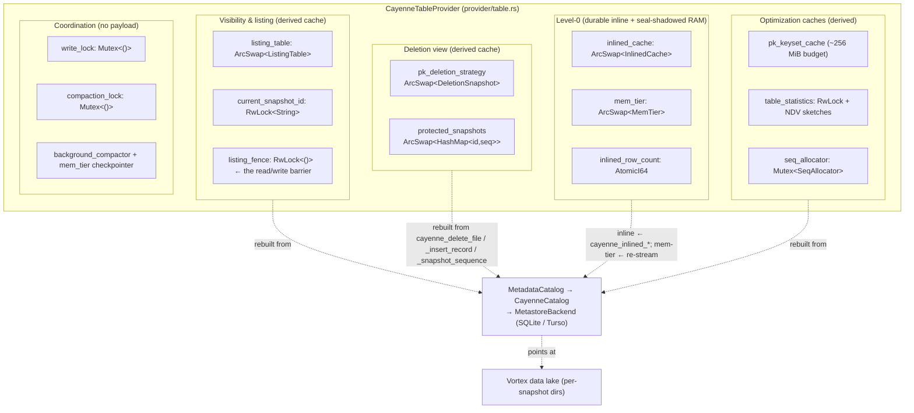
```mermaid
flowchart TB
    subgraph PROV["CayenneTableProvider (provider/table.rs)"]
        direction TB

        subgraph VIS["Visibility & listing  (derived cache)"]
            LT["listing_table: ArcSwap&lt;ListingTable&gt;"]
            CSI["current_snapshot_id: RwLock&lt;String&gt;"]
            LF["listing_fence: RwLock&lt;()&gt;  ← the read/write barrier"]
        end

        subgraph DEL["Deletion view  (derived cache)"]
            PDS["pk_deletion_strategy<br/>ArcSwap&lt;DeletionSnapshot&gt;"]
            PS["protected_snapshots<br/>ArcSwap&lt;HashMap&lt;id,seq&gt;&gt;"]
        end

        subgraph MEM["Level-0  (durable inline + seal-shadowed RAM)"]
            IC["inlined_cache: ArcSwap&lt;InlinedCache&gt;"]
            MT["mem_tier: ArcSwap&lt;MemTier&gt;"]
            IRC["inlined_row_count: AtomicI64"]
        end

        subgraph CACHE["Optimization caches  (derived)"]
            PKC["pk_keyset_cache (~256 MiB budget)"]
            STAT["table_statistics: RwLock + NDV sketches"]
            SEQ["seq_allocator: Mutex&lt;SeqAllocator&gt;"]
        end

        subgraph COORD["Coordination  (no payload)"]
            WL["write_lock: Mutex&lt;()&gt;"]
            CL["compaction_lock: Mutex&lt;()&gt;"]
            BG["background_compactor + mem_tier checkpointer"]
        end
    end

    CAT["MetadataCatalog → CayenneCatalog<br/>→ MetastoreBackend (SQLite / Turso)"]
    LAKE["Vortex data lake (per-snapshot dirs)"]

    VIS -. "rebuilt from" .-> CAT
    DEL -. "rebuilt from cayenne_delete_file / _insert_record / _snapshot_sequence" .-> CAT
    MEM -. "inline ← cayenne_inlined_*; mem-tier ← re-stream" .-> CAT
    CACHE -. "rebuilt from" .-> CAT
    CAT -. "points at" .-> LAKE
```

The crucial mental model from `docs/storage.md`: **almost everything in memory is a *derived cache*** — a fast-read projection of a durable source that is rebuilt on open/restart. The single exception is the CDC mem-tier, whose primary copy is RAM; it recovers from the durable shadow its periodic seal leaves in the unpublished inline corpus, plus a re-stream from the source slot for the unsealed tail. Locks, fences, and counters are *coordination* with no payload. This is why a crash is cheap: the metastore plus the immutable files plus the source slot fully reconstruct the table.

| Durability class | Meaning | On crash | Examples |
|------------------|---------|----------|----------|
| **Derived cache** | fast-read projection of a durable source | no loss — reloaded from metastore/files | listing table, protected snapshots, deletion index, inline cache, PK keyset, statistics, sequence allocator |
| **Ephemeral** | RAM-only payload | discarded; the sealed prefix recovers from its durable shadow, the un-sealed tail (≤ ~2 s) re-streams exactly-once | the CDC mem-tier (the *only* data-bearing ephemeral state) |
| **Coordination** | locks, fences, atomics, flags | irrelevant (reconstructed empty) | `listing_fence`, `write_lock`, generation counters, GC maps |

## Catalog visibility: which tables the catalog exposes

Everything above concerns one table. A Cayenne *catalog* connector exposes many, and a spicepod can narrow that set with the catalog's `include` and `exclude` glob patterns. Those patterns are carried as a `TableSelector` (`data_components::catalog_filter`) held by both `CayenneCatalogProvider` and each `CayenneSchemaProvider` it creates, and they are applied at every point a table name can enter the catalog:

| Path | Where | Behaviour |
|------|-------|-----------|
| **Refresh / discovery** | `CayenneCatalogProvider::refresh` | A metastore table the selector rejects is not registered, so it never appears in `table_names()`. |
| **Lazy load** | `CayenneSchemaProvider::table` | A cache miss falls through to the metastore, so naming a rejected table in a query would otherwise re-admit it. The selector is re-applied here and the miss returns `None`. |
| **DDL registration** | `CayenneSchemaProvider` insert paths | **Not** filtered. A `CREATE TABLE` through this catalog is an explicit operator action, so the table it creates is registered and served without re-deciding. |

The two filtered paths must agree, which is why the selector is re-applied on the lazy-load miss rather than trusted from discovery alone: filtering only at refresh would leave `exclude` bypassable by naming the table directly.

The DDL exemption is a deliberate asymmetry, and it is visible: a table created under a name the selector rejects is queryable until the next `refresh()` rebuilds the cache from selected metastore tables only, at which point it disappears; cluster discovery rejects it on the same rule, so in distributed mode an unpartitioned table created this way is not routed. Whether such a `CREATE TABLE` should instead be refused outright is a product decision rather than a filtering bug, tracked separately in spiceai/spiceai#12766.

## How the tiers interact

The three tiers are not siloed — a read fuses all of them, and the level-0 tier continuously drains into the Vortex tier. This diagram shows the data movement; the locks that make it safe come in Part 3.

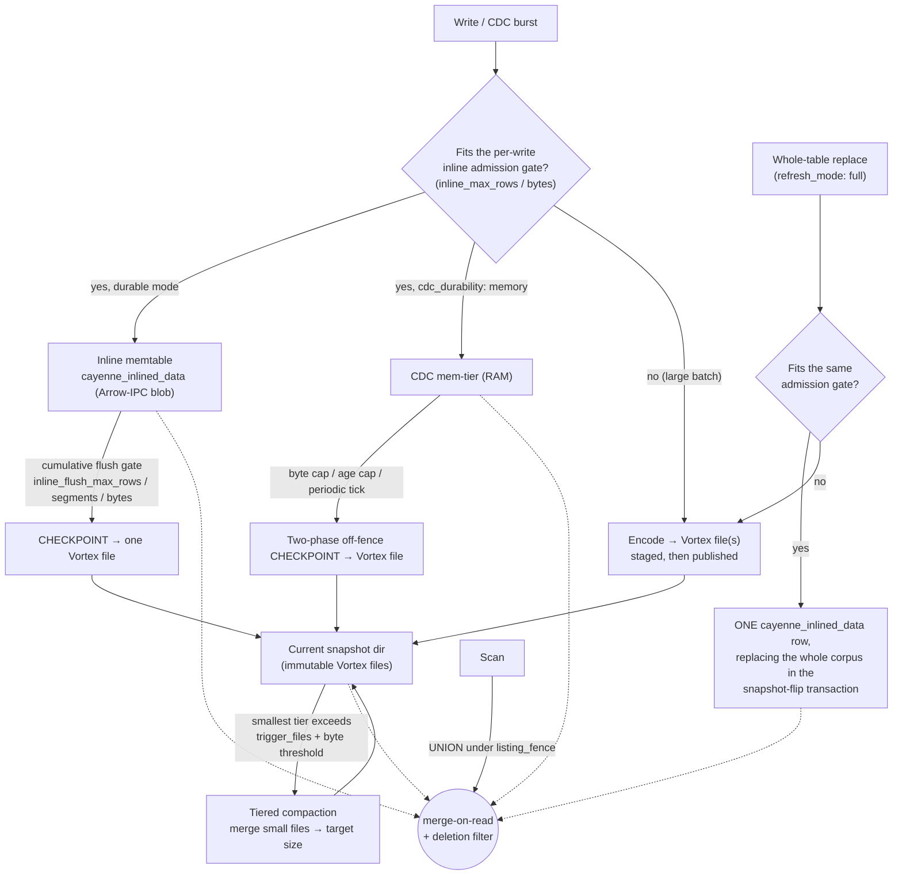
```mermaid
flowchart TB
    W["Write / CDC burst"] --> GATE{"Fits the per-write<br/>inline admission gate?<br/>(inline_max_rows / bytes)"}

    GATE -->|"yes, durable mode"| INLINE["Inline memtable<br/>cayenne_inlined_data (Arrow-IPC blob)"]
    GATE -->|"yes, cdc_durability: memory"| RAM["CDC mem-tier (RAM)"]
    GATE -->|"no (large batch)"| VORTEX["Encode → Vortex file(s)<br/>staged, then published"]

    OW["Whole-table replace<br/>(refresh_mode: full)"] --> OGATE{"Fits the same<br/>admission gate?"}
    OGATE -->|"yes"| OINLINE["ONE cayenne_inlined_data row,<br/>replacing the whole corpus in the<br/>snapshot-flip transaction"]
    OGATE -->|"no"| VORTEX

    INLINE -->|"cumulative flush gate<br/>inline_flush_max_rows / segments / bytes"| CKPT1["CHECKPOINT → one Vortex file"]
    RAM -->|"byte cap / age cap / periodic tick"| CKPT2["Two-phase off-fence CHECKPOINT → Vortex file"]
    CKPT1 --> CUR["Current snapshot dir<br/>(immutable Vortex files)"]
    CKPT2 --> CUR
    VORTEX --> CUR

    CUR -->|"smallest tier exceeds<br/>trigger_files + byte threshold"| COMPACT["Tiered compaction<br/>merge small files → target size"]
    COMPACT --> CUR

    READ["Scan"] -->|"UNION under listing_fence"| FUSE(("merge-on-read<br/>+ deletion filter"))
    INLINE -.-> FUSE
    OINLINE -.-> FUSE
    RAM -.-> FUSE
    CUR -.-> FUSE
```

Two thresholds govern the inline tier and they are easy to confuse:

- **`inline_max_*`** is the *per-write admission* gate: *"is this single write small enough to absorb into the memtable at all?"*
- **`inline_flush_max_*`** is the *cumulative flush* gate: *"has the accumulated memtable grown enough that we should checkpoint it to a Vortex file?"*

Under the small-write CDC profile the admission caps default to **1,024 rows** (`inline_max_rows`) **/ 1 MiB serialized** (`inline_max_bytes` — the per-write Arrow-IPC payload size, i.e. how large the batch will be as the blob stored in `cayenne_inlined_data`) **/ 4 MiB in-memory buffer** (`inline_max_buffer_bytes` — the transient in-memory Arrow data the writer may hold while deciding whether the write fits; set above the 1 MiB cap because in-memory Arrow is bulkier than its compact IPC form). The flush caps default to **2,048 rows** (`inline_flush_max_rows`) **/ 16 segments** (`inline_flush_max_segments` — accumulated inline entries) **/ 2 MiB** (`inline_flush_max_bytes` — cumulative serialized-IPC bytes held inline). The bulk-overwrite profile (`refresh_mode: full`) uses the same admission caps and the same flush defaults; the flush gate never binds there because a whole-table replace leaves exactly one entry. For the remaining profiles (`snapshot`, slow `append`, `disabled`) the admission caps are zeroed — inlining is disabled, because batch loads should go straight to Vortex.

**A whole-table replace takes the same gate, and one extra rule.** An overwrite small enough to be admitted becomes a *single* `cayenne_inlined_data` row, inserted by the same transaction that clears the previous corpus and flips the snapshot pointer — so the replace is atomic, and the tier holds one entry per table rather than growing with the refresh count. The new snapshot's directory is created and left empty, exactly as a zero-row overwrite already leaves it.

The extra rule is about *when* those rows become visible, because an overwrite's catalog transaction and its in-memory publish are two separate atomic units and a scan can land between them. In that gap the in-memory snapshot pointer still names the previous snapshot while the catalog already holds only the replacement row — so `begin_overwrite` publishes the inline visibility state *before* the transaction runs: it raises the inline watermark to the new row's sequence, raises (never sets) the durable-corpus row count so the empty-corpus read fast path cannot fire, and bumps the structural epoch so every read in the gap goes to the catalog. The catalog is only ever in one of two states — the whole old corpus, or the whole new row — so the gap serves a complete table either way. What it deliberately does *not* raise is the in-memory row count that gates whether a scan consults the tier at all: leaving that alone is what keeps a file-backed predecessor reading its own files rather than mixing them with the replacement rows. An overwrite that is *not* inlined gets the mirror treatment — its transaction clears the corpus and puts nothing back, so it materializes the pre-overwrite inline view into the cache on the way in, and the gap is served from memory. Without either of these a scan in the gap can see an empty inline view unioned with an empty directory and report an **empty table**.

Because the buffered batches and the serialized blob stay resident until the overwrite publishes, admission is claimed through a single non-blocking slot on the shared `CayenneContext` — which is what makes the runtime's host-memory reservation of one buffer plus one entry per acceleration true rather than merely generous. The slot is never awaited: parking on it would stall a caller that another writer depends on (spiceai/spiceai#11818), so a writer that cannot claim it writes Vortex files instead.

**A partitioned dataset does not inline a whole-table replace.** (Its children remain eligible for ordinary small-write CDC inlining, which is gated on the partition-column and retention rules below rather than on the overwrite slot.) Its per-partition child tables share one context and therefore that one slot, and they write concurrently under a single routing demux — so exactly one child would claim the slot and inline while its siblings fell back to Vortex, splitting a whole-table replace across both tiers with the inlined partition decided by whichever child reached admission first. The children each carry `partition_column: None`, so the partition-column rule above does not reach them; they are refused as **coupled writers** (`CayenneContext::is_coupled_writer`) instead. Widening the slot is not the alternative: awaiting it reintroduces the demux hold-and-wait deadlock of #11818, and one permit per child would multiply the buffered-admission reservation by a partition count that is not statically bounded (time-based partitions grow indefinitely). Little is given up by refusing them, because the small-file accumulation that inlining exists to prevent barely applies to a child in the first place: `serialize_partition_child_writes` already clamps a child to `write_concurrency = 1`, so a refresh leaves *one* file per partition, and the next overwrite replaces it rather than adding to it — there is no growing pile for the (disabled) background compactor to have merged. Inlining is also skipped outright when the table holds a mem-tier seal shadow — a durable inline row deliberately kept above the watermark while its rows are still live in RAM — since raising the watermark past it would serve those rows twice; only `cdc_durability: memory` can produce one, which the bulk-overwrite profile never selects.

**The corpus outlives a schema change, so it is adapted on read.** An inline entry is Arrow IPC frozen at the schema that was live when it was written. A *live* widening evolution (`evolve_schema_live`) flushes the corpus to Vortex before it swaps, so nothing stale survives it; the open-time evolution that adopts a source's added column at restart (`on_schema_change: append_new_columns` / `sync_all_columns` / `drop_and_recreate`) commits the widened schema straight to the metastore, leaving the next provider to open onto a corpus one or more widenings behind. Two dataset shapes are excluded from that open-time evolution, and stay pinned to their stored schema: `refresh_mode: caching`, whose hidden `__spice_cache_namespace` column is appended last and so cannot be reconciled with an evolution that also appends at the end; and a **partitioned** dataset, because the config that gates evolution also opens the parent catalog entry — widening the parent while every partition keeps its own schema would have the accelerated table advertise a width its data does not have, and read back a silent narrowing cast. Every decode therefore adapts to the live schema — missing nullable columns null-filled, widened columns cast — which is the same treatment the Vortex opener already gives pre-evolution files, and is the truth for a row written before the widening, since a widening plan admits only added *nullable* columns and lossless casts. A corpus already at the live width short-circuits on a field comparison.

## The on-disk layout

The directories below are produced by a **two-stage write**, so it helps to define the two stages up front, since they reappear throughout. **Stage A** is the *durable* half: the burst's new Vortex files are encoded into a separate *staging* snapshot directory and made crash-safe by a write-ahead-log marker (`_wal.json`, written `tmp + fsync + rename`). It runs on the write path, and once it completes the data is safe on disk but **not yet visible** to readers. (If a crash lands after the files are staged but before that marker is durable, the orphaned staging directory is cleaned up during recovery — see *Staging WAL crash-safety* in Part 3 for the full recovery model.) **Stage B** is the *visibility* half: a background task moves the staged files into their destination snapshot, publishes deletion state, and advances the snapshot pointer where required — at which point the write becomes visible. For a write spanning several Cayenne partitions, every participant first builds a private complete snapshot and exact file manifest; one shared metastore transaction then advances all `current_snapshot_id` pointers and commits the manifests, deletion metadata, protected-snapshot sequences, and statistics invalidation together. The top-level `_partitioned_wal/<commit_id>.json` records the complete participant set before any move. Object-store participants may use distinct client handles, but their canonical backend URL and table-level WAL prefix must match; a shared prefix on heterogeneous backends is rejected before the anchor is written. Recovery treats catalog pointers as the sole durable decision: all targets matching means finish and fully rehydrate every committed participant, none matching means roll back, and a mixed set, an unreadable pointer, or an unavailable participant is a hard error that retains every WAL and physical staged/deletion file. The commit/publication sequence owns its receipts and exact physical cleanup guards through publication, so cancellation while `COMMIT` is in flight cannot unlink a newly-live deletion vector. Splitting the two stages lets the source's change-log offset be acknowledged as soon as Stage A is durable, without waiting for visibility. (See *Flow E — A CDC burst, end to end* in Part 4 for the full sequence, including how back-to-back bursts pipeline.)

Vortex files and Arrow-IPC deletion files live under the data root, grouped by `table_id` and then by snapshot directory. A `<snapshot_id>` is a UUIDv7-named set of immutable files.

**The stored types are not always the source's types.** Vortex cannot represent every Arrow type, so `transform_schema_for_vortex` rewrites `Float16` → `Float32` at table creation and the table stores `Float32` for its lifetime. That is the only unconditional rewrite; the list is published as `CAYENNE_TYPE_REWRITE_RULES` so the acceleration write path can tell an engine-imposed type from a schema that has genuinely drifted. Timestamps are **not** rewritten — Vortex represents second, millisecond, microsecond and nanosecond precision, so a table stores the unit its source reports, timezone included. A `PostgreSQL` `timestamptz`, inferred as `Timestamp(ns, "UTC")`, is created and stored as nanoseconds.

**A table created before that keeps its microseconds**, and no `on_schema_change` policy migrates it: `classify` excludes nanosecond as a widening *target*, because rescaling to nanoseconds overflows `i64` past ~2262, so microsecond → nanosecond is `Incompatible` rather than `Widening`. Recreating the table (`mode: file_create` against an empty directory) is what moves it to the source's unit. Until then the write path casts each batch down to the stored microseconds — lossless for a `PostgreSQL` `timestamptz`, which is itself microsecond-precision. So that this stays a cast rather than an outage, `CAYENNE_TYPE_REWRITE_RULES` — the list the acceleration write path consults — still carries the old timestamp normalization even though table creation no longer applies it. Append overlap de-duplication reconciles those declared type rewrites against the accelerated table's stored representation, so comparing incoming rows against existing rows does not fail as a schema mismatch for either legacy microsecond or current nanosecond tables. The two lists differ on purpose: without the compatibility entry, an existing microsecond table fed by its unchanged nanosecond source would read as an incompatible schema change and stop CDC replication under `on_schema_change: fail`.

Types Vortex supports at all are stored as-is, subject to `unsupported_type_action`. The exceptions — the types Vortex has no array encoding for — are `Interval`, `Duration`, `FixedSizeBinary`, `Union` and `RunEndEncoded`. `Map` is **not** among them: Vortex has no map dtype, but aliases the type to `List<Struct<keys, values>>` on write and restores it on read from the table's schema, so a map column round-trips.

That exception list is a frozen policy rather than a question put to Vortex per column, which keeps the set of storable types reviewable — but it can therefore drift from what Vortex actually encodes, and once did: a `Map` column produced a table that was created successfully and then failed every write to it. A test now probes Vortex per Arrow type family and fails when the two disagree.

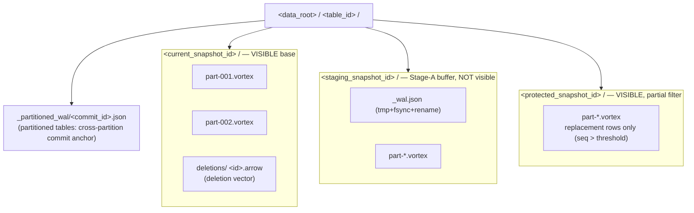
```mermaid
flowchart TB
    ROOT["&lt;data_root&gt; / &lt;table_id&gt; /"] --> CUR
    ROOT --> STG
    ROOT --> PROT
    ROOT --> PWAL

    subgraph CUR["&lt;current_snapshot_id&gt; / — VISIBLE base"]
        C1["part-001.vortex"]
        C2["part-002.vortex"]
        C3["deletions/ &lt;id&gt;.arrow<br/>(deletion vector)"]
    end
    subgraph STG["&lt;staging_snapshot_id&gt; / — Stage-A buffer, NOT visible"]
        S1["_wal.json (tmp+fsync+rename)"]
        S2["part-*.vortex"]
    end
    subgraph PROT["&lt;protected_snapshot_id&gt; / — VISIBLE, partial filter"]
        P1["part-*.vortex<br/>replacement rows only (seq &gt; threshold)"]
    end
    PWAL["_partitioned_wal/&lt;commit_id&gt;.json<br/>(partitioned tables: cross-partition commit anchor)"]
```

### The three snapshot kinds

They share an on-disk shape but differ in **visibility** and **which deletions apply at scan time**:

| Kind | Visible to reads? | Deletion filter at scan | Created by |
|------|-------------------|-------------------------|------------|
| **Current** | yes — the base (`current_snapshot_id`) | **full** — every deletion applies | genesis + compaction output; one at a time, replaced by an atomic pointer flip |
| **Staging** | **no** — pre-visibility | n/a | Stage A of every burst, under `_wal.json`; Stage B publishes it; the WAL self-heals on crash |
| **Protected** | yes — **unioned** with current | **partial** — only `delete_seq > threshold` | an on-conflict upsert / pending-PK-delete publish; they accumulate and are folded by maintenance compaction |

**Why protected snapshots exist.** When a publish stages freshly-inserted rows, it assigns them sequence numbers *above* the deletions already baked into the current snapshot. Those older deletions provably cannot apply to the new rows — so rather than re-resolving the entire deletion set against them, the writer publishes the new data as a *protected* snapshot tagged with a **threshold = its own allocated sequence**. At scan time the reader applies the full deletion filter to current and a partial one (`delete_seq > threshold`) to each protected snapshot, then unions them. This is the key trick that lets an upsert publish *without* touching the existing, possibly-huge deletion set.


### Layout by workload shape

The same primitives produce visibly different trees depending on whether the workload deletes.

**1 · Append-only** (plain `INSERT` / batch load): one snapshot that *grows in place* — each append moves its staged files in, `current_snapshot_id` does **not** change, nothing is ever deleted. Compaction periodically consolidates small files and flips the pointer to a fresh snapshot.

**2 · CDC append** (`cdc_durability: memory`, no PK conflicts): newest bursts live in the RAM mem-tier and tiny batches as Arrow-IPC blobs in `cayenne_inlined_data`; a periodic checkpoint flushes them to a Vortex file in the current snapshot. A `staging/` dir exists only mid-burst. Still no `deletions/`, no protected snapshots.

**3 · Updates / deletes** (upserts + deletes, key-delete path): the current snapshot is scanned with the *full* deletion filter; each upsert publish adds a *protected* snapshot scanned with `delete_seq > threshold`; thresholds live in `cayenne_snapshot_sequence`; unflushed tombstones live in `cayenne_inlined_delete`. The scan is `current(FULL) ∪ A(partial) ∪ B(partial) ∪ mem-tier/inline`. Maintenance compaction folds the older protected prefix into one self-contained merged snapshot, keeps the newest *K* unbaked, and seq-prefix-bakes `delete_seq ≤ T` into the data.

## Sequence numbers and visibility — the spine

Every mutation is stamped with a monotonically increasing **sequence number** reserved from the metastore (`reserve_sequence_numbers` batches reservations to cut round-trips). Inserts, deletes, and re-insertions all carry one. This is exactly the **Iceberg** discipline of sequence-ordered data and delete files, and it is what makes merge-on-read deterministic: given a row at `data_sequence` and a tombstone at `delete_sequence`, the row is hidden iff `delete_sequence ≥ data_sequence`; under upsert semantics, a re-inserted row is visible iff `insert_sequence > delete_sequence`.

Visibility itself is a **single atomic pointer flip**. A write or compaction builds new files, then flips `current_snapshot_id` under the listing fence. Readers resolve the pointer once under the fence and hold that view for the whole scan, so they get snapshot isolation for free.

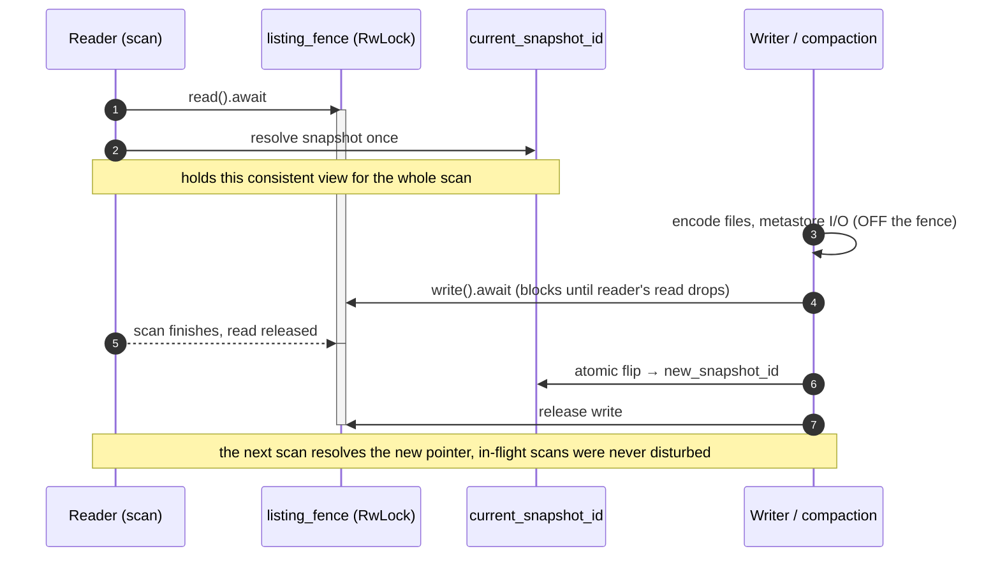
```mermaid
sequenceDiagram
    autonumber
    participant R as Reader (scan)
    participant LF as listing_fence (RwLock)
    participant P as current_snapshot_id
    participant W as Writer / compaction

    R->>LF: read().await
    activate LF
    R->>P: resolve snapshot once
    Note over R,P: holds this consistent view for the whole scan
    W->>W: encode files, metastore I/O (OFF the fence)
    W->>LF: write().await (blocks until reader's read drops)
    R-->>LF: scan finishes, read released
    deactivate LF
    activate LF
    W->>P: atomic flip → new_snapshot_id
    W->>LF: release write
    deactivate LF
    Note over R,W: the next scan resolves the new pointer, in-flight scans were never disturbed
```


---

## The cold object-store tier (optional)

Everything called "warm" so far means the local-disk Vortex files of the current and compacted snapshots. An optional third tier sits below them: a **cold object store**, enabled by setting `cayenne_datalake_location` (dormant and byte-identical to the warm-only behavior when unset). With it on, the tiers form a strict cascade — RAM mem-tier → warm local disk → cold object store — with every row resident in exactly one tier.

A dedicated background worker, `BackgroundColdTierPromoter`, runs on its own `cayenne_datalake_tiering_check_interval_ms` cadence and promotes the warm tier to cold once it crosses the `cayenne_datalake_warm_max_bytes` / `cayenne_datalake_warm_max_files` thresholds. Promotion is **incremental carry-forward** (#11745): the existing cold manifest is first classified into *dirty* files that may host a tombstoned key (per-PK-column min/max rectangles from the manifest stats blobs, refined by per-file PK blooms — conservative in every failure direction) and *clean* files carried forward by manifest reference, never re-read. Only the warm delta plus the dirty files are re-read (all deletes applied, one version per key), **Z-order (Morton) clustered** so multi-column zone maps stay tight, written as read-optimized Vortex at a larger cold file size under a per-promotion prefix, and then — in one metastore transaction — registered in `cayenne_cold_tier_file` alongside the carried-forward rows while the warm tier is overwrite-cleared. Promotion excludes writers for the whole graduation (the table `write_lock`) and, before capturing the visible set, **drains in-flight pipelined Stage-B publishes** (bounded wait, shared with live schema evolution; a timeout is surfaced as a tick error — warm tier left intact, next tick retries): a staged batch whose Stage-A sequence row is already durable — source slot acked — but whose publish is still pending would otherwise be invisible to the capture while the overwrite-clear deletes its sequence row, silently losing the batch at restart. A cold graduation is therefore just "an overwrite whose content lives on the cold store," correct by construction, with cost proportional to the *changed* data; objects orphaned by dirty rewrites are reclaimed by the periodic mark-and-sweep GC (`cayenne_datalake_gc_interval_ms`). The clustering key is resolved by precedence — explicit `cayenne_datalake_clustering_columns`, else an **operator-configured** `cayenne_sort_columns`, else (default-on, F4) the hottest columns observed in scan pushdown filters, else an **inference-derived** `cayenne_sort_columns`, else the primary key; the kernel builds order-preserving per-column keys and MSB-first bit-interleaves them, applied through the ordinary `SortExec` path without materializing a clustering column. The clustering sort is **bounded**: rather than one unbounded sort over the whole visible stream (pathological first-batch latency and memory/spill pressure at tens of GB), the stream is split into sequential byte-bounded *runs* (`provider/streaming.rs::bounded_sort_stream`), each fed to its own memory-pool-accounted, disk-spilling `SortExec` while the scan overlaps the next run's read. The run cap is `VortexConfig::cold_clustering_run_size_mb` — an *internal* knob (not a spicepod param; a future autotuner may set it) defaulting to 16× `cayenne_datalake_target_file_size_mb` (`cold_clustering_run_size_bytes`). Z-order key ranges may overlap across runs, which only weakens per-file min/max pruning slightly — cold files advertise no lexicographic ordering, so bounding is a clustering-quality trade-off, never a correctness change; each run's consumed row count is checked against its emitted count and a mismatch aborts the write. Per-run progress (`run starting` / `input consumed` / `first batch` / `complete`) is logged at DEBUG under `cayenne::compaction` for stall triage.

At read time a cross-tier scan unions a **cold branch** alongside the warm and level-0 tiers. That branch prunes cold files using the inline statistics blob stored on each `cayenne_cold_tier_file` row, so listing-time pruning costs no object-store round-trip, and it applies the same tier-blind key-delete filter as the other tiers — so a delete issued *after* a row was promoted still correctly hides that cold-resident row. The cold file set is **resolved in the same fenced capture as the warm snapshot id**, never looked up while the branch is built: a promotion publishes its `cayenne_cold_tier_file` commit and its warm snapshot flip together under one `listing_fence.write()`, so a scan that captured the pre-promotion warm snapshot and then resolved the manifest live would see the promoted rows in *both* halves and count them twice. The manifest is cached against the snapshot id it was published with (`ColdManifestForSnapshot`) — sound as a key because every mutation of that table mints a new snapshot id in the same transaction — so the steady-state resolve is a pointer clone rather than a metastore round-trip per scan. One session type is deliberately exempt from that capture: the promotion's own. A carry-forward rewrite runs on a private session carrying a `ColdScanFiles` config extension whose payload is the classified manifest rows themselves, and `cold_files_for_scan` lets those rows **replace** the scan's capture rather than intersect with it. Classification and the scan's capture are independent reads of `cayenne_cold_tier_file` with no lock held across them, so they can disagree — and intersecting silently yields the smaller set: a file classified dirty but already absent from the capture would be dropped from the rewrite while the promotion's commit still retires it, carrying its live rows forward by neither manifest reference nor rewrite (#12708). Every file the promotion classified is one it listed from the manifest, so reading exactly those rows is always the correct rewrite input. Should such a file's object have since been reclaimed by the mark-and-sweep GC, the scan fails with a `NotFound` rather than dropping rows — the same trade `run_cold_tier_gc_tick` already documents for a long-running query, and the right one for an accelerator. User-query sessions never carry the extension, so an ordinary scan always reads the full captured manifest. Two constraints in this first version: enabling the cold tier forces key-based deletes, and partitioned or position-delete tables are unsupported.

# Part 3 — How data is managed: locks, deletions, and the level-0 tier

## The concurrency model

Cayenne's locking is deliberately *fine-grained and asymmetric*: the read hot-path is wait-free, and the few real locks are held for as short a span as possible. There are two kinds of synchronization:

- **`ArcSwap<T>` cells** — wait-free *reads*. Readers `load()` an immutable `Arc<T>` and never block. *Writes* are **not** automatically safe: a blind swap is last-write-wins, so each cell's read-modify-write is guarded either by a lock or by `rcu` (see *`ArcSwap` writes: guarding against lost updates* below). Everything on the read hot path is an `ArcSwap`: `listing_table`, `protected_snapshots`, the deletion snapshots, `inlined_cache`, `mem_tier`, `current_sorted_snapshot`.
- **Real locks** — a small set of `tokio` async mutexes/rwlocks (held across `.await`) plus a few `parking_lot` mutexes for short non-async critical sections.

### The locks, what they guard, and their order

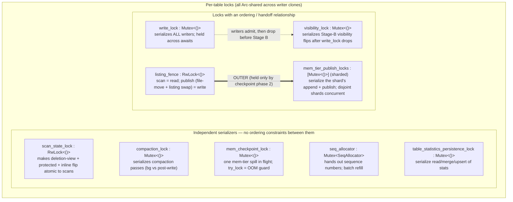
```mermaid
flowchart TB
    subgraph PERTABLE["Per-table locks (all Arc-shared across writer clones)"]
        direction TB
        subgraph ORD["Locks with an ordering / handoff relationship"]
            direction LR
            WL["write_lock : Mutex&lt;()&gt;<br/>serializes ALL writers; held across awaits"] -.->|"writers admit, then drop before Stage B"| VL["visibility_lock : Mutex&lt;()&gt;<br/>serializes Stage-B visibility flips after write_lock drops"]
            LF["listing_fence : RwLock&lt;()&gt;<br/>scan = read; publish (file-move + listing swap) = write"] ==>|"OUTER (held only by checkpoint phase 2)"| MPL["mem_tier_publish_locks : [Mutex&lt;()&gt;] (sharded)<br/>serialize the shard's append + publish; disjoint shards concurrent"]
        end
        subgraph IND["Independent serializers — no ordering constraints between them"]
            direction LR
            SS["scan_state_lock : RwLock&lt;()&gt;<br/>makes deletion-view + protected + inline flip atomic to scans"]
            CL["compaction_lock : Mutex&lt;()&gt;<br/>serializes compaction passes (bg vs post-write)"]
            MCL["mem_checkpoint_lock : Mutex&lt;()&gt;<br/>one mem-tier spill in flight; try_lock = OOM guard"]
            SEQ["seq_allocator : Mutex&lt;SeqAllocator&gt;<br/>hands out sequence numbers; batch refill"]
            TSP["table_statistics_persistence_lock : Mutex&lt;()&gt;<br/>serialize read/merge/upsert of stats"]
            SS ~~~ CL ~~~ MCL ~~~ SEQ ~~~ TSP
        end
    end
    ORD ~~~ IND
```

The non-obvious but load-bearing facts about this set:

- **`write_lock` serializes writers but is dropped early.** CDC pipelining acquires it, does Stage A (durable staging), then **drops it before Stage B** — the runtime spawns Stage B, which takes `visibility_lock` (not `write_lock`) for the move + pointer flip. Because `write_lock` is already free, back-to-back bursts overlap: burst *N+1*'s Stage A can begin while burst *N*'s Stage B is still publishing. Order is preserved by a FIFO (`PendingApplyFinalize`), so reads never see a later burst before an earlier one.
- **`listing_fence` is the read/write barrier.** Scans take `read().await` and hold it across the inner DataFusion listing call. The publish step takes `write().await` only for the move + cache-invalidate + `ArcSwap` swap — microseconds, not the duration of the encode or metastore I/O.
- **`scan_state_lock` exists so three things flip *together*.** A scan captures `(deletion_snapshot, protected_snapshots, inlined_batches)` under a read; the publisher takes the write so a scan can never observe, say, a new protected snapshot but the *old* deletion index.
- **The mem-tier publish locks are sharded.** A shard-*s* append takes `locks[s]`, so disjoint PK-hash shards of one apply append concurrently; a checkpoint's capture takes *all* of them in index order to be mutually exclusive with every appender.
- **The only nested lock order that matters:** `listing_fence` (outer) → a mem-tier publish lock (inner), taken together *only* by checkpoint phase 2. Everything else avoids holding two of these locks at once.

### Why this is HTAP-friendly

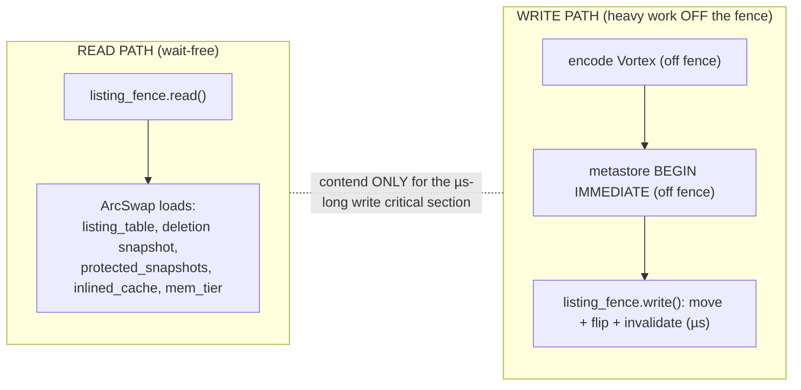
```mermaid
flowchart LR
    subgraph READ["READ PATH (wait-free)"]
        direction TB
        RL["listing_fence.read()"] --> RA["ArcSwap loads:<br/>listing_table, deletion snapshot,<br/>protected_snapshots, inlined_cache, mem_tier"]
    end
    subgraph WRITE["WRITE PATH (heavy work OFF the fence)"]
        direction TB
        WE["encode Vortex (off fence)"] --> WM["metastore BEGIN IMMEDIATE (off fence)"] --> WF["listing_fence.write(): move + flip + invalidate (µs)"]
    end
    READ -. "contend ONLY for the µs-long write critical section" .- WRITE
```

The expensive parts of a write — encoding, metastore transactions, checkpoint I/O — all run *outside* the listing fence. The only thing under it is the pointer flip and the list-cache invalidation. So a scan and a continuous CDC stream contend only for a microsecond-scale critical section, which is what lets one table sustain ingestion and analytics at the same time.

### `ArcSwap` writes: guarding against lost updates

`ArcSwap` makes *reads* wait-free, but it does **not** make *writes* safe on its own. `store()` is an unconditional last-write-wins overwrite, so the obvious read-modify-write is a trap: if two writers each `load()` the current `Arc<T>`, derive new values `T1` and `T2` from it, and both `store()`, the second silently clobbers the first — a lost update. Cayenne hit precisely this once: a deletion-index *add* built off a pre-prune `load()` overwrote a concurrent seq-prefix *prune* and resurrected an already-deleted key. There is now a regression test, `rcu_publish_does_not_lose_a_concurrent_prune`, pinning the fix. So every `ArcSwap` mutation in the codebase follows one of two guarded patterns, chosen by whether a concurrent second writer is even possible:

- **Lock-serialized blind `store()`** — used when the read-modify-write happens only inside an already-serialized critical section, so there is never a second concurrent writer to lose to. The per-table `write_lock` serializes the main write path; the `listing_fence` write side serializes the visibility publish; each `mem_tier_publish_locks[s]` serializes its shard's append. Inside one of those, a plain `store()` is correct because the writer is alone.
- **Lock-free `rcu()` (compare-and-swap retry)** — used when the cell can genuinely be mutated from more than one concurrent path that cannot share a single lock. The pipelined Stage-B finalize runs *backgrounded*, off the `write_lock`, and snapshot GC / deletion-index pruning can run alongside a writer. `rcu` loads the current value, runs the closure to derive the new one, and compare-and-swaps it in; if another writer swapped in between, it throws away the result and re-runs the closure against the *new* current — so the two updates compose and neither is dropped.

| `ArcSwap` cell | Write mechanism | What makes it safe |
|----------------|-----------------|--------------------|
| `listing_table` | blind `store` | `listing_fence` write side (the visibility publish is serialized) |
| `mem_tier` (sharded) | blind `store` per shard | `mem_tier_publish_locks[s]`; a checkpoint takes all shards under `mem_checkpoint_lock` |
| `inlined_cache` | blind `store` | `write_lock`, plus an `inlined_generation` counter that invalidates any view built off a stale generation |
| `table_schema`, `current_sorted_snapshot` | blind `store` | the serialized write / compaction-publish path |
| `protected_snapshots` | **`rcu`** | concurrent — a backgrounded publish can race an unrelated deletion |
| deletion snapshots (`Int64PkDeletionSnapshot` / `KeyDeletionIndex`) | **`rcu`** | concurrent — an add must not clobber a simultaneous seq-prefix prune |

These guards protect each cell *individually*. The `scan_state_lock` (above) is a separate concern: it makes the three views a scan reads — the deletion snapshot, `protected_snapshots`, and the inline batches — flip *together*, so a reader never pairs a new protected snapshot with an old deletion index even though each lives in its own `ArcSwap`.


### Serializable transactions and per-key optimistic concurrency

A client can wrap a gated read-modify-write in a single serializable transaction — the canonical shape is `BEGIN; SELECT assert(<gate>); UPDATE …; COMMIT;` submitted as one `/v1/sql` (or FlightSQL) body. `assert(<bool>)` is a volatile scalar UDF that errors — rolling the whole body back — when its argument is false or NULL; the "conditional"-ness is just the caller's optional use of it, the mechanism underneath is a plain serializable transaction over one or more accelerator-only Cayenne tables. Every statement runs through the ordinary query builder, so authorization, column masking, logging, and tracing apply uniformly; atomicity comes from a transaction-aware sink (`CayenneDataSink` reads the active transaction back off the request context and *stages* instead of publishing), not from intercepting the write plan.

The discipline extends the per-table `write_lock` rather than replacing it. At `BEGIN` the executor captures, under a brief `write_lock`, a per-table begin token (`TransactionWriteToken` = the table's `sequence_high_water()` plus a staging-clean bit) for **every** participant table, *before* the gate reads. Staging then runs **off-lock**: the gate's reads and the write's Vortex encode hold no `write_lock`, so transactions touching disjoint keys stage concurrently. The `write_lock` is re-acquired only at `COMMIT`, held just long enough to re-validate and publish.

Validation is **per-key**, not per-table. Every committed write stamps its commit sequence onto the `sequence` field of the primary keys it touches in the PK index (`PkKeysetEntry`); a transaction records the digests of the keys it *read* — captured from the scan's pushed-down PK-equality predicate and digested through the same PK `RowConverter` as the keyset, so the footprint is projection-independent and phantom-safe. At `COMMIT`, `transaction_has_conflict` aborts with a retryable `Error::WriteConflict` (surfaced as HTTP 409 / Flight `Aborted`) iff any key in the read footprint or write set carries a stored `sequence` newer than the begin token — otherwise disjoint-key transactions commit without contending. The per-key path applies only to a read expressed as a bounded full-PK equality point; an unbounded or composite read marks the footprint incomplete and falls back to the conservative per-table sequence gate. Reading a Cayenne table that was never registered as a participant fail-closes the transaction at commit.

Per-key validation is only sound while the keyset's per-key `sequence` stamps are trustworthy, so `transaction_has_conflict` also falls back to the per-table gate whenever the shared `Exact` keyset may carry a stale, dropped, or unstamped stamp — tracked by a per-table `pk_keyset_occ_degraded` flag (release/acquire-ordered). It is set when a committed write's stamps are dropped because the keyset was checked out by a concurrent writer (`record_pk_keys_with_location`), when an upsert filter-`DELETE` deliberately keeps the keyset as a stale superset rather than paying an O(live-rows) rebuild (`PkKeysetInvalidatingDeletionSink` / `InlineAwareDeletionSink`), or when a validated-key publish has no available sequence (`publish_validated_file_keys`). While set, commits over that table take the conservative per-table high-water gate (over-abort, never a missed conflict); it clears on the next keyset rebuild, which floor-stamps every key to the end-of-scan high-water (`load_existing_keyset` → `stamp_all_sequences_min`) — so a cleared flag can never uncover a stale keyset.

A transaction spanning **several** tables that share one metastore catalog commits atomically: the executor locks every participant in canonical (`table_id`-sorted) order, re-checks per-key OCC on all of them, then applies every staged write inside **one** `MetastoreTransaction` — a shared-catalog `Arc::ptr_eq` check guarantees they truly share a database — so all tables advance together or none do. The fused commit path marks each written table's maintained aggregates stale under the held listing fence (`feed_staged_ivm_under_fence`), so an IVM query cannot serve a `Fresh` aggregate that omits the transaction's just-committed rows. On a local filesystem each participant fsyncs its staged snapshot directory in `prepare_commit`, before the shared transaction makes it visible — the same directory barrier the single-table publish takes in `record_written_snapshot_sequence`, which the fused path never reaches because its snapshot-sequence row is applied inside the caller's transaction.

> **v1 scope.** Comparison gates are NULL-safe (`assert((SELECT n WHERE id = …) < cap)` errors and rolls back when the row is absent), but a nullability-predicate gate such as `assert(… IS NOT NULL)` can be constant-folded to `TRUE` by the optimizer and is a known limitation. Explicit `ROLLBACK` as a terminal statement is not yet recognized — a client aborts by simply not sending `COMMIT` (nothing is published until then). One write per table per transaction.


### Durable federated write-back

An accelerator-only table serves its writes locally; a table configured for durable write-back (`write_mode: write_back`, which additionally requires dataset-level `replication.enabled: true`) also reconciles committed writes back to its federated source. A committed write records the primary keys it touched in the `cayenne_pending_write_back` marker table **inside the same commit `MetastoreTransaction`** — never on the CDC apply path, so an echo of Cayenne's own write cannot spawn a delivery. A per-table delivery worker then drains the markers in commit order: it claims a batch and point-scans those keys' *current* committed values from the accelerator, splitting them into present (upsert) and absent (delete) sets before delivering idempotently. A source whose connector needs to own the delivery transaction — `PostgreSQL`, so it can stamp each delivery with its transaction id and register that id for the CDC pump's echo filter — delivers through a connector-owned `WriteBackDeliverer`: the present-key rows upsert (`INSERT … ON CONFLICT (pk) DO UPDATE`) in one source transaction, the absent keys delete in another. Every other source delivers through its `TableProvider`: a native upsert (`InsertOp::Replace`) when the source supports one, falling back to the older delete-then-insert emulation only when it answers `NotImplemented`. Markers clear only for the markers whose stored `sequence_number` is still at or below what the pass claimed (a newer commit that re-dirtied a key leaves its marker in place). Delivery failure never blocks accelerator commits; the dirty set simply grows until the next successful pass — the `dataset_acceleration_write_back_pending_keys` gauge reports that backlog per dataset, so a source falling behind (or never converging) is visible without reading the worker's logs. v1 delivers single-column primary keys.

**Known limitation: a source-side trigger can rewrite an untracked row out from under the echo filter.** The CDC pump's echo filter (`XidRegistry`) suppresses by relation and transaction id: every change the arbitrated table's delivery transaction carries is dropped, not only the rows the delivery itself wrote. A trigger that fires inside that same delivery transaction and rewrites the *delivered* row still converges — the accelerator ends up holding the source's rewritten value, because that row's later state is still resolved through the delivery's own bookkeeping. But a trigger that, inside the same transaction, also rewrites a *different* row of the arbitrated table — one the delivery did not touch, so its change is not represented anywhere in the accelerator's own write — has that rewrite dropped along with the echo. The row silently diverges: the source holds the trigger's value and the accelerator never learns of it. Give a write-back target table a trigger that rewrites only the row it fires on, not other rows of the same table (tracked as #13348).

Unlike an accelerator-only transaction — whose staging plan is executed by the query orchestrator (and so passes through DataFusion's physical optimizer) — a write-back write executes the accelerator's staging plan **directly** via `collect`, with no optimizer pass. That matters for the transaction-aware `UPDATE`, whose upsert-only leg reads the current rows through a plan that, for `changes`-mode (CDC) data, unions the file branch with the in-memory CDC tier branch and so has more than one partition. A `DataSinkExec` requires single-partition input — normally guaranteed by an optimizer-inserted `CoalescePartitionsExec` — so the staging path coalesces that read-side to a single partition itself; without it the sink would drain only partition 0 (the file branch, empty for mem-tier-resident rows) and silently stage an empty write, losing the update.


## The deletion subsystem

Deletes never rewrite data. They are recorded as **deletion vectors** — Arrow-IPC files under `<snapshot_id>/deletions/<id>.arrow` — and applied **merge-on-read**. The *on-disk schema is the type discriminator* (it is inferred at read time, not stored as a column):

| Mode | Schema | When |
|------|--------|------|
| **Position-based** | `row_id: UInt64`, `deleted_at: Int64` (µs) | PK-less tables (always), or any table in `deletion_mode: position` |
| **Key-based** | `row_key: Binary`, `deleted_at: Int64` (µs) | PK tables in `deletion_mode: key` (`auto` ⇒ key for `changes`-mode PK tables) |

At scan time three strategies are wired up in `PkDeletionStrategyWithCache`:

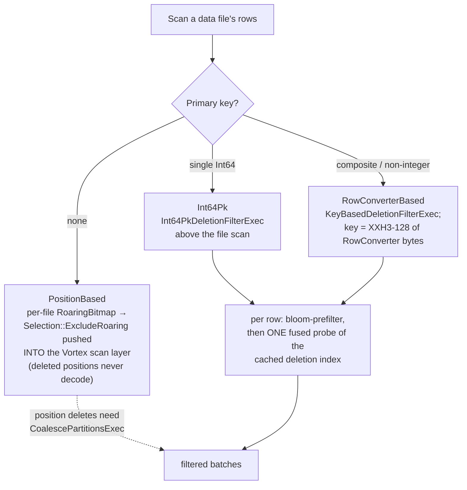
```mermaid
flowchart TB
    SCAN["Scan a data file's rows"] --> HASPK{"Primary key?"}
    HASPK -->|"none"| POS["PositionBased<br/>per-file RoaringBitmap →<br/>Selection::ExcludeRoaring pushed<br/>INTO the Vortex scan layer<br/>(deleted positions never decode)"]
    HASPK -->|"single Int64"| I64["Int64Pk<br/>Int64PkDeletionFilterExec<br/>above the file scan"]
    HASPK -->|"composite / non-integer"| RC["RowConverterBased<br/>KeyBasedDeletionFilterExec;<br/>key = XXH3-128 of RowConverter bytes"]

    I64 --> PROBE["per row: bloom-prefilter,<br/>then ONE fused probe of the<br/>cached deletion index"]
    RC --> PROBE
    POS -.->|"position deletes need<br/>CoalescePartitionsExec"| DONE["filtered batches"]
    PROBE --> DONE
```

The `RowConverter` that produces those key bytes is a **Cayenne-vendored, versioned** format (the `row_converter/` module; `RowFormatVersion::V1` is byte-identical to `arrow-row` 58.3.0), not Arrow's directly. This matters because the encoded bytes are persisted durably and byte-compared on read — the `row_key` of a key-based deletion-vector file, `cayenne_insert_record.pk_bytes`, and inline-delete blobs — so pinning the format decouples that durable key layout from `arrow-rs`'s release cadence: a future Arrow bump can no longer silently change the persisted key bytes and break key-based delete/upsert matching. The decoders return an `ArrowError` on truncated or malformed input rather than panicking.

### The fused tombstone — one probe answers two questions

The clever bit is the **fused** index entry. Each key maps to a single `TombstoneEntry`:

```rust
struct TombstoneEntry { delete_seq: i64, insert_seq: i64 }  // i64::MIN = SEQUENCE_ABSENT

// Visibility under upsert semantics: the row is VISIBLE iff
//   insert_seq > delete_seq   (re-inserted strictly after the delete)
```

A single probe therefore answers *both* "was this key deleted?" and "was it re-inserted after the delete?" — no second lookup, no companion insert-records index. (An earlier revision published a delete index *and* a separate insert-records index together; fusing them into one cell preserves the same atomicity in a single `ArcSwap`.) "Single" here means one *logical* probe that resolves both questions at once, not one memory access: each probe is an **in-memory** lookup against the cached index (a bloom prefilter plus a small number of `HashMap` GETs, detailed below), never a metastore round-trip or a disk read. The metastore and the delete-vector files are read only *once*, at provider open, to build that cached index; from then on the scan hot path only loads the current `ArcSwap` snapshot and probes it in memory.

**Where the two halves come from, and that they live together.** The entry is one 16-byte `Copy` value stored *inline* as the map value — `delete_seq` and `insert_seq` are a single record, not two structures joined at read time. Each half is filled on the write path from the sequence the mutation was stamped with: a delete (or the delete half of an upsert) records `delete_seq`; a re-insertion records `insert_seq`. The index-building methods fold incoming tuples into the per-key entry and take the **per-side max** on conflict — `extend_max_deletes` for pure key-deletes (`(key, delete_seq)`), and `extend_max_conflicts` / `extend_max` for upserts that delete-then-reinsert (`(key, delete_seq, insert_seq)`) — so a key touched repeatedly keeps the highest `delete_seq` and the highest `insert_seq` *independently*, and a side never seen stays `SEQUENCE_ABSENT`. Cross-tier fusion happens at read time (the probe takes the per-side max over the `active` tier plus the applicable runs), but the unit that is written and read is always this one paired value.

### The index is an LSM in miniature: `LayeredRuns`

`LayeredRuns<K,S>` is the **query-time form of the deletions the table has not yet folded into its data files** — the structure each scan probes, once per row, to implement merge-on-read. It is *not* a row store, and it does *not* hold an entry per live key: it holds one fused `TombstoneEntry` only for keys that have been **deleted or upserted**, mapping each to its highest delete and (if re-inserted) insert sequence. A never-deleted row never appears in it — a probe for that key misses the bloom and the row is "visible." Each index — `DeletionIndex` for Int64 PKs, `KeyDeletionIndex` for composite/non-integer PKs — organizes those entries as an ordered set of frozen **runs** (oldest first) over one small mutable **active** tier, the same size-tiered shape as an LSM tree applied to *tombstones* instead of data: new writes land in `active`, and a scan fuses `active` with the applicable frozen runs.

Crucially, it does **not** grow without bound. Once tombstones accumulate past `cayenne_bake_deletion_index_trigger`, a **seq-prefix bake** — a selection-variant compaction — rewrites the data files with every deletion at or below a cutoff sequence *physically applied* (the deleted rows simply aren't re-emitted), and then `prune_deletes_at_or_below(cutoff)` drops those now-redundant tombstones from the index; the durable delete-files/inline tombstones are pruned in the same step. What survives is only the *unbaked* tail — the recent deletions plus the newest few protected snapshots the bake deliberately leaves untouched — so the index tracks the settling front of change, not the table's lifetime deletion count. (See *Where the tombstones live durably* below, and the maintenance-compaction notes in Part 2, for the bake and its durable counterpart.) Delete-vector files left unreferenced after such a rewrite are swept by a background cleanup that is now unconditional: the former `cayenne_orphaned_dv_cleanup_min_files` spicepod parameter (including `0` to disable) has been removed, and the sweep fires once a table accumulates 20 unreferenced files — the fixed `ORPHANED_DV_CLEANUP_MIN_FILES` constant in the provider. The knob was dropped because the sweep is lock-free and runs off the write path, so the threshold only ever traded sweep frequency against lingering disk, never ingest latency — a poor candidate for a user-facing setting.

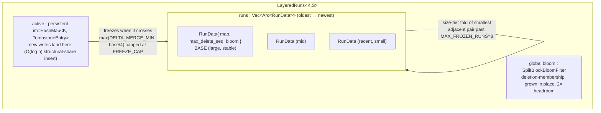
```mermaid
flowchart TB
    subgraph LR["LayeredRuns&lt;K,S&gt;"]
        ACTIVE["active : persistent im::HashMap&lt;K, TombstoneEntry&gt;<br/>new writes land here (O(log n) structural-share insert)"]
        BLOOM["global bloom : SplitBlockBloomFilter<br/>deletion-membership, grown in place, 2× headroom"]
        subgraph RUNS["runs : Vec&lt;Arc&lt;RunData&gt;&gt; (oldest → newest)"]
            R0["RunData{ map, max_delete_seq, bloom }<br/>BASE (large, stable)"]
            R1["RunData (mid)"]
            R2["RunData (recent, small)"]
        end
    end
    ACTIVE -->|"freezes when it crosses<br/>max(DELTA_MERGE_MIN, base/4) capped at FREEZE_CAP"| RUNS
    RUNS -->|"size-tier fold of smallest<br/>adjacent pair past MAX_FROZEN_RUNS=8"| RUNS
```

Key constants (production): `DELTA_MERGE_MIN = 16,384`, `FREEZE_CAP = 262,144`, `MAX_FROZEN_RUNS = 8`. The freeze cap is what keeps the *recent* runs (and their per-run blooms) small and cache-resident no matter how large the accumulated base grows. Per-key copy work stays `O(log N)` because additions land in the small `active` tier and the frozen base is shared by `Arc` until the delta crosses the merge threshold — a geometric cadence.

**`Arc` granularity — not one per key.** A reasonable worry is that an `Arc`-shared index means an `Arc` *per tombstone* — `O(keys)` reference counts. It doesn't. `TombstoneEntry` is a plain `Copy` value living inline in the map; it is never individually boxed or refcounted. The `Arc`s sit at *tier* granularity: each frozen run is a single `Arc<RunData>` wrapping an `Arc<HashMap<K, TombstoneEntry>>` and an `Arc<bloom>`, and there are at most `MAX_FROZEN_RUNS = 8` of them over one `active` tier. (The `active` `im::HashMap` does refcount internally — that is how its insert achieves structural sharing — but each HAMT node holds many entries, so it is `O(nodes)`, not `O(keys)`.) So the total `Arc` count is bounded by a small multiple of the run count, the per-key footprint is just the 16 inline bytes, and there is no per-entry allocation or refcount traffic. That bounded sharing is also exactly what makes the `rcu` copy cheap: cloning the index for a publish bumps a handful of run `Arc`s and structural-shares the `active` tier rather than copying `O(keys)` of anything.

**Where the tombstones live durably — and why this isn't `O(live keys)` on disk either.** `LayeredRuns` is a *derived cache*; no `TombstoneEntry` is ever persisted in this shape. A deletion is durable in one of two places: a **delete-vector file** (`DeleteFile` — an Arrow-IPC file under the snapshot's `deletions/` directory, referenced from the `cayenne_delete_file` metastore table; position-based vectors name a `source_data_file_path` and carry row IDs relative to it, key-based ones apply table-wide), or — for the most recent, unflushed level-0 deletions — an **inline tombstone row** in `cayenne_inlined_delete`. Delete-vector writers allocate an exact UUID path per file and retain RAII ownership until catalog commit; batch failure or cancellation waits for every detached blocking writer and removes exactly those paths, never a broad directory or every "unreferenced" file. Oversized position IDs fail rather than being truncated or skipped. The re-insertion (`insert_seq`) side comes from the upsert's delete-file record: since the metadata-only upsert publish it is stamped on `cayenne_delete_file.reinsert_sequence`, with `cayenne_insert_record` retained only as the legacy fallback for rows where that column is NULL. At provider open, `load_deletion_vectors_all` reads the delete files and insert records once and builds the in-memory index; inline tombstones are applied as a read filter on top. So the durable footprint is `O(deletions + upsert re-insertions)`, **not** a row per live key — live rows exist only in the Vortex data files — and maintenance compaction's seq-prefix bake (`prune_deletes_at_or_below`) folds the older `delete_seq ≤ T` prefix into the data files and drops those records, which bounds the growth. The one structure that *does* scale with the number of distinct primary keys is a separate one: `cayenne_pk_index`, a persisted PK-existence checkpoint (a sharded keyset plus bloom) that lets an upsert table skip rebuilding its conflict-detection keyset by full-table scan on restart. That is the conflict-detection keyset, not the tombstone index — a different structure answering "does this PK already exist?", not "was this PK deleted, and re-inserted after?".

### The probe (pseudocode)

The hot path is `get_with_min_seq`. The `min_delete_seq` cutoff `S` is the protected-snapshot optimization: a protected probe skips any run whose deletes provably can't be newer than `S`.

```text
fn probe(pk, S: Option<i64>) -> Option<Tombstone>:
    hash = hash_key(pk)

    # 1. Global bloom is a safe superset over ALL runs' deletion keys.
    #    A miss ⇒ no tombstone at any sequence ⇒ None for any cutoff.
    #    This rejects the common "never deleted" key in ~one block load.
    if not global_bloom.might_contain(hash):
        return None

    # 2. Fuse `active` with the applicable runs, taking the per-side max.
    entry = TombstoneEntry::EMPTY
    fuse(entry, active.get(pk))                 # always: small, recent
    for run in runs:                            # oldest → newest
        if S is Some(s) and run.max_delete_seq <= s:
            continue                            # CANNOT carry a delete > s — skip wholesale
        if run.bloom.might_contain(hash):       # per-run bloom (small for recent runs)
            fuse(entry, run.map.get(pk))
    return Tombstone::from(entry)               # None if no delete side present
```

```text
# applied per scanned row by the deletion-filter exec:
fn row_is_visible(row, tombstone: Option<Tombstone>) -> bool:
    match tombstone:
        None                          => true                         # never deleted
        Some(t) if t.insert_seq.is_some()
                  and t.insert_seq > t.delete_seq => true             # re-inserted after delete
        Some(_)                       => false                        # deleted, not re-inserted
```

Two properties make this fast at steady state:

- **Main-scan probes** (`S = None`) fuse all runs — the full fused value over every write.
- **Protected-snapshot probes** (`S = Some(s)`) skip every run with `max_delete_seq ≤ s` and consult only the recent, small runs via their *per-run* blooms — never the large global bloom. So probe cost tracks *recent* writes, not the total accumulated tombstone count.

For whole-batch scanning, `get_batch` restructures into two passes — a tight bloom sweep over a chunk of keys, then the tier walk only for the survivors — so out-of-cache map misses overlap across iterations (memory-level parallelism). And a process-wide `DeletionIndex::shared_empty()` is reused by every table that has *no* deletions, amortizing the bloom allocation to zero.

### Maintenance: seq-prefix bake

Over time, tombstones whose `delete_seq ≤ T` get **baked** into the data files by compaction (`prune_deletes_at_or_below(T)` drops them from the runs once they're physically applied). This shrinks the per-row probe cost continuously, so a long-lived high-churn table doesn't accumulate an ever-growing tombstone set.

The cutoff itself has one subtlety in `memory` mode. The natural fence is the durable deletion index's max sequence — but under off-fence sharded CDC a *later* apply's delete can fold into the durable index ahead of an *earlier* apply's delete that is still pending in RAM, so that max can sit **above** a pending delete that was never baked into the merged files. Tagging the merged snapshot with it would make the scan treat the pending delete as already-applied (`delete_seq ≤ threshold`) and skip it forever — resurrecting the deleted row. The merge/bake fence is therefore capped **strictly below the smallest still-pending mem-tier delete** (`min_pending_mem_tier_delete_sequence`). Lowering the fence cannot under-count: a pending upsert's (delete, data) pair is one atomic apply, so its re-insert is also still pending and never in the merged durable files — a lower fence only applies more deletes to old rows, never hides a baked re-insert.


## The level-0 tier in detail

Level-0 has two implementations that absorb small writes, picked by `cdc_durability`:

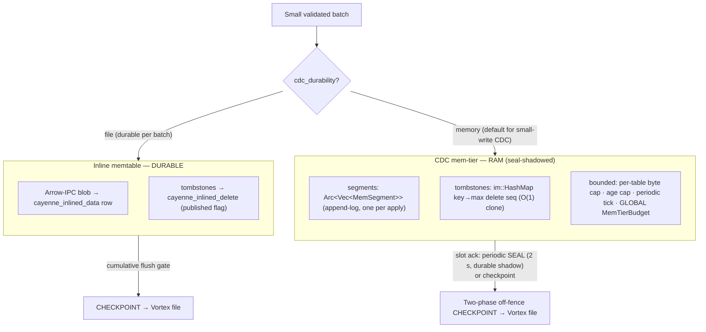
```mermaid
flowchart TB
    BURST["Small validated batch"] --> MODE{"cdc_durability?"}

    MODE -->|"file (durable per batch)"| INLINE
    MODE -->|"memory (default for small-write CDC)"| MEMTIER

    subgraph INLINE["Inline memtable — DURABLE"]
        direction TB
        IPC["Arrow-IPC blob → cayenne_inlined_data row"]
        ITOMB["tombstones → cayenne_inlined_delete (published flag)"]
    end

    subgraph MEMTIER["CDC mem-tier — RAM (seal-shadowed)"]
        direction TB
        SEG["segments: Arc&lt;Vec&lt;MemSegment&gt;&gt; (append-log, one per apply)"]
        TOMB["tombstones: im::HashMap key→max delete seq (O(1) clone)"]
        BUD["bounded: per-table byte cap · age cap · periodic tick · GLOBAL MemTierBudget"]
    end

    INLINE -->|"cumulative flush gate"| FLUSH["CHECKPOINT → Vortex file"]
    MEMTIER -->|"slot ack: periodic SEAL (2 s, durable shadow)<br/>or checkpoint"| FLUSH2["Two-phase off-fence CHECKPOINT → Vortex file"]
```

**The inline memtable** is the durable level-0: each small batch is an Arrow-IPC blob stored as a row in `cayenne_inlined_data`, with tombstones in `cayenne_inlined_delete`. An append shares structure rather than re-encoding the corpus, and a read fuses the decoded batches into the scan union. Once cumulative rows/segments/bytes cross `inline_flush_max_*`, a checkpoint drains it into one consolidated Vortex file.

**The CDC mem-tier** (`cdc_durability: memory`, the default for the small-write CDC profile) is the *only* data-bearing state whose primary copy is RAM. It is held in an `ArcSwap<MemTier>`, so an append is an O(1) `Arc` swap and reads union it with zero copy. Its tombstone maps are persistent `im::HashMap`s, so each append shares structure with the prior version. The mem-tier defers per-batch durability cost: instead of persisting a blob before the source-slot ack, it appends to RAM and defers the slot ack until the rows are durable — by default via a cheap periodic **seal** (below), and in any case by the checkpoint that flushes the tier to a durable Vortex file. The checkpoint stays off the hot path: it captures all shards, then **releases `write_lock` before the encode**, so encoding the drained tier into Vortex overlaps concurrent applies rather than blocking them (with `cdc_mem_tier_shards > 1` the shards encode concurrently); only the final snapshot-pointer flip is taken under the fence. The sharded apply's per-batch work is kept lean the same way: both the apply preparation (`prepare_stream_for_insert_sharded`) and the per-batch shard split (`split_batch_by_pk_shard`) reuse the table's cached PK `RowConverter` instead of rebuilding one per apply and again per batch — shard routing stays byte-identical, and the saving bites hardest in the 1-row-transaction regime where replication lag accrues.

### The seal — the slot ack decoupled from the checkpoint

Until recently the slot ack rode *only* the checkpoint, which coupled it to the read hand-off: rows were query-visible on append, but the source replication slot advanced on the checkpoint cadence (typically 10–15 s), so replication and end-to-end freshness lag tracked that cadence. Lowering the age cap to chase sub-3-second freshness meant several times more small protected snapshots — read amplification and listing-fence contention — which is exactly the wrong trade. The observation behind #11622 is that the slot advance should stay coupled to **durability** but be decoupled from **reads**.

The mechanism is a split of `MemTier` at a `sealed_segments` boundary: `segments[0..sealed_segments]` are the immutable, already-durably-shadowed piece; `segments[sealed_segments..]` are the active ingestion piece. A periodic **seal** (`seal_mem_tier_durable`, driven by `cayenne_cdc_mem_tier_seal_age_ms`, default 2 000 ms) durably shadows the active piece and fires the slot advancer — with **no Vortex encode, no listing-fence publish, no protected snapshot, and no read amplification**:

- inserts are written as one **unpublished** inline BLOB (`commit_inlined_data_durable` — the publish is skipped, so `published_inlined_seq` never advances and the shadow stays invisible in-process);
- tombstones become durable delete-vector files (`commit_mem_tier_checkpoint_metadata`, with the in-memory update dropped) — a load-bearing detail, because `cayenne_inlined_delete` rows only hide inline-corpus rows and are wiped by the inline checkpoint, so they cannot durably hide a *file* row;
- then `fire_slot_advancer(seal_epoch)`.

Reads are unchanged — a scan still unions the whole RAM tier; the split is invisible to the scan path. Critically, `mark_sealed_through` **preserves the mem-tier `version`** (it advances only `sealed_segments`), so a seal does not move the scan-view cache's identity key (`RawScanInput::key` includes the per-shard mem-tier `version`, which a seal preserves — whereas `Arc::ptr_eq` would falsely trip on the seal's fresh shard `Arc`) — a seal is transparent to the cache, so a scan keeps hitting the cached bundle instead of forcing an `O(resident-tier)` rebuild every ~2 s. On restart the shadow *becomes* the recovered corpus (the inline watermark reseeds from the durable `current_sequence_number`, and `publish_orphan_inlined_deletes` re-activates the shadow's tombstones). A later bake re-flushes the same rows to Vortex and **clears the shadow** — a `mem_tier_shadow_present` flag forces the clear even though the published inline view is empty — so nothing double-counts, live or across a crash. Seal, checkpoint, and a cold promotion's pre-graduation mem-tier checkpoint are all serialized by `mem_checkpoint_lock` (a single drainer, preserving the slot advancer's failure-requeue ordering) — this is also what stops a promotion from re-capturing and re-publishing a background checkpoint's not-yet-cleared segments (a former duplicate-row over-count on promoted tables). The capture-lock acquisition is deadlock-safe against the write-path spill and cold promotion, which hold `write_lock` first and then await `mem_checkpoint_lock` (`write → mem`): a **guaranteed** capture (seal, the pre-commit drain, and age/pressure/flush-every-tick checkpoints) takes `mem_checkpoint_lock` then `try_lock`s `write_lock`, and *only on contention* drops `mem_checkpoint_lock` and re-acquires fairly in that same `write → mem` order — it never blocks on `write_lock` while holding `mem_checkpoint_lock`, so it can neither invert against the spill/promotion nor starve. A **best-effort** capture (a size-triggered checkpoint that still has age headroom) instead `try_lock`s both and skips (`Busy`) on contention, retrying next tick. At `cdc_mem_tier_shards > 1` that capture is **all-shards-atomic**: the slot-ack epoch is a single cross-shard axis, so a per-shard seal could tear the MAX watermark and ack an apply epoch not yet durable in every shard it touched; the seal therefore takes `write_lock` (a mid-fan-out apply is observed all-or-none) plus every shard publish lock in index order, computes the durable watermark as the MAX over shards, and builds the cross-shard union off the locks (`ShardedMemTier::union_snapshot_view`) into one shadow BLOB. At N = 1 no `write_lock` is taken — a single `ArcSwap` load is already atomic.

The contract: the slot stays tied to the **persisted** tier (it never advances before durability) but is untied from reads (it advances after the rows are scannable, without waiting for a publish). A crash before a seal re-streams only the un-acked tail — PK-idempotent, exactly-once, now a ~2-second window instead of a checkpoint-cadence one. Setting `cayenne_cdc_mem_tier_seal_age_ms: 0` disables sealing and reverts the slot ack to the checkpoint cadence; the value should sit at or below the age cap, since a seal older than the checkpoint window is superseded by the checkpoint's own slot advance. Like the checkpoint interval, this is a fixed time-domain durability-policy bound, not an adaptive-controller actuator.

### Why the mem-tier is safe to lose

The crash model is simple and is the reason `memory` mode is the default:

- The live mem-tier structure is pure RAM; it is **discarded** on crash/restart. Its *sealed prefix*, though, has a durable shadow, recovered as the inline corpus on the next open — only the unsealed tail is truly lost.
- The **source slot** is the single source of truth — it holds at most the last-sealed (or last-checkpointed) LSN.
- On restart, the source re-streams everything past that slot, and the **PK-idempotent apply** reconciles it **exactly-once**.
- The load-bearing invariant, enforced by the `SlotAdvancer` callback: **the slot advances only after the covering seal's or checkpoint's Vortex/metastore writes are durable.**

This trades a bounded crash-replay window — now the seal cadence (~2 s by default) rather than the checkpoint cadence — for the elimination of per-batch durability cost — a good bargain for a replayable CDC source. The tier is bounded on four axes so it can never OOM: a per-table byte cap (`cdc_mem_tier_max_bytes`), an age cap (`cdc_mem_tier_max_age_ms`), a periodic background tick, and a process-global `MemTierBudget` shared across a fleet of tables.

## Table statistics

Cayenne keeps two layers of statistics, both persisted in the metastore and both restored from it — a restart never rescans data files to rebuild them.

The **per-table optimizer aggregate** is what the DataFusion planner reads to size joins and estimate selectivity: `num_rows` plus, per column, min/max, null count, and a **HyperLogLog NDV sketch** (distinct-count estimate — 4 KiB of register bytes per NDV-eligible column, ≈1.6% standard error). It lives as one serialized blob in the `cayenne_table_statistics` row and is cached in memory as a DataFusion `Statistics`. It is built **incrementally**: every write folds its batch's min/max/null into a `ColumnStatsAccumulator`, which is then merged into the stored aggregate with a delta row-count update — all under `table_statistics_persistence_lock`, so a concurrent writer's merge is never lost. NDV is folded **lazily**: the synchronous inline tier0 write (the CDC apply hot loop) always skips the per-row sketch hashing; only a write that produces a persisted Vortex file — a checkpoint spill, staged append, compaction rewrite, or overwrite — hashes each NDV-eligible column's values into the sketch. An inline row's distinct-count therefore reaches the aggregate at the inline memtable's next checkpoint rather than at write time (a lag bounded to roughly one memtable), which is safe because NDV is consumed only as an inexact optimizer hint. Because HyperLogLog is mergeable and min/max/null compose, this never rescans data.

The cost of incremental merging is **one-directional drift**: min/max only ever widen (a since-deleted row's extreme value lingers) and the NDV sketch only grows (HyperLogLog cannot forget a value), so between compactions the aggregate is a *loose superset* of the live set. Two things keep that acceptable. First, the planner consumes the aggregate as **inexact** (advisory) statistics, so drift affects plan *costing*, never correctness. Second, compaction **re-anchors** it: a full-rewrite compaction (`replace_table_stats_after_rewrite`) recomputes the aggregate over exactly the materialized live rows and replaces the drifted one, and an overwrite (`reset_table_stats_after_overwrite`) replaces it outright and resets the count — so statistics tighten back to the live set whenever the data is rewritten.

There is one place where "inexact, so only costing" was *not* the whole story: the row count. On the distributed path, `local_executor_table_statistics` reports the maintained `num_rows` to the coordinator, and a count served `Exact` there is folded straight into a `COUNT(*)` **answer** — metadata, not a scan. The mem-tier checkpoint persists its row delta best-effort (it historically did not net supersedes of already-durable rows), so under memory-CDC churn the maintained count drifts toward "every row ever flushed" — and served `Exact`, that drift became a wrong `COUNT(*)` that survives drain. The fix is an explicit exactness bit: `cayenne_table_statistics.num_rows_exact`. A mem-tier checkpoint's best-effort `Delta` **taints** it false; a full-rewrite compaction's or overwrite's `Set` restores it. A tainted count is served `Inexact`, so the `COUNT(*)` metadata fold declines and a real, deletion-aware scan answers instead — while pure append/staged tables keep their `Exact` fast path. The mem-tier checkpoint is not the only taint source: the durable/staged path carries the same guard, so an **upsert-, delete-, or retention-capable** table's incremental `num_rows` `Delta` is likewise served `Inexact` (only a compaction/overwrite `Set` re-establishes exactness), because a `superseded` count can mis-net after an overwrite and standalone durable deletes aren't netted into the delta. Exactness on the incremental path survives only when `on_conflict` is unset **and** no retention delete ran this commit — i.e. a provably pure-append table. Even then it is withheld while a commit's row-count delta is still *queued*: a write publishes its rows under the fence but hands the matching `num_rows` delta to the debounced post-write maintenance task, so for that window the maintained count is short by exactly the undrained delta. The three in-memory conditions that used to stand in for "rows the persisted count does not describe yet" (`has_pending_deletions`, a non-zero `inlined_row_count`, mem-tier tombstones) are all cleared together by `clear_inlined_state_after_checkpoint`, which drains no maintenance — so on a pure-append table a reader landing just after a checkpoint saw every condition clear and folded a stale count as `Exact`. `PostWriteMaintenance` therefore counts outstanding deltas directly (`outstanding_live_rows_deltas`, incremented under the state lock as each delta is queued and retired only by a drain whose persist reports it landed), and the gate serves `Inexact` while any remain. It is a count rather than a high-water mark so a drain that abandons its update — `persist_table_stats` now reports that — retires nothing, and a later drain's success cannot declare the count exact over the gap it left. The cost is that a distributed `COUNT(*)` issued between a commit and the maintenance debounce that follows it real-scans instead of folding; outside that window the fast path is unchanged. Independently, the checkpoint delta is now netted by the durable supersedes accumulated on the append path (a saturating counter, so it can never wrap and inflate), keeping the `Inexact` value close to the live count rather than climbing without bound. A completed streaming write also triggers a debounced executor-stats rebroadcast, so the coordinator's `COUNT(*)` metadata fold reflects freshly-published rows without waiting for the next periodic report. Single-node `COUNT(*)` folds on Vortex footer sums and was never affected. A **standalone `DELETE`** is the third taint source, and for a reason the other two do not share: nothing re-derives the count on the delete path at all, so the tombstone's rows stay in `num_rows` and `cached_table_statistics_for_optimizer` only *masks* the drift to `Inexact` while `has_pending_deletions()` holds. Every tombstone fold drops that mask, so a fold that does not re-baseline restores `Exact` over the stale value — the delete therefore taints the persisted flag directly (`RowCountExactnessTaintingDeletionSink`), which also survives a restart. The taint is written **before** the irreversible delete and unconditionally — a delete that matches nothing, errors, or is cancelled only costs the fast path, whereas tainting afterward leaves a window where the tombstone is durable and the flag still claims the stale count is live (the same reason the per-key OCC degrade is set pre-delete). A failed statistics write likewise stops the process serving the count `Exact` rather than leaving the unjustified claim standing. The count itself is left alone rather than decremented: the deleted total spans tiers `num_rows` does not uniformly include, so subtracting it can *under*-count, and an over-count served `Inexact` is only a planner estimate. **Datalake promotion** is a full-rewrite fold like compaction and overwrite, so it likewise `Set`s an authoritative count — the sum of the cold manifest it just committed, which is by construction the whole live set — and restores exactness; when any manifest entry's row count is unknown that sum is only a lower bound, so promotion taints instead of claiming it exact. Completeness is judged over the *whole* committed manifest, carried clean files included: a carried entry's count comes from an earlier promotion, which may have persisted the placeholder 0 for an unreadable footer, so checking only the freshly-written files would mark a sum exact while omitting every row in that carried file. The baseline it carries the min/max + NDV aggregate over from is captured **before** the commit, because `commit_overwrite_to_cold` deletes the table's `cayenne_table_statistics` row — a re-baseline that read the record afterward would find nothing and silently no-op, leaving whatever the in-memory cache still claims. One hazard is deliberately left to its own fix: a full rewrite that acquires `write_lock` between a delete's taint and that delete's publish can `Set` exactness back over a corpus the delete has not reached yet, which needs a mutation generation rather than a reordering.

The same never-shrink property surfaces on the **join build side**. When a scan unions the compacted base with the live deltas, the `UnionExec` wipes the base's join-key statistics; Cayenne refills them from a tier-accurate overlay so the planner still sees per-key stats that reflect merge-on-read deletes. Because that overlay's NDV is an HLL union that only grows — it never shrinks on a delete or upsert-supersede — it is capped before it feeds build-side selection, so the never-shrink over-count cannot push the estimate past the live row count.

The second layer is **per-file footer statistics**: each Vortex file's min/max/null/row-count, persisted per file in `cayenne_snapshot_file_statistics` and cached in a `FileStatisticsCache`. These drive listing-time **file pruning** — skipping files that can't satisfy a scan predicate — without re-reading each object's footer; the in-memory cache is cleared on publish when new files appear.

When `cayenne_integrity_checksums` is enabled, each Vortex data file also carries a self-describing content digest (`provider/file_digest.rs`, `"xxh3-128:<hex>"`) computed at manifest-author time and stored in the nullable `cayenne_snapshot_file.digest` column. It is verified once (a per-process-cached whole-file read) *before the file is first scanned*, turning silent bit-rot into a detected fault that fails the scan; a file with no digest or that can't be read is skipped as unverifiable, not treated as corrupt. Off, the digest column is simply left NULL.

Restore is a metastore read, not a rescan. At open, `load_table_statistics` reads the aggregate blob (`get_table_statistics`) and deserializes it straight into a `Statistics`, and the per-file layer comes back from `cayenne_snapshot_file_statistics`. The raw Vortex data is never re-read to rebuild statistics.

## Adaptive CDC tuning and query admission

A `cdc_durability: memory` table is a closed loop: the adaptive controller (`provider/tuning.rs`) watches each table's freshness / replication-lag against its SLO setpoints (the `cayenne_goal_*` parameters — an unset goal leaves that lever inert) and nudges a set of actuators — checkpoint cadence, mem-tier caps, the deletion-index bake trigger, and more. It is **storage-aware**: a startup calibration probe measures the data path's write throughput, an IMDS check flags T-family burstable EC2 hosts, and an I/O-cliff detector (the fast latency EWMA rising sharply over the slow EWMA) triggers a fast-path backoff before latencies spiral.

The newest lever inverts the controller's original grow-only bias on the mem-tier. When a `cayenne_goal_freshness` SLO is set and violated **and** apply is actually behind offered load (`apply_vs_arrival > BEHIND_RATIO`) **and** the stream is not mutation-heavy (`delete_fraction ≤ MUTATION_HEAVY_FRACTION`, matching the strict `>` gate on `mutation_heavy`), the controller **shrinks** `cayenne_cdc_mem_tier_max_bytes` (`goal_shrink_i64` in `decide_goal`, ordered before the ingest-grow tier). The causality is checkpoint-shaped: a large mem-tier makes each checkpoint's `write_lock` capture window deep, applies queue behind it, and source-commit→queryable lag climbs — so shrinking the tier checkpoints smaller epochs sooner and keeps the capture stall shallow. The apply-behind and mutation-heavy gates matter: a freshness violation with *healthy* apply (`apply_vs_arrival ≪ 1`) is source-side / multi-table / coalesce lag, not a deep-tier problem — shrinking then collapses the absorb buffer (measured 1 GiB→67 MiB on a local SF10 RATE-capped HTAP ladder) and *raises* order_line p99 freshness. Mutation-heavy streams (`delete_fraction` above `MUTATION_HEAVY_FRACTION`, e.g. delete-heavy shapes like `order_line`) pay more per spill/checkpoint on key churn, so shrink is withheld there the same way write-concurrency is. When the gates block, the tick falls through to ingest throughput levers (write concurrency / compaction). This closes the loop on what was previously a hand-pinned A/B (1 GiB → 256 MiB took a worst-table freshness P99 from ~4.4 s to sub-second on an SF-100 3-node run, though the merged claim is deliberately softened to "a safe control response" — the validation run was variance-dominated). Freshness *owns* the tier lever: the replication-lag grow moves are gated off while freshness is violated, so the two goals can never drive the tier in opposite directions on one tick; an explicit operator pin on `cayenne_cdc_mem_tier_max_bytes` collapses the clamp bounds so the lever no-ops rather than fighting the pin; and the shrink is gated on live ingest, so a parked table never ratchets its tier down on wall-clock staleness.

The violation signal is worth naming because it also changed a metric's semantics. Per-apply row freshness (apply wall-clock minus the batch's source commit timestamp, clock-skew clamped to zero) is folded into a tumbling-window **peak** (`WindowMax`, spanning the ~60 s default goal-convergence window — fixed to the default; a per-dataset `cayenne_goal_convergence_window` override retunes the controller's dwell, not this window). The peak is idle-immune by construction — a post-idle batch measures its own small lag, where an instantaneous gauge would ramp on the wall clock while nothing arrives — and it now backs the `cayenne_ingest_freshness_seconds` gauge, which therefore reports the windowed worst case rather than the sampling-phase-blind instantaneous value. A companion diagnostic splits the checkpoint capture timer: `capture_lock_wait` (the `write_lock` + shard publish-lock acquisition) is emitted as its own phase beside the O(1) snapshot work, so a long `mem_tier_checkpoint_capture` is attributable — a large lock-wait means the fix is apply-path throughput, not the already-constant capture.

One actuator reaches outside the table — the process-global **query-admission throttle** (`provider/query_admission.rs`). When a memory-mode table falls behind its freshness SLO *and CPU is the contended resource*, the governor holds live permits on the very admission semaphore the runtime's analytical queries acquire from, shedding some query concurrency to hand cores back to the CDC apply, then releases them once the table catches up. Admission is count-based — whole queries, never partitions — so throttling can never wedge a partially-admitted plan, and because it holds reversible permits (rather than forgetting them) the cap lifts cleanly.

## Other managed state, briefly

- **PK keyset cache** (`pk_keyset_cache`) — the visible PK set for `auto` on-conflict detection, so a burst doesn't re-scan Vortex files. Byte-budgeted (256 MiB default); when the exact keyset would exceed budget it falls back to a `PkBloom`. Reported to `runtime.query.memory_limit` accounting. A `cdc_mem_tier_shards > 1` table maintains **two** live caches — this table-wide keyset and the per-shard `ShardedPkIndex` — so each gets **half** the configured budget (`effective_pk_keyset_budget`) and the accounting is their **sum**, keeping the pair inside the configured figure. The budget is enforced at three points, because the sharded index is grown by two different writers: the cold/lazy rebuild bounds itself as it streams (`BoundedShardedPkIndexBuilder`); the inline/file commit mirror (`record_pk_keys_with_location`) enforces the budget **during** its inserts — per key on the single keyset, and via `record_keys_bounded` on the sharded index, which re-reads the table-global tally every 512 keys and stops there; and the mem-tier CDC apply still enforces **after** recording (step 6 of `validate_and_append_sharded`), because its per-shard inserts (`record_keys_in_shard`, step 4) run under separate publish locks and the `Exact`/`Bloom` variant is table-global, so no shard can convert while its siblings are still appending. It stops rather than converting in place because the `Exact`/`Bloom` variant is table-global — one shard cannot convert while its siblings are still appending — so it reports over-budget and the caller degrades or drops. Enforcing during rather than after matters because an uncapped insert peaks at `batch_keys × entry_bytes` with no ceiling — the budget is applied only once the batch that broke it has already been built. **The mem-tier path still has that shape**; only the commit mirror is bounded so far. Neither, on its own, was what reached ~14.5 GiB at SF-1000: that came from the per-table budgets *summing* (see below), and the profile's hot path was the commit mirror. Because a bounded insert stops mid-batch, the caller **backfills the whole batch into the blooms after degrading** (`record_keys_after_degrade`): degrading converts only what the keysets already hold, so the keys after the stop would otherwise be absent — and an absent key is a false NEGATIVE, which under upsert reads as a new PK and writes a duplicate live row. Without that third point the sharded keysets grew with every distinct key ever written, which is unbounded under monotonic keys even at a stable live row count (the budget was reported and never applied — an SF-1000 CH-benCH OOM). A fourth constraint bounds the **fleet**: each table's `pk_keyset_cache_mb` is derived from total memory (~1/32, clamped 256 MiB–8 GiB) with no view of its siblings, so seven CDC tables on a 96 GiB host are granted 3 GiB each — 21 GiB in aggregate that no single table can ever exceed. A SF-1000 profile measured ~14.5 GiB resident in keysets with **zero** over-budget events for exactly that reason: every table was correctly inside its own limit while the process ran to its cgroup cap. `pk_keyset_budget` (a process-global ceiling, the same shape `mem_tier_budget` already uses next door) clamps each cache's effective budget to `own residency + remaining fleet headroom` (`clamp_to_fleet_headroom`), so the bound governs growth without evicting, and `CayenneMemoryAccount` releases a dropped table's share. `own` is **that cache's** residency, not the table's sum across both: every caller compares the ceiling against one cache's `approx_bytes`, so passing the sum would hand each cache the other's bytes as extra allowance and let a sharded pair grow to twice what the fleet had left. The clamp is **advisory, not admission control** — a cache reads its ceiling, inserts up to it, and publishes the result afterwards, so two tables can read the same headroom and both grow into it; the overshoot is then *recorded* rather than hidden (`force_reserve_keyset_bytes`), because once the bytes exist the honest aggregate is what stops the next grower. It is bounded by how far a grower gets between reading its ceiling and publishing — one 512-key chunk on the sharded insert, not a whole batch. Unset, it admits everything. **Degrading to a bloom is sound only under `OnConflict::Upsert`**: the bloom existence arm keeps the incoming row and supersedes the prior one, so a false positive is just a redundant delete, whereas under `DoNothing` that is upsert semantics rather than "do nothing" — validation debug-asserts a bloom index implies upsert. A non-upsert index that exceeds budget is therefore left exact and reported at its true size rather than bloomed (or dropped, which on the mem-tier path would rebuild the whole keyset on the next apply, forever, since the `DoNothing` rebuild is itself uncapped); bounding it needs a sound exact eviction, which does not exist yet. Per-entry accounting charges the u128 digest, the whole `PkKeysetEntry` (`OwnedRow` pointer + `RowLocation` + the OCC `sequence`) and the key's heap bytes — 96 B for an 8-byte key on 64-bit (`approx_pk_keyset_entry_bytes`). **The bloom itself is split-block** (frame version 2): one hash picks a 256-bit block and the key sets exactly one bit in each of its eight `u32` lanes, so a probe touches one cache line and carries no branch, where the scattered layout it replaces spread seven probes across the whole array and addressed them with two FNV-1a passes over the key. It is also **sized to the density it asks for**: `with_expected_keys` requests ~10 bits/key and now rounds the bit count up to the next power of two, where rounding down delivered as little as 5.24 bits/key with `PK_BLOOM_NUM_HASHES` tuned for the 10 it did not get — 12.1% false positives against 0.76% at 100K keys. The scattered layout stays fully readable and every filter already on disk is one; nothing rewrites them, because a bloom is lossy and its members cannot be re-enumerated, so an existing filter is probed by the layout that wrote it until promotion or compaction replaces it. Each layout carries its own probe fingerprint, so retuning one cannot invalidate filters written by the other. A cold rebuild (`load_existing_keyset`, forced when compaction or a deletion-vector refresh invalidates the cache) folds the **un-checkpointed mem-tier's keys** in beside the durable-file scan (`fold_mem_tier_keys_into_keyset`), snapshotting the tier *before* the scan so a concurrent checkpoint-clear cannot hide a key from both sides; the fold covers both the serial and the sharded (`build_sharded_pk_index`) callers and is a no-op for non-memory tables. This matters because compaction never flushes the mem-tier first: without the fold, a RAM-only key is missing from the rebuilt index, its next UPDATE false-negatives into a fresh insert with **no tombstone**, and the prior copy is served forever — a durable over-count compaction cannot heal. RAM-only keys enter as `FileUnlocated`, a benign label since the mem-tier tombstone unions the file and inline delete lists. The **persisted-bloom fast path** (`try_load_persisted_pk_index` — used right after a compaction persists a `cayenne_pk_index` bloom for the current snapshot) had the same gap and now gets the same fold (`fold_mem_tier_keys_into_bloom`; a superset is safe under upsert, a stale key just costs a redundant tombstone). Both paths now capture the (mem-tier, protected, current) triple **coherently under the listing fence**, so a concurrent off-fence checkpoint can't hide a live key from both the RAM fold and the durable delta.
- **Sequence allocator** (`seq_allocator`) — hands out every sequence number, refilling in batches from the metastore high-water column to cut round-trips.
- **Maintained aggregates** (`maintained_aggregate.rs`, adjacent query-side machinery this document otherwise leaves out of scope) — an incremental-view-maintenance registry fed by the CDC delta: an optimizer rule (`CayenneMaintainedAggregateRewriter`) rewrites a recurring `COUNT` / `SUM` / `AVG` / `MIN` / `MAX … GROUP BY` plan over a CDC-fed table into a `MaintainedAggregateExec` served from per-group state in O(groups) instead of an O(rows) rescan. `SUM` tracks non-null cardinality so retracting the final non-null contribution restores SQL `NULL` even when null-valued rows keep the group alive; `AVG` covers the full integer family exactly via an `i128` accumulator (invertible under retract-then-insert, unlike `f64`). `SUM`/`AVG` also cover `Decimal128` (the CDC money-column case, e.g. Postgres `NUMERIC(6,2)`): the running sum is the exact `i128` backing-value sum at the input scale, and the served output reproduces DataFusion's decimal return types — `SUM(p, s)` → `(min(38, p+10), s)`, `AVG(p, s)` → `(min(38, p+4), min(38, s+4))` with the serve-time quotient computed by DataFusion's own `DecimalAverager`, so truncation/precision/overflow behavior is identical to a base-table re-scan by construction (negative-scale decimal `AVG` and `Decimal256` stay unsupported and safe-decline). `MIN`/`MAX` are the retraction-hard cases — deleting the current group extremum must expose the *next* value — and keep a per-group ordered multiset (`SortedScalarIndex`), covering integers, `Date`/`Timestamp`, and `Decimal128` (float `MIN`/`MAX` is deferred on NaN ordering; the resolver safe-declines to a base-table scan). Runtime configuration requires a primary key for `MIN`/`MAX`; each view's retained-entry count is updated in O(1), the cap counts both per-PK contribution records and distinct multiset nodes, and all group/index state is detached when the registry becomes stale. At `cdc_mem_tier_shards > 1`, the writer pre-assigns one IVM epoch, publishes shard segments concurrently, and sends one ordered insert/delete delta after the fan-out. A lightweight even/odd scan seqlock binds that epoch to the captured shard vector: a scan racing the fan-out declines maintained substitution and executes the captured base plan, while a scan at the new epoch falls back until the background applier catches up. This prevents both stale-aggregate/new-shard and new-aggregate/old-shard substitutions without serializing ordinary scans on the write lock.
- **Scan-view cache** (`ScanViewCache`, `scan_view_cache`) — a per-table **demand-driven** cache of the merge-on-read scan input, computed off the query cores and reused across scans. A `ScanView` (the merged file∪mem-tier deletion snapshot + the per-segment deletion-filtered visible mem-tier batches + the tombstone union) is built **only for a scan-visible state a scan actually queries** — "build only what's queried" — and every concurrent scan on that same state borrows the one build. This retires the two per-scan `ArcSwapOption` memos (`merged_scan_deletions`, `mem_tier_visible_memo`) and the N==1 append-lockstep: instead of every concurrent scan recomputing the merge on a cold memo (the thundering herd that hurt worst under a query burst on the CPU-starved box), one build serves them all. Two slots behind a `parking_lot::Mutex`: a single self-replacing `latest_complete` and a short `in_flight` list; the rule is **decide under the lock, await OUTSIDE it** (the mutex is never held across `.await`). Each build is a `futures::future::Shared` future driving `capture_raw_scan_input` + `build_scan_view` in `spawn_blocking` (never stalling a tokio worker), so N scans keying to the same `ScanViewKey` await ONE build (dedup); an independently-spawned driver task polls a clone to completion, so a finished build is observable (and reusable) even if the originating scan is cancelled. A capture is keyed by `RawScanInput::key` — snapshot id + per-shard mem-tier `version` (not `Arc::ptr_eq`, so a seal that swaps the shard `Arc` while preserving `version` does not re-key) + structural epoch + the file-index / protected-map / inline-view pointers + the structural generation — computed FROM the captured immutable snapshot, so the key is self-consistent with the bundle it labels.
- **Freshness is per-scan, derived from the dataset's `access` mode AND refresh mode** (`default_scan_freshness`). Every table uses `0` = **read-your-writes** — the scan captures the CURRENT state, keys it, and serves an exact-key completed view or builds one, so a scan always sees the latest state — **except a read-only CDC replica**. Read-your-writes preserves what the retired per-scan memos already gave (an eager background-maintainer alternative — the #11948 approach — instead published a bounded-stale bundle and missed an immediate `INSERT OVERWRITE`'s own write, `test_overwrite_operations`; the demand capture avoids that while keeping the off-query-path build). The one exception is a **read-only CDC replica** (`access: read` **and** `refresh_mode: changes`): its data streams in only via CDC and is eventually-consistent by design (user writes require both a ReadWrite API key and `access: read_write`), so it uses a bounded lag (`CAYENNE_SCAN_VIEW_FRESHNESS_MS`, default 1000 ms): a fast path serves `latest_complete` when it is within the lag AND its structural generation still matches, letting concurrent analytical scans share one build without a capture or fence — the cross-query reuse that relieves the per-version rebuild CPU competing with the CDC apply. On a miss (or read-your-writes) it captures the current state and builds. **Read-only alone is deliberately not enough**: a full-refresh/snapshot/append table must reflect its last refresh immediately (refresh-then-query reads its own writes), and a read-only table can still take a direct `delete_from` via the accelerator — serving a pre-mutation view there would be a stale, wrong result — so only the streaming CDC case opts into staleness. The read-current fast path is gated on the structural generation so a stale-tolerant scan is **never** served a pre-schema-evolution bundle. `scan_input_version` remains as the cache's **ordering axis** (which completed build wins the `latest_complete` slot) and a cheap freshness signal — not a correctness gate.
- The **`StructuralVersion` seqlock is retained** (deleting it is unsafe here — the schema-evolve mem-tier flush re-enters `listing_fence.write()` inside `checkpoint_*`, so it cannot be fence-serialized): the read-your-writes capture runs under `read_validated_async`, so a capture that straddled a **live schema-evolution** (whose off-fence all-shards mem-tier flush could otherwise tear it at `cdc_mem_tier_shards > 1`) is discarded and re-captured (a bounded retry) rather than built torn, and the settled structural generation folds into the key so a schema change mints a fresh identity. There is no scan-WAIT gate: a read-your-writes scan simply rebuilds current. Other forced snapshot events (truncate / full-delete / `INSERT OVERWRITE` / reopen) are fence-serialized and change only the snapshot id (observed by the capture) + the additive `scan_input_version`. A scan sees a bundle GC-protected for its whole lifetime by the shared `SnapshotScanRef` the capture minted under the fence.
- A background **evictor** (`run_scan_view_evictor`, a 5 s tick holding only a `Weak<Self>`) drops `latest_complete` once it has gone UNSERVED for the idle window (`max(freshness, 5 s)`) — keyed on **last-access, not age**, so a still-reused view is retained rather than dropped mid-reuse (a read-your-writes exact-key hit stays valid at any age while the scan-visible state is unchanged, and each serve refreshes `last_access`). Only a truly idle view is evicted, releasing the `SnapshotScanRef` it holds so compaction GC can reclaim its snapshot dirs on a table that was queried once and then went quiet (the cache only refreshes `latest_complete` on a scan miss, so with no scans nothing else would ever release it). The provider records a `Weak<Self>` (`init_scan_view_cache`) so a build closure — which is `'static` and cannot borrow `&self` — can obtain an owned `Arc<Self>` for its `spawn_blocking`; a provider never `Arc`-wrapped (unit-test path) builds inline instead.


---

# Part 4 — Key flows

Now the boxes open. Each flow is a sequence diagram; the prose calls out the decisions that distinguish one flow from another.

## Flow A — The read path (a scan's lifecycle)

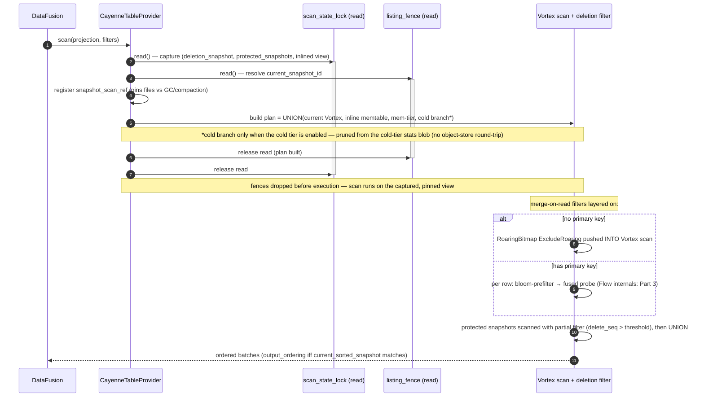
```mermaid
sequenceDiagram
    autonumber
    participant DF as DataFusion
    participant P as CayenneTableProvider
    participant SS as scan_state_lock (read)
    participant LF as listing_fence (read)
    participant V as Vortex scan + deletion filter

    DF->>P: scan(projection, filters)
    P->>SS: read() — capture (deletion_snapshot, protected_snapshots, inlined view)
    activate SS
    P->>LF: read() — resolve current_snapshot_id
    activate LF
    P->>P: register snapshot_scan_ref (pins files vs GC/compaction)
    P->>V: build plan = UNION(current Vortex, inline memtable, mem-tier, cold branch*)
    Note over P,V: *cold branch only when the cold tier is enabled — pruned from the cold-tier stats blob (no object-store round-trip)
    P->>LF: release read (plan built)
    deactivate LF
    P->>SS: release read
    deactivate SS
    Note over P,V: fences dropped before execution — scan runs on the captured, pinned view
    Note over V: merge-on-read filters layered on:
    alt no primary key
        V->>V: RoaringBitmap ExcludeRoaring pushed INTO Vortex scan
    else has primary key
        V->>V: per row: bloom-prefilter → fused probe (Flow internals: Part 3)
    end
    V->>V: protected snapshots scanned with partial filter (delete_seq > threshold), then UNION
    V-->>DF: ordered batches (output_ordering iff current_sorted_snapshot matches)
```

The scan resolves one consistent view, pins the snapshot so concurrent compaction/GC can't delete files out from under it, and applies deletions transparently. It no longer computes the merge itself: it borrows an `Arc<ScanView>` from the demand-driven **scan-view cache** (`scan_view_at_current_input` — see *Other managed state* in Part 3), so the merged deletion snapshot + deletion-filtered visible mem-tier batches are built once per distinct scan-visible identity, off the query cores in `spawn_blocking` and deduplicated across concurrent scans, rather than per-scan (or per-reference) on them. Freshness is per the dataset's `access` mode AND refresh mode: every table is read-your-writes (captures the current state — the scan sees the latest state) except a read-only CDC replica (`access: read` + `refresh_mode: changes`), which serves a bounded-stale cached bundle within the freshness lag. Nothing here blocks a concurrent writer except the microsecond window when a publisher takes the *write* side of the fences; and because the bundle is captured off the scan path, the scan holds no listing fence across plan-build.

**What a scan charges to the query pool.** Materializing a batch means canonicalizing Vortex's compressed encodings — RunEnd, Constant, dictionary — into flat Arrow, and that expansion is the single largest allocator in the process at scale: an SF-1000 heap profile put ~50 GiB under `vortex_buffer::BufferMut::with_capacity_preferred_aligned`, reached through `to_arrow_struct`, `canonical::execute`, `to_arrow_primitive` and `runend_decode_primitive`. None of it was accounted — `DataFusion`'s operators reserve for what they *hold*, and Cayenne's `memory_account` covers long-lived resident state (the PK keyset and deletion indexes, explicitly outside query execution), but the materialization in between reserved from nothing — so `runtime.query.memory_limit` did not bound the process: measured peak RSS tracked the cgroup cap (95.8 GiB at a 96G cap, 109.8 GiB at 110G) and was unmoved by partition count or tuning mode. The outermost `CayenneAccelerationExec` now registers a `MemoryConsumer` per output partition (`MemoryAccountedScanStream`) and takes the charge **before** each poll, holds it across the decode, and settles it to the batch's `get_array_memory_size()` once the batch exists. The ordering is the whole point: charging afterwards is a detector rather than a bound, since the allocation has already happened and a refusal could only reject the *next* batch. **This is a user-visible behavior change** — a scan that cannot fit returns `ResourcesExhausted` instead of drifting toward an OOM kill, so a workload that was quietly over-committing starts erroring. Because the failure is now the operator's to act on, the refusal names the dataset, how many batches it decodes at once and what they needed, and which of two remedies applies: a charge larger than the whole pool can never run at that limit and says so (raise `runtime.query.memory_limit`, lower `cayenne_scan_concurrency`, or read narrower batches), while one that fits the pool alone but not beside concurrent work reports what other queries hold and points at concurrency. The same message is logged at `warn` with the pool's own byte-level error attached, so the runtime's log carries what the query's error should not.

The reservation covers a batch **in flight**, from yield to the next poll, not its downstream lifetime: whatever an operator above retains, it reserves for itself. Two boundaries are deliberate, and neither should be over-read from the type's presence:

- Accounting attaches to the outermost wrapper only (`scan_guard.is_some()`), so the concurrent decodes beneath it are counted in aggregate rather than per branch. `plan_decode_concurrency` sums each file-backed source's `scan partitions x concurrency` over the subtree, and each output partition charges `estimate x` its share of that total (`partition_decode_share` — the quotient everywhere, the remainder on the lowest-numbered partitions, so the shares sum to exactly the subtree total). The total is right; its distribution is uniform, so a plan whose branches are lopsided — one wide file scan beside several narrow ones — charges each stream the average rather than what its own branch runs.
- The gate is whole-plan and comes from that same walk — `plan_decode_concurrency` is `None` when nothing under the plan decodes a file, including a file-backed source with no files to read — so a purely memory-backed scan is not charged at all. Those bytes are already mirrored into the same pool by the `cayenne:mem_tier` consumer, and charging them twice could refuse a query on memory no scan allocated. That is not a corner case: a `mode: memory` table keeps all of its data in the RAM mem-tier, and `mode` defaults to `memory`. Memory branches contribute nothing to the multiplier, but a *mixed* union that decodes files and also serves the RAM tier still passes its mem-tier batches through this stream, **over-counting** them by one partition's in-flight batches.

Charging at each materializing leaf would close both directions at once, and is the noted follow-up. The pre-poll estimate is a running max seeded at 1 MiB (`INITIAL_BATCH_ESTIMATE_BYTES`), deliberately small — a charge paid before any measurement refuses scans that would have fit — so until it converges, from the second batch on, one batch per partition decodes against the seed rather than its true size. None of this covers the CDC apply path, which runs through `mutation_writer` rather than this exec.

## Flow B — Insert (append, no PK conflict)

The simplest write. There is **no conflict resolution, no tombstone, no protected snapshot** — just a sequence number and a landing tier.

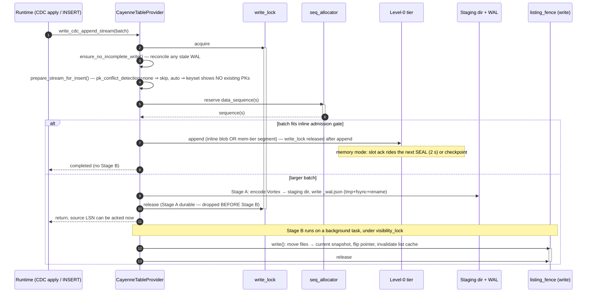
```mermaid
sequenceDiagram
    autonumber
    participant RT as Runtime (CDC apply / INSERT)
    participant P as CayenneTableProvider
    participant WL as write_lock
    participant SEQ as seq_allocator
    participant L0 as Level-0 tier
    participant STG as Staging dir + WAL
    participant LF as listing_fence (write)

    RT->>P: write_cdc_append_stream(batch)
    P->>WL: acquire
    activate WL
    P->>P: ensure_no_incomplete_write() — reconcile any stale WAL
    P->>P: prepare_stream_for_insert() — pk_conflict_detection=none ⇒ skip, auto ⇒ keyset shows NO existing PKs
    P->>SEQ: reserve data_sequence(s)
    activate SEQ
    SEQ-->>P: sequence(s)
    deactivate SEQ
    alt batch fits inline admission gate
        P->>L0: append (inline blob OR mem-tier segment) — write_lock released after append
        Note over L0: memory mode: slot ack rides the next SEAL (2 s) or checkpoint
        P-->>RT: completed (no Stage B)
    else larger batch
        P->>STG: Stage A: encode Vortex → staging dir, write _wal.json (tmp+fsync+rename)
        P->>WL: release (Stage A durable — dropped BEFORE Stage B)
        deactivate WL
        P-->>RT: return, source LSN can be acked now
        Note over P,LF: Stage B runs on a background task, under visibility_lock
        P->>LF: write(): move files → current snapshot, flip pointer, invalidate list cache
        activate LF
        P->>LF: release
        deactivate LF
    end
```

The defining feature: the incoming rows are **brand new PKs**, so `prepare_stream_for_insert` produces no deletions. The rows simply get a sequence number and land in level-0 (small) or a staged Vortex file (large). Visibility is the pointer flip; no deletion vectors are written.

For **bounded append freshness**, a long-lived append stream (e.g. an ADBC bulk ingest that would otherwise publish only at stream end) is cut into age- and size-bounded **segments** (`write_append_segmented`), each run as a complete prepare→stage→publish write under `write_lock`, so its rows become queryable within roughly one segment interval instead of at the very end. The age bound is a fixed ~10 s internal default (`DEFAULT_STREAM_PUBLISH_INTERVAL_MS`; `0` reverts to publish-only-at-end — note this is currently an internal default, not yet a settable spicepod parameter); the size bound is the target file size clamped to `[8 MiB, 256 MiB]`. An idle stream never publishes empty segments (the deadline starts at the first buffered batch), and on a mid-stream error already-published segments stay published — whole-payload retries stay convergent because the PK on-conflict resolution is idempotent.

## Flow C — Update / upsert (PK conflict → tombstone + re-insertion)

This is where an "update" diverges from an "insert." Cayenne has no in-place update — an upsert is modeled, Iceberg-style, as **a re-insertion that tombstones the prior copy**. The contrast with Flow B is entirely in the *conflict-preparation* and *publish* steps.

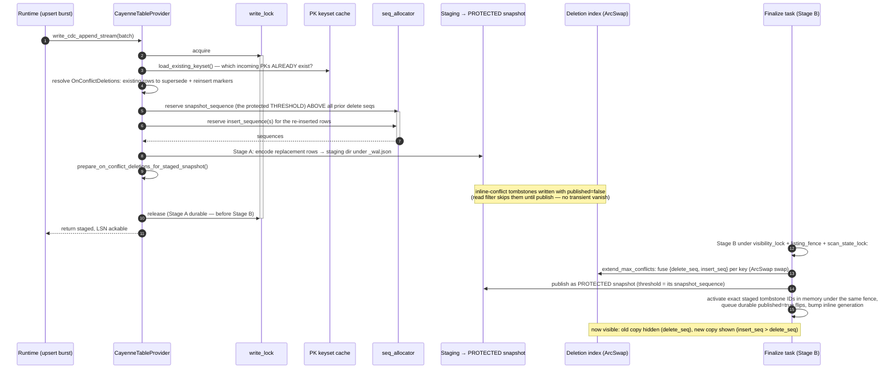
```mermaid
sequenceDiagram
    autonumber
    participant RT as Runtime (upsert burst)
    participant P as CayenneTableProvider
    participant WL as write_lock
    participant KS as PK keyset cache
    participant SEQ as seq_allocator
    participant STG as Staging → PROTECTED snapshot
    participant DI as Deletion index (ArcSwap)
    participant FIN as Finalize task (Stage B)

    RT->>P: write_cdc_append_stream(batch)
    P->>WL: acquire
    activate WL
    P->>KS: load_existing_keyset() — which incoming PKs ALREADY exist?
    P->>P: resolve OnConflictDeletions: existing rows to supersede + reinsert markers
    P->>SEQ: reserve snapshot_sequence (the protected THRESHOLD) ABOVE all prior delete seqs
    activate SEQ
    P->>SEQ: reserve insert_sequence(s) for the re-inserted rows
    SEQ-->>P: sequences
    deactivate SEQ
    P->>STG: Stage A: encode replacement rows → staging dir under _wal.json
    P->>P: prepare_on_conflict_deletions_for_staged_snapshot()
    Note over STG,DI: inline-conflict tombstones written with published=false<br/>(read filter skips them until publish — no transient vanish)
    P->>WL: release (Stage A durable — before Stage B)
    deactivate WL
    P-->>RT: return staged, LSN ackable
    FIN->>FIN: Stage B under visibility_lock + listing_fence + scan_state_lock:
    FIN->>DI: extend_max_conflicts: fuse {delete_seq, insert_seq} per key (ArcSwap swap)
    FIN->>STG: publish as PROTECTED snapshot (threshold = its snapshot_sequence)
    FIN->>FIN: activate exact staged tombstone IDs in memory under the same fence,<br/>queue durable published=true flips, bump inline generation
    Note over FIN,DI: now visible: old copy hidden (delete_seq), new copy shown (insert_seq > delete_seq)
```

The mechanics that make this correct:

- The new rows get sequence numbers **strictly above** every prior delete sequence, so they are immune to all pre-existing tombstones — they can neither resurface a deleted row nor be hidden by an old tombstone.
- The old copy is tombstoned at a *lower* `delete_seq`; the fused `TombstoneEntry` for that PK now carries `{delete_seq, insert_seq}` with `insert_seq > delete_seq`, so merge-on-read shows exactly one row — the new one.
- The publish goes into a **protected** snapshot tagged with `threshold = snapshot_sequence`, so the writer never has to re-resolve the whole existing deletion set. (Contrast Flow B, which publishes straight into the current snapshot with no threshold.)
- Inline-conflict tombstones are inserted durably as unpublished and carry their exact UUID into Stage B. Their in-memory activation and replacement-snapshot publication happen under one listing fence; durable `published = true` flips are deferred and replay-safe, so neither a crash nor a repeated finalize can activate a different tombstone for the same key.
- `total_superseded` nets the live row count: an upsert replacing *N* rows adds `inserted − N` live rows, not `inserted`.


## Flow D — Delete (the filter fast path)

A `DELETE` whose filter already encodes a concrete set of primary keys never scans data files. The extractor recognizes two shapes and writes a deletion vector directly:

- **Single PK**: `pk_col IN (v1, v2, …)` — integer literals route to the Int64 deletion-vector writer; non-integer to the key-based writer.
- **Composite PK**: an OR-tree of AND-equality conjunctions `(pk1=a AND pk2=b) OR …`, with the tree walk capped at `MAX_PK_FILTER_TREE_NODES = 65,536` nodes. Every conjunction must cover the PK exactly, else the extractor declines and the slow (scan-based) path runs.

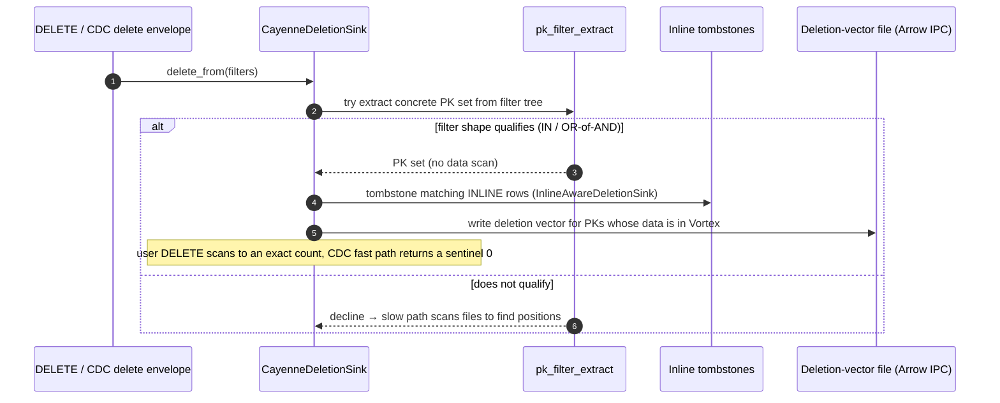
```mermaid
sequenceDiagram
    autonumber
    participant SQL as DELETE / CDC delete envelope
    participant SINK as CayenneDeletionSink
    participant EX as pk_filter_extract
    participant L0 as Inline tombstones
    participant DV as Deletion-vector file (Arrow IPC)

    SQL->>SINK: delete_from(filters)
    SINK->>EX: try extract concrete PK set from filter tree
    alt filter shape qualifies (IN / OR-of-AND)
        EX-->>SINK: PK set (no data scan)
        SINK->>L0: tombstone matching INLINE rows (InlineAwareDeletionSink)
        SINK->>DV: write deletion vector for PKs whose data is in Vortex
        Note over SINK: user DELETE scans to an exact count, CDC fast path returns a sentinel 0
    else does not qualify
        EX-->>SINK: decline → slow path scans files to find positions
    end
```

A pure delete differs from an upsert in that it writes a tombstone with a `delete_seq` and **no** `insert_seq` — so merge-on-read hides the row permanently (until a later upsert re-inserts the key at a higher sequence). Small delete batches land as `InlinedDelete` entries first and flush to a delete-vector file on memtable pressure.

Two callers share this extractor and the `InlineAwareDeletionSink`, differing only in whether they need a verified count. A **user-visible `DELETE`** runs through `delete_from` with an exact count (it must surface "rows affected"), so a qualifying `pk IN (…)` scans to count just the live rows removed. The **durable CDC apply loop** instead calls `delete_from_cdc_fast`, which builds the identical key-delete sink but *non-exact*: it persists deletion vectors straight from the extracted PK set with no scan and returns a sentinel `0` the caller discards — restoring the `O(deleted keys)` cost (a scan-to-count path had regressed durable CDC deletes to `O(table)` under `write_lock`). Shapes the fast path declines — position- or retention-based deletes — fall back to `delete_from` unchanged. (The memory-absorption path always kept the fast path; this restores it for `cdc_durability: file` key-delete tables.)

## Flow E — A CDC burst, end to end (Stage A / Stage B pipelining)

This is the flow that ties durability, visibility, and ordering together. The runtime acks the source LSN after **Stage A** (data durable) without waiting for **Stage B** (data visible), so Postgres can recycle WAL ahead of visibility — while burst order is still preserved for readers.

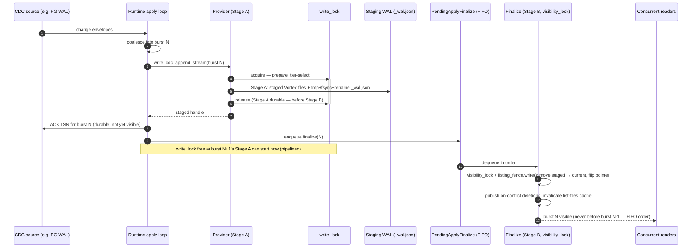
```mermaid
sequenceDiagram
    autonumber
    participant SRC as CDC source (e.g. PG WAL)
    participant RT as Runtime apply loop
    participant P as Provider (Stage A)
    participant WL as write_lock
    participant WAL as Staging WAL (_wal.json)
    participant FIFO as PendingApplyFinalize (FIFO)
    participant B as Finalize (Stage B, visibility_lock)
    participant RD as Concurrent readers

    SRC->>RT: change envelopes
    RT->>RT: coalesce into burst N
    RT->>P: write_cdc_append_stream(burst N)
    P->>WL: acquire — prepare, tier-select
    activate WL
    P->>WAL: Stage A: staged Vortex files + tmp+fsync+rename _wal.json
    P->>WL: release (Stage A durable — before Stage B)
    deactivate WL
    P-->>RT: staged handle
    RT->>SRC: ACK LSN for burst N  (durable, not yet visible)
    RT->>FIFO: enqueue finalize(N)
    Note over RT,WL: write_lock free ⇒ burst N+1's Stage A can start now (pipelined)
    FIFO->>B: dequeue in order
    B->>B: visibility_lock + listing_fence.write(): move staged → current, flip pointer
    B->>B: publish on-conflict deletions, invalidate list-files cache
    B-->>RD: burst N visible (never before burst N-1 — FIFO order)
```

**Durability modes recap.** In `file` mode every burst is durable before its ack. In `memory` mode the mem-tier append is the "Stage A," and the slot ack rides whichever durability pass comes first: by default the periodic **seal** (every `cayenne_cdc_mem_tier_seal_age_ms` = 2 s — a durable shadow into the unpublished inline corpus, no encode, no publish; see Part 3), else the full **two-phase off-fence checkpoint** below, whose encode + metastore `BEGIN IMMEDIATE` run *outside* the listing fence with only the snapshot-pointer flip under it. So a checkpoint never stalls scans for the duration of the encode/IO — and freshness/replication lag no longer has to wait for one.

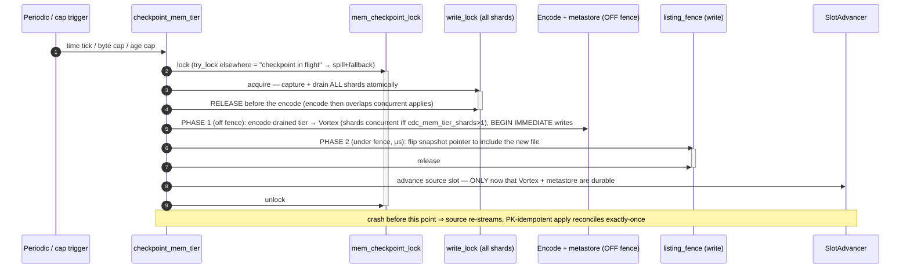
```mermaid
sequenceDiagram
    autonumber
    participant T as Periodic / cap trigger
    participant CK as checkpoint_mem_tier
    participant MCL as mem_checkpoint_lock
    participant WL as write_lock (all shards)
    participant ENC as Encode + metastore (OFF fence)
    participant LF as listing_fence (write)
    participant SA as SlotAdvancer

    T->>CK: time tick / byte cap / age cap
    CK->>MCL: lock (try_lock elsewhere = "checkpoint in flight" → spill+fallback)
    activate MCL
    CK->>WL: acquire — capture + drain ALL shards atomically
    activate WL
    CK->>WL: RELEASE before the encode (encode then overlaps concurrent applies)
    deactivate WL
    CK->>ENC: PHASE 1 (off fence): encode drained tier → Vortex (shards concurrent iff cdc_mem_tier_shards>1), BEGIN IMMEDIATE writes
    CK->>LF: PHASE 2 (under fence, µs): flip snapshot pointer to include the new file
    activate LF
    CK->>LF: release
    deactivate LF
    CK->>SA: advance source slot — ONLY now that Vortex + metastore are durable
    CK->>MCL: unlock
    deactivate MCL
    Note over CK,SA: crash before this point ⇒ source re-streams, PK-idempotent apply reconciles exactly-once
```

## Flow F — Background maintenance: tiered compaction

Compaction bounds read amplification by consolidating small Vortex files into target-sized ones. The picker buckets the current snapshot's files by size and fires when the smallest tier crosses its file-count and byte thresholds — but the pass it fires then re-encodes the *full current snapshot* into fresh target-sized files (a concurrent-append-guarded flip that aborts if a writer appended meanwhile), not merely the picked subset; re-encoding only the picked files and hard-linking the rest is a noted, not-yet-implemented optimization. The genuinely *incremental* subset rewrite is the separate protected-snapshot path (`compact_protected_snapshots_subset`), which the seq-prefix bake also rides. Both commit via the same copy-on-write atomic flip. A rewrite that must stay on a single encoder declares it (`EncodeFanOut::Serial`) rather than asking for one partition: the protected-snapshot merge does so for position-delete tables, whose tombstones are file-path scoped and whose position bake-in assumes one output sequence, as does a Z-order-clustered cold promotion, and so does any rewrite that actually sorted its stream (`rewrite_write_policy`) — splitting a globally sorted stream across shard files would give every file zone maps spanning the whole range, forfeiting exactly the pruning the sort exists for. Whether the fan-out is pinned is a property of the **write**, not of the table: a table's *declared* `cayenne_sort_columns` does not serialize the writes it makes, because schema inference fills that list on every catalog-visible CDC table (it is the key the background rewrite sorts by), and the two write paths that never sort — the CDC delta write, and the protected-snapshot merge, which unions its input scans — would otherwise encode on one core to preserve an order neither produces. **What a fanned-out write clusters by is a second, separate decision.** The shard key is the configured `cayenne_shard_key_columns` (or a source's declared shard key supplied by extended schema inference), else the primary key; an empty key means the primary key throughout, which is why schema inference omits a source shard key that already equals it. How that key is split then depends on whether the writer knows the range it is about to write. A **rewrite** does: it range-partitions on what its inputs report (`ShardSpec::Range`), so the shards tile the key domain in ascending, disjoint slices and each output file keeps zone maps narrow enough to prune. A **streaming CDC write** does not — it knows nothing about the keys still to arrive — so it hashes, which spreads every key range across every file. Both split each batch row-wise, which is what keeps all the encoders fed: the sink's shard and file channels are depth-1, so a router that sent whole batches to one shard at a time would idle every other encoder behind the one it was feeding. The split points come from the *distribution* the inputs describe, not from the single range they span: each merge input contributes bands — one per scan partition, each carrying the key range it covers and its row count — and the bands are cut at equal cumulative row mass, so every encoder gets roughly the same number of rows. The cuts are made for the shard count the write will **actually** create, not the session's partition hint: the sink keeps the ascending prefix of the bounds it is handed, so bounds cut for more shards than there are writers would leave the last one holding everything above the prefix. This matters because the parallel encode finishes with its **largest** shard, so a key that piles onto one writer forfeits the fan-out that the split was made to keep; a hot-key upsert stream, which is the CDC steady state, is exactly that shape. A band says how many rows fall in a range but never where they sit inside it, so reading it as uniform can invent mass where there is none — and given a wide band that is really two clusters at its ends, equal-mass cuts land in the empty middle and do **worse** than equal-width ones. The model is therefore used only where its error is bounded: **every band must be no wider than one shard's share of the key domain**, so however its rows truly sit, they cannot be misplaced by more than the granularity the split is choosing at. That rule declines the flat case too — where every band spans the whole domain, as hash-partitioned inputs do — which costs nothing, since equal mass over a flat density *is* the equal-width split and delegating reproduces it exactly. It holds precisely when the inputs are range-clustered, the state the rewrite's own output creates on the next merge. Reading the bands per *partition* is what makes that compounding real: a range-sharded rewrite writes its slices as several files under one snapshot, so a single band per input would report that snapshot's whole outer range and hand the walk back exactly the summary it is trying to see past. When the inputs cannot describe a distribution the write falls back to interpolating the merged range, and past that — missing statistics, a degenerate range, or a key type the interpolation does not cover — it declines the split and hashes. A composite key is split on its **leading** column, which needs no lexicographic comparison because rows sharing a leading value stay together on one shard — but only on evidence. A wide range on that column says nothing about how many values occur in it, and Cayenne's statistics carry no distinct count to ask, so a tenant id taking five values across a billion would yield a full set of equal-width cuts while the rows reached five shards. The leading column is therefore taken only when the bounds came from the band walk, whose gated-narrow bands exist only where rows actually are, and still fill every shard; otherwise the write hashes the whole key. The partition count travelling beside it stays a *hint* — an ordinary write inherits it from whichever session executes it, so it can be small for reasons unrelated to that write, and a configured `cayenne_write_concurrency` survives it. The accelerator has to enforce the serial case itself, because the Vortex sink clamps against the write *session's* `target_partitions` rather than the caller's.

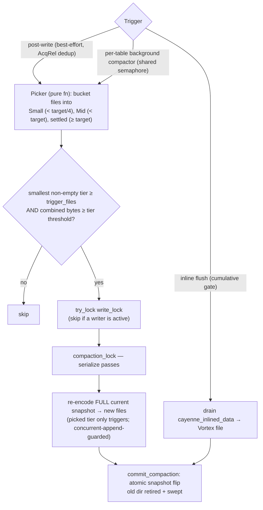
```mermaid
flowchart TB
    TRIG{"Trigger"} -->|"post-write (best-effort, AcqRel dedup)"| PICK
    TRIG -->|"per-table background compactor (shared semaphore)"| PICK
    TRIG -->|"inline flush (cumulative gate)"| FLUSH["drain cayenne_inlined_data → Vortex file"]

    PICK["Picker (pure fn): bucket files into<br/>Small (&lt; target/4), Mid (&lt; target), settled (≥ target)"] --> COND{"smallest non-empty tier ≥ trigger_files<br/>AND combined bytes ≥ tier threshold?"}
    COND -->|"no"| SKIP["skip"]
    COND -->|"yes"| LOCK["try_lock write_lock<br/>(skip if a writer is active)"]
    LOCK --> CLK["compaction_lock — serialize passes"]
    CLK --> REWRITE["re-encode FULL current snapshot → new files<br/>(picked tier only triggers; concurrent-append-guarded)"]
    REWRITE --> COMMIT["commit_compaction: atomic snapshot flip<br/>old dir retired + swept"]
    FLUSH --> COMMIT
```

Compaction runs only for tables that accumulate files. A **bulk-overwrite** table (`refresh_mode: full`) gets `compaction_background_interval_ms = 0` and so never spawns a background compactor at all: its refresh publishes a fresh snapshot and `update_current_snapshot_id` resets the small-file counter, it never creates a protected snapshot, and its deletion index stays empty — so every trigger would early-out anyway. An operator who mixes in-place writes with full refreshes can set the interval explicitly to turn it back on.

Compaction is gated by a **process-wide semaphore** (`provider::compaction_budget()`, sized at `cpu_budget().cayenne_compaction_permits()`), so a fleet of tables can't oversubscribe the writer pool. The budget spans the whole process, not one accelerator: a table created by `CREATE TABLE … PARTITIONED BY` belongs to no accelerator and still draws on it, so the `cayenne_compaction_permits_available` / `_total` gauges read the global budget directly rather than a handle published at accelerator registration. Compaction `try_lock`s the write lock and skips if a writer is active; the `compaction_lock` serializes passes so write-driven and background-driven runs never overlap. Key-delete tables compact *concurrently* with their writers.

**How much one pass may read.** Both protected-snapshot paths — the size-tier subset merge and the seq-prefix bake — union their whole selected input set into a single streaming rewrite, so how much they *select* is a memory decision, not just a write-amplification one. The size tiers (`select_protected_snapshot_merge_tier`: 8 MiB base, ×8 growth, up to 32 runs) are purely *relative*: they grow geometrically and saturate on overflow, so arbitrarily large runs collapse into one top tier and are then treated as same-size peers. Streaming does not make the footprint size-independent either — every selected input is scanned concurrently, and the native Vortex encode cascade holds decompressed Arrow chunks the memory pool never accounts. Left unbounded, that combination could union dozens of multi-gigabyte runs and OOM a small-RAM host (issue #12013).

So both paths carry an **absolute per-pass input ceiling** on top of the relative tiers: `PROTECTED_MERGE_INPUT_BYTES_PER_POOL_BYTE` (4) × the memory pool the pass accounts against — the dedicated compaction pool when `cayenne_compaction_memory_fraction` carved one, otherwise the query pool. Runs are taken oldest-first only while they fit, so a tier of large runs is consolidated a few at a time rather than whole, and the bake truncates its older prefix the same way (truncating only lowers the cutoff `T`, and the clean-prefix gate re-validates the resurrect-critical prune against whatever prefix was actually selected). There is no user-facing knob: an unbounded pool has no host ceiling to derive a budget from, so selection there stays bounded only by run count, exactly as before.

A tier whose two oldest runs do not fit the budget is thereby **settled** — the same "not a compaction candidate" outcome the current-snapshot picker gives files at or above the target size, but derived from the memory budget rather than configured. That costs less than it first appears, because of how this pass's benefit and cost scale differently. A merge buys exactly **one fewer scan branch** — `scan_protected_snapshots` unions one branch per protected snapshot — which is the same benefit whether the runs are 8 MiB or 8 GiB, while the cost is the bytes rewritten. Benefit is per run, cost is per byte, so the largest runs are the *worst* merges available and a byte ceiling drops the pass's least valuable work first. The read amplification that remains is alarmed where it is measured: the read path already WARNs at 8 × `cayenne_compaction_trigger_protected_snapshots` protected snapshots. Compaction logs the budget skip at DEBUG, as the cause behind that warning rather than a second alarm for it.

Bounding the work is not the same as making it unnecessary, and this pass is nominally the *fast* consolidation path. The rewrite exists only to apply each input's own deletions (`delete_seq > threshold_at_creation`); a run needing none could be **referenced in place** rather than re-encoded, and cross-snapshot manifest references already exist and are honored by physical-file GC (`manifest_file_relative_path` — two manifest rows resolving to the same relative path reference one physical file). Consolidating the protected set as a metadata operation where no deletions need applying is the change that would make this path fast rather than merely bounded; it is not part of the ceiling described above.

The compaction *output* writer is tier-gated (`provider/compaction_writer.rs`). On network-attached block storage — `StorageClass::Ebs` (EBS, Azure managed disks, NAS), auto-detected from the environment and overridable via the `storage` acceleration param — compaction installs an `O_DIRECT`/`fallocate` writer (up-front size hint, `bytes_per_sync`, content-fsync, a 4 MiB bounce buffer, and page-cache self-eviction of its own output). Local SSD/NVMe (including AWS instance store, classified `LocalSsd`), tmpfs, and S3 stay on the buffered writer — `O_DIRECT` is a net loss on local NVMe. There is no new boolean knob; the storage class is a detected fact. Two correctness/robustness guards ride the same path: writer-input batches are `try_cast`-normalized to the *stored* table schema before Vortex derives its dtype (so a read-schema scan — e.g. `Utf8View` under `cayenne_force_view_types` — can't trip a Vortex dtype-mismatch during a current-snapshot compaction), and runtime shutdown now drains in-flight Vortex-producing passes (`drain_compaction_tasks`) before the dedicated compaction runtime is dropped, so pending compaction CPU work isn't lost mid-flight.

One scope caveat is worth spelling out: `compaction_lock` — like every lock in Part 3 — is in-memory, per provider instance. Two *live instances of the same table* sharing one metastore are outside the concurrency contract: a full-snapshot rewrite in one can interleave with a protected-snapshot subset-merge (`swap_protected_snapshots_in_txn`) in the other so that the rewrite folds a set of protected snapshots and clears their catalog rows while the merge concurrently registers a merged replacement the rewrite never saw — and since a scan unions the current snapshot with *every* registered protected snapshot with no key-level dedup, the already-folded rows double-count on the next open. Production runs one instance per table, but the convergence property tests' in-process "restart" recreated the provider without killing its detached maintenance and hit exactly this race. The remedy is `drain_in_flight_maintenance()`: await the coalesced post-write-compaction / orphan-DV-sweep / inline-checkpoint tasks, flush the post-write maintenance loop, and take a final `compaction_lock` barrier before dropping the instance. The coalescing flags those tasks set now clear via an RAII drop guard on *any* exit — completion, early return, panic unwind, or abort — since a flag stuck `true` would both suppress future maintenance and hang the drain. (The same recreate-without-drain pattern exists in the runtime's hot-reload path; it is flagged upstream but not yet addressed.)


---

# Part 5 — Deep dives in pseudocode

## The write-path decision tree

Flows B–E are all one function (`write_cdc_pipelined`) taking different branches. Collapsed to pseudocode, the decision tree is:

```text
fn write_cdc_pipelined(batch):
    write_lock.acquire()                          # serialize writers (dropped after Stage A)
    ensure_no_incomplete_write()                  # reconcile any stale staging WAL first

    # --- conflict preparation ---
    if pk_conflict_detection == auto:
        existing = pk_keyset_cache.load_or_build() # which incoming PKs already exist?
        prepared = resolve_on_conflict(batch, existing)   # supersedes + reinsert markers
    else: # none (append-only CDC; source guarantees PK uniqueness)
        prepared = batch                          # blind append, no keyset scan

    # --- pipeline eligibility ---
    can_stage = (partition_column is None)        # partitioned ⇒ synchronous publish

    if not can_stage:
        return write_prepared_stream(prepared)    # synchronous: new snapshot under one flip

    # --- in-memory CDC durability mode ---
    if is_cdc_memory_mode() and has_slot_advancer():
        match append_to_mem_tier(prepared):       # O(1) ArcSwap; slot ack rides next seal/checkpoint
            Done(w)            => return w
            FallBackToDurable  => fallthrough      # global budget full → durable path

    # --- tier selection (the inline admission gate) ---
    match try_inline_or_restream(prepared):
        Inlined(rows)  => return completed(rows)  # FLOW B small / FLOW D small delete
        Fallback(stream, est_bytes):
            stage_protected = may_have_on_conflict_deletions or pending_pk_deletions
            target = ProtectedSnapshot if stage_protected else CurrentSnapshot
            # STAGE A (durable, on write path):
            staged = write_staged_append(stream, target)   # encode Vortex + fsync _wal.json
            if stage_protected:
                prepare_on_conflict_deletions_for_staged_snapshot()  # tombstones published=false
            return CdcWrite{ staged, write_lock }  # STAGE B spawned by runtime (FLOW C / E)
```

The single most important branch is `stage_protected`: a plain append (Flow B) targets the *current* snapshot; anything carrying on-conflict deletions or pending PK deletions (Flow C) targets a *protected* snapshot whose threshold immunizes the new rows from old tombstones.

## Metastore transaction semantics

All metadata mutation is a metastore transaction. The backend chooses the right `BEGIN` for its concurrency model:

```text
SqliteMetastore:  BEGIN IMMEDIATE   # take the reserved write lock UP FRONT, so a later
                                    # UPDATE/INSERT can't upgrade-deadlock vs a concurrent writer
TursoMetastore:   BEGIN CONCURRENT  # MVCC: writers proceed optimistically, serialize at COMMIT
                                    # time only on actual row conflicts
```

`SqliteMetastore` (the default) runs `tokio-rusqlite` in WAL journal mode with `synchronous = NORMAL`, foreign keys on, a 30-second `busy_timeout`, and a round-robin **connection pool** of `K = min(cpu_budget().cores(), 32)` independent connections (floor 2). SQLite WAL serializes writers at the engine level but allows concurrent readers; the pool primarily lifts read-side concurrency for metadata-heavy scans, where each scan pays several metastore reads. `begin_transaction` holds an `OwnedMutexGuard` on one pool slot for the transaction's lifetime. `TursoMetastore` (optional, `turso` feature) uses a fixed `K = 16` pool and libSQL's MVCC journal mode. Because `BEGIN CONCURRENT` pins an MVCC snapshot for the life of a transaction, that pool guarantees **autocommit at acquire time**: a slot whose previous holder returned it mid-transaction is rolled back before it is handed over, and is refused outright — `acquire` returns an error rather than a connection — if it cannot be confirmed back in autocommit. Without that, the next statement on the slot reads the abandoned transaction's snapshot instead of the committed database, so a reader can miss rows another connection has already committed. `SqliteMetastore` needs no equivalent: `BEGIN IMMEDIATE` takes no snapshot.

`commit_compaction` and `commit_overwrite` share retry-on-conflict logic; `is_retryable_write_conflict` is re-exported at the crate root so callers can bound-retry transient `SQLITE_BUSY` / Turso `BEGIN CONCURRENT` conflicts. Schema drift is caught at startup by `validate_existing_schema`, which compares column **names and ordering** (not types — SQLite/libSQL type affinity makes exact matching unreliable) against `metastore::EXPECTED_TABLES` and returns an actionable `SchemaMismatch`.

Beyond column-shape validation, each backend stamps a **monotonic schema version** into the database header (`PRAGMA user_version`). On every open, `init_schema` reads that version *before* running any migration and calls `ensure_supported_schema_version`, which refuses to open a catalog stamped **newer** than the build supports (`CAYENNE_METASTORE_SCHEMA_VERSION`, currently `1`) — returning `CatalogError::IncompatibleSchemaVersion { found, supported }` (an actionable "upgrade Spice or clear the Cayenne acceleration data" message) rather than risk a downgraded binary misreading a newer layout into silently-wrong (dropped-row) results. A stamp of `0` — a fresh database, or any pre-gate catalog — is always accepted and migrated forward; after the migrations succeed the current version is stamped back. The gate is symmetric across the SQLite and Turso/libSQL backends (`turso_core` supports `PRAGMA user_version` read + write). Version `1` guards the metadata-only upsert publish: the `reinsert_sequence` column on `cayenne_delete_file` (see below) that a pre-gate binary would misread as an empty insert-record table.

## Staging WAL crash-safety (self-healing recovery)

A staged file list is made crash-safe by writing `_wal.json` via **tmp + fsync + rename** — an atomic publish of the marker, so the WAL is all-or-nothing: a reader of the staging directory ever sees either a complete, committed marker or none at all, never a half-written one. The subtlety is that Stage A writes the Vortex files into the per-burst `_staging/<id>/` directory *before* it writes that marker, so a crash can leave the directory in one of two recoverable shapes. `ensure_no_incomplete_write` resolves both — it runs at provider open and again before every burst (with an in-process bypass for prepared appends still being finalized, so back-to-back CDC bursts don't block on each other):

- **Files staged, no committed WAL — the "pre-WAL orphan" case.** The directory holds `.vortex` files but no durable `_wal.json` — either the crash landed before the marker was written, or mid-write so that only a `tmp` file exists (recovery ignores uncommitted tmp WALs). With no record of intent to act on, recovery treats the directory as a crash leftover and deletes it (`clear_orphan_staging_dirs` → `remove_dir_all`; loose non-directory pre-WAL files are always removed). Nothing rolls these files forward.
- **Committed WAL present — roll forward.** The marker is durable, so recovery finishes the interrupted publish: it renames the listed staged files into the current snapshot and removes the WAL. Roll-forward is idempotent — if the crash landed *after* some or all files had already been moved, re-attempting the move is a harmless no-op (a missing staging source is tolerated), so a crash anywhere from "WAL just became durable" through "Stage B all but the WAL-removal done" heals to the same end state.

Discarding the pre-WAL orphan is correct rather than lossy, because of the ack ordering: the source's change-log offset is acknowledged only *after* Stage A's WAL is durable. A crash before the marker means the burst was never acked, so the source re-streams it on reconnect and the PK-idempotent apply reconciles it **exactly-once** — the deleted files belonged to a burst that is going to be replayed anyway. (This is the same "the source slot is the source of truth" argument that makes the RAM mem-tier safe to lose.)

The cleanup is deliberately *per-entry*, never a whole-staging-root wipe: it skips any staging id registered as an in-flight append and runs under the `visibility_lock`, so a recovery pass can never delete the staging directory of a pipelined Stage B that is concurrently mid-move (an earlier whole-root variant did exactly that and wedged the changes stream). Across a real process restart there are no in-flight registrations — they live only in memory — so every WAL-less staging directory on disk is an unambiguous orphan and is swept.

**Opt-in end-to-end integrity checksums.** With `cayenne_integrity_checksums` enabled (default off; see Appendix B), each staging-WAL record is wrapped by `provider/wal_checksum.rs` in a self-describing binary envelope — `MAGIC + version + u64-LE length + u64-LE XXH3-64(payload) + JSON payload` — so a record whose checksum fails to verify on recovery is *detected and discarded* (its staging directory removed, converging to the last committed snapshot) rather than parsed as valid intent. This is safe precisely because the WAL is a forward-progress marker, not the durable commit point: a discarded record's burst was never acked and is re-streamed. Reads accept both framed and legacy records, so toggling the feature on or off — or downgrading — never orphans an existing WAL. Off is byte-identical to the pre-feature on-disk format with zero read/write overhead.


---

# Part 6 — Cayenne vs. Iceberg, Delta Lake, and Hudi

Cayenne borrows liberally from the open lakehouse formats and then diverges where its goals (Vortex storage, HTAP, high-rate CDC, single-node-to-distributed) demand it. The comparisons below are architectural analogies, not interoperability claims — Cayenne does **not** read or write Iceberg, Delta, or Hudi tables.

## The lineage at a glance

| Dimension | Apache Iceberg | Delta Lake | Apache Hudi | **Cayenne** |
|-----------|----------------|------------|-------------|-------------|
| **Metadata store** | file-based metadata tree (metadata.json → manifest lists → manifests) + a catalog pointer | file-based transaction log (`_delta_log` JSON + Parquet checkpoints) | file-based timeline of instant files (`.hoodie`) | **SQL database** (SQLite / Turso) — `BEGIN…COMMIT` |
| **Data file format** | Parquet / ORC / Avro | Parquet | Parquet (base) + Avro/Parquet log | **Vortex** |
| **Commit / visibility** | atomic swap of the table pointer in the catalog | optimistic concurrency; atomic log append | atomic timeline instant | **atomic flip of `current_snapshot_id`** (one column) |
| **Ordering** | sequence numbers order data vs delete files | log version monotonicity | timeline instant ordering | **sequence numbers** (Iceberg-style) |
| **Deletes (MoR)** | position deletes + equality deletes | deletion vectors (RoaringBitmap, position) | delta/log records merged at read | **position (RoaringBitmap) + key-based fused tombstone** |
| **Small-write absorption** | none native (small-files problem) | none native (small-files problem) | MoR **log files** absorb updates | **LSM level-0**: inline memtable (durable) + RAM mem-tier (seal-shadowed) |
| **Upsert model** | MERGE / equality deletes | MERGE | **native record-level upsert** (its headline feature) | sequence-fused tombstone + re-insertion; PK keyset/bloom index |
| **Compaction** | rewrite/compaction actions | `OPTIMIZE` (+ Z-order) | compaction of log → base; clustering | tiered small-files (inline + background) |
| **Time travel / snapshot expiry** | yes | yes (versions) | yes (timeline) | **not implemented** (no time travel, no snapshot expiration) |
| **Schema evolution** | full column-level | full column-level | full | intentionally simplified (schema as a JSON blob) |

## Deletes: the closest and the cleverest borrowing

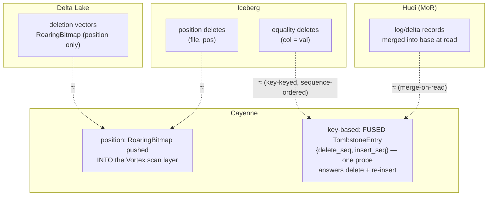
```mermaid
flowchart TB
    subgraph ICE["Iceberg"]
        IP["position deletes<br/>(file, pos)"]
        IE["equality deletes<br/>(col = val)"]
    end
    subgraph DL["Delta Lake"]
        DV["deletion vectors<br/>RoaringBitmap (position only)"]
    end
    subgraph HU["Hudi (MoR)"]
        HL["log/delta records<br/>merged into base at read"]
    end
    subgraph CY["Cayenne"]
        CP["position: RoaringBitmap pushed<br/>INTO the Vortex scan layer"]
        CK["key-based: FUSED TombstoneEntry<br/>{delete_seq, insert_seq} — one probe<br/>answers delete + re-insert"]
    end
    IP -. "≈" .-> CP
    DV -. "≈" .-> CP
    IE -. "≈ (key-keyed, sequence-ordered)" .-> CK
    HL -. "≈ (merge-on-read)" .-> CK
```

- **Cayenne's position deletes ≈ Delta's deletion vectors and Iceberg's position deletes.** All three keep a per-file bitmap of deleted row positions and apply it merge-on-read so the data file is never rewritten. Cayenne pushes the `RoaringBitmap` *into* the Vortex scan layer (`Selection::ExcludeRoaring`) so deleted positions never even decode — closer to Delta's pushed-down DV than Iceberg's separate scan.
- **Cayenne's key-based deletes ≈ Iceberg's equality deletes**, but with two refinements: the key is sequence-ordered (so delete-vs-insert visibility is deterministic), and the entry is **fused** with the re-insertion sequence so a single probe resolves an upsert. Iceberg needs the reader to reconcile equality deletes against data sequence numbers; Cayenne folds the answer into one cell.

## Small writes: where Cayenne looks like Hudi, not Iceberg/Delta

Iceberg and Delta have no in-format mechanism to absorb a tiny write — each commit produces data files, and a high-rate stream produces the dreaded small-files problem, mitigated only after the fact by compaction/`OPTIMIZE`. **Hudi's Merge-on-Read** tables solve this with **log files**: updates land in row/columnar log files that are merged into the base at read time and compacted later. Cayenne's **LSM level-0 tier** plays the same role — but the level-0 lands *inside the metastore* (durable Arrow-IPC blobs) or *in RAM* (the seal-shadowed mem-tier), not as object-store log files. The inline-data table is conceptually the same idea DuckLake exposes as `ducklake_inlined_data_tables`.

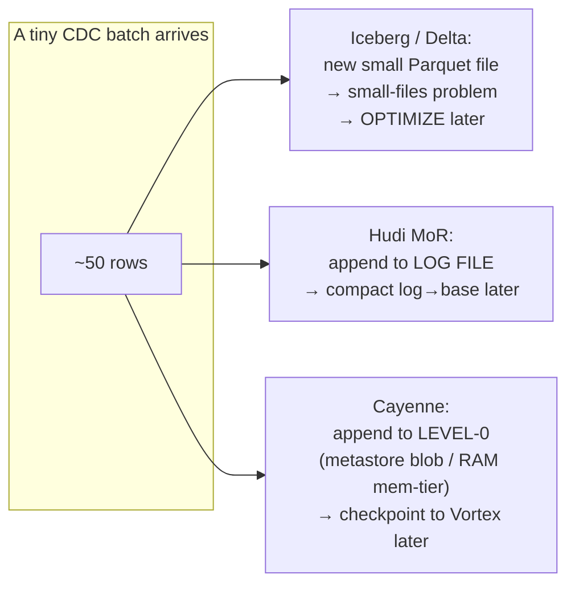
```mermaid
flowchart LR
    subgraph SMALL["A tiny CDC batch arrives"]
        B["~50 rows"]
    end
    B --> I["Iceberg / Delta:<br/>new small Parquet file<br/>→ small-files problem<br/>→ OPTIMIZE later"]
    B --> H["Hudi MoR:<br/>append to LOG FILE<br/>→ compact log→base later"]
    B --> C["Cayenne:<br/>append to LEVEL-0<br/>(metastore blob / RAM mem-tier)<br/>→ checkpoint to Vortex later"]
```

## Upserts: Cayenne's PK index echoes Hudi's record index

Hudi's signature capability is native record-level upsert, routed by a **record-level index** (bloom index / simple index / HBase / RLI) that locates the file holding each incoming key. Cayenne's `auto` PK-conflict detection plays the analogous role with its **byte-budgeted PK keyset cache** (exact `HashMap`, falling back to a `PkBloom` when the keyset would exceed budget) plus the persisted `cayenne_pk_index` checkpoint — so a burst resolves which incoming PKs already exist without re-scanning data files, just as Hudi's index avoids a full-table join. The difference is the resolution: Hudi rewrites or logs the record; Cayenne writes a sequence-stamped tombstone + re-insertion.

## Relationship to DuckLake (its nearest sibling)

DuckLake and Cayenne are the two formats that put *transactional metadata in a SQL database and data in object storage*. They share sequence-numbered snapshots, per-table partition metadata, delete-files decoupled from data, and an inline-data table for small-write absorption. But they are **not interchangeable**, and the divergences are deliberate:

| Area | DuckLake v1.0 | Cayenne |
|------|---------------|---------|
| Data file format | Parquet (mandated) | Vortex |
| Catalog prefix | `ducklake_` | `cayenne_` |
| Data-file metadata | explicit `ducklake_data_file` row per file | no explicit table; DataFusion `ListingTable` enumerates a snapshot dir |
| Snapshot model | dedicated `ducklake_snapshot` + change log | `current_snapshot_id` column + `cayenne_snapshot_sequence` |
| Schema | column-level rows + evolution tables | JSON blob on `cayenne_table` (simplified) |
| Upsert | snapshot-based merge | Iceberg-style insert-record tracking + inline tombstones |
| Views / macros / tags / time-travel | first-class | not implemented |

The one-line decision rule from the README: *if you need interoperability with a DuckLake catalog reader, Cayenne is not the tool; if you need a Vortex-native, CDC-friendly accelerator backed by SQLite or Turso, Cayenne is purpose-built for it.*

## What Cayenne deliberately leaves out

Cayenne is not trying to be a general open table format. Relative to the big three it intentionally omits **time travel and snapshot expiration**, **column-row-granularity schema evolution** (adds/drops/renames/mappings), **views / SQL macros / table tags**, and **full MVCC**. Those are real features in Iceberg/Delta/Hudi; Cayenne trades them for a tighter, faster HTAP/CDC engine on Vortex.


---

# Appendix A — The metastore schema (13 tables)

`EXPECTED_TABLES` materializes thirteen tables in the metastore. `table_id` (UUIDv7 text) is the spine — every dependent table references it via `FOREIGN KEY … ON DELETE CASCADE`. The DDL in `metastore/sqlite.rs` is authoritative; this is a map.

All thirteen tables hang off `cayenne_table` by its `table_id`, with `ON DELETE CASCADE`. The hub-and-spoke shape below shows that spine and the functional grouping; the per-column detail is in the table that follows.

```mermaid
%%{init: {"htmlLabels": false, "flowchart": {"htmlLabels": false, "curve": "basis", "nodeSpacing": 40, "rankSpacing": 40}, "securityLevel": "loose", "theme": "base", "themeVariables": {"fontFamily": "Helvetica, Arial, sans-serif", "fontSize": "14px", "primaryColor": "#ffffff", "primaryBorderColor": "#312e81", "primaryTextColor": "#0f172a", "lineColor": "#1e293b", "clusterBkg": "#f8fafc", "clusterBorder": "#6366f1"}}}%%
flowchart TB
    HUB["cayenne_table<br/>(the spine — FK target)<br/>holds current_snapshot_id"]
    subgraph SNAP["Snapshot &amp; file manifest"]
        direction TB
        SS["cayenne_snapshot_sequence"]
        SF["cayenne_snapshot_file"]
        SFS["cayenne_snapshot_file_statistics"]
        SS ~~~ SF ~~~ SFS
    end
    subgraph DEL["Deletion &amp; upsert"]
        direction TB
        DF["cayenne_delete_file"]
        IR["cayenne_insert_record"]
        PK["cayenne_pk_index"]
        DF ~~~ IR ~~~ PK
    end
    subgraph L0["Level-0 inline (LSM)"]
        direction TB
        ID["cayenne_inlined_data"]
        IDD["cayenne_inlined_delete"]
        ID ~~~ IDD
    end
    subgraph MISC["Statistics, partitioning, cold tier &amp; write-back"]
        direction TB
        TS["cayenne_table_statistics"]
        PT["cayenne_partition"]
        CT["cayenne_cold_tier_file"]
        WB["cayenne_pending_write_back"]
        TS ~~~ PT ~~~ CT ~~~ WB
    end
    HUB -->|"FK table_id"| SNAP
    HUB -->|"FK table_id"| DEL
    HUB -->|"FK table_id"| L0
    HUB -->|"FK table_id"| MISC
```

| Table | Role |
|-------|------|
| `cayenne_table` | the table row; `current_snapshot_id` is the visibility pointer; high-water sequence allocator |
| `cayenne_snapshot_sequence` | per-snapshot sequence → drives Iceberg-style visibility ordering + protected-snapshot thresholds |
| `cayenne_snapshot_file` | authoritative per-snapshot data-file manifest; `min/max_sequence` drive seq-prefix bake; nullable `digest` (`xxh3-128:<hex>`) for opt-in end-to-end file-integrity verification |
| `cayenne_snapshot_file_statistics` | per-file Vortex footer stats so listing-time pruning skips re-reading objects |
| `cayenne_table_statistics` | per-table aggregate stats blob + `num_rows` (+ its `num_rows_exact` taint flag) + HyperLogLog NDV sketches |
| `cayenne_delete_file` | deletion-vector references; type inferred from file schema; carries a `reinsert_sequence` column (metadata-only upsert re-insert stamp; NULL ⇒ legacy fallback to `cayenne_insert_record`) |
| `cayenne_insert_record` | upsert re-insertion tracking (`WITHOUT ROWID`, clustered, raw-UUID-byte `table_id` to cut WAL) |
| `cayenne_pk_index` | persisted PK existence checkpoint so restart skips full-table keyset rebuild |
| `cayenne_partition` | composite partition metadata (Hive-style `partition_key`) |
| `cayenne_inlined_data` | LSM level-0 inline memtable (Arrow-IPC blobs) |
| `cayenne_inlined_delete` | LSM level-0 inline tombstones (`published` activation flag) |
| `cayenne_cold_tier_file` | cold object-store tier file manifest (Z-order-clustered Vortex); inline stats blob for zero-round-trip listing-time pruning |
| `cayenne_pending_write_back` | durable-write-back dirty-key markers: one row per committed-but-undelivered primary key (`WITHOUT ROWID`; raw-UUID-byte `table_id` + `RowConverter`-encoded `pk_bytes`; `sequence_number` of the commit that dirtied it); the delivery worker claims, reconciles to the federated source, and clears |

# Appendix B — Configuration cheat-sheet

The runtime classifies each dataset into one of three **write profiles**, which set the compaction and inlining defaults:

| Profile | `refresh_mode` | Compaction | Inlining |
|---------|----------------|-----------|----------|
| **small-write** | `caching`, `changes`, or `append` with `refresh_check_interval ≤ 5m` | tight cadence (10 s) + low triggers | on |
| **bulk-overwrite** | `full` | **off** — each refresh replaces the whole table, so nothing accumulates to consolidate | on |
| **bulk-append** | `snapshot`, `disabled`, or slower `append` | conservative cadence (30 s) | off |

Turning the background compactor off for bulk-overwrite removes only the periodic task; inline compaction on writes is unaffected, so a table that also takes `INSERT`s still consolidates.

Bulk-overwrite inlines for the same reason its background compactor is off, and the two settings depend on each other: a refresh of a small dimension table that fits the admission caps would otherwise write `write_concurrency` tiny Vortex files per refresh that nothing would ever merge. It uses the same static admission caps as small-write, but keeps the default *flush* caps — a whole-table replace leaves exactly one inline entry, so the cumulative flush gate never binds.

An unset `refresh_mode` is filled in by the *connector* (`DataConnector::resolve_refresh_mode`), not by a fixed default — `debezium` and `cdc` resolve it to `changes`, `sink` to `disabled`, everything else to `full`. Both classifications apply those same connector defaults, from one shared mapping: the runtime builder's pre-init host-memory sizing resolves the raw `from:` value, and the accelerator resolves the initialized component's connector name (`AccelerationSource::connector_name`) when it configures the table. So an unannotated `debezium:` dataset is both budgeted *and* configured as the CDC stream it is, and the two views of a pod cannot disagree. An explicit `refresh_mode` always wins over the connector default.

The profile also drives host-memory sizing outside the accelerator, along two independent axes:

- **Room for the in-memory CDC tier** (a query pool reduced to 70%, plus the tier's aggregate byte budget) is reserved only for a pod containing a small-write table — `cdc_durability` is forced to `file` on the other profiles, so the tier is otherwise unreachable. This does *not* require a file acceleration mode: a `mode: memory` table keeps its whole dataset in that tier permanently, so it is the case that most needs the room.
- **The dedicated compaction memory pool and thread pool** are carved only for a pod containing a table that can actually accumulate files — a file acceleration mode *and* a profile other than bulk-overwrite. `mode: memory` never writes a Vortex file (it zeroes the compaction interval and skips the durable write path), so it earns no carve whatever its refresh mode.

Both axes classify every component kind that creates a Cayenne table: datasets, views, and a catalog with an `acceleration` block. A catalog is configured by a different type (`CatalogAcceleration`), so it is **converted** into the dataset acceleration its tables are configured with (`to_dataset_acceleration`) and classified like any other — a config-shape conversion at startup that discovers nothing and yields one value per catalog. Converting rather than reading the catalog type directly is what keeps `RefreshWriteProfile` the single classifier, so a catalog-accelerated pod is budgeted on exactly the terms the equivalent set of datasets is. `changes` is the only refresh mode a catalog admits, so it always reaches the CDC tier; whether it takes the compaction carve follows its storage `mode` like any other table's. Because the conversion yields one value, the off-pool per-table cache reservation counts a catalog once however many tables it goes on to accelerate — a deliberate floor, since that count is unknowable before the connector connects.

| Parameter | Meaning | Default |
|-----------|---------|---------|
| `cayenne_metastore` | `sqlite` (default) or `turso` | `sqlite` |
| `cayenne_file_path` | data path (local or `s3://…--x-s3/…`) | `{spice_data}/{dataset}/` |
| `cayenne_metadata_dir` | directory holding the metastore (`cayenne.db`). Must not sit inside any acceleration's data directory: that directory is deleted wholesale on a `file_create` bootstrap and on a schema recreate, and one metastore is the catalog for every Cayenne dataset in the instance. A layout this dataset's own parameters place inside its data directory is refused at load; a metastore found on disk under the directory about to be deleted — whoever configured it — refuses the teardown | `{cayenne_file_path}/metadata` when it is local, else `{spice_data}/metadata` |
| `cayenne_pk_conflict_detection` | `auto` (resolve upserts) or `none` (blind append) | `auto` |
| `cayenne_deletion_mode` | `auto` / `key` / `position` (`auto` ⇒ key for `changes` PK tables) | `auto` |
| `cayenne_cdc_durability` | `memory` (default, eligibility-gated) or `file` | `memory` |
| `cayenne_integrity_checksums` | opt-in end-to-end integrity checks — XXH3-64 envelope per staging-WAL record + `xxh3-128` digest per Vortex data file, verified before first scan; off is byte-identical to the pre-feature format (enabled by any value other than `false`) | off |
| `cayenne_target_file_size_mb` | Vortex file target size | `256` |
| `cayenne_compression_strategy` | `btrblocks` or `zstd` | `btrblocks` |
| `cayenne_inline_max_rows` / `_bytes` / `_buffer_bytes` | per-write inline admission gate: rows / serialized-IPC bytes / in-memory buffer (0 disables) | small + bulk-overwrite = 1,024 / 1 MiB / 4 MiB; bulk-append = 0 |
| `cayenne_inline_flush_max_rows` / `_segments` / `_bytes` | cumulative inline-flush gate: rows / entries / serialized-IPC bytes | small = 2,048 / 16 / 2 MiB |
| `cayenne_compaction_trigger_files` | small-tier file-count trigger | small = 4; else 8 |
| `cayenne_compaction_background_interval_ms` | per-table background compactor cadence (`0` = no background task; inline compaction on writes still runs) | small = 10,000; bulk-overwrite = `0`; else 30,000 |
| `cayenne_cdc_mem_tier_max_bytes` / `_max_age_ms` | RAM-tier byte / age caps (`memory` mode) | memory-derived / `10_000` |
| `cayenne_cdc_mem_tier_seal_age_ms` | seal cadence: max age of the un-sealed ingestion piece before a durable shadow + slot advance; `0` disables (slot ack reverts to checkpoint cadence); keep ≤ the age cap | `2_000` |
| `cayenne_datalake_location` | `s3://` URI for the optional datalake (cold) tier; presence enables it (dormant otherwise; requires `refresh_mode: changes`/`append`, forces key-based deletes) | (unset) |
| `cayenne_datalake_s3_auth` / `_s3_key` / `_s3_secret` / `_s3_region` / `_s3_endpoint` / … | dedicated datalake S3 credentials/client options, validated by a write probe at load | (unset) |
| `cayenne_datalake_clustering_columns` | columns to Z-order-cluster datalake files by | (operator-set `cayenne_sort_columns`, else hot observed filters, else inferred `cayenne_sort_columns`, else PK) |
| `cayenne_sort_columns_origin` | provenance of `cayenne_sort_columns`: `user` (authoritative) or `inferred` (a guess, outranked by observed filter columns) | `user` |
| `cayenne_datalake_target_file_size_mb` | datalake Vortex file target size | `512` |
| `cayenne_datalake_warm_max_bytes` / `_max_files` | warm→datalake promotion triggers (size / file count) | 16 × `cayenne_datalake_target_file_size_mb` / (unset) |
| `cayenne_datalake_tiering_check_interval_ms` | datalake tiering-check cadence | `60_000` |
| `cayenne_datalake_gc_interval_ms` | physical-GC cadence AND orphan grace for superseded datalake objects | `300_000` (5 min) |
| `cayenne_goal_replication_lag` / `_freshness` / `_query_latency` | adaptive-controller SLO setpoints (durations; global or per-dataset; unset ⇒ that lever inert; require `cayenne_tuning: adaptive`) | (unset) |
| `cayenne_tuning` | `auto` (static) or `adaptive` (closed-feedback controller, preview) | `auto` |

When `cayenne_tuning: adaptive`, a per-table closed-feedback controller makes at most one bounded actuator move per tick, **always clamped to the static `[floor, ceiling]` the `auto` tier derived** — so a dynamic decision can only pick a value `auto` could also have picked; the worst case is the worst static config, never worse.

`adaptive` is reached only by setting `cayenne_tuning: adaptive` on the dataset. Nothing else selects it: a configured `cayenne_goal_*` SLO declares a target for the controller, not a choice of controller, so on a table left at the `auto` default the goals are parsed, reported as ignored (one warning per table), and the closed loop stays off.

One removal to note (breaking): `cayenne_orphaned_dv_cleanup_min_files` is no longer a recognized parameter — orphaned deletion-vector cleanup is unconditional at a fixed threshold of 20 unreferenced files. A spicepod still setting the key (including `0`, which used to disable the sweep) has it ignored with a runtime warning ("Ignoring parameter … not supported"), so a config that relied on disabling cleanup silently gains it back.

The scan-view cache's freshness for **read-only CDC replicas** is a **process-wide environment variable**, not a per-dataset parameter (it is operational tuning, not data configuration, so it stays out of `configuration_matches`): `CAYENNE_SCAN_VIEW_FRESHNESS_MS` (default `1000`; `0` = read-your-writes) sets the bounded-staleness lag within which concurrent analytical scans on a read-only CDC replica (`access: read` + `refresh_mode: changes`) share one cached `ScanView` instead of rebuilding — the freshness/CPU trade, staleness far inside the freshness SLO. It does **not** affect any other table (read-write datasets, or read-only full-refresh/snapshot/append tables), which always use `0` (read-your-writes). This replaces the retired maintainer's `CAYENNE_SCAN_VIEW_REFRESH_FLOOR_MS` (and its `cayenne_scan_view_builds_total` / `_waits_total` metrics), which no longer exist.

---

# Appendix C — Observability: maintenance and footprint

Cayenne's maintenance passes mostly decide *not* to run. A compaction declines because a lock is held, a budget is exceeded, or a fence caps its inputs; the deletion-vector sweep declines because it cannot prove the current snapshot is empty. Each decline is a correct decision, and each one leaves the table slightly larger than before. So the operational question is never "did maintenance run" but **"which pass is declining, why, and is the footprint growing while it does"** — and answering it needs the declines to be countable, not logged.

Every metric below is emitted on the `cayenne` OpenTelemetry meter and reaches `spiced --metrics <addr>` at `/metrics`. Per-table metrics carry `table`; metastore-wide metrics carry `catalog` (the metastore path), because the metastore is per-dataset and its file is always named `cayenne.db`.

## Which pass ran, and why not

`cayenne_compaction_outcome_total{table, kind, outcome}` counts one row per attempt. `kind` is the same vocabulary as `cayenne_compaction_duration_ms` and `cayenne_compaction_merged_bytes`, so an outcome joins to the duration and bytes of the pass that produced it:

| `kind` | pass |
|---|---|
| `full` | full current-snapshot re-encode (also folds the protected set) |
| `subset_current` | current-snapshot small-file rewrite (hard-links the unpicked files); also carries the declines of the current-snapshot pass as a whole, which fire before the subset/full choice |
| `subset` | size-tiered merge over the protected-snapshot set |
| `bake` | seq-prefix bake (consolidate the clean older prefix, prune the deletion index) |
| `datalake` | cold-tier graduation |

`outcome` has three classes, and the distinction between them is the point:

- **work happened** — `committed`, or `no_op` (the pass ran its selection and found nothing to merge)
- **work was paid and thrown away** — `aborted_concurrent_change` (the merge finished, then a concurrent append, compaction, or overwrite invalidated its inputs at commit)
- **the pass never ran** — a `declined_<reason>`

`declined_*` is a single selector, which is how "what is stopping maintenance" becomes one query:

```promql
sum by (kind, outcome) (rate(cayenne_compaction_outcome_total{outcome=~"declined_.*"}[15m]))
```

| `outcome` | why the pass declined |
|---|---|
| `declined_staging_inflight` | a staged append is mid-finalization, so files are neither cleanly in nor out of the scan |
| `declined_below_trigger` | no file-count, protected-snapshot, or deletion-index trigger has fired |
| `declined_lock_busy` | another pass holds the per-table compaction lock |
| `declined_writer_active` | a writer holds the write lock on a position-delete table, whose rewrite must serialize against writers |
| `declined_not_key_mode` | position-delete table: out of the bake's scope (its prune is a no-op for file-scoped tombstones) |
| `declined_apply_backpressure` | the CDC apply is at or over capacity, so the bake yields the shared write path |
| `declined_no_candidates` | fewer than two inputs qualified |
| `declined_above_delete_fence` | a pending mem-tier delete caps the fence below the candidates' thresholds, so folding them would mask a deletion |
| `declined_over_pass_budget` | the qualifying inputs exceed the per-pass memory budget |
| `declined_no_qualifying_tier` | no size tier has accumulated enough runs |
| `declined_sizing_failed` | an input could not be sized, and an unknown size cannot count as free against a memory ceiling |
| `declined_no_clean_prefix` | a live snapshot is not clean past the prefix cutoff, so the bake's prune would be withheld and its write amplification wasted |
| `declined_not_configured` | the pass is not configured for this table (no cold-tier location) — a permanent state, so a steady count here is the expected shape |

`cayenne_compaction_trigger_total{table, kind, trigger}` names which threshold asked for a pass — `small_file_count`, `protected_snapshot_count`, `protected_snapshot_age`, `deletion_index`, `deletion_index_memory_ceiling`. Read against the outcome counter it separates "the trigger never fired" from "it fired and the pass was declined", which are different problems with different fixes.

The non-compaction passes use the same grammar under `cayenne_maintenance_outcome_total{table, op, outcome}`, with `op` ∈ `orphan_dv_sweep`, `retention`, `retired_dir_sweep`. Its outcomes need a few reading rules of their own:

- `applied` — the pass did its work, but that work returns no space by itself. Retention is the only case: it writes tombstones, and the bytes come back when a later compaction rewrites without the dead rows and the deletion-vector sweep unlinks the vectors. `applied` climbing while `reclaimed` stays flat for the same table is exactly the "deletes recorded, nothing given back" shape.
- `declined_manifest_unprovable` — the current snapshot's manifest is empty while its directory is not, so the deletion-vector sweep cannot prove no live row is shadowed. **Every** pass returns here until that resolves, so deletion vectors accumulate with the sweep apparently running.
- `coalesced` — a sweep was already in flight, so this request folded into it.
- `declined_live_reference` vs `declined_not_due` — for the retired-directory sweep these look alike and have opposite prognoses. `not_due` means nothing had reached its grace window (or every candidate is pinned by an in-flight scan); it resolves itself. `live_reference` means candidates **were** examined and none could be removed, because their files are still referenced in place by a live snapshot or a non-data sidecar keeps the directory alive — which resolves only when the referencing snapshot is itself retired, possibly never. A directory reported `live_reference` indefinitely is space that is not coming back on its own.

`cayenne_maintenance_reclaimed_{files,bytes,rows}_total{table, op}` is what each pass actually gave back. A footprint gauge that climbs while its reclaim counter stays flat is the signature of a reclamation path that is scheduled but doing nothing.

Two properties of that family are load-bearing:

- **The units are files and bytes, never directories** — and the bytes are *physical*. The retired-directory sweep counts the files it unlinked, including those it removes from a directory that *survives* because a live snapshot still references others in place, and sizes each one before the unlink. A file whose inode another pathname still links contributes **zero bytes**: subset compaction hard-links an unpicked file into the new snapshot's directory, so unlinking the retired snapshot's name for it frees nothing, and billing its length would claim back space the table still occupies. This is the one family that is physical rather than logical — `cayenne_storage_bytes` and `cayenne_data_dir_bytes` both count pathnames.
- **The reclaim totals and the outcome are independent.** A pass that cleaned four directories and failed on a fifth reports `failed` — the failure is the actionable half, and the directory that will never go away is what an operator needs — while still publishing everything the pass did give back. Labelling such a pass `reclaimed` because the majority succeeded would hide the one that did not.

## The state the decisions read

The bake's trigger compares two numbers, and both are exported so a `declined_below_trigger` can be read rather than guessed at:

- `cayenne_deletion_index_len{table}` — live tombstones, the trigger input
- `cayenne_autotune_bake_deletion_index_trigger{table}` — the threshold, read through the same accessor the gate reads (so a pinned value reports itself, not the controller's)
- `cayenne_deletion_index_reinserts{table}` — re-insert records; their share of `_len` is how much of the index is superseded history
- `cayenne_deletion_index_bytes{table}` — resident bytes, the quantity the OOM backstop measures against the query memory pool

## Footprint: what is growing, and where

`cayenne_storage_{files,bytes,rows}{table, tier}` splits the table by the layer that produced it — `current`, `protected`, `cold`, `delete_vector`, `inline`. The split is what makes growth attributable: a rising `protected` file count is read amplification, a rising `delete_vector` byte count is a deletion set outgrowing the data it shadows, and a rising `inline` count is level-0 that no checkpoint has drained.

`files` on the `current` and `protected` tiers counts data-file **paths**. A manifest `file_path` is resolved against its own snapshot's directory, so a filename appearing under two live snapshots is two paths and counts twice — even when subset compaction hard-linked them to one inode, which is the usual case for a file a new snapshot inherits. That matches `cayenne_data_dir_bytes`, which walks the filesystem the same way. For bytes actually returned to the disk, read `cayenne_maintenance_reclaimed_bytes_total`, which counts a file only when it removed the file's last link.

### A manifest row count is not a live-state count

`cayenne_snapshot_file` holds one row per **(snapshot, file)** pair, and dead snapshots keep their rows until a compaction or overwrite prunes them. So the raw row count in `cayenne_metastore_table_rows{metastore_table="cayenne_snapshot_file"}` overstates live state by the prune backlog, which on a busy table is most of it.

The split resolves it, and neither half means much alone:

| metric | what it counts |
|---|---|
| `cayenne_snapshot_manifest_rows{table, reachable="true"}` | pairs a live snapshot names — equal to `cayenne_storage_files` summed over the `current` and `protected` tiers |
| `cayenne_snapshot_manifest_rows{table, reachable="false"}` | pairs naming a dead snapshot — metastore weight no query can use |

`reachable="false"` is the prune backlog: rising while compactions commit means the prune is not keeping up with snapshot turnover.

### Metastore size

- `cayenne_metastore_db_bytes{catalog}` and `cayenne_metastore_wal_bytes{catalog}` — the database file and its `-wal`; together, the whole metadata footprint.
- `cayenne_metastore_table_bytes{catalog, metastore_table}` — the per-table attribution of `db_bytes`, from `SQLite`'s `dbstat`, with each index folded into the table it belongs to (an index's pages are that table's footprint). The file total says the metastore is growing; this says which table is growing it. Absent on a backend without `dbstat`, rather than approximated.
- `cayenne_metastore_table_rows{table, metastore_table}` — per-**dataset-table** row counts across `cayenne_snapshot_file`, `_file_statistics`, `_snapshot_sequence`, `cayenne_delete_file`, `cayenne_insert_record`, `cayenne_inlined_data`, `cayenne_inlined_delete`, `cayenne_cold_tier_file`. These are row counts, not state — see the section above before reading a large `cayenne_snapshot_file` value as a large table.
- `cayenne_metastore_freelist_bytes{catalog}` — the share of `db_bytes` that churn has already released. Under the default `auto_vacuum: none` those pages are reused but never returned to the OS, so a large freelist against a flat live row count is what `auto_vacuum: incremental` would give back.

`table_bytes` is keyed by metastore table and `table_rows` by dataset table, so **one dataset's share of a metastore table** is `table_bytes × (that dataset's table_rows ÷ the metastore table's total rows)` — an estimate, not a measurement: pages are shared between the rows of every dataset in the catalog and cannot be attributed exactly. That is why the two factors are published rather than the product.

`table_bytes` covers every `cayenne_*` table in the file; `table_rows` covers the eight that grow with a dataset's activity. For the remainder (`cayenne_table`, `cayenne_partition`, `cayenne_table_statistics`, `cayenne_pk_index`, `cayenne_pending_write_back`) the division has no denominator — they hold at most a row or two per table, so their bytes are a fixed overhead rather than a growth term.

### What is actually on disk

Everything above is what the metastore *tracks*. The data directory also holds retired snapshot directories awaiting their sweep, deletion vectors nothing reclaimed, and staging left by an interrupted write — none of which appear in any manifest figure. The gap between the two is the leak signal, so the footprint sample measures the directory directly:

- `cayenne_data_dir_bytes{table, kind}` and `cayenne_data_dir_files{table, kind}` — measured by walking the table directory, split by file role: `data` (`.vortex` anywhere under the table, *including* snapshot directories no manifest references), `deletion_vector` (under `deletions/`), `staging` (under `_staging/` — an interrupted write's residue when it outlives the write), `other` (write-ahead logs, temporaries). Role is decided by **position**, not extension: a `.vortex` under `_staging/` is staging residue.
- `cayenne_data_dir_snapshot_dirs{table}` — snapshot directories present on disk. Far above the live snapshot count means retired directories the sweep has not reclaimed.

Space no query can use shows up as the directory exceeding the manifest. Aggregate the tiers before comparing — a bare `{tier="current"} + {tier="protected"}` matches on labels that differ, so it yields nothing:

```promql
sum by (table) (cayenne_data_dir_bytes{kind="data"})
  - sum by (table) (cayenne_storage_bytes{tier=~"current|protected"})
```

**Local filesystem only.** On object storage the equivalent is a paginated LIST of the whole table prefix — a per-request charge every sample would repeat — so there the manifest figures stand alone. The walk is skipped rather than approximated, so a missing series is never mistaken for an empty directory.

### What each sample costs

Every figure here rides a background tick, never a write path. Two ticks drive it: the background compactor's, and the post-write maintenance loop's. Both are needed — the bulk-overwrite profile sets `cayenne_compaction_background_interval_ms: 0`, so those tables have no compactor, and driving the sample only from it would leave exactly the tables that rewrite themselves wholesale as the ones whose disk usage cannot be seen. The clocks below bound how often either driver does real work, so the second one costs a clock read.

The samples differ by orders of magnitude in cost, so they run on separate clocks rather than one:

| sample | cadence | cost |
|---|---|---|
| deletion index, PK index format/size, memory account, inline cache, fleet budgets, write shape | every tick | atomic loads plus one `try_lock`, and one `get_array_memory_size` per inline batch; nothing to throttle |
| `cayenne_storage_*`, `cayenne_snapshot_manifest_*`, `cayenne_metastore_table_rows`, freelist | ≥ 30 s per table | two aggregate queries over the table's own metastore rows; the `COUNT(DISTINCT file_path)` over a large manifest is the bulk of it |
| `cayenne_data_dir_*` | ≥ 5 min per table | one `stat` per file — cost scales with exactly the file count it measures |
| `cayenne_metastore_table_bytes` | ≥ 10 min per **catalog** | `dbstat` walks every B-tree page in the database, so its cost scales with the whole metastore file rather than with one table |

Two details make those cadences hold in practice:

- The metastore-wide gauges (freelist, `dbstat`) describe the *file*, which every Cayenne table in the dataset shares. Their clocks are keyed by metastore path, so N tables produce one sample's worth of work rather than N.
- The directory walk runs as a single `spawn_blocking` over `std::fs`, not a sequence of `tokio::fs` awaits. `tokio::fs` dispatches each call to the blocking pool individually, so a per-file `metadata()` would cost one task hop per file — tens of thousands per sample on exactly the runaway table this metric exists to reveal.

A walk that runs long is logged with its duration and file count rather than capped: a silent cap would report a bounded directory for an unbounded one, which is the opposite of what the metric is for.

The per-event counters (`cayenne_pk_index_discard_total` / `_preserved_total`, `cayenne_pk_bloom_split_rows_total`) fire **per batch**, never per row, and the bloom split is accumulated across an apply and emitted once. The encode fan-out is stored in an atomic at the decision and published on the tick, so nothing on the write path allocates for a metric.

## Closing the resident-memory gap

Budgets and pool gauges describe intent; resident memory describes fact. Until the gap can be decomposed, a pod using far more RAM than its pool gauge admits is an unfalsifiable mystery. These gauges are what the gap is closed against.

**Take the gap against `process_resident_anon_bytes`, not against the total.** `process_resident_memory_bytes` includes file-backed pages — mapped metastore and Vortex files — which the kernel reclaims on demand and which no heap profiler can see. On a Cayenne file-mode workload that half has been measured at roughly half of total RSS, so the total overstates the instrumentation gap by more than a factor of two. `process_resident_file_bytes` is that half; it is real RSS and it is not a leak.

Neither figure is the pod-sizing number: the kernel OOM-kills on cgroup accounting, which also charges kernel memory (slab, page tables, socket buffers) that no per-process metric sees. Use `container_memory_working_set_bytes` for capacity; this family is for attributing memory to what allocated it.

**What Cayenne accounts for, and whether it lands.** Two gauges, and their relationship is the whole diagnosis:

- `cayenne_memory_account_bytes{table, kind}` — what Cayenne **computed** and registered against the `DataFusion` query pool, split into `keyset`, `deletion_index`, and `cold_existence`.
- `cayenne_memory_account_reserved_bytes{table}` — what the table's reservation **actually holds** on that pool.

A resident figure far above `query_memory_pool_used_bytes` has two possible causes, and no single gauge separates them:

| observation | reading |
|---|---|
| components ≈ reserved, both small | the accounting lands and the keysets really are small — check `cayenne_pk_index_format`, since a bloom is a few MB where an exact keyset would be gigabytes |
| components ≈ reserved, both large | the accounting lands and the pool gauge should show it; a low `query_memory_pool_used_bytes` then points at the pool gauge, not at Cayenne |
| components ≫ reserved | the accounting is not reaching the pool |
| both small, resident large | the memory is in structures neither bounds — see the off-pool list below |

**Off-pool structures.** Nothing registers these against the query pool, so they are invisible in every pool gauge:

- `cayenne_inline_cache_bytes{table}` and `cayenne_inline_cache_batches{table}` — the decoded inline (level-0) view cache. These are *decoded* Arrow bytes, so they legitimately exceed the serialized `cayenne_storage_bytes{tier="inline"}` the same rows occupy in the metastore.
- `cayenne_deletion_index_bytes{table}` — the deletion index's own view of its residency, published beside `cayenne_memory_account_bytes{kind="deletion_index"}`, which is the pool-facing figure. A divergence between the two is itself the finding.

**Fleet ceilings.** A table whose index refuses to grow because the *process-global* budget is exhausted looks, in every per-table gauge, exactly like a table that is simply small:

- `cayenne_pk_keyset_budget_used_bytes` / `_total_bytes` and the pre-existing `cayenne_mem_tier_budget_used_bytes` / `_total_bytes` — the two process-global ceilings. `used` at the total is the reason a keyset degraded to a bloom rather than growing.

Together with `cayenne_pk_index_budget_bytes{table, site}` — the per-table budget the `auto` tier derived, which is what multiplies across tables into a large fleet total — that accounts for the whole PK-keyset hypothesis: how large each table's index is, what it is allowed to reach, whether the fleet is at its ceiling, and which format each table settled on.

All of these are lock-free atomic loads (the inline-cache figure is one `get_array_memory_size` per batch, not per row), so they ride every tick with no throttle.

## The primary-key index

The PK existence index is what an upsert-heavy apply leans on hardest, and its failures are silent: a discarded index is rebuilt from the table, which is correct but costs a full keyset scan.

**Reported per cache, not per table.** A sharded (N>1) table keeps **two** indexes at once — the table-wide keyset and the per-shard index — each bounded by *half* the configured budget, and they transition independently. One can be an exact keyset still growing while the other has already degraded to a bloom, so every metric here carries `site` ∈ `table_keyset`, `sharded_keyset`. A per-table aggregate cannot express that mixed state, and the cache nearing its transition is the one worth knowing about.

Two aggregation rules follow, and getting either wrong is easy:

- **bytes sum across `site`.** Both layouts are resident simultaneously. `cayenne_memory_account_bytes{kind="keyset"}` is already that sum, as the memory account registers it against the query pool — use it rather than re-deriving one.
- **keys must not.** The two caches are meant to cover the *same* key set in different layouts, so adding them double-counts every key. A divergence between their key counts is itself a staleness signal, which is the second reason not to aggregate them away.

 The index has three shapes, and which one is live decides how its memory behaves:

| `cayenne_pk_index_format` | shape | how its bytes behave |
|---|---|---|
| `0` | absent | no index cached — every conflict-validated batch rebuilds one with an O(live rows) scan *inside* the apply |
| `1` | exact keyset | every live PK with its row location (and, table-wide, its per-key sequence stamp); bytes grow with the live key count until the budget is reached. Required by `on_conflict: do_nothing` |
| `2` | bounded bloom | fixed bytes, no false negatives, some false positives (which cost a validation, never correctness). What an upsert table degrades to when the exact keyset exceeds its budget |

Reported as a numeric gauge rather than a label for the reason `cayenne_data_storage_class` is: the value is what changes over time, and a label would spread one index across three series with two of them stale.

- `cayenne_pk_index_bytes{table, site}` — approximate resident bytes of that cache, whichever representation it holds
- `cayenne_pk_index_keys{table, site}` — DISTINCT keys that cache covers, published **only in exact mode**. A bloom cannot enumerate its members, so it reports `cayenne_pk_bloom_insertions` instead (see below); publishing a bloom's tally under a name that says "keys" made a hot-key workload look like unbounded cardinality growth
- `cayenne_pk_index_budget_bytes{table, site}` — the *effective* budget for that cache: half the per-table figure on a sharded table, already clamped by whatever the fleet has left (the process-global ceiling itself is `cayenne_pk_keyset_budget_total_bytes`)

The three are only interpretable together. Bytes alone cannot distinguish an **exact keyset growing toward its budget** (which will degrade to a bloom and give most of them back) from a **bloom already at its fixed size** (which will not shrink); the budget alone says nothing about how close the table is to that transition. `bytes / budget_bytes` at `format = 1` is the countdown to a format change.

`bytes` and `budget_bytes` come from the memory-accounting atomics, so they are **always** published — including on a tick where the busy table an operator is looking at cannot spare its cache lock. `format` and `keys` need that lock, taken with `try_lock` because the keyset caches sit on the CDC apply's write path and observability must never queue a writer behind it. A cache whose lock is busy publishes its size and skips its shape for that tick: reporting `absent` for a cache that was merely busy would read as a table rebuilding its index every batch.

- `cayenne_pk_index_discard_total{table, site, kind, reason}` — indexes thrown away rather than cached back. `site` (`table_keyset` / `sharded_keyset`) is the load-bearing label: a discard rate concentrated at one site points at that site's guard rather than at the workload. `reason` is `overflowed` (the pending-key log's byte cap was too small for the commit rate during a validation), `invalidated` (something superseded the table state), or `over_budget` / `replay_over_budget`.
- `cayenne_pk_index_preserved_total{table, site, kind}` — the positive control. Without it a low discard count could equally mean a healthy preserve path or that nothing ever checked an index out.
- `cayenne_pk_bloom_bits{table, site}`, `cayenne_pk_bloom_insertions{table, site}`, and `cayenne_pk_bloom_bits_per_insertion{table, site}` — that cache's filter density. A filter resident at many times the bits-per-key the sizing code asks for is invisible in the bytes alone (they look like a large cache) and in the key count alone (it looks correct); only the ratio shows it.

  **The denominator is insertions, not distinct keys.** `PkBloom::insert` tallies calls, because a bloom cannot enumerate its members: re-upserting one key increments it every time, and keys long since superseded still count. So `insertions` is an *upper bound* on the distinct live keys, and `bits_per_insertion` is a *lower bound* on the true bits per distinct key. The bound runs in the useful direction — a value already above the configured target proves over-allocation, since the real density is higher still — but it cannot prove the absence of over-allocation, which is why both are named for what they actually measure.

  Both are emitted on **every** tick and **zeroed when that cache holds no bloom**, not skipped. A skipped gauge keeps its last value, so a cache that rebuilt an exact index would go on reporting the density of a filter that no longer exists — and a stale over-allocation reads exactly like a live one. A live bloom always allocates bits, so zero here unambiguously means "no bloom", which `cayenne_pk_index_format` states independently.
- `cayenne_pk_bloom_split_rows_total{table, result}` — apply rows the filter split: `miss` rows skip on-conflict validation entirely, `hit` rows are validated. This is the filter's return on its resident bytes, stated directly.

`cayenne_write_shape_shards{table, decision}` reports the encode fan-out a write resolved to together with the branch that chose it — `serial_sort_columns`, `serial_required`, `size_bounded`, `concurrency_bounded`. The shard count alone cannot be acted on: a fan-out of 1 from a configured write concurrency is a knob to raise, while one from a sort order is structural and no knob reaches it.

## A note on resolution

The counters here are cumulative OpenTelemetry counters: they accumulate every recorded event and are exported on the reader's interval, so a `rate()` between two scrapes is exact — no event is lost between them. What the reader interval bounds is *resolution*, not accuracy: a burst finer than one scrape interval is visible only as its total. The gauges are last-value and sampled on the maintenance tick, so they carry the opposite trade — dense in time, but they say nothing about what happened between two samples.

---

# Putting it all together

Cayenne is best understood as **three tiers with one visibility rule and a sequence-ordered deletion model**, all arranged so the write and read paths never fight:

- a **transactional metastore** for atomic metadata,
- **immutable Vortex files** under per-snapshot directories,
- an **LSM level-0 tier** (durable inline + seal-shadowed RAM mem-tier) that absorbs the small writes a CDC stream produces,
- **sequence numbers** that make merge-on-read deletions and upserts deterministic,
- a **single atomic pointer flip** for visibility, with the heavy work pushed off the listing fence and the read hot-path published wait-free through `ArcSwap`.

It takes Iceberg's sequence-ordered visibility and equality-delete idea, Delta's pushed-down deletion vectors, and Hudi's merge-on-read small-write absorption — then fuses the delete/re-insert probe into one cell, lands level-0 in the metastore and RAM rather than object-store log files, and stores its catalog in a SQL database à la DuckLake. The result is, today, an **accelerator** rather than a general-purpose open format: a derived, refreshable copy that does something the big three don't try to — sustain continuous high-rate CDC ingestion and low-latency analytical queries on the *same* table at the same time, which is exactly the job Spice built it for.

---

*— End —*
