# Cayenne

### Spice.ai's acceleration engine for high-rate CDC — a lakehouse table format built on Vortex

*A technical walkthrough — organized breadth-first, from the 10,000-foot view down to the hot-path internals, with comparisons to Iceberg, Delta Lake, and Apache Hudi.*

---

> **Scope and sourcing.** This document describes the `cayenne` crate in the Spice.ai OSS repository (`crates/cayenne`), **as of commit `5c1316c75c5deaf7d4ced27ebeb70493ce67b604` (`5c1316c7`, committed 2026-07-14)** — carrying forward the `4685a3dd` baseline and folding in the maintained-aggregate, memory-mode, CDC, compaction, and statistics changes since. It is built from the crate's `README.md` and `docs/storage.md`, cross-checked against the source — primarily `provider/table.rs`, `provider/mutation_writer.rs`, `provider/deletion_index.rs`, `provider/on_conflict.rs`, `provider/mem_tier.rs`, `provider/compaction.rs`, `provider/compaction_writer.rs`, `provider/zorder.rs`, `provider/query_admission.rs`, `provider/tuning.rs`, `provider/wal_checksum.rs`, `provider/file_digest.rs`, the vendored `row_converter/` module, and `metastore.rs` / `metastore/sqlite.rs` / `metastore/turso.rs`. Where a detail matters, the relevant type or function is named so you can find it in the tree. The DDL in `metastore/sqlite.rs` and the column lists in `metastore::EXPECTED_TABLES` are the authoritative source of truth for anything schema-related. Cayenne moves quickly; the *Document changelog* at the end tracks revisions against later commits.

---

# Glossary

A quick reference for the recurring terms below. Each is defined in more depth where it first appears in the text; this is the thirty-second version.

**Role and substrate**

- **Accelerator** — Cayenne's deployed role: a derived, refreshable replica of a source, not the system of record.
- **Vortex** — the columnar on-disk file format Cayenne stores data in.
- **Metastore** — the transactional catalog (SQLite, or libSQL/Turso) holding snapshots, file manifests, sequence numbers, delete-file references, and statistics.
- **CDC** — change data capture; the ordered stream of row changes Cayenne ingests from a source.
- **Source slot / LSN** — the source's change-log offset (e.g. a Postgres LSN), acked only once the corresponding burst is durable.

**Versioning and visibility**

- **Snapshot** — an immutable, point-in-time set of data files plus metadata. Kinds: *current*, *staging*, *protected*.
- **Snapshot pointer (`current_snapshot_id`)** — the atomic pointer whose flip publishes a new version to readers.
- **Sequence number** — the monotonic, Iceberg-style ordering stamped on every row and delete (`delete_seq`, `insert_seq`, and the protected-threshold `snapshot_sequence`).
- **Snapshot isolation / MVCC** — readers see one consistent snapshot for the life of a scan; writers publish new snapshots without blocking readers.
- **Merge-on-read** — deletions applied at scan time via the deletion index, rather than by rewriting data files.

**The write path**

- **Stage A / Stage B** — the two-phase write: Stage A is the durable half (encode + staged files + WAL); Stage B is the visibility half (move into the current snapshot + pointer flip).
- **Staging WAL (`_wal.json`)** — the crash-safety marker that makes a burst's staged file set recoverable.
- **Checkpoint** — the process that flushes the in-memory mem-tier to a durable, published Vortex file (and advances the source slot, if a seal hasn't already).
- **Seal** — a cheap periodic pass (default every 2 s) that durably *shadows* the mem-tier's active segments into the unpublished inline corpus and advances the source slot — durability without a Vortex encode or a publish.
- **Level-0 / tier-0** — the small-write landing tier: inline blobs (in the metastore) or the mem-tier, before flush to a Vortex file.
- **Mem-tier** — the RAM tier used in `cdc_durability: memory` (and as the permanent store under acceleration `mode: memory`); for file-mode CDC it is discarded on crash and recovered from its seal shadow plus a replay of the un-sealed tail. Under `mode: memory` there is no seal/checkpoint recovery — the tier is the whole table and dies with the process.
- **`mode: memory`** — acceleration storage mode: fully in-RAM Cayenne (no Vortex, no durable metastore path); see *Storage modes*.
- **Upsert / on-conflict** — an update modeled Iceberg-style as a re-insertion that tombstones the prior copy of the key.
- **PK keyset** — the cached set of existing primary keys, used for `auto` conflict detection without rescanning data.

**Deletions**

- **Tombstone** — a per-key fused `{delete_seq, insert_seq}` marker; the row is visible iff `insert_seq > delete_seq`.
- **Deletion vector** — the durable Arrow-IPC file recording deleted row positions or keys.
- **Deletion index (`LayeredRuns`)** — the in-memory, LSM-shaped cache of unbaked tombstones that each scan probes.
- **Seq-prefix bake** — the compaction that folds deletions at or below a cutoff sequence into rewritten data and prunes them from the index, bounding its size.
- **Protected snapshot** — a snapshot tagged with a threshold sequence so a writer needn't re-resolve the whole prior deletion set.
- **Position-based vs key-based deletion** — deletion by row position (a RoaringBitmap over a data file) versus by primary key.

**Concurrency and statistics**

- **Listing fence** — the RwLock read/write barrier that serializes the publish move + pointer flip against a scan's plan-build.
- **`ArcSwap` / `rcu`** — the lock-free publish primitives: `ArcSwap` gives wait-free reads of an `Arc`, and `rcu` is its compare-and-swap retry loop for safe read-modify-write.
- **HyperLogLog / NDV** — the mergeable, add-only sketch that estimates a column's number of distinct values for the query optimizer.

---

# Part 1 — The 10,000-foot view

## What Cayenne is, in one breath

Cayenne is the **acceleration engine** behind Spice.ai datasets configured with `engine: cayenne`: it holds a local, query-optimized, continuously-refreshed copy of data whose source of truth lives upstream. It is **built on** the [Vortex](https://github.com/spiral-db/vortex) columnar file format, pairing it with a **transactional SQL metastore** (SQLite by default, Turso optionally) for all metadata, **immutable Vortex data files** on local disk or S3 Express One Zone for the columnar data, and an **LSM-style level-0 tier** that absorbs small writes without producing a data file per batch. A single `CayenneTableProvider` ties these together behind DataFusion's `TableProvider` trait, so the *same* table simultaneously serves high-rate change-data-capture (CDC) ingestion and low-latency analytical scans — the dual workload it was built to carry, with the architecture shaped end-to-end around keeping the write path and the read path off each other's backs.

## Table format, or accelerator?

Cayenne has the full apparatus of a lakehouse table format — a transactional metastore, immutable columnar files made visible by an atomic snapshot-pointer flip (genuine snapshot isolation, not last-write-wins), Iceberg-style sequence numbers governing delete and insert visibility, deletion vectors, tiered compaction, and `MERGE` / `CREATE TABLE` handlers against a catalog. That apparatus is why it *looks* like Iceberg or Delta, and it is what lets the rest of this document compare it to them.

But "table format" describes the machinery, not the job. Cayenne's **role** is the accelerator: you select it with `engine: cayenne` in the same slot you would otherwise write `engine: duckdb` or `engine: postgres`, and the data it holds is a derived replica — disposable and rebuildable from the upstream source (a schema mismatch tells you, in those words, to *clear your acceleration data*). The two descriptions don't compete. Cayenne *is* a table format **because** an accelerator that applies an upserting CDC stream needs ACID snapshots, ordered deletes, and merge-on-read — a plain cache cannot apply changes correctly — and it was built **as** an accelerator because that is the workload its level-0 inline tier, in-memory CDC durability tier, and source-commit-timestamp plumbing are tuned for. Those are accelerator-first choices — the kind of CDC bookkeeping the open formats today leave to the ingestion engine rather than baking into the table format itself — but they reflect an emphasis, not a ceiling. Nothing in the machinery confines Cayenne to the accelerator role: it already carries `MERGE` / DDL handlers (today behind a feature flag) and portable, node-independent snapshots, so it *could* grow into a more general-purpose table format if Spice chose to take it there. As built and as used today, though, it is best read as one thing: **a lakehouse table format, built on Vortex, deployed as Spice's high-rate-CDC accelerator.**

## The one idea everything hangs from

Most of Cayenne's design follows from a single discipline: **the expensive parts of a write never block a read, and a write becomes visible through one atomic pointer flip.**

- All metadata changes are transactional in the metastore (`BEGIN … COMMIT`).
- Data files are immutable — a write never mutates a file in place.
- The authoritative state of a table is a single column, `cayenne_table.current_snapshot_id`. A write or a compaction becomes visible by **atomically flipping that pointer**, never by editing existing data.
- The heavy lifting (encoding Vortex files, metastore I/O, checkpoints) happens *outside* the read/write barrier. Only the instantaneous pointer flip happens inside it.
- State the read hot-path touches is published **wait-free** through `ArcSwap` cells, so readers never block on a writer's `Arc`-load.

Everything below — the tiers, the locks, the deletion index, the CDC pipeline — is machinery in service of that one idea.

## Storage modes: `mode: file` vs `mode: memory`

Acceleration `mode:` selects how Cayenne persists data. This is distinct from
`cdc_durability: memory` (a durability deferral on an otherwise file-backed table).

Spicepod `acceleration.mode` defaults to **`memory`** (the same default as Arrow).
Omitting `mode` on a Cayenne dataset therefore selects fully in-RAM Cayenne. Set
`mode: file` explicitly when you need durable on-disk (or S3 Express) storage.

- **`mode: file`** (durable; must be set explicitly): local SQLite/Turso metastore,
  Vortex data files (local FS or S3 Express One Zone), level-0 inline + optional RAM
  mem-tier for CDC, background compaction/seal/checkpoint. Survives restarts; CDC
  source slots are deferred until a durable seal or checkpoint covers the burst.
- **`mode: memory`** (fully in-RAM, ephemeral; spicepod default when `mode` is
  omitted): all table data lives in the RAM mem-tier; the catalog is an in-memory
  SQLite `memdb` (never written to disk). Checkpointing, sealing, compaction, and
  the datalake (cold) tier are disabled. On restart the table is empty and reloads
  from its source (like Arrow memory acceleration). Because there is no durable
  covering checkpoint, a CDC (`refresh_mode: changes`) source's replication slot is
  committed **immediately** after each in-RAM write — not deferred behind a later
  seal/checkpoint. Works for `full` / `append` / `changes` and for keyed or no-PK
  tables; a full refresh atomically replaces the in-RAM tier. **Partitioning is
  rejected** at accelerator config time (`partition_by` + `mode: memory` returns a
  configuration error). A per-table hard RAM bound (`cayenne_cdc_mem_tier_max_bytes`;
  default unbounded) is enforced as a structured error during buffering; peak checks
  count **resident + incoming** even for overwrite, because the old tier stays live
  until the atomic replace. S3 Express / `cayenne_file_path` params are ignored in
  this mode (no object store is built).

Source: acceleration `mode` → `!is_file_accelerated()` in
`crates/runtime/src/dataaccelerator/cayenne/mod.rs` (`apply_memory_mode_overrides`,
partition reject), `VortexConfig.memory_mode`,
`CayenneTableProvider::is_memory_resident_mode`, and the mem-tier write path in
`provider/sink.rs` / `provider/mutation_writer.rs`.

## The three cooperating tiers

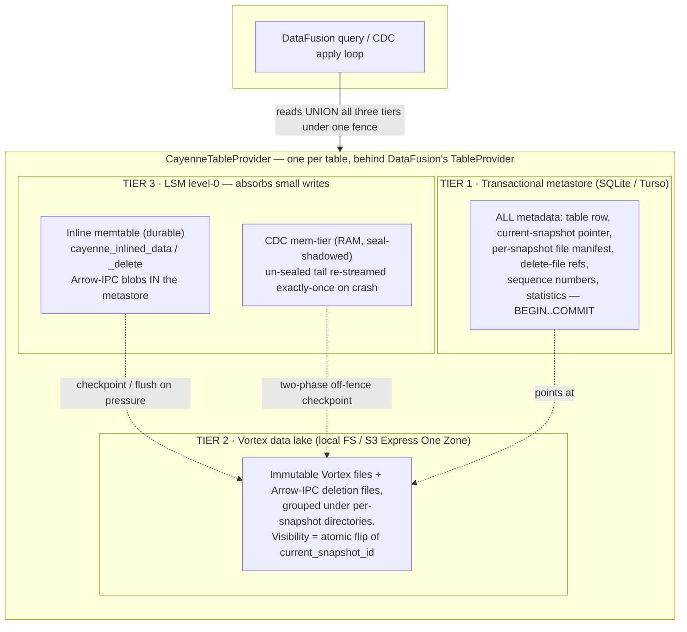
```mermaid
flowchart TB
    subgraph CLIENT[" "]
        direction TB
        DF["DataFusion query / CDC apply loop"]
    end

    subgraph PROVIDER["CayenneTableProvider — one per table, behind DataFusion's TableProvider"]
        direction TB

        subgraph T1["TIER 1 · Transactional metastore (SQLite / Turso)"]
            M["ALL metadata: table row, current-snapshot pointer,<br/>per-snapshot file manifest, delete-file refs,<br/>sequence numbers, statistics — BEGIN..COMMIT"]
        end

        subgraph T3["TIER 3 · LSM level-0 — absorbs small writes"]
            L0A["Inline memtable (durable)<br/>cayenne_inlined_data / _delete<br/>Arrow-IPC blobs IN the metastore"]
            L0B["CDC mem-tier (RAM, seal-shadowed)<br/>un-sealed tail re-streamed exactly-once on crash"]
        end

        subgraph T2["TIER 2 · Vortex data lake (local FS / S3 Express One Zone)"]
            V["Immutable Vortex files + Arrow-IPC deletion files,<br/>grouped under per-snapshot directories.<br/>Visibility = atomic flip of current_snapshot_id"]
        end
    end

    DF -->|"reads UNION all three tiers under one fence"| PROVIDER
    L0A -.->|"checkpoint / flush on pressure"| V
    L0B -.->|"two-phase off-fence checkpoint"| V
    M -.->|"points at"| V
```

| Tier | Holds | Durability | Backed by |
|------|-------|-----------|-----------|
| **Metastore** (SQLite / Turso) | *all* metadata — table row, snapshot pointer, file manifests, delete-file refs, statistics, sequence numbers, and the inline memtable itself | transactional (`BEGIN … COMMIT`) | a SQL database file (or libSQL) |
| **Vortex data lake** (local FS / S3 Express One Zone) | immutable Vortex data files + Arrow-IPC deletion files, grouped under per-snapshot directories | atomic file rename + snapshot-pointer flip | the object store / filesystem |
| **LSM level-0** | small writes absorbed as Arrow-IPC blobs in the metastore (`cayenne_inlined_*`) and, under the CDC profile, an in-RAM mem-tier | metastore tier is durable; RAM tier is discarded on crash — its sealed prefix recovers from a durable shadow, the un-sealed tail re-streams exactly-once | metastore (inline) + process RAM (mem-tier) |

The level-0 tier is the part that makes high-rate CDC affordable. A naïve format turns every small change batch into its own little data file, and a stream of thousands of tiny files wrecks read performance (the classic "small-files problem"). Cayenne instead lands small bursts in the level-0 tier — either as Arrow-IPC blobs inside the metastore (durable) or in a RAM mem-tier (seal-shadowed every ~2 s; the un-sealed tail re-streamed on crash) — and only *checkpoints* them into a consolidated Vortex file once enough has accumulated.

## Where Cayenne sits

Cayenne is the acceleration engine behind a Spice dataset configured with `engine: cayenne`. A `refresh_mode: changes` dataset selects it exactly as it would select DuckDB, SQLite, or Postgres — but Cayenne's owned Vortex storage and in-memory CDC tier make it the engine of choice for high-rate, large CDC streams. The runtime's CDC apply loop coalesces source change envelopes into bursts and hands them to Cayenne. Those envelopes are **connector-agnostic**: PostgreSQL WAL logical replication, DynamoDB Streams, MongoDB Change Streams, and Debezium (CDC over Kafka, for MySQL/SQL Server/Oracle) all decode into the same `{op, primary_keys, data}` change batch, so Cayenne ingests all of them through one path.

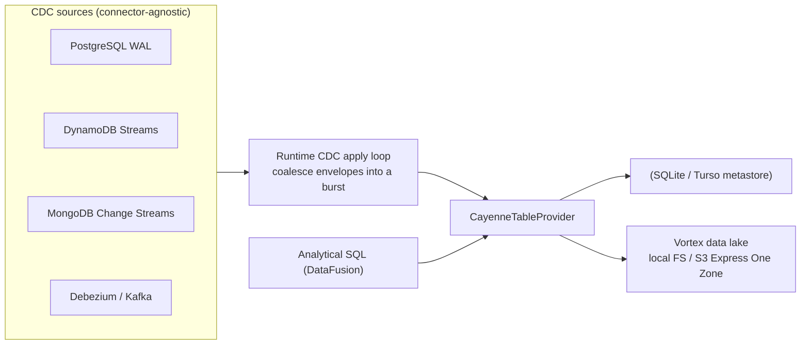
```mermaid
flowchart LR
    subgraph SRC["CDC sources (connector-agnostic)"]
        direction TB
        PG["PostgreSQL WAL"]
        DDB["DynamoDB Streams"]
        MDB["MongoDB Change Streams"]
        DBZ["Debezium / Kafka"]
        PG ~~~ DDB ~~~ MDB ~~~ DBZ
    end
    SRC --> APPLY["Runtime CDC apply loop<br/>coalesce envelopes into a burst"]
    APPLY --> PROV["CayenneTableProvider"]
    QRY["Analytical SQL (DataFusion)"] --> PROV
    PROV --> META["(SQLite / Turso metastore)"]
    PROV --> LAKE["Vortex data lake<br/>local FS / S3 Express One Zone"]
```

A reader can keep the whole rest of this document in perspective with four claims:

1. **Metadata is a SQL transaction; data is an immutable file; visibility is a pointer flip.**
2. **Small writes are absorbed in level-0; big writes become Vortex files; both are unioned at read time.**
3. **Deletes never rewrite data** — they are recorded as separate deletion vectors and applied *merge-on-read*.
4. **Sequence numbers order everything**, so a scan can always answer "was this row deleted, and if so, re-inserted after the delete?" deterministically.

## The life of a change: one stream, many generations

Everything above is easier to hold in the head as one picture. A source emits a single long, ordered stream of changes; Cayenne continuously *partitions* that stream into generations that age from volatile to consolidated, and each boundary between generations is crossed by a specific write-path or background process. Read the landscape figure below as a staircase: from the **top-right** — the system of record, holding the newest changes — down and to the **left** into ever-more-consolidated storage. Time / recency runs left→right, and the bracket down the left groups the generations by where they physically live — in-memory (RAM), warm (local-disk Vortex), and cold (object store). The sequence ranges are illustrative: they exist only to show that at any instant the one stream is cut into contiguous spans, one per generation.

<div class="landscape-fig">

<figcaption>The life of a change — one ordered stream, partitioned across generations. Time / recency runs left→right; the bracket down the left groups the generations by where they physically live (in-memory, warm local disk, cold object store). Solid arrows name the process that settles a change into the next generation; the dashed arrow is the large-burst path that bypasses the level-0 tier.</figcaption>
</div>

Three boundaries in that picture are worth naming, because the rest of the document keeps returning to them. **Durability**: a change becomes crash-safe once Stage A's `_wal.json` is fsynced (in `file` mode) or — in `memory` mode — at the earlier of a periodic **seal** (default every 2 s, which durably shadows the mem-tier's newest segments without publishing them) and the next full checkpoint; whichever comes first is also when the **source offset is acked**, so a crash before that point simply re-streams the burst. **Visibility**: a change becomes queryable only after Stage B flips the snapshot pointer; in between it is safe on disk but unseen. **Consolidation**: the last arrow is *background maintenance*, not a stage on the write path — a copy-on-write pass that runs off the listing fence and commits by the same atomic pointer flip. It takes two related forms sharing the subset-compaction machinery: tiered **compaction**, triggered by small-file accumulation, rebuilds the current snapshot into fewer target-sized files; and the **seq-prefix bake**, triggered once the deletion index grows past a threshold, consolidates the settled prefix of protected snapshots — physically applying their deletions and pruning every tombstone at or below the cutoff, while leaving the newest few protected snapshots untouched. Its output, the compacted base, becomes the floor of the *next* current snapshot, so the published generation is always "the compacted base, plus whatever has landed since." Because the pass is copy-on-write and optimistic, one that races a concurrent append simply aborts and retries later rather than blocking the writer. Each transition is detailed later: Stage A/B and the write path in Parts 2 and 4, the tiers and checkpoint in Part 2, and compaction and the seq-prefix bake in Parts 3 and 4.

One note on versioning: the **cold object-store tier** at the bottom (user-facing name: the **datalake tier**) is newer than the commit this document otherwise tracks — added in PR #11543 (`e972f80`), finalized and renamed in #11731, and made incremental in #11745. It is optional (enabled by `cayenne_datalake_location`, an `s3://` URI; dormant and byte-identical otherwise) and shown here because it completes the tiering picture. When enabled, the tiers form a strict cascade — RAM mem-tier, then warm local-disk Vortex, then cold object store, with a row living in exactly one tier. A background `BackgroundColdTierPromoter` promotes warm to cold once size/file thresholds cross (default trigger: warm bytes exceeding 16× `cayenne_datalake_target_file_size_mb`). Promotion is **incremental carry-forward** (#11745): the existing cold manifest is classified into *dirty* files that may host a tombstoned key — per-PK-column min/max rectangles from the manifest stats blobs, refined by per-file PK bloom filters, conservative in every failure direction — and *clean* files carried forward by manifest reference, never re-read. Only the warm delta plus the dirty files are re-read (all deletes applied, one version per key), **Z-order-clustered** for tight multi-column zone maps, and written as read-optimized Vortex at the larger cold file size under a per-promotion prefix (`…/<table_name>-<table_id>/data/<promotion_id>/` — the sanitized table name makes a shared datalake location navigable, the UUIDv7 `table_id` suffix keeps the prefix collision-free; `TableMetadata::datalake_dir_segment`), then atomically registered (`cayenne_cold_tier_file`, whose per-file `pk_bloom_blob` also lets upsert keyset rebuilds serve cold PK existence with no object-store scan) while overwrite-clearing the warm tier — so promotion cost tracks the *changed* data, not total table size (watch `datalake_rewrite_selectivity` in the commit trace). Objects orphaned by rewrites are reclaimed by a periodic mark-and-sweep GC rooted at the manifest (`cayenne_datalake_gc_interval_ms`, default 5 min, doubling as the orphan grace period). Enabling the tier requires `refresh_mode: changes` or `append` and forces key-based deletes; partitioned and position-delete tables are unsupported.

### Where it all lives on disk

The left-hand bracket above groups the generations by *where they physically live*. Here is that same split as an actual on-disk tree for the default local-filesystem backend; an S3-backed table mirrors the per-table portion under an `s3://…/<table_id>/<snapshot_id>/` prefix. Paths and names come from `provider/constants.rs`, `snapshot_dir_path`, and the compaction file writer.

```text
cayenne_<catalog>/                        # created under <spice_data_base_path>/
├─ metadata/
│  └─ cayenne.db                          # SQLite metastore (all metadata; see below)
└─ data/                                  # the table_path root
   └─ <table_id>/                         # one dir per accelerated table
      ├─ <current_snapshot_id>/           # exactly ONE live snapshot
      │  ├─ file_0000.vortex              # immutable Vortex data files,
      │  ├─ file_0001.vortex              #   merged + target-sized by compaction
      │  └─ deletions/
      │     └─ <id>.arrow                 # Arrow-IPC delete vectors (merge-on-read)
      ├─ <protected_snapshot_id>/         # 0..K retained older publishes,
      │  └─ ...                           #   same shape; may share files via manifest
      └─ _staging/                        # transient — present only mid-burst
         ├─ _wal.json                     # Stage-A durability marker (file mode)
         └─ <staged>.vortex               # staged data; moved in at Stage B
```

Two things the tree deliberately omits, because they are not files under the table directory. First, the metastore (`cayenne.db`) is a single SQLite database holding *all* metadata and some data: table metadata, the authoritative per-snapshot data-file manifest (`cayenne_snapshot_file`), delete-file and re-insertion references (`cayenne_delete_file` / `cayenne_insert_record`), per-snapshot sequence numbers (`cayenne_snapshot_sequence`), the inline level-0 rows and unflushed tombstones (`cayenne_inlined_data` / `cayenne_inlined_delete`), and the PK-existence checkpoint (`cayenne_pk_index`). A small write absorbed inline therefore never becomes a file at all — it is a row in `cayenne.db` until a checkpoint flushes it into a `.vortex` file. Second, the CDC mem-tier has no filesystem presence whatsoever: it lives in process RAM and is rebuilt by re-streaming from the source on restart. And when the optional cold tier is enabled, its files sit in the object store — registered append-only in `cayenne_cold_tier_file` by absolute `file_url` — outside the per-table snapshot directories entirely.

A snapshot, then, is not a self-contained copy of the table; it is a *directory of immutable Vortex files plus a `deletions/` subdirectory*, whose membership is defined by the manifest rows in `cayenne.db`. Publishing a new snapshot is a metastore transaction that points at a new set of file paths — many of them shared, unchanged, with the previous snapshot — which is why a pointer flip or a compaction is cheap, and why the handful of retained protected snapshots do not each cost a full table's worth of disk.


---

# Part 2 — One layer down: the architecture

This layer answers *what the pieces are* and *how they fit*, with the read and write paths still treated as black boxes. Part 3 opens those boxes.

## The component map

A `CayenneTableProvider` is the spider in the web. It owns ~57 fields of in-memory state, but they fall into a handful of clusters, each of which fronts a durable backing store.

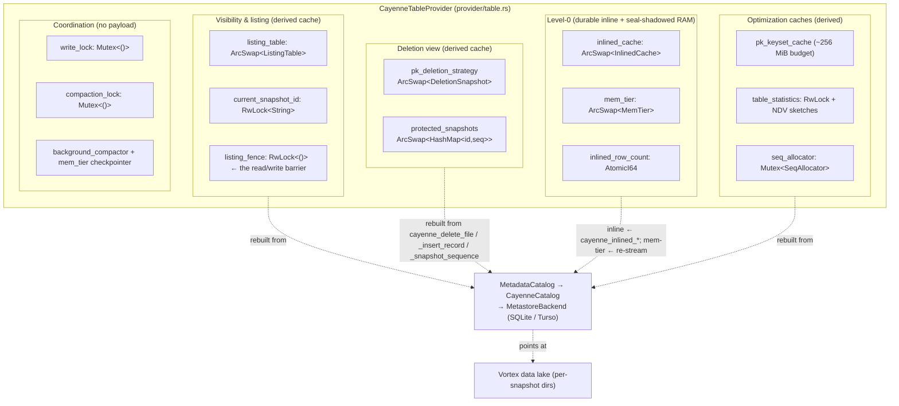
```mermaid
flowchart TB
    subgraph PROV["CayenneTableProvider (provider/table.rs)"]
        direction TB

        subgraph VIS["Visibility & listing  (derived cache)"]
            LT["listing_table: ArcSwap&lt;ListingTable&gt;"]
            CSI["current_snapshot_id: RwLock&lt;String&gt;"]
            LF["listing_fence: RwLock&lt;()&gt;  ← the read/write barrier"]
        end

        subgraph DEL["Deletion view  (derived cache)"]
            PDS["pk_deletion_strategy<br/>ArcSwap&lt;DeletionSnapshot&gt;"]
            PS["protected_snapshots<br/>ArcSwap&lt;HashMap&lt;id,seq&gt;&gt;"]
        end

        subgraph MEM["Level-0  (durable inline + seal-shadowed RAM)"]
            IC["inlined_cache: ArcSwap&lt;InlinedCache&gt;"]
            MT["mem_tier: ArcSwap&lt;MemTier&gt;"]
            IRC["inlined_row_count: AtomicI64"]
        end

        subgraph CACHE["Optimization caches  (derived)"]
            PKC["pk_keyset_cache (~256 MiB budget)"]
            STAT["table_statistics: RwLock + NDV sketches"]
            SEQ["seq_allocator: Mutex&lt;SeqAllocator&gt;"]
        end

        subgraph COORD["Coordination  (no payload)"]
            WL["write_lock: Mutex&lt;()&gt;"]
            CL["compaction_lock: Mutex&lt;()&gt;"]
            BG["background_compactor + mem_tier checkpointer"]
        end
    end

    CAT["MetadataCatalog → CayenneCatalog<br/>→ MetastoreBackend (SQLite / Turso)"]
    LAKE["Vortex data lake (per-snapshot dirs)"]

    VIS -. "rebuilt from" .-> CAT
    DEL -. "rebuilt from cayenne_delete_file / _insert_record / _snapshot_sequence" .-> CAT
    MEM -. "inline ← cayenne_inlined_*; mem-tier ← re-stream" .-> CAT
    CACHE -. "rebuilt from" .-> CAT
    CAT -. "points at" .-> LAKE
```

The crucial mental model from `docs/storage.md`: **almost everything in memory is a *derived cache*** — a fast-read projection of a durable source that is rebuilt on open/restart. The single exception is the CDC mem-tier, whose primary copy is RAM; it recovers from the durable shadow its periodic seal leaves in the unpublished inline corpus, plus a re-stream from the source slot for the unsealed tail. Locks, fences, and counters are *coordination* with no payload. This is why a crash is cheap: the metastore plus the immutable files plus the source slot fully reconstruct the table.

| Durability class | Meaning | On crash | Examples |
|------------------|---------|----------|----------|
| **Derived cache** | fast-read projection of a durable source | no loss — reloaded from metastore/files | listing table, protected snapshots, deletion index, inline cache, PK keyset, statistics, sequence allocator |
| **Ephemeral** | RAM-only payload | discarded; the sealed prefix recovers from its durable shadow, the un-sealed tail (≤ ~2 s) re-streams exactly-once | the CDC mem-tier (the *only* data-bearing ephemeral state) |
| **Coordination** | locks, fences, atomics, flags | irrelevant (reconstructed empty) | `listing_fence`, `write_lock`, generation counters, GC maps |

## How the tiers interact

The three tiers are not siloed — a read fuses all of them, and the level-0 tier continuously drains into the Vortex tier. This diagram shows the data movement; the locks that make it safe come in Part 3.

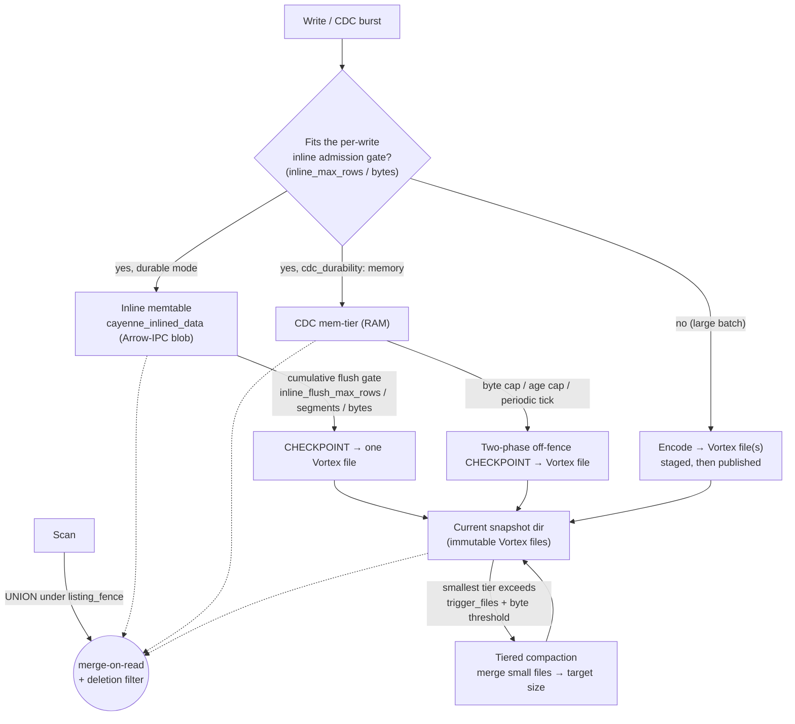
```mermaid
flowchart TB
    W["Write / CDC burst"] --> GATE{"Fits the per-write<br/>inline admission gate?<br/>(inline_max_rows / bytes)"}

    GATE -->|"yes, durable mode"| INLINE["Inline memtable<br/>cayenne_inlined_data (Arrow-IPC blob)"]
    GATE -->|"yes, cdc_durability: memory"| RAM["CDC mem-tier (RAM)"]
    GATE -->|"no (large batch)"| VORTEX["Encode → Vortex file(s)<br/>staged, then published"]

    INLINE -->|"cumulative flush gate<br/>inline_flush_max_rows / segments / bytes"| CKPT1["CHECKPOINT → one Vortex file"]
    RAM -->|"byte cap / age cap / periodic tick"| CKPT2["Two-phase off-fence CHECKPOINT → Vortex file"]
    CKPT1 --> CUR["Current snapshot dir<br/>(immutable Vortex files)"]
    CKPT2 --> CUR
    VORTEX --> CUR

    CUR -->|"smallest tier exceeds<br/>trigger_files + byte threshold"| COMPACT["Tiered compaction<br/>merge small files → target size"]
    COMPACT --> CUR

    READ["Scan"] -->|"UNION under listing_fence"| FUSE(("merge-on-read<br/>+ deletion filter"))
    INLINE -.-> FUSE
    RAM -.-> FUSE
    CUR -.-> FUSE
```

Two thresholds govern the inline tier and they are easy to confuse:

- **`inline_max_*`** is the *per-write admission* gate: *"is this single write small enough to absorb into the memtable at all?"*
- **`inline_flush_max_*`** is the *cumulative flush* gate: *"has the accumulated memtable grown enough that we should checkpoint it to a Vortex file?"*

Under the small-write CDC profile the admission caps default to **1,024 rows** (`inline_max_rows`) **/ 1 MiB serialized** (`inline_max_bytes` — the per-write Arrow-IPC payload size, i.e. how large the batch will be as the blob stored in `cayenne_inlined_data`) **/ 4 MiB in-memory buffer** (`inline_max_buffer_bytes` — the transient in-memory Arrow data the writer may hold while deciding whether the write fits; set above the 1 MiB cap because in-memory Arrow is bulkier than its compact IPC form). The flush caps default to **2,048 rows** (`inline_flush_max_rows`) **/ 16 segments** (`inline_flush_max_segments` — accumulated inline entries) **/ 2 MiB** (`inline_flush_max_bytes` — cumulative serialized-IPC bytes held inline). For larger-write profiles (`full`, `snapshot`, manual append, …) the admission caps are zeroed — inlining is disabled, because batch loads should go straight to Vortex.

## The on-disk layout

The directories below are produced by a **two-stage write**, so it helps to define the two stages up front, since they reappear throughout. **Stage A** is the *durable* half: the burst's new Vortex files are encoded into a separate *staging* snapshot directory and made crash-safe by a write-ahead-log marker (`_wal.json`, written `tmp + fsync + rename`). It runs on the write path, and once it completes the data is safe on disk but **not yet visible** to readers. (If a crash lands after the files are staged but before that marker is durable, the orphaned staging directory is cleaned up during recovery — see *Staging WAL crash-safety* in Part 3 for the full recovery model.) **Stage B** is the *visibility* half: a background task moves the staged files into the current snapshot, publishes any deletion vectors, and flips the snapshot pointer — at which point the write becomes visible. Splitting the two lets the source's change-log offset be acknowledged as soon as Stage A is durable, without waiting for visibility. (See *Flow E — A CDC burst, end to end* in Part 4 for the full sequence, including how back-to-back bursts pipeline.)

Vortex files and Arrow-IPC deletion files live under the data root, grouped by `table_id` and then by snapshot directory. A `<snapshot_id>` is a UUIDv7-named set of immutable files.

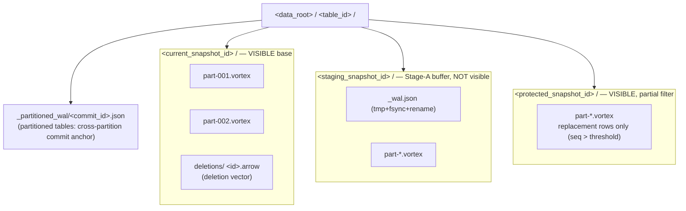
```mermaid
flowchart TB
    ROOT["&lt;data_root&gt; / &lt;table_id&gt; /"] --> CUR
    ROOT --> STG
    ROOT --> PROT
    ROOT --> PWAL

    subgraph CUR["&lt;current_snapshot_id&gt; / — VISIBLE base"]
        C1["part-001.vortex"]
        C2["part-002.vortex"]
        C3["deletions/ &lt;id&gt;.arrow<br/>(deletion vector)"]
    end
    subgraph STG["&lt;staging_snapshot_id&gt; / — Stage-A buffer, NOT visible"]
        S1["_wal.json (tmp+fsync+rename)"]
        S2["part-*.vortex"]
    end
    subgraph PROT["&lt;protected_snapshot_id&gt; / — VISIBLE, partial filter"]
        P1["part-*.vortex<br/>replacement rows only (seq &gt; threshold)"]
    end
    PWAL["_partitioned_wal/&lt;commit_id&gt;.json<br/>(partitioned tables: cross-partition commit anchor)"]
```

### The three snapshot kinds

They share an on-disk shape but differ in **visibility** and **which deletions apply at scan time**:

| Kind | Visible to reads? | Deletion filter at scan | Created by |
|------|-------------------|-------------------------|------------|
| **Current** | yes — the base (`current_snapshot_id`) | **full** — every deletion applies | genesis + compaction output; one at a time, replaced by an atomic pointer flip |
| **Staging** | **no** — pre-visibility | n/a | Stage A of every burst, under `_wal.json`; Stage B publishes it; the WAL self-heals on crash |
| **Protected** | yes — **unioned** with current | **partial** — only `delete_seq > threshold` | an on-conflict upsert / pending-PK-delete publish; they accumulate and are folded by maintenance compaction |

**Why protected snapshots exist.** When a publish stages freshly-inserted rows, it assigns them sequence numbers *above* the deletions already baked into the current snapshot. Those older deletions provably cannot apply to the new rows — so rather than re-resolving the entire deletion set against them, the writer publishes the new data as a *protected* snapshot tagged with a **threshold = its own allocated sequence**. At scan time the reader applies the full deletion filter to current and a partial one (`delete_seq > threshold`) to each protected snapshot, then unions them. This is the key trick that lets an upsert publish *without* touching the existing, possibly-huge deletion set.


### Layout by workload shape

The same primitives produce visibly different trees depending on whether the workload deletes.

**1 · Append-only** (plain `INSERT` / batch load): one snapshot that *grows in place* — each append moves its staged files in, `current_snapshot_id` does **not** change, nothing is ever deleted. Compaction periodically consolidates small files and flips the pointer to a fresh snapshot.

**2 · CDC append** (`cdc_durability: memory`, no PK conflicts): newest bursts live in the RAM mem-tier and tiny batches as Arrow-IPC blobs in `cayenne_inlined_data`; a periodic checkpoint flushes them to a Vortex file in the current snapshot. A `staging/` dir exists only mid-burst. Still no `deletions/`, no protected snapshots.

**3 · Updates / deletes** (upserts + deletes, key-delete path): the current snapshot is scanned with the *full* deletion filter; each upsert publish adds a *protected* snapshot scanned with `delete_seq > threshold`; thresholds live in `cayenne_snapshot_sequence`; unflushed tombstones live in `cayenne_inlined_delete`. The scan is `current(FULL) ∪ A(partial) ∪ B(partial) ∪ mem-tier/inline`. Maintenance compaction folds the older protected prefix into one self-contained merged snapshot, keeps the newest *K* unbaked, and seq-prefix-bakes `delete_seq ≤ T` into the data.

## Sequence numbers and visibility — the spine

Every mutation is stamped with a monotonically increasing **sequence number** reserved from the metastore (`reserve_sequence_numbers` batches reservations to cut round-trips). Inserts, deletes, and re-insertions all carry one. This is exactly the **Iceberg** discipline of sequence-ordered data and delete files, and it is what makes merge-on-read deterministic: given a row at `data_sequence` and a tombstone at `delete_sequence`, the row is hidden iff `delete_sequence ≥ data_sequence`; under upsert semantics, a re-inserted row is visible iff `insert_sequence > delete_sequence`.

Visibility itself is a **single atomic pointer flip**. A write or compaction builds new files, then flips `current_snapshot_id` under the listing fence. Readers resolve the pointer once under the fence and hold that view for the whole scan, so they get snapshot isolation for free.

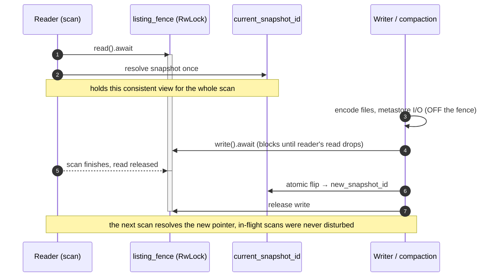
```mermaid
sequenceDiagram
    autonumber
    participant R as Reader (scan)
    participant LF as listing_fence (RwLock)
    participant P as current_snapshot_id
    participant W as Writer / compaction

    R->>LF: read().await
    activate LF
    R->>P: resolve snapshot once
    Note over R,P: holds this consistent view for the whole scan
    W->>W: encode files, metastore I/O (OFF the fence)
    W->>LF: write().await (blocks until reader's read drops)
    R-->>LF: scan finishes, read released
    deactivate LF
    activate LF
    W->>P: atomic flip → new_snapshot_id
    W->>LF: release write
    deactivate LF
    Note over R,W: the next scan resolves the new pointer, in-flight scans were never disturbed
```


---

## The cold object-store tier (optional)

Everything called "warm" so far means the local-disk Vortex files of the current and compacted snapshots. An optional third tier sits below them: a **cold object store**, enabled by setting `cayenne_datalake_location` (dormant and byte-identical to the warm-only behavior when unset). With it on, the tiers form a strict cascade — RAM mem-tier → warm local disk → cold object store — with every row resident in exactly one tier.

A dedicated background worker, `BackgroundColdTierPromoter`, runs on its own `cayenne_datalake_promotion_interval_ms` cadence and promotes the warm tier to cold once it crosses the `cayenne_datalake_warm_max_bytes` / `cayenne_datalake_warm_max_files` thresholds. Promotion is **incremental carry-forward** (#11745): the existing cold manifest is first classified into *dirty* files that may host a tombstoned key (per-PK-column min/max rectangles from the manifest stats blobs, refined by per-file PK blooms — conservative in every failure direction) and *clean* files carried forward by manifest reference, never re-read. Only the warm delta plus the dirty files are re-read (all deletes applied, one version per key), **Z-order (Morton) clustered** so multi-column zone maps stay tight, written as read-optimized Vortex at a larger cold file size under a per-promotion prefix, and then — in one metastore transaction — registered in `cayenne_cold_tier_file` alongside the carried-forward rows while the warm tier is overwrite-cleared. A cold graduation is therefore just "an overwrite whose content lives on the cold store," correct by construction, with cost proportional to the *changed* data; objects orphaned by dirty rewrites are reclaimed by the periodic mark-and-sweep GC (`cayenne_datalake_gc_interval_ms`). The clustering key defaults to the primary key or is set with `cayenne_datalake_clustering_columns`; the kernel builds order-preserving per-column keys and MSB-first bit-interleaves them, applied through the ordinary `SortExec` path without materializing a clustering column.

At read time a cross-tier scan unions a **cold branch** alongside the warm and level-0 tiers. That branch prunes cold files using the inline statistics blob stored on each `cayenne_cold_tier_file` row, so listing-time pruning costs no object-store round-trip, and it applies the same tier-blind key-delete filter as the other tiers — so a delete issued *after* a row was promoted still correctly hides that cold-resident row. Two constraints in this first version: enabling the cold tier forces key-based deletes, and partitioned or position-delete tables are unsupported.

# Part 3 — How data is managed: locks, deletions, and the level-0 tier

## The concurrency model

Cayenne's locking is deliberately *fine-grained and asymmetric*: the read hot-path is wait-free, and the few real locks are held for as short a span as possible. There are two kinds of synchronization:

- **`ArcSwap<T>` cells** — wait-free *reads*. Readers `load()` an immutable `Arc<T>` and never block. *Writes* are **not** automatically safe: a blind swap is last-write-wins, so each cell's read-modify-write is guarded either by a lock or by `rcu` (see *`ArcSwap` writes: guarding against lost updates* below). Everything on the read hot path is an `ArcSwap`: `listing_table`, `protected_snapshots`, the deletion snapshots, `inlined_cache`, `mem_tier`, `current_sorted_snapshot`.
- **Real locks** — a small set of `tokio` async mutexes/rwlocks (held across `.await`) plus a few `parking_lot` mutexes for short non-async critical sections.

### The locks, what they guard, and their order

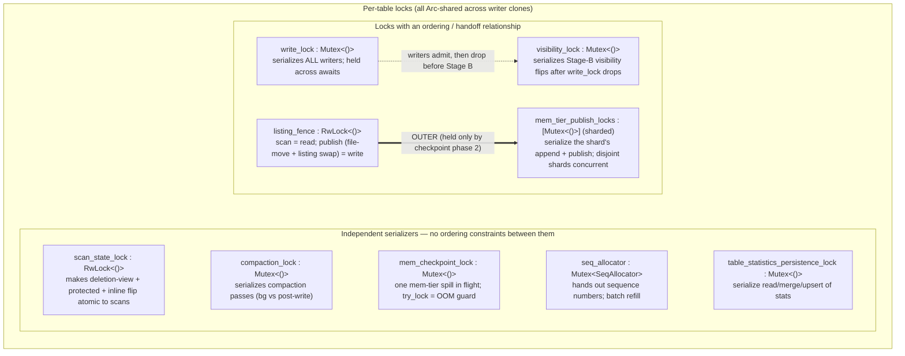
```mermaid
flowchart TB
    subgraph PERTABLE["Per-table locks (all Arc-shared across writer clones)"]
        direction TB
        subgraph ORD["Locks with an ordering / handoff relationship"]
            direction LR
            WL["write_lock : Mutex&lt;()&gt;<br/>serializes ALL writers; held across awaits"] -.->|"writers admit, then drop before Stage B"| VL["visibility_lock : Mutex&lt;()&gt;<br/>serializes Stage-B visibility flips after write_lock drops"]
            LF["listing_fence : RwLock&lt;()&gt;<br/>scan = read; publish (file-move + listing swap) = write"] ==>|"OUTER (held only by checkpoint phase 2)"| MPL["mem_tier_publish_locks : [Mutex&lt;()&gt;] (sharded)<br/>serialize the shard's append + publish; disjoint shards concurrent"]
        end
        subgraph IND["Independent serializers — no ordering constraints between them"]
            direction LR
            SS["scan_state_lock : RwLock&lt;()&gt;<br/>makes deletion-view + protected + inline flip atomic to scans"]
            CL["compaction_lock : Mutex&lt;()&gt;<br/>serializes compaction passes (bg vs post-write)"]
            MCL["mem_checkpoint_lock : Mutex&lt;()&gt;<br/>one mem-tier spill in flight; try_lock = OOM guard"]
            SEQ["seq_allocator : Mutex&lt;SeqAllocator&gt;<br/>hands out sequence numbers; batch refill"]
            TSP["table_statistics_persistence_lock : Mutex&lt;()&gt;<br/>serialize read/merge/upsert of stats"]
            SS ~~~ CL ~~~ MCL ~~~ SEQ ~~~ TSP
        end
    end
    ORD ~~~ IND
```

The non-obvious but load-bearing facts about this set:

- **`write_lock` serializes writers but is dropped early.** CDC pipelining acquires it, does Stage A (durable staging), then **drops it before Stage B** — the runtime spawns Stage B, which takes `visibility_lock` (not `write_lock`) for the move + pointer flip. Because `write_lock` is already free, back-to-back bursts overlap: burst *N+1*'s Stage A can begin while burst *N*'s Stage B is still publishing. Order is preserved by a FIFO (`PendingApplyFinalize`), so reads never see a later burst before an earlier one.
- **`listing_fence` is the read/write barrier.** Scans take `read().await` and hold it across the inner DataFusion listing call. The publish step takes `write().await` only for the move + cache-invalidate + `ArcSwap` swap — microseconds, not the duration of the encode or metastore I/O.
- **`scan_state_lock` exists so three things flip *together*.** A scan captures `(deletion_snapshot, protected_snapshots, inlined_batches)` under a read; the publisher takes the write so a scan can never observe, say, a new protected snapshot but the *old* deletion index.
- **The mem-tier publish locks are sharded.** A shard-*s* append takes `locks[s]`, so disjoint PK-hash shards of one apply append concurrently; a checkpoint's capture takes *all* of them in index order to be mutually exclusive with every appender.
- **The only nested lock order that matters:** `listing_fence` (outer) → a mem-tier publish lock (inner), taken together *only* by checkpoint phase 2. Everything else avoids holding two of these locks at once.

### Why this is HTAP-friendly

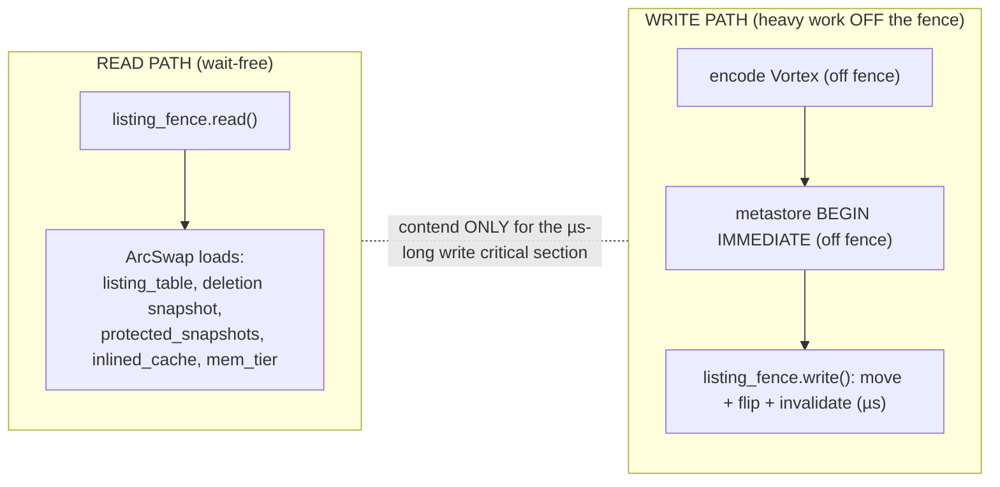
```mermaid
flowchart LR
    subgraph READ["READ PATH (wait-free)"]
        direction TB
        RL["listing_fence.read()"] --> RA["ArcSwap loads:<br/>listing_table, deletion snapshot,<br/>protected_snapshots, inlined_cache, mem_tier"]
    end
    subgraph WRITE["WRITE PATH (heavy work OFF the fence)"]
        direction TB
        WE["encode Vortex (off fence)"] --> WM["metastore BEGIN IMMEDIATE (off fence)"] --> WF["listing_fence.write(): move + flip + invalidate (µs)"]
    end
    READ -. "contend ONLY for the µs-long write critical section" .- WRITE
```

The expensive parts of a write — encoding, metastore transactions, checkpoint I/O — all run *outside* the listing fence. The only thing under it is the pointer flip and the list-cache invalidation. So a scan and a continuous CDC stream contend only for a microsecond-scale critical section, which is what lets one table sustain ingestion and analytics at the same time.

### `ArcSwap` writes: guarding against lost updates

`ArcSwap` makes *reads* wait-free, but it does **not** make *writes* safe on its own. `store()` is an unconditional last-write-wins overwrite, so the obvious read-modify-write is a trap: if two writers each `load()` the current `Arc<T>`, derive new values `T1` and `T2` from it, and both `store()`, the second silently clobbers the first — a lost update. Cayenne hit precisely this once: a deletion-index *add* built off a pre-prune `load()` overwrote a concurrent seq-prefix *prune* and resurrected an already-deleted key. There is now a regression test, `rcu_publish_does_not_lose_a_concurrent_prune`, pinning the fix. So every `ArcSwap` mutation in the codebase follows one of two guarded patterns, chosen by whether a concurrent second writer is even possible:

- **Lock-serialized blind `store()`** — used when the read-modify-write happens only inside an already-serialized critical section, so there is never a second concurrent writer to lose to. The per-table `write_lock` serializes the main write path; the `listing_fence` write side serializes the visibility publish; each `mem_tier_publish_locks[s]` serializes its shard's append. Inside one of those, a plain `store()` is correct because the writer is alone.
- **Lock-free `rcu()` (compare-and-swap retry)** — used when the cell can genuinely be mutated from more than one concurrent path that cannot share a single lock. The pipelined Stage-B finalize runs *backgrounded*, off the `write_lock`, and snapshot GC / deletion-index pruning can run alongside a writer. `rcu` loads the current value, runs the closure to derive the new one, and compare-and-swaps it in; if another writer swapped in between, it throws away the result and re-runs the closure against the *new* current — so the two updates compose and neither is dropped.

| `ArcSwap` cell | Write mechanism | What makes it safe |
|----------------|-----------------|--------------------|
| `listing_table` | blind `store` | `listing_fence` write side (the visibility publish is serialized) |
| `mem_tier` (sharded) | blind `store` per shard | `mem_tier_publish_locks[s]`; a checkpoint takes all shards under `mem_checkpoint_lock` |
| `inlined_cache` | blind `store` | `write_lock`, plus an `inlined_generation` counter that invalidates any view built off a stale generation |
| `table_schema`, `current_sorted_snapshot` | blind `store` | the serialized write / compaction-publish path |
| `protected_snapshots` | **`rcu`** | concurrent — a backgrounded publish can race an unrelated deletion |
| deletion snapshots (`Int64PkDeletionSnapshot` / `KeyDeletionIndex`) | **`rcu`** | concurrent — an add must not clobber a simultaneous seq-prefix prune |

These guards protect each cell *individually*. The `scan_state_lock` (above) is a separate concern: it makes the three views a scan reads — the deletion snapshot, `protected_snapshots`, and the inline batches — flip *together*, so a reader never pairs a new protected snapshot with an old deletion index even though each lives in its own `ArcSwap`.


## The deletion subsystem

Deletes never rewrite data. They are recorded as **deletion vectors** — Arrow-IPC files under `<snapshot_id>/deletions/<id>.arrow` — and applied **merge-on-read**. The *on-disk schema is the type discriminator* (it is inferred at read time, not stored as a column):

| Mode | Schema | When |
|------|--------|------|
| **Position-based** | `row_id: UInt64`, `deleted_at: Int64` (µs) | PK-less tables (always), or any table in `deletion_mode: position` |
| **Key-based** | `row_key: Binary`, `deleted_at: Int64` (µs) | PK tables in `deletion_mode: key` (`auto` ⇒ key for `changes`-mode PK tables) |

At scan time three strategies are wired up in `PkDeletionStrategyWithCache`:

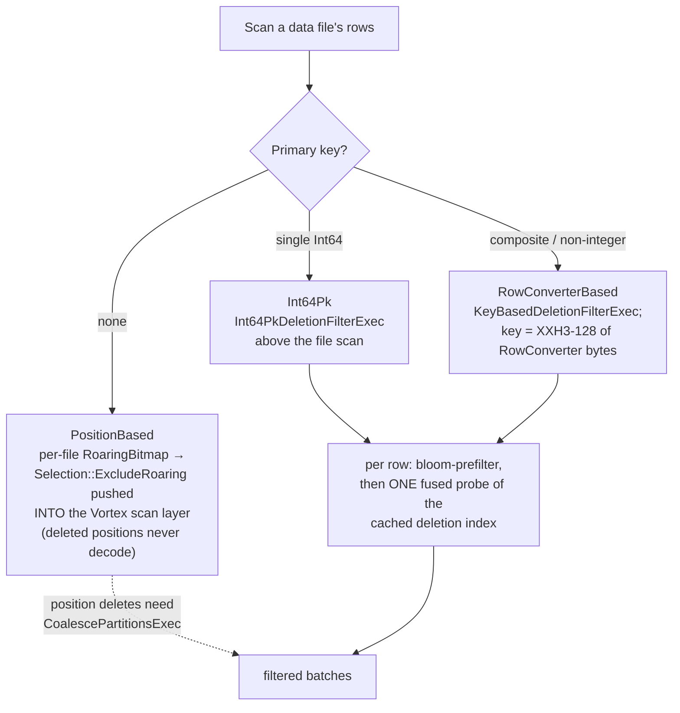
```mermaid
flowchart TB
    SCAN["Scan a data file's rows"] --> HASPK{"Primary key?"}
    HASPK -->|"none"| POS["PositionBased<br/>per-file RoaringBitmap →<br/>Selection::ExcludeRoaring pushed<br/>INTO the Vortex scan layer<br/>(deleted positions never decode)"]
    HASPK -->|"single Int64"| I64["Int64Pk<br/>Int64PkDeletionFilterExec<br/>above the file scan"]
    HASPK -->|"composite / non-integer"| RC["RowConverterBased<br/>KeyBasedDeletionFilterExec;<br/>key = XXH3-128 of RowConverter bytes"]

    I64 --> PROBE["per row: bloom-prefilter,<br/>then ONE fused probe of the<br/>cached deletion index"]
    RC --> PROBE
    POS -.->|"position deletes need<br/>CoalescePartitionsExec"| DONE["filtered batches"]
    PROBE --> DONE
```

The `RowConverter` that produces those key bytes is a **Cayenne-vendored, versioned** format (the `row_converter/` module; `RowFormatVersion::V1` is byte-identical to `arrow-row` 58.3.0), not Arrow's directly. This matters because the encoded bytes are persisted durably and byte-compared on read — the `row_key` of a key-based deletion-vector file, `cayenne_insert_record.pk_bytes`, and inline-delete blobs — so pinning the format decouples that durable key layout from `arrow-rs`'s release cadence: a future Arrow bump can no longer silently change the persisted key bytes and break key-based delete/upsert matching. The decoders return an `ArrowError` on truncated or malformed input rather than panicking.

### The fused tombstone — one probe answers two questions

The clever bit is the **fused** index entry. Each key maps to a single `TombstoneEntry`:

```rust
struct TombstoneEntry { delete_seq: i64, insert_seq: i64 }  // i64::MIN = SEQUENCE_ABSENT

// Visibility under upsert semantics: the row is VISIBLE iff
//   insert_seq > delete_seq   (re-inserted strictly after the delete)
```

A single probe therefore answers *both* "was this key deleted?" and "was it re-inserted after the delete?" — no second lookup, no companion insert-records index. (An earlier revision published a delete index *and* a separate insert-records index together; fusing them into one cell preserves the same atomicity in a single `ArcSwap`.) "Single" here means one *logical* probe that resolves both questions at once, not one memory access: each probe is an **in-memory** lookup against the cached index (a bloom prefilter plus a small number of `HashMap` GETs, detailed below), never a metastore round-trip or a disk read. The metastore and the delete-vector files are read only *once*, at provider open, to build that cached index; from then on the scan hot path only loads the current `ArcSwap` snapshot and probes it in memory.

**Where the two halves come from, and that they live together.** The entry is one 16-byte `Copy` value stored *inline* as the map value — `delete_seq` and `insert_seq` are a single record, not two structures joined at read time. Each half is filled on the write path from the sequence the mutation was stamped with: a delete (or the delete half of an upsert) records `delete_seq`; a re-insertion records `insert_seq`. The index-building methods fold incoming tuples into the per-key entry and take the **per-side max** on conflict — `extend_max_deletes` for pure key-deletes (`(key, delete_seq)`), and `extend_max_conflicts` / `extend_max` for upserts that delete-then-reinsert (`(key, delete_seq, insert_seq)`) — so a key touched repeatedly keeps the highest `delete_seq` and the highest `insert_seq` *independently*, and a side never seen stays `SEQUENCE_ABSENT`. Cross-tier fusion happens at read time (the probe takes the per-side max over the `active` tier plus the applicable runs), but the unit that is written and read is always this one paired value.

### The index is an LSM in miniature: `LayeredRuns`

`LayeredRuns<K,S>` is the **query-time form of the deletions the table has not yet folded into its data files** — the structure each scan probes, once per row, to implement merge-on-read. It is *not* a row store, and it does *not* hold an entry per live key: it holds one fused `TombstoneEntry` only for keys that have been **deleted or upserted**, mapping each to its highest delete and (if re-inserted) insert sequence. A never-deleted row never appears in it — a probe for that key misses the bloom and the row is "visible." Each index — `DeletionIndex` for Int64 PKs, `KeyDeletionIndex` for composite/non-integer PKs — organizes those entries as an ordered set of frozen **runs** (oldest first) over one small mutable **active** tier, the same size-tiered shape as an LSM tree applied to *tombstones* instead of data: new writes land in `active`, and a scan fuses `active` with the applicable frozen runs.

Crucially, it does **not** grow without bound. Once tombstones accumulate past `cayenne_bake_deletion_index_trigger`, a **seq-prefix bake** — a selection-variant compaction — rewrites the data files with every deletion at or below a cutoff sequence *physically applied* (the deleted rows simply aren't re-emitted), and then `prune_deletes_at_or_below(cutoff)` drops those now-redundant tombstones from the index; the durable delete-files/inline tombstones are pruned in the same step. What survives is only the *unbaked* tail — the recent deletions plus the newest few protected snapshots the bake deliberately leaves untouched — so the index tracks the settling front of change, not the table's lifetime deletion count. (See *Where the tombstones live durably* below, and the maintenance-compaction notes in Part 2, for the bake and its durable counterpart.) Delete-vector files left unreferenced after such a rewrite are swept by a background cleanup that is now unconditional: the former `cayenne_orphaned_dv_cleanup_min_files` spicepod parameter (including `0` to disable) has been removed, and the sweep fires once a table accumulates 20 unreferenced files — the fixed `ORPHANED_DV_CLEANUP_MIN_FILES` constant in the provider. The knob was dropped because the sweep is lock-free and runs off the write path, so the threshold only ever traded sweep frequency against lingering disk, never ingest latency — a poor candidate for a user-facing setting.

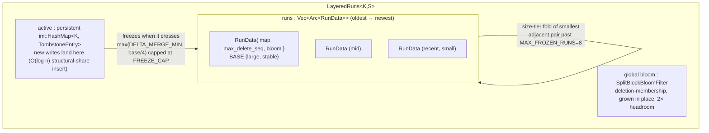
```mermaid
flowchart TB
    subgraph LR["LayeredRuns&lt;K,S&gt;"]
        ACTIVE["active : persistent im::HashMap&lt;K, TombstoneEntry&gt;<br/>new writes land here (O(log n) structural-share insert)"]
        BLOOM["global bloom : SplitBlockBloomFilter<br/>deletion-membership, grown in place, 2× headroom"]
        subgraph RUNS["runs : Vec&lt;Arc&lt;RunData&gt;&gt; (oldest → newest)"]
            R0["RunData{ map, max_delete_seq, bloom }<br/>BASE (large, stable)"]
            R1["RunData (mid)"]
            R2["RunData (recent, small)"]
        end
    end
    ACTIVE -->|"freezes when it crosses<br/>max(DELTA_MERGE_MIN, base/4) capped at FREEZE_CAP"| RUNS
    RUNS -->|"size-tier fold of smallest<br/>adjacent pair past MAX_FROZEN_RUNS=8"| RUNS
```

Key constants (production): `DELTA_MERGE_MIN = 16,384`, `FREEZE_CAP = 262,144`, `MAX_FROZEN_RUNS = 8`. The freeze cap is what keeps the *recent* runs (and their per-run blooms) small and cache-resident no matter how large the accumulated base grows. Per-key copy work stays `O(log N)` because additions land in the small `active` tier and the frozen base is shared by `Arc` until the delta crosses the merge threshold — a geometric cadence.

**`Arc` granularity — not one per key.** A reasonable worry is that an `Arc`-shared index means an `Arc` *per tombstone* — `O(keys)` reference counts. It doesn't. `TombstoneEntry` is a plain `Copy` value living inline in the map; it is never individually boxed or refcounted. The `Arc`s sit at *tier* granularity: each frozen run is a single `Arc<RunData>` wrapping an `Arc<HashMap<K, TombstoneEntry>>` and an `Arc<bloom>`, and there are at most `MAX_FROZEN_RUNS = 8` of them over one `active` tier. (The `active` `im::HashMap` does refcount internally — that is how its insert achieves structural sharing — but each HAMT node holds many entries, so it is `O(nodes)`, not `O(keys)`.) So the total `Arc` count is bounded by a small multiple of the run count, the per-key footprint is just the 16 inline bytes, and there is no per-entry allocation or refcount traffic. That bounded sharing is also exactly what makes the `rcu` copy cheap: cloning the index for a publish bumps a handful of run `Arc`s and structural-shares the `active` tier rather than copying `O(keys)` of anything.

**Where the tombstones live durably — and why this isn't `O(live keys)` on disk either.** `LayeredRuns` is a *derived cache*; no `TombstoneEntry` is ever persisted in this shape. A deletion is durable in one of two places: a **delete-vector file** (`DeleteFile` — an Arrow-IPC file under the snapshot's `deletions/` directory, referenced from the `cayenne_delete_file` metastore table; position-based vectors name a `source_data_file_path` and carry row IDs relative to it, key-based ones apply table-wide), or — for the most recent, unflushed level-0 deletions — an **inline tombstone row** in `cayenne_inlined_delete`. The re-insertion (`insert_seq`) side comes from the upsert's delete-file record: since the metadata-only upsert publish it is stamped on `cayenne_delete_file.reinsert_sequence`, with `cayenne_insert_record` retained only as the legacy fallback for rows where that column is NULL. At provider open, `load_deletion_vectors_all` reads the delete files and insert records once and builds the in-memory index; inline tombstones are applied as a read filter on top. So the durable footprint is `O(deletions + upsert re-insertions)`, **not** a row per live key — live rows exist only in the Vortex data files — and maintenance compaction's seq-prefix bake (`prune_deletes_at_or_below`) folds the older `delete_seq ≤ T` prefix into the data files and drops those records, which bounds the growth. The one structure that *does* scale with the number of distinct primary keys is a separate one: `cayenne_pk_index`, a persisted PK-existence checkpoint (a sharded keyset plus bloom) that lets an upsert table skip rebuilding its conflict-detection keyset by full-table scan on restart. That is the conflict-detection keyset, not the tombstone index — a different structure answering "does this PK already exist?", not "was this PK deleted, and re-inserted after?".

### The probe (pseudocode)

The hot path is `get_with_min_seq`. The `min_delete_seq` cutoff `S` is the protected-snapshot optimization: a protected probe skips any run whose deletes provably can't be newer than `S`.

```text
fn probe(pk, S: Option<i64>) -> Option<Tombstone>:
    hash = hash_key(pk)

    # 1. Global bloom is a safe superset over ALL runs' deletion keys.
    #    A miss ⇒ no tombstone at any sequence ⇒ None for any cutoff.
    #    This rejects the common "never deleted" key in ~one block load.
    if not global_bloom.might_contain(hash):
        return None

    # 2. Fuse `active` with the applicable runs, taking the per-side max.
    entry = TombstoneEntry::EMPTY
    fuse(entry, active.get(pk))                 # always: small, recent
    for run in runs:                            # oldest → newest
        if S is Some(s) and run.max_delete_seq <= s:
            continue                            # CANNOT carry a delete > s — skip wholesale
        if run.bloom.might_contain(hash):       # per-run bloom (small for recent runs)
            fuse(entry, run.map.get(pk))
    return Tombstone::from(entry)               # None if no delete side present
```

```text
# applied per scanned row by the deletion-filter exec:
fn row_is_visible(row, tombstone: Option<Tombstone>) -> bool:
    match tombstone:
        None                          => true                         # never deleted
        Some(t) if t.insert_seq.is_some()
                  and t.insert_seq > t.delete_seq => true             # re-inserted after delete
        Some(_)                       => false                        # deleted, not re-inserted
```

Two properties make this fast at steady state:

- **Main-scan probes** (`S = None`) fuse all runs — the full fused value over every write.
- **Protected-snapshot probes** (`S = Some(s)`) skip every run with `max_delete_seq ≤ s` and consult only the recent, small runs via their *per-run* blooms — never the large global bloom. So probe cost tracks *recent* writes, not the total accumulated tombstone count.

For whole-batch scanning, `get_batch` restructures into two passes — a tight bloom sweep over a chunk of keys, then the tier walk only for the survivors — so out-of-cache map misses overlap across iterations (memory-level parallelism). And a process-wide `DeletionIndex::shared_empty()` is reused by every table that has *no* deletions, amortizing the bloom allocation to zero.

### Maintenance: seq-prefix bake

Over time, tombstones whose `delete_seq ≤ T` get **baked** into the data files by compaction (`prune_deletes_at_or_below(T)` drops them from the runs once they're physically applied). This shrinks the per-row probe cost continuously, so a long-lived high-churn table doesn't accumulate an ever-growing tombstone set.

The cutoff itself has one subtlety in `memory` mode. The natural fence is the durable deletion index's max sequence — but under off-fence sharded CDC a *later* apply's delete can fold into the durable index ahead of an *earlier* apply's delete that is still pending in RAM, so that max can sit **above** a pending delete that was never baked into the merged files. Tagging the merged snapshot with it would make the scan treat the pending delete as already-applied (`delete_seq ≤ threshold`) and skip it forever — resurrecting the deleted row. The merge/bake fence is therefore capped **strictly below the smallest still-pending mem-tier delete** (`min_pending_mem_tier_delete_sequence`). Lowering the fence cannot under-count: a pending upsert's (delete, data) pair is one atomic apply, so its re-insert is also still pending and never in the merged durable files — a lower fence only applies more deletes to old rows, never hides a baked re-insert.


## The level-0 tier in detail

Level-0 has two implementations that absorb small writes, picked by `cdc_durability`:

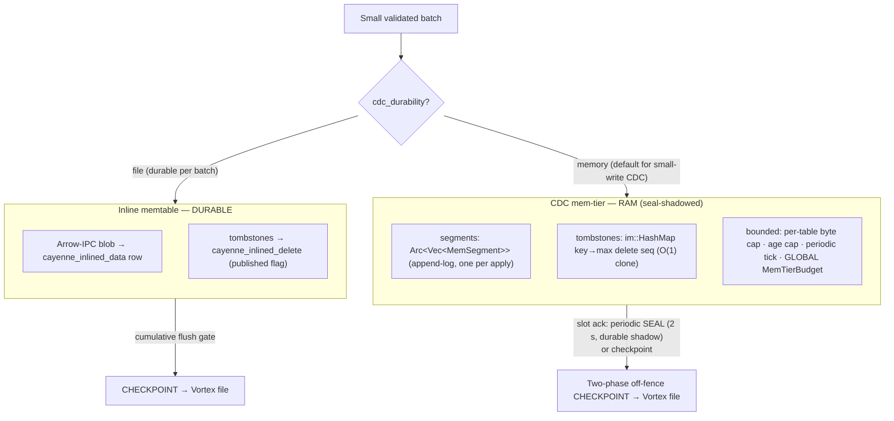
```mermaid
flowchart TB
    BURST["Small validated batch"] --> MODE{"cdc_durability?"}

    MODE -->|"file (durable per batch)"| INLINE
    MODE -->|"memory (default for small-write CDC)"| MEMTIER

    subgraph INLINE["Inline memtable — DURABLE"]
        direction TB
        IPC["Arrow-IPC blob → cayenne_inlined_data row"]
        ITOMB["tombstones → cayenne_inlined_delete (published flag)"]
    end

    subgraph MEMTIER["CDC mem-tier — RAM (seal-shadowed)"]
        direction TB
        SEG["segments: Arc&lt;Vec&lt;MemSegment&gt;&gt; (append-log, one per apply)"]
        TOMB["tombstones: im::HashMap key→max delete seq (O(1) clone)"]
        BUD["bounded: per-table byte cap · age cap · periodic tick · GLOBAL MemTierBudget"]
    end

    INLINE -->|"cumulative flush gate"| FLUSH["CHECKPOINT → Vortex file"]
    MEMTIER -->|"slot ack: periodic SEAL (2 s, durable shadow)<br/>or checkpoint"| FLUSH2["Two-phase off-fence CHECKPOINT → Vortex file"]
```

**The inline memtable** is the durable level-0: each small batch is an Arrow-IPC blob stored as a row in `cayenne_inlined_data`, with tombstones in `cayenne_inlined_delete`. An append shares structure rather than re-encoding the corpus, and a read fuses the decoded batches into the scan union. Once cumulative rows/segments/bytes cross `inline_flush_max_*`, a checkpoint drains it into one consolidated Vortex file.

**The CDC mem-tier** (`cdc_durability: memory`, the default for the small-write CDC profile) is the *only* data-bearing state whose primary copy is RAM. It is held in an `ArcSwap<MemTier>`, so an append is an O(1) `Arc` swap and reads union it with zero copy. Its tombstone maps are persistent `im::HashMap`s, so each append shares structure with the prior version. The mem-tier defers per-batch durability cost: instead of persisting a blob before the source-slot ack, it appends to RAM and defers the slot ack until the rows are durable — by default via a cheap periodic **seal** (below), and in any case by the checkpoint that flushes the tier to a durable Vortex file. The checkpoint stays off the hot path: it captures all shards, then **releases `write_lock` before the encode**, so encoding the drained tier into Vortex overlaps concurrent applies rather than blocking them (with `cdc_mem_tier_shards > 1` the shards encode concurrently); only the final snapshot-pointer flip is taken under the fence. The sharded apply's per-batch work is kept lean the same way: both the apply preparation (`prepare_stream_for_insert_sharded`) and the per-batch shard split (`split_batch_by_pk_shard`) reuse the table's cached PK `RowConverter` instead of rebuilding one per apply and again per batch — shard routing stays byte-identical, and the saving bites hardest in the 1-row-transaction regime where replication lag accrues.

### The seal — the slot ack decoupled from the checkpoint

Until recently the slot ack rode *only* the checkpoint, which coupled it to the read hand-off: rows were query-visible on append, but the source replication slot advanced on the checkpoint cadence (typically 10–15 s), so replication and end-to-end freshness lag tracked that cadence. Lowering the age cap to chase sub-3-second freshness meant several times more small protected snapshots — read amplification and listing-fence contention — which is exactly the wrong trade. The observation behind #11622 is that the slot advance should stay coupled to **durability** but be decoupled from **reads**.

The mechanism is a split of `MemTier` at a `sealed_segments` boundary: `segments[0..sealed_segments]` are the immutable, already-durably-shadowed piece; `segments[sealed_segments..]` are the active ingestion piece. A periodic **seal** (`seal_mem_tier_durable`, driven by `cayenne_cdc_mem_tier_seal_age_ms`, default 2 000 ms) durably shadows the active piece and fires the slot advancer — with **no Vortex encode, no listing-fence publish, no protected snapshot, and no read amplification**:

- inserts are written as one **unpublished** inline BLOB (`commit_inlined_data_durable` — the publish is skipped, so `published_inlined_seq` never advances and the shadow stays invisible in-process);
- tombstones become durable delete-vector files (`commit_mem_tier_checkpoint_metadata`, with the in-memory update dropped) — a load-bearing detail, because `cayenne_inlined_delete` rows only hide inline-corpus rows and are wiped by the inline checkpoint, so they cannot durably hide a *file* row;
- then `fire_slot_advancer(seal_epoch)`.

Reads are unchanged — a scan still unions the whole RAM tier; the split is invisible to the scan path. Critically, `mark_sealed_through` **preserves the mem-tier `version`** (it advances only `sealed_segments`), so a seal invalidates neither the `merged_scan_deletions` nor the `mem_tier_visible_memo` merge-on-read memo — a seal is fully memo-transparent, avoiding an `O(resident-tier)` memo rebuild on the next scan every ~2 s. On restart the shadow *becomes* the recovered corpus (the inline watermark reseeds from the durable `current_sequence_number`, and `publish_orphan_inlined_deletes` re-activates the shadow's tombstones). A later bake re-flushes the same rows to Vortex and **clears the shadow** — a `mem_tier_shadow_present` flag forces the clear even though the published inline view is empty — so nothing double-counts, live or across a crash. Seal and bake are serialized by `mem_checkpoint_lock` (a single drainer, preserving the slot advancer's failure-requeue ordering), and the seal's capture takes the checkpoint's byte-identical lock hierarchy — `mem_checkpoint → write → publish`. At `cdc_mem_tier_shards > 1` that capture is **all-shards-atomic**: the slot-ack epoch is a single cross-shard axis, so a per-shard seal could tear the MAX watermark and ack an apply epoch not yet durable in every shard it touched; the seal therefore takes `write_lock` (a mid-fan-out apply is observed all-or-none) plus every shard publish lock in index order, computes the durable watermark as the MAX over shards, and builds the cross-shard union off the locks (`ShardedMemTier::union_snapshot_view`) into one shadow BLOB. At N = 1 no `write_lock` is taken — a single `ArcSwap` load is already atomic.

The contract: the slot stays tied to the **persisted** tier (it never advances before durability) but is untied from reads (it advances after the rows are scannable, without waiting for a publish). A crash before a seal re-streams only the un-acked tail — PK-idempotent, exactly-once, now a ~2-second window instead of a checkpoint-cadence one. Setting `cayenne_cdc_mem_tier_seal_age_ms: 0` disables sealing and reverts the slot ack to the checkpoint cadence; the value should sit at or below the age cap, since a seal older than the checkpoint window is superseded by the checkpoint's own slot advance. Like the checkpoint interval, this is a fixed time-domain durability-policy bound, not an adaptive-controller actuator.

### Why the mem-tier is safe to lose

The crash model is simple and is the reason `memory` mode is the default:

- The live mem-tier structure is pure RAM; it is **discarded** on crash/restart. Its *sealed prefix*, though, has a durable shadow, recovered as the inline corpus on the next open — only the unsealed tail is truly lost.
- The **source slot** is the single source of truth — it holds at most the last-sealed (or last-checkpointed) LSN.
- On restart, the source re-streams everything past that slot, and the **PK-idempotent apply** reconciles it **exactly-once**.
- The load-bearing invariant, enforced by the `SlotAdvancer` callback: **the slot advances only after the covering seal's or checkpoint's Vortex/metastore writes are durable.**

This trades a bounded crash-replay window — now the seal cadence (~2 s by default) rather than the checkpoint cadence — for the elimination of per-batch durability cost — a good bargain for a replayable CDC source. The tier is bounded on four axes so it can never OOM: a per-table byte cap (`cdc_mem_tier_max_bytes`), an age cap (`cdc_mem_tier_max_age_ms`), a periodic background tick, and a process-global `MemTierBudget` shared across a fleet of tables.

## Table statistics

Cayenne keeps two layers of statistics, both persisted in the metastore and both restored from it — a restart never rescans data files to rebuild them.

The **per-table optimizer aggregate** is what the DataFusion planner reads to size joins and estimate selectivity: `num_rows` plus, per column, min/max, null count, and a **HyperLogLog NDV sketch** (distinct-count estimate — 4 KiB of register bytes per NDV-eligible column, ≈1.6% standard error). It lives as one serialized blob in the `cayenne_table_statistics` row and is cached in memory as a DataFusion `Statistics`. It is built **incrementally**: every write folds its batch's min/max/null into a `ColumnStatsAccumulator`, which is then merged into the stored aggregate with a delta row-count update — all under `table_statistics_persistence_lock`, so a concurrent writer's merge is never lost. NDV is folded **lazily**: the synchronous inline tier0 write (the CDC apply hot loop) always skips the per-row sketch hashing; only a write that produces a persisted Vortex file — a checkpoint spill, staged append, compaction rewrite, or overwrite — hashes each NDV-eligible column's values into the sketch. An inline row's distinct-count therefore reaches the aggregate at the inline memtable's next checkpoint rather than at write time (a lag bounded to roughly one memtable), which is safe because NDV is consumed only as an inexact optimizer hint. Because HyperLogLog is mergeable and min/max/null compose, this never rescans data.

The cost of incremental merging is **one-directional drift**: min/max only ever widen (a since-deleted row's extreme value lingers) and the NDV sketch only grows (HyperLogLog cannot forget a value), so between compactions the aggregate is a *loose superset* of the live set. Two things keep that acceptable. First, the planner consumes the aggregate as **inexact** (advisory) statistics, so drift affects plan *costing*, never correctness. Second, compaction **re-anchors** it: a full-rewrite compaction (`replace_table_stats_after_rewrite`) recomputes the aggregate over exactly the materialized live rows and replaces the drifted one, and an overwrite (`reset_table_stats_after_overwrite`) replaces it outright and resets the count — so statistics tighten back to the live set whenever the data is rewritten.

There is one place where "inexact, so only costing" was *not* the whole story: the row count. On the distributed path, `local_executor_table_statistics` reports the maintained `num_rows` to the coordinator, and a count served `Exact` there is folded straight into a `COUNT(*)` **answer** — metadata, not a scan. The mem-tier checkpoint persists its row delta best-effort (it historically did not net supersedes of already-durable rows), so under memory-CDC churn the maintained count drifts toward "every row ever flushed" — and served `Exact`, that drift became a wrong `COUNT(*)` that survives drain. The fix is an explicit exactness bit: `cayenne_table_statistics.num_rows_exact`. A mem-tier checkpoint's best-effort `Delta` **taints** it false; a full-rewrite compaction's or overwrite's `Set` restores it. A tainted count is served `Inexact`, so the `COUNT(*)` metadata fold declines and a real, deletion-aware scan answers instead — while pure append/staged tables keep their `Exact` fast path. The mem-tier checkpoint is not the only taint source: the durable/staged path carries the same guard, so an **upsert-, delete-, or retention-capable** table's incremental `num_rows` `Delta` is likewise served `Inexact` (only a compaction/overwrite `Set` re-establishes exactness), because a `superseded` count can mis-net after an overwrite and standalone durable deletes aren't netted into the delta. Exactness on the incremental path survives only when `on_conflict` is unset **and** no retention delete ran this commit — i.e. a provably pure-append table. Independently, the checkpoint delta is now netted by the durable supersedes accumulated on the append path (a saturating counter, so it can never wrap and inflate), keeping the `Inexact` value close to the live count rather than climbing without bound. A completed streaming write also triggers a debounced executor-stats rebroadcast, so the coordinator's `COUNT(*)` metadata fold reflects freshly-published rows without waiting for the next periodic report. Single-node `COUNT(*)` folds on Vortex footer sums and was never affected.

The same never-shrink property surfaces on the **join build side**. When a scan unions the compacted base with the live deltas, the `UnionExec` wipes the base's join-key statistics; Cayenne refills them from a tier-accurate overlay so the planner still sees per-key stats that reflect merge-on-read deletes. Because that overlay's NDV is an HLL union that only grows — it never shrinks on a delete or upsert-supersede — it is capped before it feeds build-side selection, so the never-shrink over-count cannot push the estimate past the live row count.

The second layer is **per-file footer statistics**: each Vortex file's min/max/null/row-count, persisted per file in `cayenne_snapshot_file_statistics` and cached in a `FileStatisticsCache`. These drive listing-time **file pruning** — skipping files that can't satisfy a scan predicate — without re-reading each object's footer; the in-memory cache is cleared on publish when new files appear.

When `cayenne_integrity_checksums` is enabled, each Vortex data file also carries a self-describing content digest (`provider/file_digest.rs`, `"xxh3-128:<hex>"`) computed at manifest-author time and stored in the nullable `cayenne_snapshot_file.digest` column. It is verified once (a per-process-cached whole-file read) *before the file is first scanned*, turning silent bit-rot into a detected fault that fails the scan; a file with no digest or that can't be read is skipped as unverifiable, not treated as corrupt. Off, the digest column is simply left NULL.

Restore is a metastore read, not a rescan. At open, `load_table_statistics` reads the aggregate blob (`get_table_statistics`) and deserializes it straight into a `Statistics`, and the per-file layer comes back from `cayenne_snapshot_file_statistics`. The raw Vortex data is never re-read to rebuild statistics.

## Adaptive CDC tuning and query admission

A `cdc_durability: memory` table is a closed loop: the adaptive controller (`provider/tuning.rs`) watches each table's freshness / replication-lag against its SLO setpoints (the `cayenne_goal_*` parameters — an unset goal leaves that lever inert) and nudges a set of actuators — checkpoint cadence, mem-tier caps, the deletion-index bake trigger, and more. It is **storage-aware**: a startup calibration probe measures the data path's write throughput, an IMDS check flags T-family burstable EC2 hosts, and an I/O-cliff detector (the fast latency EWMA rising sharply over the slow EWMA) triggers a fast-path backoff before latencies spiral.

The newest lever inverts the controller's original grow-only bias on the mem-tier. When a `cayenne_goal_freshness` SLO is set and violated, the controller **shrinks** `cayenne_cdc_mem_tier_max_bytes` (`goal_shrink_i64` in `decide_goal`, ordered before the ingest-grow tier). The causality is checkpoint-shaped: a large mem-tier makes each checkpoint's `write_lock` capture window deep, applies queue behind it, and source-commit→queryable lag climbs — so shrinking the tier checkpoints smaller epochs sooner and keeps the capture stall shallow. This closes the loop on what was previously a hand-pinned A/B (1 GiB → 256 MiB took a worst-table freshness P99 from ~4.4 s to sub-second on an SF-100 3-node run, though the merged claim is deliberately softened to "a safe control response" — the validation run was variance-dominated). Freshness *owns* the tier lever: the replication-lag grow moves are gated off while freshness is violated, so the two goals can never drive the tier in opposite directions on one tick; an explicit operator pin on `cayenne_cdc_mem_tier_max_bytes` collapses the clamp bounds so the lever no-ops rather than fighting the pin; and the shrink is gated on live ingest, so a parked table never ratchets its tier down on wall-clock staleness.

The violation signal is worth naming because it also changed a metric's semantics. Per-apply row freshness (apply wall-clock minus the batch's source commit timestamp, clock-skew clamped to zero) is folded into a tumbling-window **peak** (`WindowMax`, spanning the ~60 s default goal-convergence window — fixed to the default; a per-dataset `cayenne_goal_convergence_window` override retunes the controller's dwell, not this window). The peak is idle-immune by construction — a post-idle batch measures its own small lag, where an instantaneous gauge would ramp on the wall clock while nothing arrives — and it now backs the `cayenne_ingest_freshness_seconds` gauge, which therefore reports the windowed worst case rather than the sampling-phase-blind instantaneous value. A companion diagnostic splits the checkpoint capture timer: `capture_lock_wait` (the `write_lock` + shard publish-lock acquisition) is emitted as its own phase beside the O(1) snapshot work, so a long `mem_tier_checkpoint_capture` is attributable — a large lock-wait means the fix is apply-path throughput, not the already-constant capture.

One actuator reaches outside the table — the process-global **query-admission throttle** (`provider/query_admission.rs`). When a memory-mode table falls behind its freshness SLO *and CPU is the contended resource*, the governor holds live permits on the very admission semaphore the runtime's analytical queries acquire from, shedding some query concurrency to hand cores back to the CDC apply, then releases them once the table catches up. Admission is count-based — whole queries, never partitions — so throttling can never wedge a partially-admitted plan, and because it holds reversible permits (rather than forgetting them) the cap lifts cleanly.

## Other managed state, briefly

- **PK keyset cache** (`pk_keyset_cache`) — the visible PK set for `auto` on-conflict detection, so a burst doesn't re-scan Vortex files. Byte-budgeted (256 MiB default); when the exact keyset would exceed budget it falls back to a `PkBloom`. Reported to `runtime.query.memory_limit` accounting. A cold rebuild (`load_existing_keyset`, forced when compaction or a deletion-vector refresh invalidates the cache) folds the **un-checkpointed mem-tier's keys** in beside the durable-file scan (`fold_mem_tier_keys_into_keyset`), snapshotting the tier *before* the scan so a concurrent checkpoint-clear cannot hide a key from both sides; the fold covers both the serial and the sharded (`build_sharded_pk_index`) callers and is a no-op for non-memory tables. This matters because compaction never flushes the mem-tier first: without the fold, a RAM-only key is missing from the rebuilt index, its next UPDATE false-negatives into a fresh insert with **no tombstone**, and the prior copy is served forever — a durable over-count compaction cannot heal. RAM-only keys enter as `FileUnlocated`, a benign label since the mem-tier tombstone unions the file and inline delete lists. The **persisted-bloom fast path** (`try_load_persisted_pk_index` — used right after a compaction persists a `cayenne_pk_index` bloom for the current snapshot) had the same gap and now gets the same fold (`fold_mem_tier_keys_into_bloom`; a superset is safe under upsert, a stale key just costs a redundant tombstone). Both paths now capture the (mem-tier, protected, current) triple **coherently under the listing fence**, so a concurrent off-fence checkpoint can't hide a live key from both the RAM fold and the durable delta.
- **Sequence allocator** (`seq_allocator`) — hands out every sequence number, refilling in batches from the metastore high-water column to cut round-trips.
- **Maintained aggregates** (`maintained_aggregate.rs`, adjacent query-side machinery this document otherwise leaves out of scope) — an incremental-view-maintenance registry fed by the CDC delta: an optimizer rule (`CayenneMaintainedAggregateRewriter`) rewrites a recurring `COUNT` / `SUM` / `AVG` / `MIN` / `MAX … GROUP BY` plan over a CDC-fed table into a `MaintainedAggregateExec` served from per-group state in O(groups) instead of an O(rows) rescan. `AVG` covers the full integer family exactly via an `i128` accumulator (invertible under retract-then-insert, unlike `f64`); `MIN`/`MAX` are the retraction-hard cases — deleting the current group extremum must expose the *next* value — and keep a per-group ordered multiset (`SortedScalarIndex`), covering integers, `Date`/`Timestamp`, and `Decimal128` (float `MIN`/`MAX` is deferred on NaN ordering; the resolver safe-declines to a base-table scan). Runtime configuration requires a primary key for `MIN`/`MAX`; programmatic provider construction is still bounded without one because distinct multiset entries count toward the provider's retained-index cap. At `cdc_mem_tier_shards > 1`, the writer pre-assigns one IVM epoch, publishes shard segments concurrently, and sends one ordered insert/delete delta after the fan-out. A lightweight even/odd scan seqlock binds that epoch to the captured shard vector: a scan racing the fan-out declines maintained substitution and executes the captured base plan, while a scan at the new epoch falls back until the background applier catches up. This prevents both stale-aggregate/new-shard and new-aggregate/old-shard substitutions without serializing ordinary scans on the write lock.
- **Mem-tier visible-batch memo** (`mem_tier_visible_memo`) — the merge-on-read *output* of the mem-tier scan (deletion-filtered visible batches), memoized version-keyed exactly like `merged_scan_deletions` (file-index pointer + per-shard version hash + structural epoch) and stored per-segment so per-query pruning predicates still apply at serve time. A multi-reference query (semi/anti-join shapes referencing the table twice) previously re-ran the deletion filter per reference; now repeated same-version references are served from the memo. It is cleared (stored `None`) at both content-change sites — append and the checkpoint's flushed-prefix clear — so it can never serve stale rows and never pins checkpointed RAM.


---

# Part 4 — Key flows

Now the boxes open. Each flow is a sequence diagram; the prose calls out the decisions that distinguish one flow from another.

## Flow A — The read path (a scan's lifecycle)

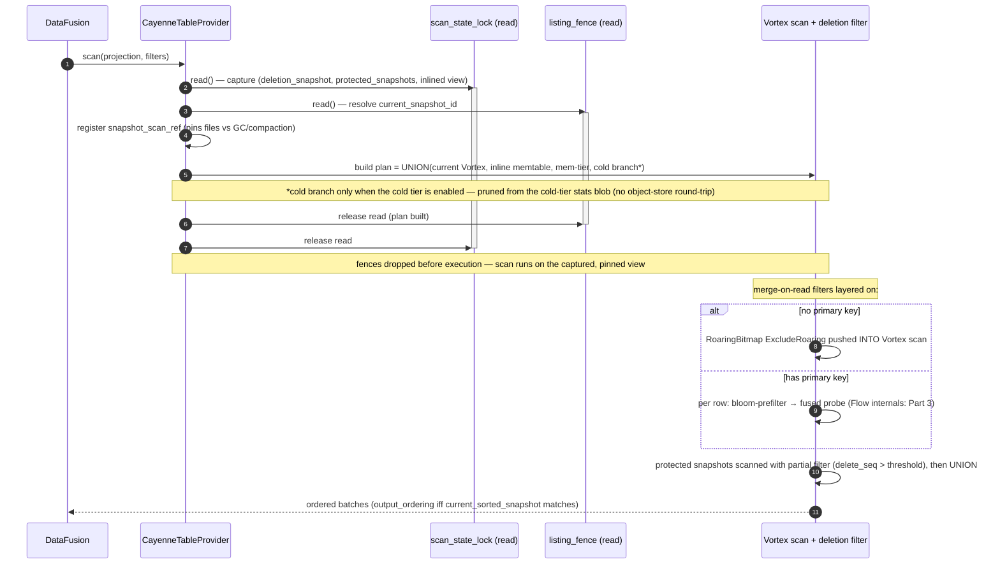
```mermaid
sequenceDiagram
    autonumber
    participant DF as DataFusion
    participant P as CayenneTableProvider
    participant SS as scan_state_lock (read)
    participant LF as listing_fence (read)
    participant V as Vortex scan + deletion filter

    DF->>P: scan(projection, filters)
    P->>SS: read() — capture (deletion_snapshot, protected_snapshots, inlined view)
    activate SS
    P->>LF: read() — resolve current_snapshot_id
    activate LF
    P->>P: register snapshot_scan_ref (pins files vs GC/compaction)
    P->>V: build plan = UNION(current Vortex, inline memtable, mem-tier, cold branch*)
    Note over P,V: *cold branch only when the cold tier is enabled — pruned from the cold-tier stats blob (no object-store round-trip)
    P->>LF: release read (plan built)
    deactivate LF
    P->>SS: release read
    deactivate SS
    Note over P,V: fences dropped before execution — scan runs on the captured, pinned view
    Note over V: merge-on-read filters layered on:
    alt no primary key
        V->>V: RoaringBitmap ExcludeRoaring pushed INTO Vortex scan
    else has primary key
        V->>V: per row: bloom-prefilter → fused probe (Flow internals: Part 3)
    end
    V->>V: protected snapshots scanned with partial filter (delete_seq > threshold), then UNION
    V-->>DF: ordered batches (output_ordering iff current_sorted_snapshot matches)
```

The scan resolves one consistent view under the fences, pins the snapshot so concurrent compaction/GC can't delete files out from under it, and applies deletions transparently. Nothing here blocks a concurrent writer except for the microsecond window when a publisher takes the *write* side of the fences. On the mem-tier branch, the deletion-filtered output is served from a version-keyed memo when nothing has changed since the last scan (see *Other managed state* in Part 3), so a query that references the table more than once pays the merge-on-read filter once.

## Flow B — Insert (append, no PK conflict)

The simplest write. There is **no conflict resolution, no tombstone, no protected snapshot** — just a sequence number and a landing tier.

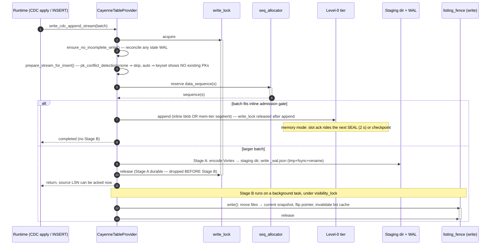
```mermaid
sequenceDiagram
    autonumber
    participant RT as Runtime (CDC apply / INSERT)
    participant P as CayenneTableProvider
    participant WL as write_lock
    participant SEQ as seq_allocator
    participant L0 as Level-0 tier
    participant STG as Staging dir + WAL
    participant LF as listing_fence (write)

    RT->>P: write_cdc_append_stream(batch)
    P->>WL: acquire
    activate WL
    P->>P: ensure_no_incomplete_write() — reconcile any stale WAL
    P->>P: prepare_stream_for_insert() — pk_conflict_detection=none ⇒ skip, auto ⇒ keyset shows NO existing PKs
    P->>SEQ: reserve data_sequence(s)
    activate SEQ
    SEQ-->>P: sequence(s)
    deactivate SEQ
    alt batch fits inline admission gate
        P->>L0: append (inline blob OR mem-tier segment) — write_lock released after append
        Note over L0: memory mode: slot ack rides the next SEAL (2 s) or checkpoint
        P-->>RT: completed (no Stage B)
    else larger batch
        P->>STG: Stage A: encode Vortex → staging dir, write _wal.json (tmp+fsync+rename)
        P->>WL: release (Stage A durable — dropped BEFORE Stage B)
        deactivate WL
        P-->>RT: return, source LSN can be acked now
        Note over P,LF: Stage B runs on a background task, under visibility_lock
        P->>LF: write(): move files → current snapshot, flip pointer, invalidate list cache
        activate LF
        P->>LF: release
        deactivate LF
    end
```

The defining feature: the incoming rows are **brand new PKs**, so `prepare_stream_for_insert` produces no deletions. The rows simply get a sequence number and land in level-0 (small) or a staged Vortex file (large). Visibility is the pointer flip; no deletion vectors are written.

For **bounded append freshness**, a long-lived append stream (e.g. an ADBC bulk ingest that would otherwise publish only at stream end) is cut into age- and size-bounded **segments** (`write_append_segmented`), each run as a complete prepare→stage→publish write under `write_lock`, so its rows become queryable within roughly one segment interval instead of at the very end. The age bound is a fixed ~10 s internal default (`DEFAULT_STREAM_PUBLISH_INTERVAL_MS`; `0` reverts to publish-only-at-end — note this is currently an internal default, not yet a settable spicepod parameter); the size bound is the target file size clamped to `[8 MiB, 256 MiB]`. An idle stream never publishes empty segments (the deadline starts at the first buffered batch), and on a mid-stream error already-published segments stay published — whole-payload retries stay convergent because the PK on-conflict resolution is idempotent.

## Flow C — Update / upsert (PK conflict → tombstone + re-insertion)

This is where an "update" diverges from an "insert." Cayenne has no in-place update — an upsert is modeled, Iceberg-style, as **a re-insertion that tombstones the prior copy**. The contrast with Flow B is entirely in the *conflict-preparation* and *publish* steps.

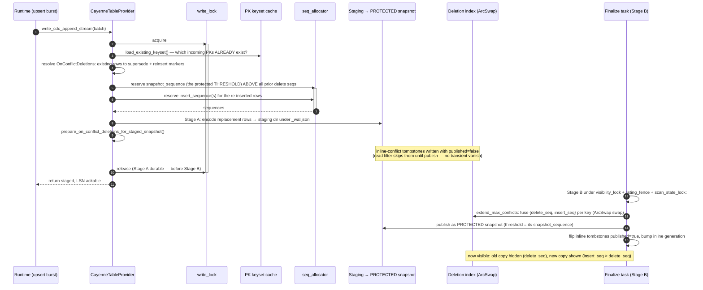
```mermaid
sequenceDiagram
    autonumber
    participant RT as Runtime (upsert burst)
    participant P as CayenneTableProvider
    participant WL as write_lock
    participant KS as PK keyset cache
    participant SEQ as seq_allocator
    participant STG as Staging → PROTECTED snapshot
    participant DI as Deletion index (ArcSwap)
    participant FIN as Finalize task (Stage B)

    RT->>P: write_cdc_append_stream(batch)
    P->>WL: acquire
    activate WL
    P->>KS: load_existing_keyset() — which incoming PKs ALREADY exist?
    P->>P: resolve OnConflictDeletions: existing rows to supersede + reinsert markers
    P->>SEQ: reserve snapshot_sequence (the protected THRESHOLD) ABOVE all prior delete seqs
    activate SEQ
    P->>SEQ: reserve insert_sequence(s) for the re-inserted rows
    SEQ-->>P: sequences
    deactivate SEQ
    P->>STG: Stage A: encode replacement rows → staging dir under _wal.json
    P->>P: prepare_on_conflict_deletions_for_staged_snapshot()
    Note over STG,DI: inline-conflict tombstones written with published=false<br/>(read filter skips them until publish — no transient vanish)
    P->>WL: release (Stage A durable — before Stage B)
    deactivate WL
    P-->>RT: return staged, LSN ackable
    FIN->>FIN: Stage B under visibility_lock + listing_fence + scan_state_lock:
    FIN->>DI: extend_max_conflicts: fuse {delete_seq, insert_seq} per key (ArcSwap swap)
    FIN->>STG: publish as PROTECTED snapshot (threshold = its snapshot_sequence)
    FIN->>FIN: flip inline tombstones published=true, bump inline generation
    Note over FIN,DI: now visible: old copy hidden (delete_seq), new copy shown (insert_seq > delete_seq)
```

The mechanics that make this correct:

- The new rows get sequence numbers **strictly above** every prior delete sequence, so they are immune to all pre-existing tombstones — they can neither resurface a deleted row nor be hidden by an old tombstone.
- The old copy is tombstoned at a *lower* `delete_seq`; the fused `TombstoneEntry` for that PK now carries `{delete_seq, insert_seq}` with `insert_seq > delete_seq`, so merge-on-read shows exactly one row — the new one.
- The publish goes into a **protected** snapshot tagged with `threshold = snapshot_sequence`, so the writer never has to re-resolve the whole existing deletion set. (Contrast Flow B, which publishes straight into the current snapshot with no threshold.)
- `total_superseded` nets the live row count: an upsert replacing *N* rows adds `inserted − N` live rows, not `inserted`.


## Flow D — Delete (the filter fast path)

A `DELETE` whose filter already encodes a concrete set of primary keys never scans data files. The extractor recognizes two shapes and writes a deletion vector directly:

- **Single PK**: `pk_col IN (v1, v2, …)` — integer literals route to the Int64 deletion-vector writer; non-integer to the key-based writer.
- **Composite PK**: an OR-tree of AND-equality conjunctions `(pk1=a AND pk2=b) OR …`, with the tree walk capped at `MAX_PK_FILTER_TREE_NODES = 65,536` nodes. Every conjunction must cover the PK exactly, else the extractor declines and the slow (scan-based) path runs.

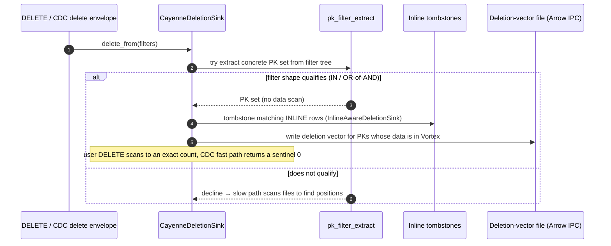
```mermaid
sequenceDiagram
    autonumber
    participant SQL as DELETE / CDC delete envelope
    participant SINK as CayenneDeletionSink
    participant EX as pk_filter_extract
    participant L0 as Inline tombstones
    participant DV as Deletion-vector file (Arrow IPC)

    SQL->>SINK: delete_from(filters)
    SINK->>EX: try extract concrete PK set from filter tree
    alt filter shape qualifies (IN / OR-of-AND)
        EX-->>SINK: PK set (no data scan)
        SINK->>L0: tombstone matching INLINE rows (InlineAwareDeletionSink)
        SINK->>DV: write deletion vector for PKs whose data is in Vortex
        Note over SINK: user DELETE scans to an exact count, CDC fast path returns a sentinel 0
    else does not qualify
        EX-->>SINK: decline → slow path scans files to find positions
    end
```

A pure delete differs from an upsert in that it writes a tombstone with a `delete_seq` and **no** `insert_seq` — so merge-on-read hides the row permanently (until a later upsert re-inserts the key at a higher sequence). Small delete batches land as `InlinedDelete` entries first and flush to a delete-vector file on memtable pressure.

Two callers share this extractor and the `InlineAwareDeletionSink`, differing only in whether they need a verified count. A **user-visible `DELETE`** runs through `delete_from` with an exact count (it must surface "rows affected"), so a qualifying `pk IN (…)` scans to count just the live rows removed. The **durable CDC apply loop** instead calls `delete_from_cdc_fast`, which builds the identical key-delete sink but *non-exact*: it persists deletion vectors straight from the extracted PK set with no scan and returns a sentinel `0` the caller discards — restoring the `O(deleted keys)` cost (a scan-to-count path had regressed durable CDC deletes to `O(table)` under `write_lock`). Shapes the fast path declines — position- or retention-based deletes — fall back to `delete_from` unchanged. (The memory-absorption path always kept the fast path; this restores it for `cdc_durability: file` key-delete tables.)

## Flow E — A CDC burst, end to end (Stage A / Stage B pipelining)

This is the flow that ties durability, visibility, and ordering together. The runtime acks the source LSN after **Stage A** (data durable) without waiting for **Stage B** (data visible), so Postgres can recycle WAL ahead of visibility — while burst order is still preserved for readers.

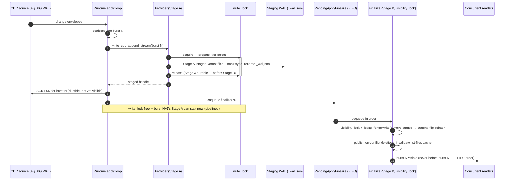
```mermaid
sequenceDiagram
    autonumber
    participant SRC as CDC source (e.g. PG WAL)
    participant RT as Runtime apply loop
    participant P as Provider (Stage A)
    participant WL as write_lock
    participant WAL as Staging WAL (_wal.json)
    participant FIFO as PendingApplyFinalize (FIFO)
    participant B as Finalize (Stage B, visibility_lock)
    participant RD as Concurrent readers

    SRC->>RT: change envelopes
    RT->>RT: coalesce into burst N
    RT->>P: write_cdc_append_stream(burst N)
    P->>WL: acquire — prepare, tier-select
    activate WL
    P->>WAL: Stage A: staged Vortex files + tmp+fsync+rename _wal.json
    P->>WL: release (Stage A durable — before Stage B)
    deactivate WL
    P-->>RT: staged handle
    RT->>SRC: ACK LSN for burst N  (durable, not yet visible)
    RT->>FIFO: enqueue finalize(N)
    Note over RT,WL: write_lock free ⇒ burst N+1's Stage A can start now (pipelined)
    FIFO->>B: dequeue in order
    B->>B: visibility_lock + listing_fence.write(): move staged → current, flip pointer
    B->>B: publish on-conflict deletions, invalidate list-files cache
    B-->>RD: burst N visible (never before burst N-1 — FIFO order)
```

**Durability modes recap.** In `file` mode every burst is durable before its ack. In `memory` mode the mem-tier append is the "Stage A," and the slot ack rides whichever durability pass comes first: by default the periodic **seal** (every `cayenne_cdc_mem_tier_seal_age_ms` = 2 s — a durable shadow into the unpublished inline corpus, no encode, no publish; see Part 3), else the full **two-phase off-fence checkpoint** below, whose encode + metastore `BEGIN IMMEDIATE` run *outside* the listing fence with only the snapshot-pointer flip under it. So a checkpoint never stalls scans for the duration of the encode/IO — and freshness/replication lag no longer has to wait for one.

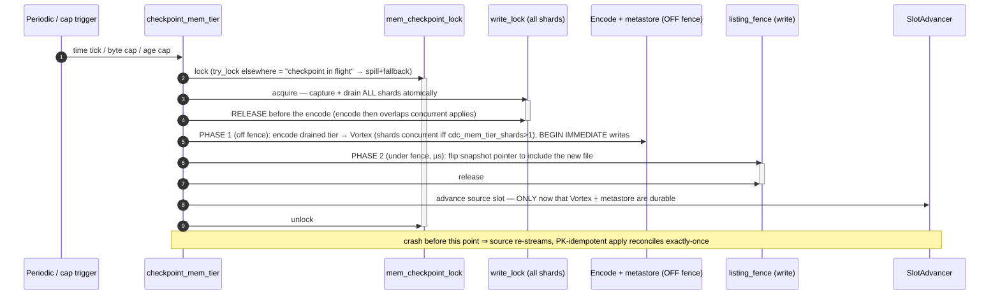
```mermaid
sequenceDiagram
    autonumber
    participant T as Periodic / cap trigger
    participant CK as checkpoint_mem_tier
    participant MCL as mem_checkpoint_lock
    participant WL as write_lock (all shards)
    participant ENC as Encode + metastore (OFF fence)
    participant LF as listing_fence (write)
    participant SA as SlotAdvancer

    T->>CK: time tick / byte cap / age cap
    CK->>MCL: lock (try_lock elsewhere = "checkpoint in flight" → spill+fallback)
    activate MCL
    CK->>WL: acquire — capture + drain ALL shards atomically
    activate WL
    CK->>WL: RELEASE before the encode (encode then overlaps concurrent applies)
    deactivate WL
    CK->>ENC: PHASE 1 (off fence): encode drained tier → Vortex (shards concurrent iff cdc_mem_tier_shards>1), BEGIN IMMEDIATE writes
    CK->>LF: PHASE 2 (under fence, µs): flip snapshot pointer to include the new file
    activate LF
    CK->>LF: release
    deactivate LF
    CK->>SA: advance source slot — ONLY now that Vortex + metastore are durable
    CK->>MCL: unlock
    deactivate MCL
    Note over CK,SA: crash before this point ⇒ source re-streams, PK-idempotent apply reconciles exactly-once
```

## Flow F — Background maintenance: tiered compaction

Compaction bounds read amplification by consolidating small Vortex files into target-sized ones. The picker buckets the current snapshot's files by size and fires when the smallest tier crosses its file-count and byte thresholds — but the pass it fires then re-encodes the *full current snapshot* into fresh target-sized files (a concurrent-append-guarded flip that aborts if a writer appended meanwhile), not merely the picked subset; re-encoding only the picked files and hard-linking the rest is a noted, not-yet-implemented optimization. The genuinely *incremental* subset rewrite is the separate protected-snapshot path (`compact_protected_snapshots_subset`), which the seq-prefix bake also rides. Both commit via the same copy-on-write atomic flip.

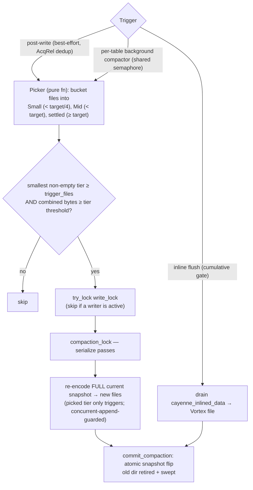
```mermaid
flowchart TB
    TRIG{"Trigger"} -->|"post-write (best-effort, AcqRel dedup)"| PICK
    TRIG -->|"per-table background compactor (shared semaphore)"| PICK
    TRIG -->|"inline flush (cumulative gate)"| FLUSH["drain cayenne_inlined_data → Vortex file"]

    PICK["Picker (pure fn): bucket files into<br/>Small (&lt; target/4), Mid (&lt; target), settled (≥ target)"] --> COND{"smallest non-empty tier ≥ trigger_files<br/>AND combined bytes ≥ tier threshold?"}
    COND -->|"no"| SKIP["skip"]
    COND -->|"yes"| LOCK["try_lock write_lock<br/>(skip if a writer is active)"]
    LOCK --> CLK["compaction_lock — serialize passes"]
    CLK --> REWRITE["re-encode FULL current snapshot → new files<br/>(picked tier only triggers; concurrent-append-guarded)"]
    REWRITE --> COMMIT["commit_compaction: atomic snapshot flip<br/>old dir retired + swept"]
    FLUSH --> COMMIT
```

Compaction is gated by a **shared per-accelerator semaphore** (`available_parallelism()`), so a fleet of tables can't oversubscribe the writer pool. It `try_lock`s the write lock and skips if a writer is active; the `compaction_lock` serializes passes so write-driven and background-driven runs never overlap. Key-delete tables compact *concurrently* with their writers.

The compaction *output* writer is tier-gated (`provider/compaction_writer.rs`). On network-attached block storage — `StorageClass::Ebs` (EBS, Azure managed disks, NAS), auto-detected from the environment and overridable via the `storage` acceleration param — compaction installs an `O_DIRECT`/`fallocate` writer (up-front size hint, `bytes_per_sync`, content-fsync, a 4 MiB bounce buffer, and page-cache self-eviction of its own output). Local SSD/NVMe (including AWS instance store, classified `LocalSsd`), tmpfs, and S3 stay on the buffered writer — `O_DIRECT` is a net loss on local NVMe. There is no new boolean knob; the storage class is a detected fact. Two correctness/robustness guards ride the same path: writer-input batches are `try_cast`-normalized to the *stored* table schema before Vortex derives its dtype (so a read-schema scan — e.g. `Utf8View` under `cayenne_force_view_types` — can't trip a Vortex dtype-mismatch during a current-snapshot compaction), and runtime shutdown now drains in-flight Vortex-producing passes (`drain_compaction_tasks`) before the dedicated compaction runtime is dropped, so pending compaction CPU work isn't lost mid-flight.

One scope caveat is worth spelling out: `compaction_lock` — like every lock in Part 3 — is in-memory, per provider instance. Two *live instances of the same table* sharing one metastore are outside the concurrency contract: a full-snapshot rewrite in one can interleave with a protected-snapshot subset-merge (`swap_protected_snapshots_in_txn`) in the other so that the rewrite folds a set of protected snapshots and clears their catalog rows while the merge concurrently registers a merged replacement the rewrite never saw — and since a scan unions the current snapshot with *every* registered protected snapshot with no key-level dedup, the already-folded rows double-count on the next open. Production runs one instance per table, but the convergence property tests' in-process "restart" recreated the provider without killing its detached maintenance and hit exactly this race. The remedy is `drain_in_flight_maintenance()`: await the coalesced post-write-compaction / orphan-DV-sweep / inline-checkpoint tasks, flush the post-write maintenance loop, and take a final `compaction_lock` barrier before dropping the instance. The coalescing flags those tasks set now clear via an RAII drop guard on *any* exit — completion, early return, panic unwind, or abort — since a flag stuck `true` would both suppress future maintenance and hang the drain. (The same recreate-without-drain pattern exists in the runtime's hot-reload path; it is flagged upstream but not yet addressed.)


---

# Part 5 — Deep dives in pseudocode

## The write-path decision tree

Flows B–E are all one function (`write_cdc_pipelined`) taking different branches. Collapsed to pseudocode, the decision tree is:

```text
fn write_cdc_pipelined(batch):
    write_lock.acquire()                          # serialize writers (dropped after Stage A)
    ensure_no_incomplete_write()                  # reconcile any stale staging WAL first

    # --- conflict preparation ---
    if pk_conflict_detection == auto:
        existing = pk_keyset_cache.load_or_build() # which incoming PKs already exist?
        prepared = resolve_on_conflict(batch, existing)   # supersedes + reinsert markers
    else: # none (append-only CDC; source guarantees PK uniqueness)
        prepared = batch                          # blind append, no keyset scan

    # --- pipeline eligibility ---
    can_stage = (partition_column is None)        # partitioned ⇒ synchronous publish

    if not can_stage:
        return write_prepared_stream(prepared)    # synchronous: new snapshot under one flip

    # --- in-memory CDC durability mode ---
    if is_cdc_memory_mode() and has_slot_advancer():
        match append_to_mem_tier(prepared):       # O(1) ArcSwap; slot ack rides next seal/checkpoint
            Done(w)            => return w
            FallBackToDurable  => fallthrough      # global budget full → durable path

    # --- tier selection (the inline admission gate) ---
    match try_inline_or_restream(prepared):
        Inlined(rows)  => return completed(rows)  # FLOW B small / FLOW D small delete
        Fallback(stream, est_bytes):
            stage_protected = may_have_on_conflict_deletions or pending_pk_deletions
            target = ProtectedSnapshot if stage_protected else CurrentSnapshot
            # STAGE A (durable, on write path):
            staged = write_staged_append(stream, target)   # encode Vortex + fsync _wal.json
            if stage_protected:
                prepare_on_conflict_deletions_for_staged_snapshot()  # tombstones published=false
            return CdcWrite{ staged, write_lock }  # STAGE B spawned by runtime (FLOW C / E)
```

The single most important branch is `stage_protected`: a plain append (Flow B) targets the *current* snapshot; anything carrying on-conflict deletions or pending PK deletions (Flow C) targets a *protected* snapshot whose threshold immunizes the new rows from old tombstones.

## Metastore transaction semantics

All metadata mutation is a metastore transaction. The backend chooses the right `BEGIN` for its concurrency model:

```text
SqliteMetastore:  BEGIN IMMEDIATE   # take the reserved write lock UP FRONT, so a later
                                    # UPDATE/INSERT can't upgrade-deadlock vs a concurrent writer
TursoMetastore:   BEGIN CONCURRENT  # MVCC: writers proceed optimistically, serialize at COMMIT
                                    # time only on actual row conflicts
```

`SqliteMetastore` (the default) runs `tokio-rusqlite` in WAL journal mode with `synchronous = NORMAL`, foreign keys on, a 30-second `busy_timeout`, and a round-robin **connection pool** of `K = min(available_parallelism, 32)` independent connections (floor 2, fallback 4). SQLite WAL serializes writers at the engine level but allows concurrent readers; the pool primarily lifts read-side concurrency for metadata-heavy scans, where each scan pays several metastore reads. `begin_transaction` holds an `OwnedMutexGuard` on one pool slot for the transaction's lifetime. `TursoMetastore` (optional, `turso` feature) uses a fixed `K = 16` pool and libSQL's MVCC journal mode.

`commit_compaction` and `commit_overwrite` share retry-on-conflict logic; `is_retryable_write_conflict` is re-exported at the crate root so callers can bound-retry transient `SQLITE_BUSY` / Turso `BEGIN CONCURRENT` conflicts. Schema drift is caught at startup by `validate_existing_schema`, which compares column **names and ordering** (not types — SQLite/libSQL type affinity makes exact matching unreliable) against `metastore::EXPECTED_TABLES` and returns an actionable `SchemaMismatch`.

Beyond column-shape validation, each backend stamps a **monotonic schema version** into the database header (`PRAGMA user_version`). On every open, `init_schema` reads that version *before* running any migration and calls `ensure_supported_schema_version`, which refuses to open a catalog stamped **newer** than the build supports (`CAYENNE_METASTORE_SCHEMA_VERSION`, currently `1`) — returning `CatalogError::IncompatibleSchemaVersion { found, supported }` (an actionable "upgrade Spice or clear the Cayenne acceleration data" message) rather than risk a downgraded binary misreading a newer layout into silently-wrong (dropped-row) results. A stamp of `0` — a fresh database, or any pre-gate catalog — is always accepted and migrated forward; after the migrations succeed the current version is stamped back. The gate is symmetric across the SQLite and Turso/libSQL backends (`turso_core` supports `PRAGMA user_version` read + write). Version `1` guards the metadata-only upsert publish: the `reinsert_sequence` column on `cayenne_delete_file` (see below) that a pre-gate binary would misread as an empty insert-record table.

## Staging WAL crash-safety (self-healing recovery)

A staged file list is made crash-safe by writing `_wal.json` via **tmp + fsync + rename** — an atomic publish of the marker, so the WAL is all-or-nothing: a reader of the staging directory ever sees either a complete, committed marker or none at all, never a half-written one. The subtlety is that Stage A writes the Vortex files into the per-burst `_staging/<id>/` directory *before* it writes that marker, so a crash can leave the directory in one of two recoverable shapes. `ensure_no_incomplete_write` resolves both — it runs at provider open and again before every burst (with an in-process bypass for prepared appends still being finalized, so back-to-back CDC bursts don't block on each other):

- **Files staged, no committed WAL — the "pre-WAL orphan" case.** The directory holds `.vortex` files but no durable `_wal.json` — either the crash landed before the marker was written, or mid-write so that only a `tmp` file exists (recovery ignores uncommitted tmp WALs). With no record of intent to act on, recovery treats the directory as a crash leftover and deletes it (`clear_orphan_staging_dirs` → `remove_dir_all`; loose non-directory pre-WAL files are always removed). Nothing rolls these files forward.
- **Committed WAL present — roll forward.** The marker is durable, so recovery finishes the interrupted publish: it renames the listed staged files into the current snapshot and removes the WAL. Roll-forward is idempotent — if the crash landed *after* some or all files had already been moved, re-attempting the move is a harmless no-op (a missing staging source is tolerated), so a crash anywhere from "WAL just became durable" through "Stage B all but the WAL-removal done" heals to the same end state.

Discarding the pre-WAL orphan is correct rather than lossy, because of the ack ordering: the source's change-log offset is acknowledged only *after* Stage A's WAL is durable. A crash before the marker means the burst was never acked, so the source re-streams it on reconnect and the PK-idempotent apply reconciles it **exactly-once** — the deleted files belonged to a burst that is going to be replayed anyway. (This is the same "the source slot is the source of truth" argument that makes the RAM mem-tier safe to lose.)

The cleanup is deliberately *per-entry*, never a whole-staging-root wipe: it skips any staging id registered as an in-flight append and runs under the `visibility_lock`, so a recovery pass can never delete the staging directory of a pipelined Stage B that is concurrently mid-move (an earlier whole-root variant did exactly that and wedged the changes stream). Across a real process restart there are no in-flight registrations — they live only in memory — so every WAL-less staging directory on disk is an unambiguous orphan and is swept.

**Opt-in end-to-end integrity checksums.** With `cayenne_integrity_checksums` enabled (default off; see Appendix B), each staging-WAL record is wrapped by `provider/wal_checksum.rs` in a self-describing binary envelope — `MAGIC + version + u64-LE length + u64-LE XXH3-64(payload) + JSON payload` — so a record whose checksum fails to verify on recovery is *detected and discarded* (its staging directory removed, converging to the last committed snapshot) rather than parsed as valid intent. This is safe precisely because the WAL is a forward-progress marker, not the durable commit point: a discarded record's burst was never acked and is re-streamed. Reads accept both framed and legacy records, so toggling the feature on or off — or downgrading — never orphans an existing WAL. Off is byte-identical to the pre-feature on-disk format with zero read/write overhead.


---

# Part 6 — Cayenne vs. Iceberg, Delta Lake, and Hudi

Cayenne borrows liberally from the open lakehouse formats and then diverges where its goals (Vortex storage, HTAP, high-rate CDC, single-node-to-distributed) demand it. The comparisons below are architectural analogies, not interoperability claims — Cayenne does **not** read or write Iceberg, Delta, or Hudi tables.

## The lineage at a glance

| Dimension | Apache Iceberg | Delta Lake | Apache Hudi | **Cayenne** |
|-----------|----------------|------------|-------------|-------------|
| **Metadata store** | file-based metadata tree (metadata.json → manifest lists → manifests) + a catalog pointer | file-based transaction log (`_delta_log` JSON + Parquet checkpoints) | file-based timeline of instant files (`.hoodie`) | **SQL database** (SQLite / Turso) — `BEGIN…COMMIT` |
| **Data file format** | Parquet / ORC / Avro | Parquet | Parquet (base) + Avro/Parquet log | **Vortex** |
| **Commit / visibility** | atomic swap of the table pointer in the catalog | optimistic concurrency; atomic log append | atomic timeline instant | **atomic flip of `current_snapshot_id`** (one column) |
| **Ordering** | sequence numbers order data vs delete files | log version monotonicity | timeline instant ordering | **sequence numbers** (Iceberg-style) |
| **Deletes (MoR)** | position deletes + equality deletes | deletion vectors (RoaringBitmap, position) | delta/log records merged at read | **position (RoaringBitmap) + key-based fused tombstone** |
| **Small-write absorption** | none native (small-files problem) | none native (small-files problem) | MoR **log files** absorb updates | **LSM level-0**: inline memtable (durable) + RAM mem-tier (seal-shadowed) |
| **Upsert model** | MERGE / equality deletes | MERGE | **native record-level upsert** (its headline feature) | sequence-fused tombstone + re-insertion; PK keyset/bloom index |
| **Compaction** | rewrite/compaction actions | `OPTIMIZE` (+ Z-order) | compaction of log → base; clustering | tiered small-files (inline + background) |
| **Time travel / snapshot expiry** | yes | yes (versions) | yes (timeline) | **not implemented** (no time travel, no snapshot expiration) |
| **Schema evolution** | full column-level | full column-level | full | intentionally simplified (schema as a JSON blob) |

## Deletes: the closest and the cleverest borrowing

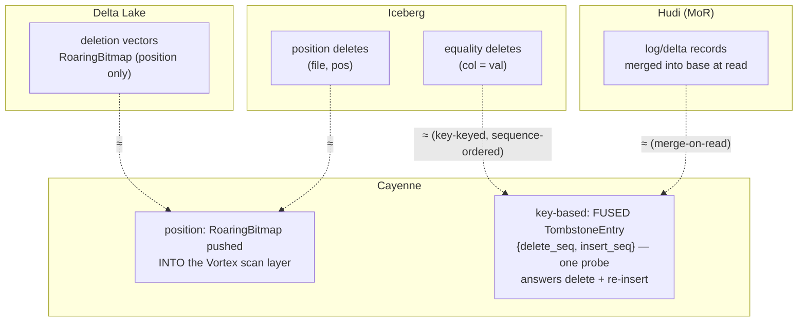
```mermaid
flowchart TB
    subgraph ICE["Iceberg"]
        IP["position deletes<br/>(file, pos)"]
        IE["equality deletes<br/>(col = val)"]
    end
    subgraph DL["Delta Lake"]
        DV["deletion vectors<br/>RoaringBitmap (position only)"]
    end
    subgraph HU["Hudi (MoR)"]
        HL["log/delta records<br/>merged into base at read"]
    end
    subgraph CY["Cayenne"]
        CP["position: RoaringBitmap pushed<br/>INTO the Vortex scan layer"]
        CK["key-based: FUSED TombstoneEntry<br/>{delete_seq, insert_seq} — one probe<br/>answers delete + re-insert"]
    end
    IP -. "≈" .-> CP
    DV -. "≈" .-> CP
    IE -. "≈ (key-keyed, sequence-ordered)" .-> CK
    HL -. "≈ (merge-on-read)" .-> CK
```

- **Cayenne's position deletes ≈ Delta's deletion vectors and Iceberg's position deletes.** All three keep a per-file bitmap of deleted row positions and apply it merge-on-read so the data file is never rewritten. Cayenne pushes the `RoaringBitmap` *into* the Vortex scan layer (`Selection::ExcludeRoaring`) so deleted positions never even decode — closer to Delta's pushed-down DV than Iceberg's separate scan.
- **Cayenne's key-based deletes ≈ Iceberg's equality deletes**, but with two refinements: the key is sequence-ordered (so delete-vs-insert visibility is deterministic), and the entry is **fused** with the re-insertion sequence so a single probe resolves an upsert. Iceberg needs the reader to reconcile equality deletes against data sequence numbers; Cayenne folds the answer into one cell.

## Small writes: where Cayenne looks like Hudi, not Iceberg/Delta

Iceberg and Delta have no in-format mechanism to absorb a tiny write — each commit produces data files, and a high-rate stream produces the dreaded small-files problem, mitigated only after the fact by compaction/`OPTIMIZE`. **Hudi's Merge-on-Read** tables solve this with **log files**: updates land in row/columnar log files that are merged into the base at read time and compacted later. Cayenne's **LSM level-0 tier** plays the same role — but the level-0 lands *inside the metastore* (durable Arrow-IPC blobs) or *in RAM* (the seal-shadowed mem-tier), not as object-store log files. The inline-data table is conceptually the same idea DuckLake exposes as `ducklake_inlined_data_tables`.

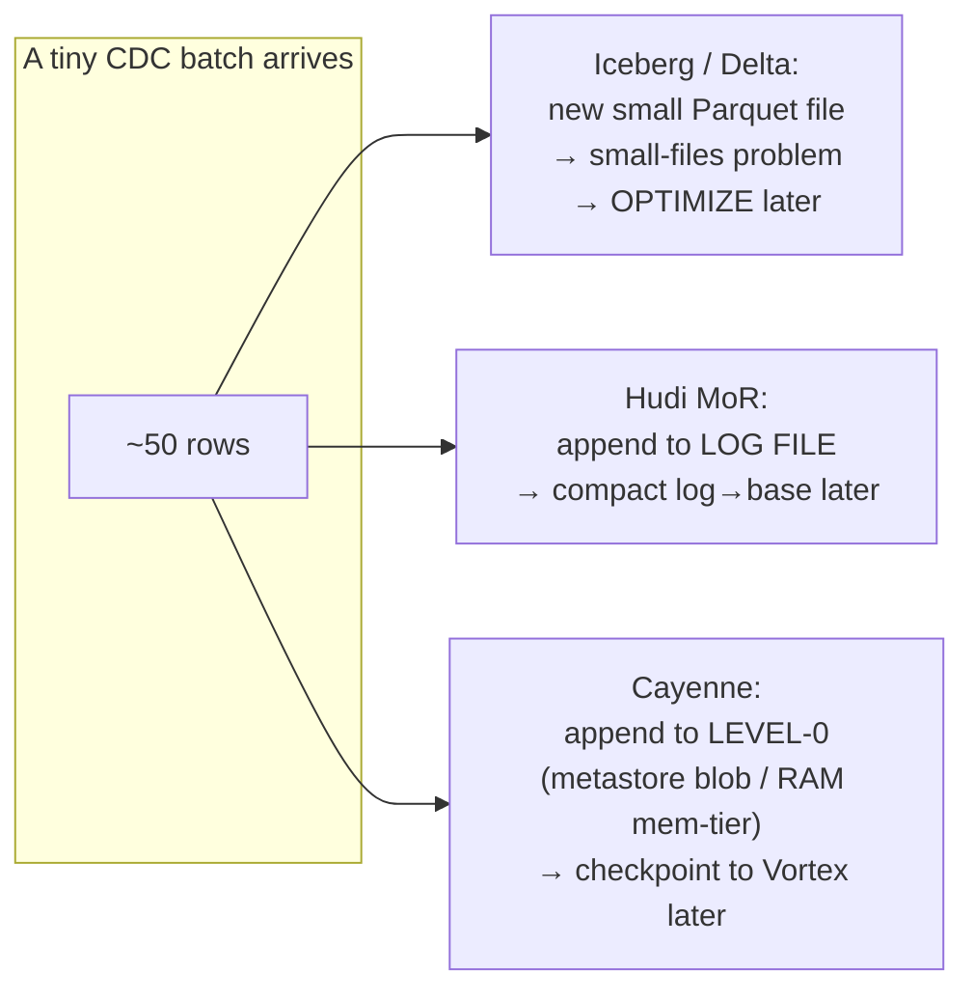
```mermaid
flowchart LR
    subgraph SMALL["A tiny CDC batch arrives"]
        B["~50 rows"]
    end
    B --> I["Iceberg / Delta:<br/>new small Parquet file<br/>→ small-files problem<br/>→ OPTIMIZE later"]
    B --> H["Hudi MoR:<br/>append to LOG FILE<br/>→ compact log→base later"]
    B --> C["Cayenne:<br/>append to LEVEL-0<br/>(metastore blob / RAM mem-tier)<br/>→ checkpoint to Vortex later"]
```

## Upserts: Cayenne's PK index echoes Hudi's record index

Hudi's signature capability is native record-level upsert, routed by a **record-level index** (bloom index / simple index / HBase / RLI) that locates the file holding each incoming key. Cayenne's `auto` PK-conflict detection plays the analogous role with its **byte-budgeted PK keyset cache** (exact `HashMap`, falling back to a `PkBloom` when the keyset would exceed budget) plus the persisted `cayenne_pk_index` checkpoint — so a burst resolves which incoming PKs already exist without re-scanning data files, just as Hudi's index avoids a full-table join. The difference is the resolution: Hudi rewrites or logs the record; Cayenne writes a sequence-stamped tombstone + re-insertion.

## Relationship to DuckLake (its nearest sibling)

DuckLake and Cayenne are the two formats that put *transactional metadata in a SQL database and data in object storage*. They share sequence-numbered snapshots, per-table partition metadata, delete-files decoupled from data, and an inline-data table for small-write absorption. But they are **not interchangeable**, and the divergences are deliberate:

| Area | DuckLake v1.0 | Cayenne |
|------|---------------|---------|
| Data file format | Parquet (mandated) | Vortex |
| Catalog prefix | `ducklake_` | `cayenne_` |
| Data-file metadata | explicit `ducklake_data_file` row per file | no explicit table; DataFusion `ListingTable` enumerates a snapshot dir |
| Snapshot model | dedicated `ducklake_snapshot` + change log | `current_snapshot_id` column + `cayenne_snapshot_sequence` |
| Schema | column-level rows + evolution tables | JSON blob on `cayenne_table` (simplified) |
| Upsert | snapshot-based merge | Iceberg-style insert-record tracking + inline tombstones |
| Views / macros / tags / time-travel | first-class | not implemented |

The one-line decision rule from the README: *if you need interoperability with a DuckLake catalog reader, Cayenne is not the tool; if you need a Vortex-native, CDC-friendly accelerator backed by SQLite or Turso, Cayenne is purpose-built for it.*

## What Cayenne deliberately leaves out

Cayenne is not trying to be a general open table format. Relative to the big three it intentionally omits **time travel and snapshot expiration**, **column-row-granularity schema evolution** (adds/drops/renames/mappings), **views / SQL macros / table tags**, and **full MVCC**. Those are real features in Iceberg/Delta/Hudi; Cayenne trades them for a tighter, faster HTAP/CDC engine on Vortex.


---

# Appendix A — The metastore schema (12 tables)

`EXPECTED_TABLES` materializes twelve tables in the metastore. `table_id` (UUIDv7 text) is the spine — every dependent table references it via `FOREIGN KEY … ON DELETE CASCADE`. The DDL in `metastore/sqlite.rs` is authoritative; this is a map.

All twelve tables hang off `cayenne_table` by its `table_id`, with `ON DELETE CASCADE`. The hub-and-spoke shape below shows that spine and the functional grouping; the per-column detail is in the table that follows.

```mermaid
%%{init: {"htmlLabels": false, "flowchart": {"htmlLabels": false, "curve": "basis", "nodeSpacing": 40, "rankSpacing": 40}, "securityLevel": "loose", "theme": "base", "themeVariables": {"fontFamily": "Helvetica, Arial, sans-serif", "fontSize": "14px", "primaryColor": "#ffffff", "primaryBorderColor": "#312e81", "primaryTextColor": "#0f172a", "lineColor": "#1e293b", "clusterBkg": "#f8fafc", "clusterBorder": "#6366f1"}}}%%
flowchart TB
    HUB["cayenne_table<br/>(the spine — FK target)<br/>holds current_snapshot_id"]
    subgraph SNAP["Snapshot &amp; file manifest"]
        direction TB
        SS["cayenne_snapshot_sequence"]
        SF["cayenne_snapshot_file"]
        SFS["cayenne_snapshot_file_statistics"]
        SS ~~~ SF ~~~ SFS
    end
    subgraph DEL["Deletion &amp; upsert"]
        direction TB
        DF["cayenne_delete_file"]
        IR["cayenne_insert_record"]
        PK["cayenne_pk_index"]
        DF ~~~ IR ~~~ PK
    end
    subgraph L0["Level-0 inline (LSM)"]
        direction TB
        ID["cayenne_inlined_data"]
        IDD["cayenne_inlined_delete"]
        ID ~~~ IDD
    end
    subgraph MISC["Statistics, partitioning &amp; cold tier"]
        direction TB
        TS["cayenne_table_statistics"]
        PT["cayenne_partition"]
        CT["cayenne_cold_tier_file"]
        TS ~~~ PT ~~~ CT
    end
    HUB -->|"FK table_id"| SNAP
    HUB -->|"FK table_id"| DEL
    HUB -->|"FK table_id"| L0
    HUB -->|"FK table_id"| MISC
```

| Table | Role |
|-------|------|
| `cayenne_table` | the table row; `current_snapshot_id` is the visibility pointer; high-water sequence allocator |
| `cayenne_snapshot_sequence` | per-snapshot sequence → drives Iceberg-style visibility ordering + protected-snapshot thresholds |
| `cayenne_snapshot_file` | authoritative per-snapshot data-file manifest; `min/max_sequence` drive seq-prefix bake; nullable `digest` (`xxh3-128:<hex>`) for opt-in end-to-end file-integrity verification |
| `cayenne_snapshot_file_statistics` | per-file Vortex footer stats so listing-time pruning skips re-reading objects |
| `cayenne_table_statistics` | per-table aggregate stats blob + `num_rows` (+ its `num_rows_exact` taint flag) + HyperLogLog NDV sketches |
| `cayenne_delete_file` | deletion-vector references; type inferred from file schema; carries a `reinsert_sequence` column (metadata-only upsert re-insert stamp; NULL ⇒ legacy fallback to `cayenne_insert_record`) |
| `cayenne_insert_record` | upsert re-insertion tracking (`WITHOUT ROWID`, clustered, raw-UUID-byte `table_id` to cut WAL) |
| `cayenne_pk_index` | persisted PK existence checkpoint so restart skips full-table keyset rebuild |
| `cayenne_partition` | composite partition metadata (Hive-style `partition_key`) |
| `cayenne_inlined_data` | LSM level-0 inline memtable (Arrow-IPC blobs) |
| `cayenne_inlined_delete` | LSM level-0 inline tombstones (`published` activation flag) |
| `cayenne_cold_tier_file` | cold object-store tier file manifest (Z-order-clustered Vortex); inline stats blob for zero-round-trip listing-time pruning |

# Appendix B — Configuration cheat-sheet

The runtime classifies a dataset as the **small-write profile** when `refresh_mode` is `caching`, `changes`, or `append` with `refresh_check_interval ≤ 5m`. All other modes get larger-write defaults (and inlining disabled).

| Parameter | Meaning | Default |
|-----------|---------|---------|
| `cayenne_metastore` | `sqlite` (default) or `turso` | `sqlite` |
| `cayenne_file_path` | data path (local or `s3://…--x-s3/…`) | `{spice_data}/{dataset}/` |
| `cayenne_pk_conflict_detection` | `auto` (resolve upserts) or `none` (blind append) | `auto` |
| `cayenne_deletion_mode` | `auto` / `key` / `position` (`auto` ⇒ key for `changes` PK tables) | `auto` |
| `cayenne_cdc_durability` | `memory` (default, eligibility-gated) or `file` | `memory` |
| `cayenne_integrity_checksums` | opt-in end-to-end integrity checks — XXH3-64 envelope per staging-WAL record + `xxh3-128` digest per Vortex data file, verified before first scan; off is byte-identical to the pre-feature format (enabled by any value other than `false`) | off |
| `cayenne_target_file_size_mb` | Vortex file target size | `256` |
| `cayenne_compression_strategy` | `btrblocks` or `zstd` | `btrblocks` |
| `cayenne_inline_max_rows` / `_bytes` / `_buffer_bytes` | per-write inline admission gate: rows / serialized-IPC bytes / in-memory buffer (0 disables) | small = 1,024 / 1 MiB / 4 MiB; else 0 |
| `cayenne_inline_flush_max_rows` / `_segments` / `_bytes` | cumulative inline-flush gate: rows / entries / serialized-IPC bytes | small = 2,048 / 16 / 2 MiB |
| `cayenne_compaction_trigger_files` | small-tier file-count trigger | small = 4; else 8 |
| `cayenne_cdc_mem_tier_max_bytes` / `_max_age_ms` | RAM-tier byte / age caps (`memory` mode) | memory-derived / `10_000` |
| `cayenne_cdc_mem_tier_seal_age_ms` | seal cadence: max age of the un-sealed ingestion piece before a durable shadow + slot advance; `0` disables (slot ack reverts to checkpoint cadence); keep ≤ the age cap | `2_000` |
| `cayenne_datalake_location` | `s3://` URI for the optional datalake (cold) tier; presence enables it (dormant otherwise; requires `refresh_mode: changes`/`append`, forces key-based deletes) | (unset) |
| `cayenne_datalake_s3_auth` / `_s3_key` / `_s3_secret` / `_s3_region` / `_s3_endpoint` / … | dedicated datalake S3 credentials/client options, validated by a write probe at load | (unset) |
| `cayenne_datalake_clustering_columns` | columns to Z-order-cluster datalake files by | (derive from PK) |
| `cayenne_datalake_target_file_size_mb` | datalake Vortex file target size | `512` |
| `cayenne_datalake_warm_max_bytes` / `_max_files` | warm→datalake promotion triggers (size / file count) | 16 × `cayenne_datalake_target_file_size_mb` / (unset) |
| `cayenne_datalake_promotion_interval_ms` | datalake promoter cadence | `60_000` |
| `cayenne_datalake_gc_interval_ms` | physical-GC cadence AND orphan grace for superseded datalake objects | `300_000` (5 min) |
| `cayenne_goal_replication_lag` / `_freshness` / `_query_latency` | adaptive-controller SLO setpoints (durations; global or per-dataset; unset ⇒ that lever inert) | (unset) |
| `cayenne_tuning` | `auto` (static) or `adaptive` (closed-feedback controller, preview) | `auto` |

When `cayenne_tuning: adaptive`, a per-table closed-feedback controller makes at most one bounded actuator move per tick, **always clamped to the static `[floor, ceiling]` the `auto` tier derived** — so a dynamic decision can only pick a value `auto` could also have picked; the worst case is the worst static config, never worse.

One removal to note (breaking): `cayenne_orphaned_dv_cleanup_min_files` is no longer a recognized parameter — orphaned deletion-vector cleanup is unconditional at a fixed threshold of 20 unreferenced files. A spicepod still setting the key (including `0`, which used to disable the sweep) has it ignored with a runtime warning ("Ignoring parameter … not supported"), so a config that relied on disabling cleanup silently gains it back.

---

# Putting it all together

Cayenne is best understood as **three tiers with one visibility rule and a sequence-ordered deletion model**, all arranged so the write and read paths never fight:

- a **transactional metastore** for atomic metadata,
- **immutable Vortex files** under per-snapshot directories,
- an **LSM level-0 tier** (durable inline + seal-shadowed RAM mem-tier) that absorbs the small writes a CDC stream produces,
- **sequence numbers** that make merge-on-read deletions and upserts deterministic,
- a **single atomic pointer flip** for visibility, with the heavy work pushed off the listing fence and the read hot-path published wait-free through `ArcSwap`.

It takes Iceberg's sequence-ordered visibility and equality-delete idea, Delta's pushed-down deletion vectors, and Hudi's merge-on-read small-write absorption — then fuses the delete/re-insert probe into one cell, lands level-0 in the metastore and RAM rather than object-store log files, and stores its catalog in a SQL database à la DuckLake. The result is, today, an **accelerator** rather than a general-purpose open format: a derived, refreshable copy that does something the big three don't try to — sustain continuous high-rate CDC ingestion and low-latency analytical queries on the *same* table at the same time, which is exactly the job Spice built it for.

---

# Document changelog

This document is a point-in-time snapshot of a fast-moving crate. Each entry records the date, the `spiceai` commit reviewed, and what changed here — so a future revision can be tied to the specific repository changes that prompted it. When updating, add a new row (newest first) and refresh the commit reference in *Scope and sourcing* at the top.

| Date | Reviewed commit | Changes |
|------|-----------------|---------|
| 2026-07-14 | `5c1316c7` (committed 2026-07-14; doc otherwise baselined at `4685a3dd`) | Exposed Spicepod `MIN`/`MAX` maintained aggregates with resolved-primary-key validation; bounded direct no-PK extremum multisets; added N>1 mem-tier UPDATE/DELETE maintenance as one pre-assigned, ordered IVM delta; and bound scan shard snapshots to the IVM epoch with an even/odd seqlock so optimizer substitution cannot cross visibility generations. The N>1 delete path projects the original PK batch once (no per-shard prefix concat). |
| 2026-07-13 | PR #11720 (pre-merge; doc otherwise baselined at `4685a3dd`) | **Acceleration `mode: memory`**: fully in-RAM Cayenne — mem-tier is the permanent store, in-memory `memdb` metastore, no Vortex/compaction/seal/checkpoint/datalake; CDC slot committed immediately after each in-RAM write; partitioning rejected at config; hard RAM bound (`cayenne_cdc_mem_tier_max_bytes`) counts resident + incoming even for overwrite. Spicepod `acceleration.mode` defaults to `memory` (same as Arrow) — durable Cayenne requires explicit `mode: file`. S3 Express params are ignored under `mode: memory`. New *Storage modes* section + glossary entries; distinct from `cdc_durability: memory` on file-mode tables. |
| 2026-07-10 | (pre-merge; doc otherwise baselined at `4685a3dd`) | Datalake (cold) tier object layout: the per-table prefix segment changed from the bare `<table_id>` to `<sanitized_table_name>-<table_id>` (`TableMetadata::datalake_dir_segment`) so a shared `cayenne_datalake_location` bucket is navigable while the UUIDv7 suffix keeps prefixes collision-free. Lossy, path-safe name slug (`[A-Za-z0-9_-]`, 64-char cap, edge-trimmed; empty → bare `table_id`). Derived on demand (no metastore change) since `table_name` is immutable per `table_id`. Write + GC prefixes only; reads follow the manifest's absolute `file_url`. Warm tier remains keyed by the bare `table_id`. |
| 2026-07-10 | PR #11806 (pre-merge; doc otherwise still baselined at `4685a3dd`) | Targeted **table statistics** update: the `SPICE_CAYENNE_EAGER_NDV` escape hatch is removed — lazy NDV (fold on file spill, not the inline tier0 CDC write) is now unconditional, so *Table statistics* no longer describes the inline write as folding "one hashed value per row into the sketch"; it now explains the lazy split and its bounded one-memtable lag explicitly. Also a perf-only change with no doc-visible behavior: per-value NDV hashing switched from a streaming to a one-shot XXH3-64 hash (byte-identical, ~21-25x faster per a new microbenchmark). |
| 2026-07-09 | PR #11745 (pre-merge; doc otherwise still baselined at `4685a3dd`) | Targeted **datalake (cold) tier** update for #11731/#11745: promotion rewritten from whole-table re-materialization to **incremental carry-forward** (dirty/clean classification from manifest stats rectangles refined by per-file PK blooms; clean files carried by manifest reference; per-promotion `cold/<promotion_id>/` prefixes), per-file **PK bloom filters** serving upsert keyset rebuilds without a cold scan, periodic **mark-and-sweep GC** of orphaned cold objects, and the parameter rename to `cayenne_datalake_*` (`_location`, `_clustering_columns`, `_s3_*`, `_gc_interval_ms`) — versioning note and configuration cheat-sheet updated accordingly. |
| 2026-07-08 | `4685a3dd` (committed 2026-07-08, `trunk`) | Moved the doc in-tree to `docs/cayenne/` and re-baselined from `1f8833ba`, folding in the cayenne PRs merged since. **Metastore schema versioning** (#11651): `PRAGMA user_version` gate (`CAYENNE_METASTORE_SCHEMA_VERSION = 1`, `ensure_supported_schema_version`), a loud `CatalogError::IncompatibleSchemaVersion` on a newer-than-supported catalog, symmetric across SQLite/Turso — plus the `cayenne_delete_file.reinsert_sequence` metadata-only upsert stamp (with `cayenne_insert_record` as the legacy NULL fallback); added to *Metastore transaction semantics*, Appendix A, and the upsert re-insertion prose. **Opt-in end-to-end integrity checksums** (#11646): `cayenne_integrity_checksums` (default off) — XXH3-64 envelope per staging-WAL record + `xxh3-128` per-Vortex-file digest in the new nullable `cayenne_snapshot_file.digest` column, verified before first scan; added to *Staging WAL crash-safety*, *Table statistics*, Appendix A, and the cheat-sheet. **Bounded append freshness** (#11620): segmented append publishing (`write_append_segmented`, ~10 s internal default, 8–256 MiB clamp) and a publish-triggered executor-stats rebroadcast for the distributed `COUNT(*)` fold; added to Flow B and *Table statistics*. **Durable CDC delete fast path** (#11642): Flow D rewritten to the two-caller split (user `DELETE` exact-count vs `delete_from_cdc_fast` sentinel-0). **Durable-path count taint** (#11643): upsert/delete/retention-capable tables also serve their incremental `num_rows` `Delta` as `Inexact`. Also: **vendored versioned `row_converter`** protecting durable PK key bytes (#11654); the **seal is now memo-transparent** (`mark_sealed_through` preserves the mem-tier `version`) (#11649); and the **tier-gated `O_DIRECT` compaction writer** + writer-input schema normalization and shutdown-drain hardening (#11696, #11692), added to Flow F. Not doc-relevant (no body edit): the transient deferred-commit-queue fix (#11678), zero-row append no-op (#11710), mem-tier snapshot-storm churn-gate bypass + small-group repartition opt-out (#11645), expanded CDC back-pressure instrumentation (#11610), and CH-BenCHmark log-level tuning (#11711). |
| 2026-07-05 | `1f8833ba` (committed 2026-07-05, `trunk`) | Folded in the five cayenne PRs merged since `5f61351`. The headline is the **mem-tier seal** (#11622): `MemTier` split at `sealed_segments` into immutable + active pieces, with a cheap periodic seal (`cayenne_cdc_mem_tier_seal_age_ms`, default 2 s) that durably shadows the active piece into the *unpublished* inline corpus and advances the replication slot — the slot ack decoupled from reads and the checkpoint cadence, all-shards-atomic at N>1; new glossary entry, level-0 subsection, and updates to the durability boundary, crash model, Flows B/E, pseudocode, and the cheat-sheet. Also: the mem-tier **visible-batch memo** and the **maintained-aggregate registry** made explicit (grouped `MIN`/`MAX` IVM over integer/temporal/`Decimal128` columns, integer `AVG` via `i128`) (#11631, #11564); `COUNT(*)` exactness guarded by a new `cayenne_table_statistics.num_rows_exact` taint flag plus supersede-netted checkpoint deltas (#11602); and the persisted-bloom PK rebuild now folds the un-checkpointed mem-tier under a coherent fence capture, with the protected-snapshot merge fence capped below the smallest pending mem-tier delete (#11609). |
| 2026-07-04 | `5f61351` (committed 2026-07-04, `trunk`) | Folded in the five cayenne PRs merged since `7aaebc4`: the **freshness-SLO-driven adaptive mem-tier shrink** — the `WindowMax` windowed-peak freshness signal (which now backs `cayenne_ingest_freshness_seconds`), the freshness-owns-the-tier-lever gating, and the `capture_lock_wait` checkpoint-capture diagnostic split (#11574); cold PK-keyset rebuilds now **fold in un-checkpointed mem-tier keys**, closing a durable over-count (#11592); the sharded CDC apply **reuses the cached PK `RowConverter`** across the apply and the per-batch shard split (#11590); orphaned-DV cleanup made **always-on** — the `cayenne_orphaned_dv_cleanup_min_files` parameter removed (breaking), threshold fixed at 20, cheat-sheet row replaced with the `cayenne_goal_*` setpoints (#11575); and the **per-instance lock-scope caveat** plus `drain_in_flight_maintenance()` / RAII-cleared maintenance flags for in-process reopen, added to Flow F (#11578). |
| 2026-07-02 | `7aaebc4` (committed 2026-07-02, `trunk`) | **Re-baselined to trunk** from `64451e0`, folding in the CDC/storage PRs merged since: the optional **cold object-store tier** with Z-order clustering (#11543 — new *cold tier* section, `cayenne_cold_tier_file` schema row, config params, and diagram tier); the off-`write_lock` N>1 mem-tier checkpoint plus the adaptive **query-admission throttle** (#11538); concurrent per-shard checkpoint encode (#11558); orphaned deletion-vector cleanup on by default (#11533); tier-accurate build-side join statistics with capped never-shrink NDV (#11496); and storage-aware adaptive CDC tuning (#11463). Also carries the corrected life-of-a-change overview, smaller diagram nodes, and the in-memory / warm / cold tier bracket. |
| 2026-06-30 | `64451e0` (committed 2026-06-29, `trunk`) | Initial version. Covers the three-tier architecture, the concurrency/lock model and fused deletion subsystem, the key flows (read, insert, upsert, fast-path delete, the Stage A/B CDC pipeline, and compaction), the comparison to Iceberg / Delta Lake / Hudi / DuckLake, and the 11-table metastore schema. |

*— End —*
