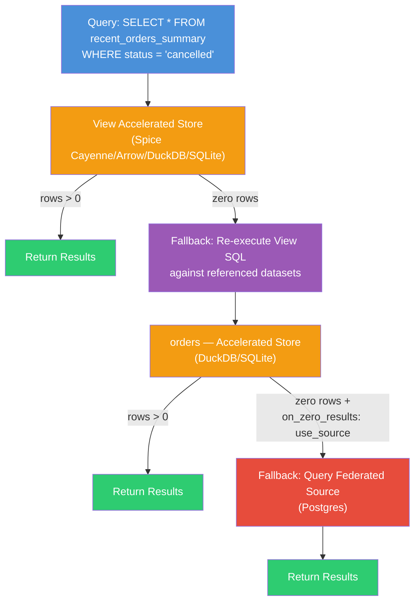

# Spice v1.11.4 (Mar 12, 2026)

Spice v1.11.4 is a patch release improving **S3** metadata column query robustness and enabling **`on_zero_results: use_source`** for accelerated views.

## What's New in v1.11.4

### Accelerated Views: `on_zero_results: use_source` Support

Accelerated [views](https://spiceai.org/docs/components/views) now support the [`on_zero_results: use_source`](https://spiceai.org/docs/features/data-acceleration/data-refresh#behavior-on-zero-results) configuration ([#9699](https://github.com/spiceai/spiceai/pull/9699)). Previously, accelerated views only supported `on_zero_results: return_empty`, which returned an empty result set when the accelerated data contained no matching rows. With this change, views can fall back to querying the source data when the accelerated query returns zero results, matching the behavior already available for accelerated datasets.

**Example configuration:**

```yaml
views:
  - name: sales_summary
    sql: |
      SELECT region, SUM(amount) as total
      FROM sales
      GROUP BY region
    acceleration:
      enabled: true
      on_zero_results: use_source
```

#### How the Fallback Works

When an accelerated view is configured with `on_zero_results: use_source`, the following happens at query time:

1. **The accelerated store is queried first.** The query runs against the view's accelerated data (e.g., Spice Cayenne, Arrow, DuckDB, or SQLite).

2. **If the accelerated query returns zero rows**, the runtime falls back to re-executing the view's SQL query against the datasets it references.

3. **Referenced datasets are queried according to their own configuration.** The view's SQL is re-executed against each referenced dataset as it is configured. This means:

   - If a referenced dataset is **accelerated**, the query hits that dataset's accelerated store — not the raw data source.
   - If a referenced dataset is **accelerated with `on_zero_results: use_source`** and its accelerated store also returns zero rows, it will independently fall back to its own federated data source (e.g., Postgres, S3, etc.).
   - If a referenced dataset is **federated** (not accelerated), the query goes directly to the data source.

This means the fallback can chain through multiple layers: first the view's acceleration, then each referenced dataset's acceleration, and finally the original data source — each layer independently applying its own `on_zero_results` behavior.

**Example: Multi-layer fallback**

```yaml
datasets:
  - from: postgres:orders
    name: orders
    acceleration:
      enabled: true
      refresh_sql: "SELECT * FROM orders WHERE created_at > now() - interval '7 days'"
      on_zero_results: use_source  # Falls back to Postgres if accelerated data has no matches

views:
  - name: recent_orders_summary
    sql: |
      SELECT status, COUNT(*) as order_count
      FROM orders
      GROUP BY status
    acceleration:
      enabled: true
      on_zero_results: use_source  # Falls back to re-running the SQL against referenced datasets
```

In this example, a query like `SELECT * FROM recent_orders_summary WHERE status = 'cancelled'` follows this path:

1. Queries `recent_orders_summary` in the view's accelerated store (DuckDB/SQLite).
2. If zero rows are returned, re-executes `SELECT status, COUNT(*) ... FROM orders GROUP BY status` against the `orders` dataset.
3. Since `orders` is accelerated, the query hits the `orders` accelerated store.
4. If `orders` also returns zero rows (e.g., the `refresh_sql` excluded cancelled orders), it falls back to querying Postgres directly.



### S3 Data Connector: More Robust Metadata Column Handling

Improved the robustness of [metadata column](https://spiceai.org/docs/components/data-connectors/#metadata-columns) (`location`, `last_modified`, `size`) handling for [S3](https://spiceai.org/docs/components/data-connectors/s3) datasets. Building on the v1.11.3 release, this update addresses an additional edge case where the query optimizer's projection swap could cause an `index out of bounds` panic when metadata columns are referenced in projections with filters or scalar functions.

## Contributors

- [@sgrebnov](https://github.com/sgrebnov)
- [@krinart](https://github.com/krinart)

## Breaking Changes

No breaking changes.

## Cookbook Updates

No new cookbook recipes.

The [Spice Cookbook](https://spiceai.org/cookbook) includes 86 recipes to help you get started with Spice quickly and easily.

## Upgrading

To upgrade to v1.11.4, use one of the following methods:

**CLI**:

```console
spice upgrade
```

**Homebrew**:

```console
brew upgrade spiceai/spiceai/spice
```

**Docker**:

Pull the `spiceai/spiceai:1.11.4` image:

```console
docker pull spiceai/spiceai:1.11.4
```

For available tags, see [DockerHub](https://hub.docker.com/r/spiceai/spiceai/tags).

**Helm**:

```console
helm repo update
helm upgrade spiceai spiceai/spiceai --version 1.11.4
```

**AWS Marketplace**:

Spice is available in the [AWS Marketplace](https://aws.amazon.com/marketplace/pp/prodview-jmf6jskjvnq7i).

## What's Changed

### Changelog

- fix(s3): Make metadata column handling more robust by [@sgrebnov](https://github.com/sgrebnov) in [#9714](https://github.com/spiceai/spiceai/pull/9714)
- feat(views): Enable `on_zero_results: use_source` for accelerated views by [@krinart](https://github.com/krinart) in [#9699](https://github.com/spiceai/spiceai/pull/9699)

**Full Changelog**: <https://github.com/spiceai/spiceai/compare/v1.11.3...v1.11.4>
